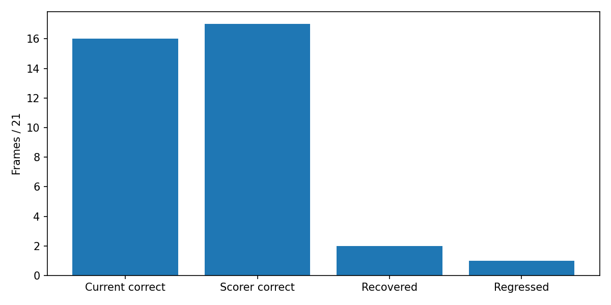
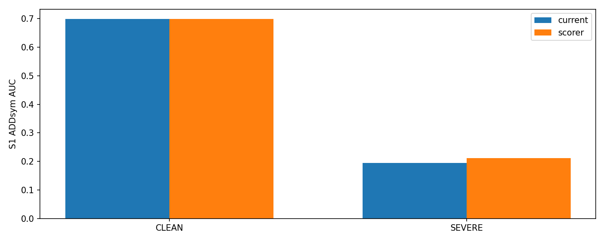
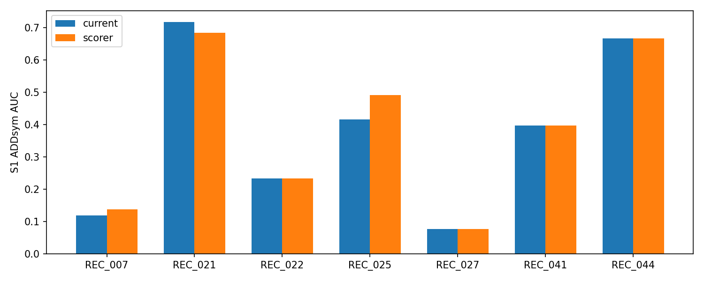
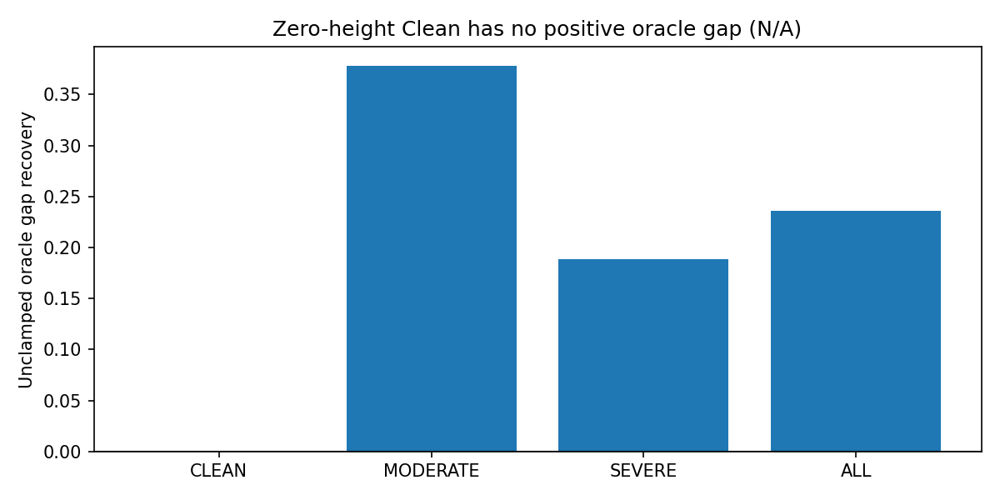

# Stage3 — frozen 합성 선택기의 실사 적용

판정: **SELECTOR_RECOVERY_WITHOUT_COLLATERAL** / None

실사128장의 두 expert별 결정을 전부 저장/hash lock한 다음에만 참조값을 읽었다. 같은 scorer, 같은 tie 규칙을 모든 난도·expert에 적용했다. raw2D를 바꾸지 않으므로 기존 PCK와 verified-anchor PCK는 동일하다.

|group|expert|current AUC|scorer AUC|oracle AUC|axis current→scorer|gap recovery|
|---|---|---:|---:|---:|---|---:|
|CLEAN|S0|0.711879|0.711879|0.711879|29→29|None|
|CLEAN|S1|0.698638|0.698638|0.698638|29→29|None|
|MODERATE|S0|0.464119|0.401452|0.511976|18→16|-1.3094527363184096|
|MODERATE|S1|0.435690|0.475333|0.540595|16→17|0.377893781207445|
|SEVERE|S0|0.144782|0.166788|0.242481|41→47|0.22524768715963525|
|SEVERE|S1|0.195397|0.211308|0.279929|47→52|0.18821566694471803|
|ALL|S0|0.325656|0.328785|0.393043|88→92|0.04643209089328169|
|ALL|S1|0.348836|0.365035|0.417559|92→98|0.2357187517762745|

Moderate S1 transitions: {'selected_changed': 3, 'recoveries': 2, 'regressions': 1}

|group|arm/method|R med °|yaw med °|t med cm|IoU3D med|
|---|---|---:|---:|---:|---:|
|CLEAN|S0/current|1.5131|0.6480|4.2969|0.6625|
|CLEAN|S0/scorer|1.5131|0.6480|4.2969|0.6625|
|CLEAN|S0/oracle|1.5131|0.6480|4.2969|0.6625|
|CLEAN|S1/current|1.5727|0.4082|4.7072|0.6194|
|CLEAN|S1/scorer|1.5727|0.4082|4.7072|0.6194|
|CLEAN|S1/oracle|1.5727|0.4082|4.7072|0.6194|
|MODERATE|S0/current|1.8164|1.1440|7.0367|0.7324|
|MODERATE|S0/scorer|1.8164|1.3408|8.3337|0.7324|
|MODERATE|S0/oracle|1.8164|1.1440|6.7890|0.7512|
|MODERATE|S1/current|1.8167|1.2377|6.9042|0.6153|
|MODERATE|S1/scorer|1.7509|1.3131|6.8418|0.7462|
|MODERATE|S1/oracle|1.7509|1.2377|6.4596|0.7462|
|SEVERE|S0/current|12.5418|10.0914|15.0795|0.4811|
|SEVERE|S0/scorer|5.7959|5.3321|14.5161|0.4918|
|SEVERE|S0/oracle|3.3991|2.5388|14.0594|0.5335|
|SEVERE|S1/current|5.6304|4.7208|13.4067|0.5039|
|SEVERE|S1/scorer|4.4758|3.6254|13.4067|0.5144|
|SEVERE|S1/oracle|3.1722|2.5546|12.3764|0.5261|
|ALL|S0/current|3.1970|2.0662|9.7711|0.5908|
|ALL|S0/scorer|3.1089|1.9129|10.1615|0.5939|
|ALL|S0/oracle|2.6062|1.5410|8.6498|0.6243|
|ALL|S1/current|3.0460|2.1485|8.4733|0.5772|
|ALL|S1/scorer|2.8875|1.8821|8.4733|0.5809|
|ALL|S1/oracle|2.6489|1.4662|7.9465|0.6095|

Stage4의 S0 유효성은 사전 구현한 보수적 부호 규칙(Clean/Moderate/Severe AUC가 모두 비감소)을 사용한다. 효과크기 임계값을 결과에 맞춰 만들지 않았다. 이미 열람한 DEV이며 독립 검증이 아니다.

