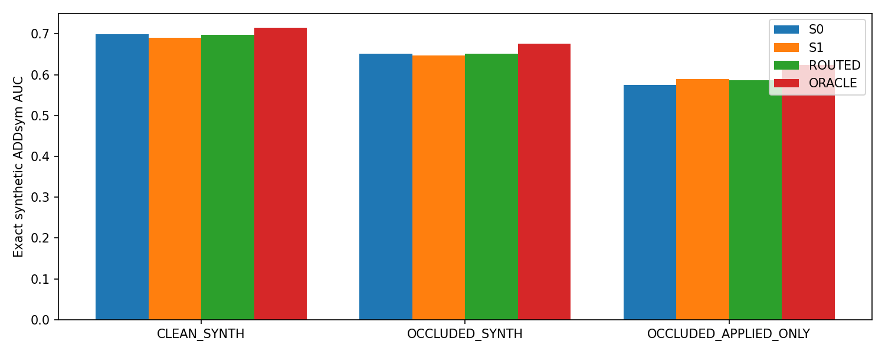
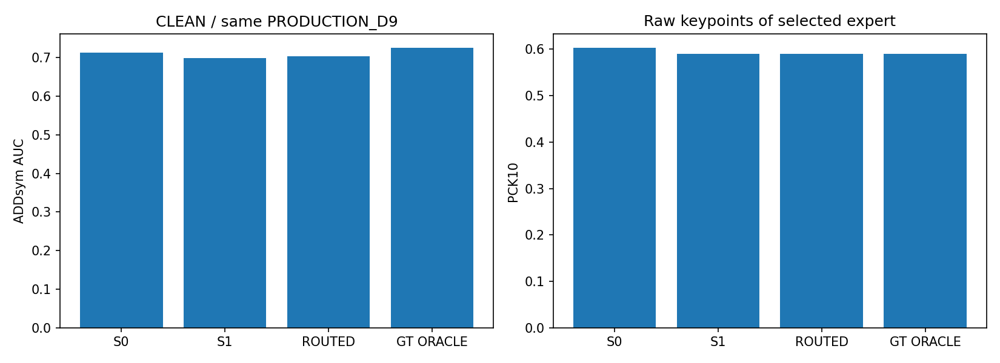
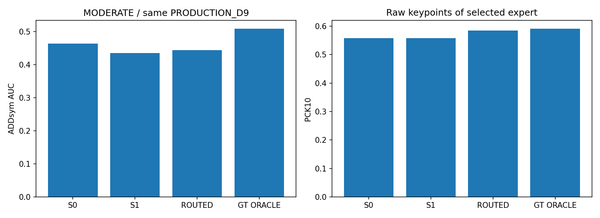
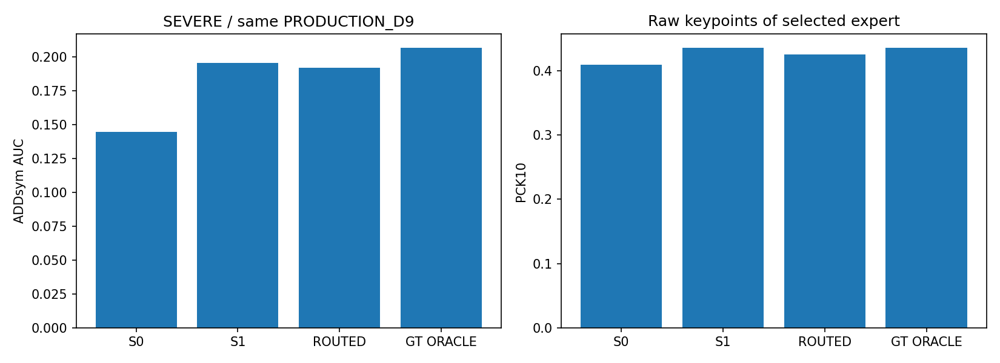
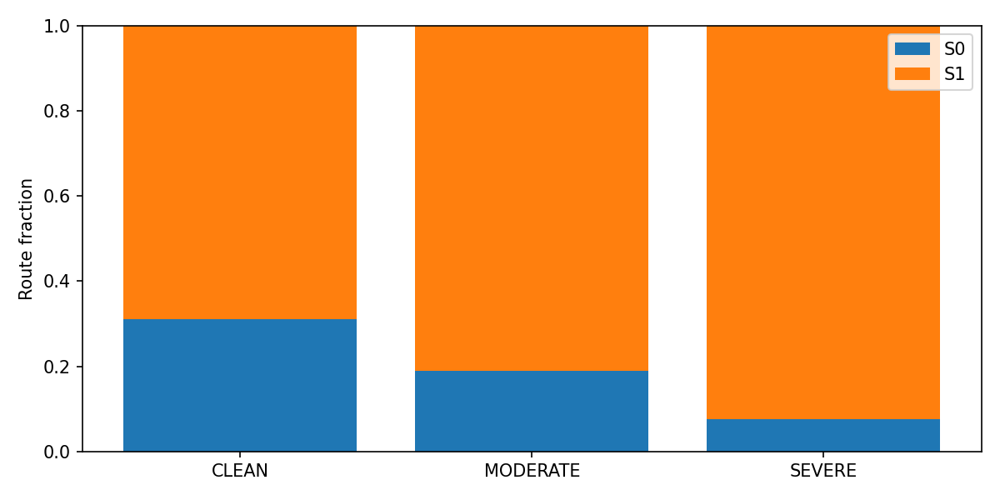

# Stage4 — frozen S0/S1 clean-hard router

판정: **CLEAN_RECOVERY_BUT_HARD_LOSS** / None

공통 selector: **PRODUCTION_D9**. Stage3의 S1 회복은 확인됐지만 S0 Moderate에는 새 선택기가 손해여서, 지시문 fallback대로 양쪽 모두 D9를 썼다. 따라서 이 표는 S1+새 scorer의 Stage3 이득까지 결합했다는 뜻이 아니다.

같은 합성 프레임 split을 재사용하여 clean/occluded 쌍 TRAIN8192 / VAL2048 / TEST2048 sample. 원래 S1의 size/fill/coverage/paired-feasibility 조건과 scheduled .5를 유지하여 실제 가림은 1851/6144개다. skip은 clean과 동일하게 남기고 applied-only도 따로 보고한다. placement는 GT오차/모델 결과를 사용하지 않았다. 원래 real 학습 policy를 synthetic에 적용했으며 random affine까지 복제한 실험은 아니다.

고정 expert 두 개의 exact synthetic ADDnorm 중 더 작은 쪽을 라벨로 사용했다. MLP64/32 한 개, seed42, best VAL=0.552246, epoch=5. 실사 GT 입력0, TEST1회, real decision 전부 lock 후 평가.

|synthetic TEST|N|expert-choice acc|route S0/S1|S0 mean ADDnorm|S1|routed|oracle|
|---|---:|---:|---|---:|---:|---:|---:|
|ALL|2048|0.5415|1348/700|0.09621723789338146|0.09840939471260424|0.09768815288684049|0.090314950507631|
|CLEAN_SYNTH|1024|0.5381|682/342|0.0880685156950269|0.0914751631226795|0.08941924156878454|0.08453126098879718|
|OCCLUDED_SYNTH|1024|0.5449|666/358|0.10436596009173604|0.10534362630252898|0.10595706420489642|0.0960986400264648|
|OCCLUDED_APPLIED_ONLY|304|0.5658|194/110|0.1376284731569835|0.1295245550105063|0.13548335003357007|0.11578016686518584|

|real group|arm|PCK5|PCK10|PCK20|ADD AUC|axis correct|R med°|yaw med°|t med cm|IoU3D med|
|---|---|---:|---:|---:|---:|---:|---:|---:|---:|---:|
|CLEAN|S0|0.3799|0.6026|0.8996|0.711879|29/29|1.513|0.648|4.297|0.6625|
|CLEAN|S1|0.3755|0.5895|0.8559|0.698638|29/29|1.573|0.408|4.707|0.6194|
|CLEAN|ROUTED|0.3712|0.5895|0.8603|0.702845|29/29|1.556|0.493|4.643|0.6359|
|CLEAN|POSTHOC_BEST_EXPERT|0.3930|0.5895|0.8996|0.724879|29/29|1.513|0.622|3.944|0.6924|
|MODERATE|S0|0.1558|0.5584|0.8377|0.464119|18/21|1.816|1.144|7.037|0.7324|
|MODERATE|S1|0.1753|0.5584|0.8506|0.435690|16/21|1.817|1.238|6.904|0.6153|
|MODERATE|ROUTED|0.1818|0.5844|0.8571|0.444548|16/21|1.817|1.094|6.904|0.6883|
|MODERATE|POSTHOC_BEST_EXPERT|0.1883|0.5909|0.8636|0.508881|18/21|1.789|1.035|6.418|0.7462|
|SEVERE|S0|0.1545|0.4086|0.6545|0.144782|41/78|12.542|10.091|15.080|0.4811|
|SEVERE|S1|0.1678|0.4352|0.6661|0.195397|47/78|5.630|4.721|13.407|0.5039|
|SEVERE|ROUTED|0.1611|0.4252|0.6495|0.192179|47/78|5.726|5.281|13.407|0.5039|
|SEVERE|POSTHOC_BEST_EXPERT|0.1711|0.4352|0.6844|0.206641|48/78|4.991|4.438|12.840|0.5115|
|ALL|S0|0.2071|0.4772|0.7401|0.325656|88/128|3.197|2.066|9.771|0.5908|
|ALL|S1|0.2173|0.4904|0.7391|0.348836|92/128|3.046|2.149|8.473|0.5772|
|ALL|ROUTED|0.2132|0.4883|0.7310|0.349281|92/128|3.170|2.181|8.436|0.5798|
|ALL|POSTHOC_BEST_EXPERT|0.2254|0.4954|0.7624|0.373641|95/128|2.808|1.887|8.098|0.6160|

|group|S0 routes|S1 routes|routed AUC − S1 AUC|
|---|---:|---:|---:|
|CLEAN|9|20|+0.004207|
|MODERATE|4|17|+0.008857|
|SEVERE|6|72|-0.003218|
|ALL|19|109|+0.000445|

Dual median 24.12ms / mean 24.05ms, peak allocated 200.1MiB, benchmark wall 1.90s. RTX3080, batch1, dual resident, decode/load 제외, PnP+context+CPU router 포함. Jetson 측정도 최종 배포 승격도 아니다.

아래 사례는 routed−S1 ADD 차이의 양 끝에서 사후 선택한 설명용 이미지이다. 개선과 실패를 함께 보여주며, 극단 사례가 전체 빈도를 대표하지 않는다. GT best expert는 사후 진단용이고 추론 경로에 들어가지 않는다.

