# Corrected pseudo-label self-training — 논문 핵심 증거 마감

## 결론

**PAPER_CORE_SUPPORTED — 단, 반복 사용한 일반 플라스틱 DEV 범위.** 새 학습 0회; 기존 공정 비교 12개 학생 결과를 동일128장에서 재평가했다. 모든 지표 우월성이나 새 세션 독립 일반화는 주장하지 않는다. 방법 개발은 STOP한다.

Q1: 같은 66점에서 PCK10 **44/66 → 50/66**, median **7.144 → 5.489px**. Q2: 학생 PCK10 **47.51% → 51.47%**, ADDsym AUC **0.33472 → 0.35902**. Q3: R0 **49.14% / 0.33796**보다 두 주 지표는 개선. Q4: 최종6D도 측정했지만 P90·회전·축 선택·일부 조건 악화는 남는다.

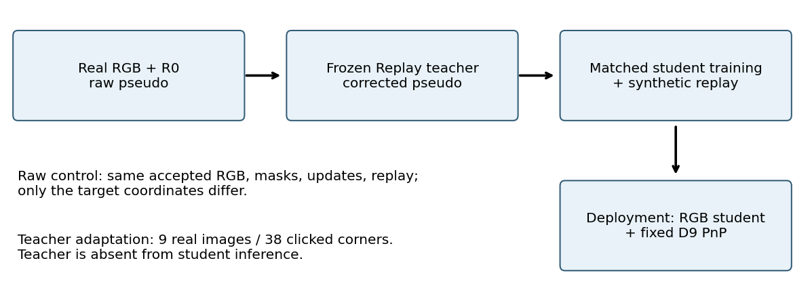

## 과정과 감독 예산

1. 기존 synthetic-pallet R0를 고정한다. R0에는 upstream COCO-pose pretraining이 있다.
2. 평가 밖 일반 플라스틱 후보1000장에 R0 confidence/flip·LOO를 적용: 259장.
3. 고정 Replay9/38 보정 후 LOO로 249장. RAW/REF 모두 동일 승인집합을 사용한다. 필터 통과=정답이라는 의미가 아니다.
4. 동일 RNG로 512 real 슬롯을 추출한 결과 unique217장. 512 synthetic 슬롯과 5epoch, 320update. raw와 보정의 공통 mask에 좌표만 다르게 준다.
5. 같은 R0에서 pose head/flow만 학습한 기존 학생을 재사용한다. Backbone/검출/buffer는 고정.
6. teacher 없이 학생 단독 RGB 추론을 비교한다. 모든6D는 같은 D9와 corner0..7 solver다.
7. teacher는 실사9장38 manual corner와 합성 replay로 학습된 고정 PoseFix-derived RGB ResNet152이다. 새 refiner, cap, PnP hidden-label 추가, router 또는 loss는 없다.

## TABLE1_pseudo_quality

| Output | Points | PCK5 % | PCK10 % | PCK20 % | Med px | P90 px | Above20 |
| --- | --- | --- | --- | --- | --- | --- | --- |
| Synthetic-only R0 | 66 | 21/66 (31.82) | 44/66 (66.67) | 60/66 (90.91) | 7.144 | 18.390 | 6 |
| Frozen Replay teacher | 66 | 30/66 (45.45) | 50/66 (75.76) | 63/66 (95.45) | 5.489 | 13.759 | 3 |

## TABLE2_main_2d

| Arm | PCK5 % | PCK10 % | PCK20 % | Med px | P90 px |
| --- | --- | --- | --- | --- | --- |
| R0 | 20.81 | 49.14 | 72.69 | 9.565 | 40.902 |
| RAW_LR5 | 20.30 | 47.51 | 72.59 | 9.961 | 41.958 |
| REF_LR5 | 24.67 | 51.47 | 73.91 | 8.954 | 42.085 |

## TABLE2_main_6d

| Arm | Pose | Axis | R deg | Yaw deg | t cm | IoU3D | ADDsym AUC |
| --- | --- | --- | --- | --- | --- | --- | --- |
| R0 | 128/128 | 83/128 | 3.530 | 2.756 | 9.353 | 0.5865 | 0.33796 |
| RAW_LR5 | 128/128 | 81/128 | 3.942 | 2.626 | 9.226 | 0.5808 | 0.33472 |
| REF_LR5 | 128/128 | 82/128 | 3.766 | 2.550 | 9.186 | 0.5928 | 0.35902 |

## TABLE3_severity

| Group | N | Arm | PCK10 % | P90 px | ADDsym AUC | t cm |
| --- | --- | --- | --- | --- | --- | --- |
| CLEAN | 29 | R0 | 65.94 | 17.485 | 0.71474 | 2.930 |
| CLEAN | 29 | RAW_LR5 | 65.50 | 16.772 | 0.73053 | 2.818 |
| CLEAN | 29 | REF_LR5 | 69.00 | 17.150 | 0.78126 | 2.218 |
| MODERATE | 21 | R0 | 58.44 | 24.119 | 0.47955 | 5.907 |
| MODERATE | 21 | RAW_LR5 | 55.19 | 24.087 | 0.47131 | 6.376 |
| MODERATE | 21 | REF_LR5 | 56.49 | 23.008 | 0.51188 | 6.242 |
| SEVERE | 78 | R0 | 40.37 | 53.725 | 0.15976 | 13.677 |
| SEVERE | 78 | RAW_LR5 | 38.70 | 55.113 | 0.15079 | 14.692 |
| SEVERE | 78 | REF_LR5 | 43.52 | 55.959 | 0.16087 | 14.431 |

## TABLE5_fairness

| Contract | RAW and corrected |
| --- | --- |
| Initialization | Same R0 checkpoint |
| Trainable state | Pose branches and flow only |
| Real RGB | 217 identical unique images |
| Real/synthetic exposure | 2560 / 2560 each |
| Synthetic pool | 512 identical images; no negatives |
| Supervised support | Identical raw/ref confidence intersection |
| Optimizer / updates | AdamW / 320 |
| Learning rate | 1e-5 main; 1e-4 sensitivity |
| Augmentation / seed | Same settings / 42 |
| Checkpoint choice | Fixed final last.pt |
| Teacher supervision | 9 images / 38 manual corners |
| Only changed target | Supervised pseudo coordinates |

## TABLE4_all_historical_controls

| Arm | PCK10 % | P90 px | ADDsym AUC |
| --- | --- | --- | --- |
| R0 | 49.14 | 40.902 | 0.33796 |
| SYN_LR4 | 47.41 | 42.356 | 0.33443 |
| RAW_LR4 | 47.31 | 42.343 | 0.34073 |
| REF_LR4 | 50.76 | 42.569 | 0.35311 |
| SYN_LR5 | 48.63 | 41.776 | 0.33895 |
| RAW_LR5 | 47.51 | 41.958 | 0.33472 |
| REF_LR5 | 51.47 | 42.085 | 0.35902 |
| SYN_ORDER43 | 48.93 | 41.762 | 0.33945 |
| RAW_ORDER43 | 48.32 | 41.808 | 0.33799 |
| REF_ORDER43 | 51.78 | 42.653 | 0.36100 |
| SYN_ORDER44 | 48.83 | 41.760 | 0.33994 |
| RAW_ORDER44 | 47.72 | 41.951 | 0.33684 |
| REF_ORDER44 | 51.27 | 42.294 | 0.35880 |

## TABLE6_recordings

| Recording | N | Raw PCK10 | Corr PCK10 | Raw AUC | Corr AUC |
| --- | --- | --- | --- | --- | --- |
| REC_007 | 33 | 47.71 | 49.24 | 0.08383 | 0.09958 |
| REC_021 | 18 | 39.71 | 45.59 | 0.80000 | 0.81567 |
| REC_022 | 16 | 32.79 | 36.89 | 0.22866 | 0.24034 |
| REC_025 | 27 | 38.07 | 44.16 | 0.36820 | 0.38743 |
| REC_027 | 12 | 26.09 | 36.96 | 0.14642 | 0.12592 |
| REC_041 | 10 | 71.25 | 71.25 | 0.23680 | 0.31110 |
| REC_044 | 12 | 96.88 | 96.88 | 0.66275 | 0.75483 |

## 짝지은 변화와 한계

Corrected vs raw: frame 평균오차 개선92 / 악화28 / 동일8. 10px 진입51점 / 이탈12점(분모985). PCK10 차이 3.96pp, 7 recording cluster bootstrap 95% interval [1.83, 6.46]pp. 반복 DEV·historical search 미보정 기술통계이며 독립 검증 p-value가 아니다.

전체 corner P90은 raw41.958 → corrected42.085px, R0는40.902px다. Severe translation median은 R0보다 악화되고 Moderate PCK10도 R0보다 낮다. 큰 오류 복구는 해결됐다고 하지 않는다. Teacher 수동9/38 및 shared teacher-based selection 효과를 제거한 순수 zero-real-label 비교가 아니다. 좌표 보정 intervention만 격리한 조건부 비교다.

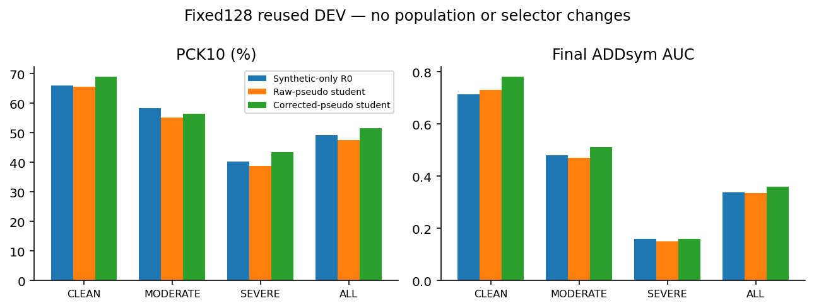

## 실제 이미지: 개선·악화·변화 적음

정량 결과에서 정해진 순위로 고른 설명용 사례다. 원본 native 2D 예측선이며 PnP 투영이 아니다. 초록 X는 reference, R0 파랑 / raw 학생 노랑 / 보정 학생 자홍.

### 2 strongest visible improvements + 2 strongest deteriorations: eval_cad:1778653033056483584

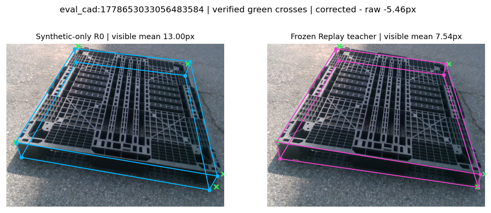

### 2 strongest visible improvements + 2 strongest deteriorations: eval_night08:1779449501478488320

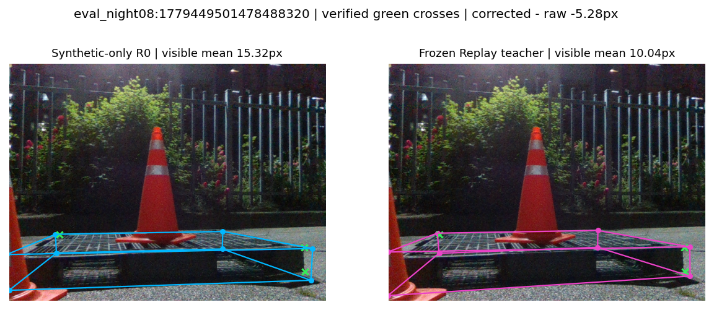

### 2 strongest visible improvements + 2 strongest deteriorations: eval_outside:1778651650839160832

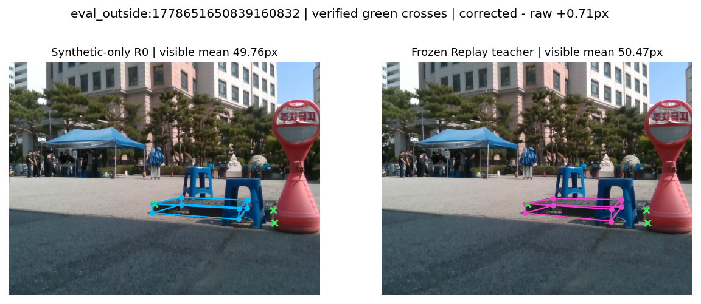

### 2 strongest visible improvements + 2 strongest deteriorations: eval_cad:1778653018878592768

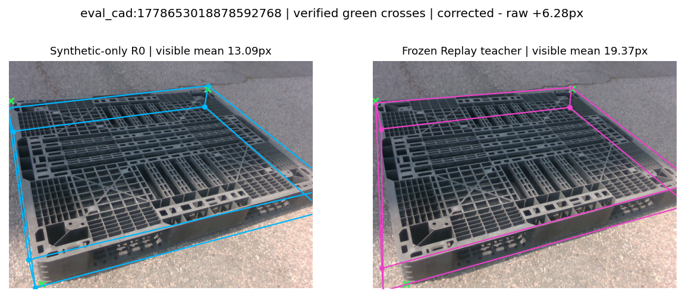

### improved: eval_pallet07:1778652146612550912

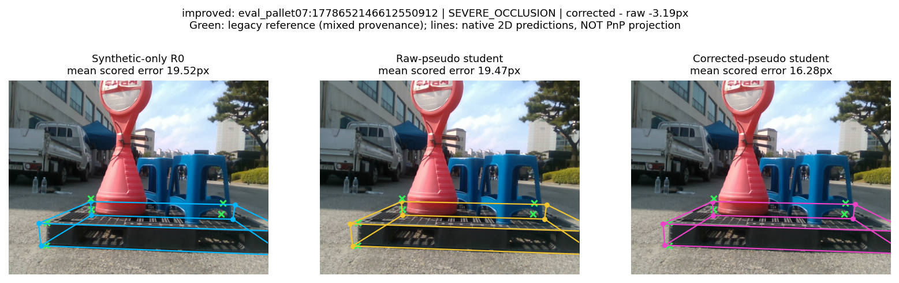

### improved: eval_night08:1779449501478488320

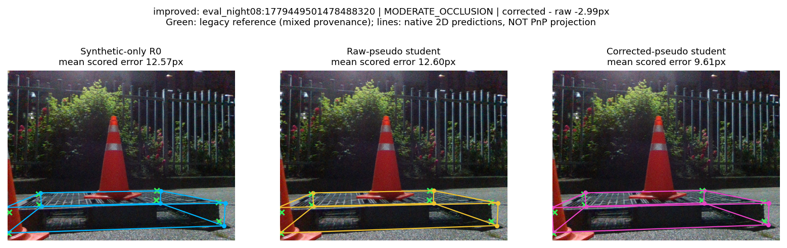

### improved: eval_pallet09:1778653630038417664

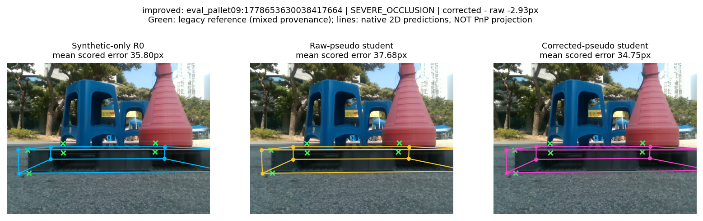

### worsened: eval_pallet07:1778652142480077056

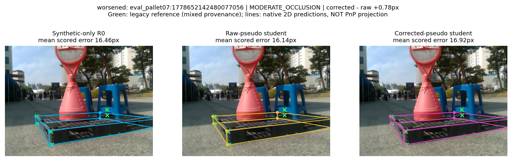

### worsened: eval_pallet07:1778652144496057088

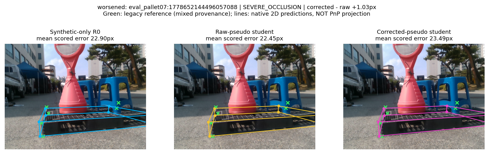

### worsened: eval_night09:1779449580573721600

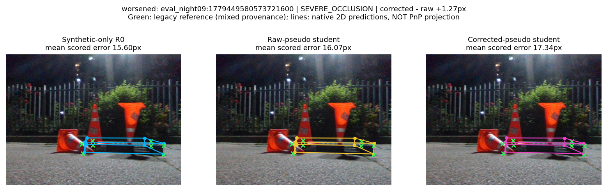

### least_changed: eval_night08:1779449483432542720

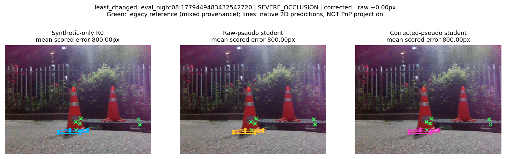

### least_changed: eval_night08:1779449485800670464

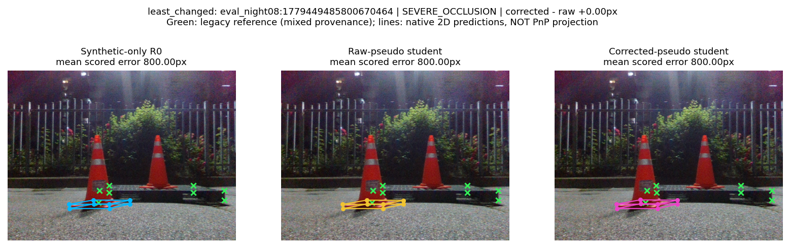

### least_changed: eval_night08:1779449496875356416

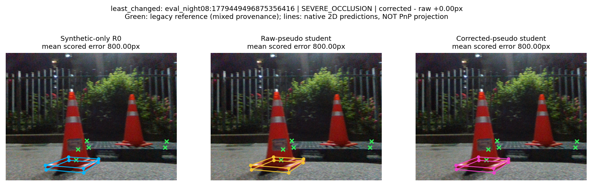

## 보조 실험과 제외 범위

Clean19 S0/S1/S2는 occlusion 확장, hard8/H_MANUAL은 추가 manual 확장, GEO_LINEAR는 selector 확장으로만 분류한다. 다른 teacher·감독 budget·학습 조건을 섞어 main self-training 이득이라고 하지 않는다. 초록·목재 전체 및 독립 미사용 촬영 일반화는 이번 main으로 검증하지 않았다.

원고: [`selftraining_submission_v1`](../../paper/selftraining_submission_v1/manuscript.tex). 전체 수치·체크포인트·분모·해시는 JSON과 재현 문서를 참조한다.

## 추가 근거 감사: 수동 재확인66점의 학생 결과

| Arm | PCK10 | PCK20 | Median px | P90 px |
| --- | --- | --- | --- | --- |
| R0 | 44/66 | 60/66 | 7.144 | 18.390 |
| RAW_LR5 | 43/66 | 60/66 | 7.046 | 19.574 |
| REF_LR5 | 43/66 | 63/66 | 7.097 | 17.343 |

이 작은 subset에서는 학생 PCK10이 raw43/66, corrected43/66으로 동일하고 R0는44/66이다. 따라서 학생 개선 주장은 전체128장 기존 reference의 pooled결과에 한정한다. 보정기44→50/66과 학생43→43/66은 서로 다른 질문이다. 보정 학생의 PCK20과 tail은 이66점에서는 개선되지만 median은 소폭 악화된다. 이 민감도도 원고와 보고서에 명시하고 유리한 subset으로 평가를 대체하지 않는다.
