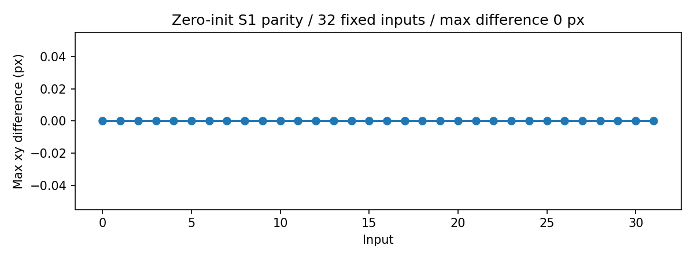
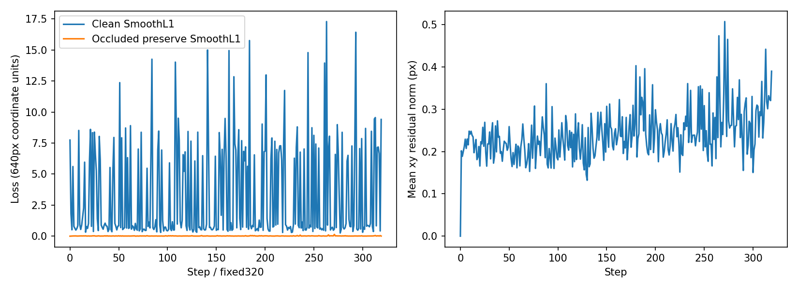
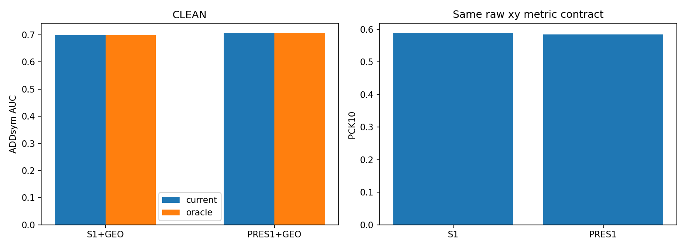
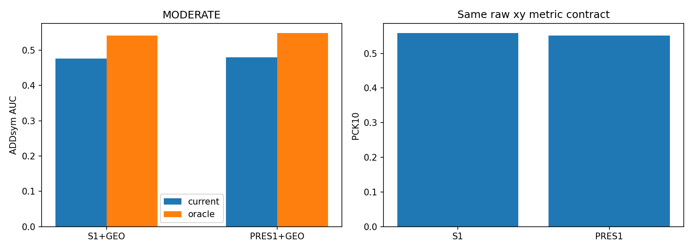
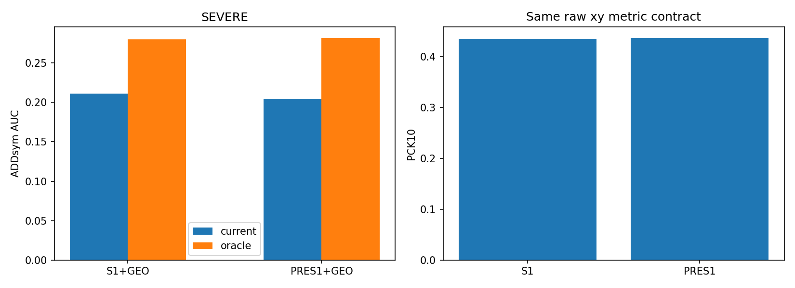
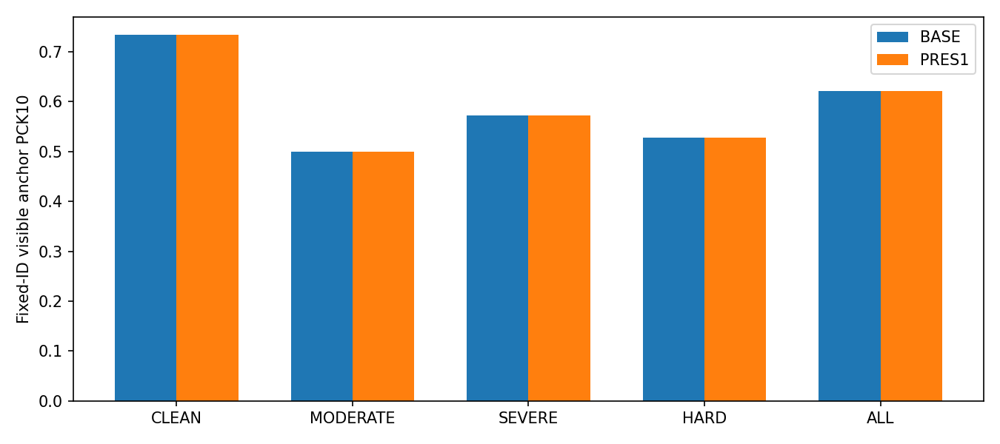
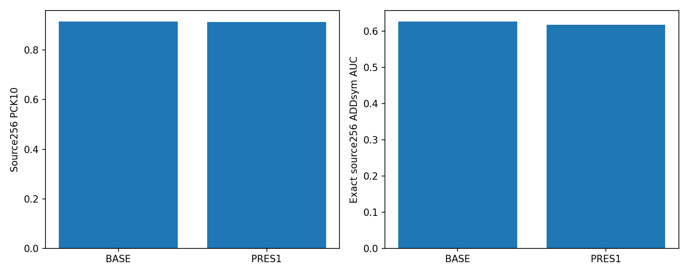
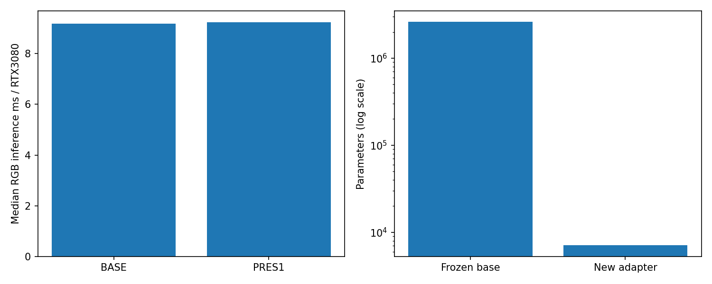
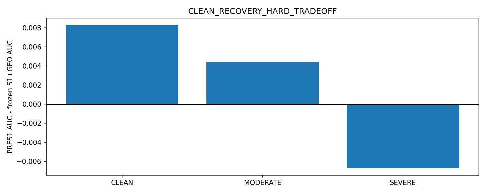
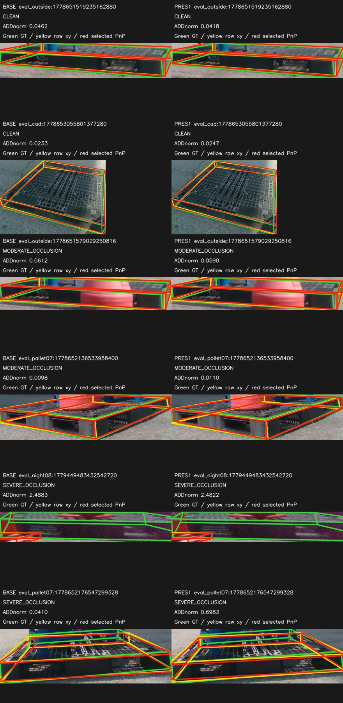

# S1 + GEO_LINEAR — single-model clean-preservation pilot

## 1. 결론

**CLEAN_RECOVERY_HARD_TRADEOFF**. 기준은 새 어댑터가 없는 frozen S1 + GEO_LINEAR다. Clean AUC 상승과 Moderate/Severe AUC 비감소를 모두 요구하며, 결과를 보고 효과크기 임계값을 추가하지 않았다.

|group|BASE AUC|PRES1 AUC|Δ AUC|
|---|---:|---:|---:|
|CLEAN|0.69863793|0.70691379|+0.00827586|
|MODERATE|0.47533333|0.47976190|+0.00442857|
|SEVERE|0.21130769|0.20460897|-0.00669872|
|ALL|0.36503516|0.36355469|-0.00148047|

verified HARD36 PCK10 감소 경고: False (정답 개수 변화 +0). 이 warning으로 6D 판정을 뒤집지 않는다. 이번 결과로 기존 production/final 모델을 교체하지 않았다.

## 2. Baseline S1+GEO_LINEAR

원본 S1 가중치와 합성 학습 GEO_LINEAR 가중치/feature 계약을 그대로 고정했다. 실제 S1 재추론과 기존 캐시 일치를 확인했고, 기존 PCK/pose/verified FINAL_V2 baseline을 재현했다. S0+D9/R0/PRES1+D9는 보조표에만 포함한다. 기존128장은 recording-disjoint이지만 이미 열람한 DEV다.

## 3. Zero-init 구조와 parity

설치된 Pose26의 end-to-end one2one keypoint projection `one2one_cv4_kpts` 직전 feature를 각 scale에서 사용했다. 독립 `Conv1x1(C,32) → SiLU → Conv1x1(32,27)` 3개이며 마지막 Conv weight/bias0. raw x/y 채널에만 더하고 visibility/conf 채널은 mask0이다. 추가 파라미터 **7,089개**. backbone/neck/box/class/기존 keypoint/scorer는 전부 고정했다.

고정32장의 최대 xy 차이 **0.0px**. bbox/conf/선택검출/D9 pose/GEO_LINEAR 결정 동일. clean loss의 adapter gradient L1=63.685527, base grad0. 원래 Pose26 inference decoder의 in-place sigmoid/slice 연산은 학습 역전파에서 version 오류를 내므로, 학습 중만 동일 `(raw+anchor)*stride` / sigmoid의 functional 식으로 바꿨다. stock 대비 bit-exact 출력 검증을 통과했고 어떤 optimizer step 전에도 모델/손실 수식은 바꾸지 않았다.

## 4. 고정 학습 계약

320 updates / batch16 /5epochs /seed42 /AdamW lr1e-3 wd1e-4 /last checkpoint only. 각 batch 4 real-clean +4 synth-clean +8 synth-occluded-preserve. 총 REAL1280 +SYNTH_CLEAN1280 +SYNTH_OCC2560=5120 occurrence. original S1의 immutable base-augmentation cache를 재사용하고, real-clean은 원래 Clean10 teacher pseudo xy/mask를 사용했다. DEV/anchor/T2/hard manual을 학습하지 않았다.

합성 clean256/epoch는 기존 source512의 SHA 고정 순서로 선택했다. 합성 preserve512/epoch는 기존 S1 random rectangle policy의 size/fill/schedule/coverage/paired-placement 조건을 cached640 canvas에서 적용했다. 계획은 모델 출력과 무관하게 먼저 고정했다. 적용 불가/미예약은 원래 policy처럼 clean RGB를 그대로 보존한다. 원본 source512의 모든 epoch 캐시가 hash 검증됐다.

좌표 task는 지시문에서 미지정된 구체식을 학습 전에 명시적으로 고정했다: frozen top1 검출의 decoded xy를 640-input pixel 단위 SmoothL1(beta1)로 감독하며, clean 유효 x/y scalar 수로 나눈다. 원래 mask v==2만 사용한다. 같은 occluded input의 frozen S1 top1 decoded9점 xy를 detach하여 동일 단위 SmoothL1로 보존한다. `L=L_clean+1.0*L_occ_preserve`. pose/RLE/LoRA/추가 선택기 loss는 없다.

|epoch|L_clean mean|L_occ mean|residual norm px|real / synth clean / synth preserve|
|---|---:|---:|---:|---|
|1|2.853403|0.014627|0.209502|256 /256 /512|
|2|2.744083|0.014960|0.217435|256 /256 /512|
|3|3.630990|0.016117|0.245440|256 /256 /512|
|4|3.452929|0.017948|0.245727|256 /256 /512|
|5|3.624238|0.020486|0.284508|256 /256 /512|

각 epoch는 서로 다른 cached augmentation을 쓰므로 loss의 epoch 간 차이를 같은 입력의 train-fit 개선으로 해석하지 않는다. magnitude cap/8px 제한은 없지만 보존 loss가 실제 이동을 작게 만들 수 있다. 결과에 맞춰 lr/epoch/lambda를 다시 고르지 않았다.

## 5. CLEAN

|arm|PCK5|PCK10|PCK20|median px|P90 px|>20|CURRENT AUC|ORACLE AUC|selection loss|axis count|
|---|---:|---:|---:|---:|---:|---:|---:|---:|---:|---:|
|BASE|0.3755|0.5895|0.8559|7.700|21.899|33|0.698638|0.698638|0.000000|29/29|
|PRES1|0.3843|0.5852|0.8559|7.516|22.059|33|0.706914|0.706914|0.000000|29/29|
|PRES1_D9|0.3843|0.5852|0.8559|7.516|22.059|33|0.706914|0.706914|0.000000|29/29|
|S0|0.3799|0.6026|0.8996|7.663|19.563|23|0.711879|0.711879|0.000000|29/29|
|R0|0.3624|0.6594|0.9476|7.258|17.485|12|0.714741|0.714741|0.000000|29/29|

|arm|R med° /P90|yaw med° /P90|t med cm /P90|IoU3D median|
|---|---|---|---|---|
|BASE|1.573 /3.172|0.408 /1.337|4.707 /7.038|0.6194|
|PRES1|1.597 /3.212|0.460 /1.328|4.567 /6.545|0.6275|
|PRES1_D9|1.597 /3.212|0.460 /1.328|4.567 /6.545|0.6275|
|S0|1.513 /3.043|0.648 /1.172|4.297 /7.409|0.6625|
|R0|1.611 /3.461|0.633 /1.191|2.930 /8.400|0.6965|

canonical GT ID 대응 후 loss/gain transitions: `{'points': 229, 'lost_correct10': 2, 'gained_correct10': 1, 'recovery20_to10': 0, 'damage5_to10': 0, 'new_match_failures': 0, 'match_recoveries': 0, 'branch_changed': 0}`

## 6. MODERATE

|arm|PCK5|PCK10|PCK20|median px|P90 px|>20|CURRENT AUC|ORACLE AUC|selection loss|axis count|
|---|---:|---:|---:|---:|---:|---:|---:|---:|---:|---:|
|BASE|0.1753|0.5584|0.8506|9.348|22.476|23|0.475333|0.540595|0.065262|17/21|
|PRES1|0.1623|0.5519|0.8506|9.239|21.987|23|0.479762|0.547881|0.068119|17/21|
|PRES1_D9|0.1623|0.5519|0.8506|9.239|21.987|23|0.439643|0.547881|0.108238|16/21|
|S0|0.1558|0.5584|0.8377|9.166|25.202|25|0.464119|0.511976|0.047857|18/21|
|R0|0.1623|0.5844|0.8636|9.117|24.119|21|0.479548|0.563143|0.083595|17/21|

|arm|R med° /P90|yaw med° /P90|t med cm /P90|IoU3D median|
|---|---|---|---|---|
|BASE|1.751 /78.265|1.313 /78.263|6.842 /19.134|0.7462|
|PRES1|1.754 /78.384|1.330 /78.382|6.764 /18.286|0.7471|
|PRES1_D9|1.807 /83.048|1.201 /82.974|6.921 /18.286|0.6287|
|S0|1.816 /5.167|1.144 /4.445|7.037 /15.097|0.7324|
|R0|1.998 /77.020|1.490 /77.018|5.907 /14.380|0.7108|

canonical GT ID 대응 후 loss/gain transitions: `{'points': 154, 'lost_correct10': 2, 'gained_correct10': 1, 'recovery20_to10': 0, 'damage5_to10': 0, 'new_match_failures': 0, 'match_recoveries': 0, 'branch_changed': 0}`

## 7. SEVERE

|arm|PCK5|PCK10|PCK20|median px|P90 px|>20|CURRENT AUC|ORACLE AUC|selection loss|axis count|
|---|---:|---:|---:|---:|---:|---:|---:|---:|---:|---:|
|BASE|0.1678|0.4352|0.6661|11.972|68.003|201|0.211308|0.279929|0.068622|52/78|
|PRES1|0.1744|0.4369|0.6661|11.868|67.709|201|0.204609|0.281481|0.076872|51/78|
|PRES1_D9|0.1744|0.4369|0.6661|11.868|67.709|201|0.196154|0.281481|0.085327|47/78|
|S0|0.1545|0.4086|0.6545|13.097|73.581|208|0.144782|0.242481|0.097699|41/78|
|R0|0.1611|0.4037|0.6080|12.952|211.362|236|0.159763|0.265314|0.105551|37/78|

|arm|R med° /P90|yaw med° /P90|t med cm /P90|IoU3D median|
|---|---|---|---|---|
|BASE|4.476 /87.901|3.625 /87.897|13.407 /88.958|0.5144|
|PRES1|4.562 /88.207|3.904 /88.199|13.597 /88.990|0.5008|
|PRES1_D9|5.647 /88.391|4.731 /88.389|13.597 /111.319|0.5008|
|S0|12.542 /88.463|10.091 /88.442|15.080 /118.633|0.4811|
|R0|63.297 /89.370|28.821 /89.253|13.677 /209.118|0.4870|

canonical GT ID 대응 후 loss/gain transitions: `{'points': 602, 'lost_correct10': 2, 'gained_correct10': 3, 'recovery20_to10': 0, 'damage5_to10': 0, 'new_match_failures': 0, 'match_recoveries': 0, 'branch_changed': 0}`

## 8. Verified visible — fixed FINAL_V2

|group|N|BASE correct10|PRES1 correct10|BASE PCK10|PRES1 PCK10|BASE median/P90 px|PRES1 median/P90 px|PRES1 >20|
|---|---:|---:|---:|---:|---:|---|---|---:|
|ALL|66|41|41|0.6212|0.6212|7.033/17.453|6.774/17.618|5|
|HARD|36|19|19|0.5278|0.5278|7.931/19.445|7.804/19.223|4|
|CLEAN|30|22|22|0.7333|0.7333|5.645/13.949|5.658/13.770|1|
|MODERATE|22|11|11|0.5000|0.5000|9.114/16.511|8.967/16.612|1|
|SEVERE|14|8|8|0.5714|0.5714|7.533/23.374|7.384/23.300|3|

PCK5/20와 전체 정량은 [VERIFIED_VISIBLE.json](VERIFIED_VISIBLE.json). visible direct clicks만 fixed-ID로 평가하며 PnP 완성점이나 새 remapping을 정답으로 추가하지 않았다.

## 9. Source preservation

|arm|N frames|PCK5|PCK10|PCK20|median/P90 px|>20|exact ADD AUC|
|---|---:|---:|---:|---:|---|---:|---:|
|BASE|256|0.7663|0.9147|0.9665|2.457/9.071|68|0.626045|
|PRES1|256|0.7663|0.9142|0.9665|2.422/8.808|68|0.616949|

기존 고정 source256 그대로. 이전 단계의 exact renderer evaluator를 재사용했고, 투영-라벨 최대 오차 0.000825px를 확인했다. 새로운 synthetic TEST나 가림 recipe를 결과 보고 고르지 않았다.

## 10. Compute

Frozen fused base 2,615,142 params +adapter 7,089. 학습 37.00s. inference GPU peak allocated 192.4MiB. median latency S1 9.19ms → PRES1 9.23ms. RTX3080 batch1, 먼저10 pair 제외, decode/checkpoint load 제외, RGB predictor 시간. PnP/scorer는 별도 총 0.61s/256 model-frame. Jetson 측정이 아니다.

## 11. 조건부 supervision gap

**MIN_HARD_LABELING_JUSTIFIED**. Frozen S1 기준 HARD36 중 >10px 17, TEACHER_CAN_TEACH 9, BOTH_FAIL_VISIBLE 8, GROSS_BOTH_FAIL 1. Missing trusted support cell의 both-fail 8점, 5 frames/3 corner IDs. gate를 사후 변경하지 않았다.

[점별 오류·trusted support 제외 사유·고정 gate](SUPERVISION_GAP_REPORT_KO.md)

## 12. 다음 행동

고정 gate가 최소 hard-label 파일럿을 지지했지만, 후보 metadata 감사는 **HARD_CANDIDATE_METADATA_INSUFFICIENT**로 멈췄다. 평가/anchor/Clean10/H10/SHA/MAD 제외 후 기존 hard 태그 후보16장은 REC_001/002 두 recording뿐이다(Moderate15 /Severe1). 최소3 recordings·recording당 최대3장·initial8을 충족할 수 없다. 전체 adaptation RGB pool8031장도 기존 hard 태그가 없어 추가 후보0장이다. 모델 예측/오차/confidence로 대신 고르지 않았다.

따라서 선택된 큐0장, 새 클릭0개, GUI/label lock 미생성. 지금 사용자에게 어노테이션을 요청하지 않는다. 다음에는 적어도 한 개의 추가 비평가·비예약 recording에서 model-independent hard metadata가 필요하다. 기존2개 recording으로 조건을 완화하거나 새 라벨로 재학습하지 않았다. [조건부 후보 감사와 그림](../pallet_min_hard_labels_v1/REPORT_KO.md).

아래는 각 난도에서 PRES1−BASE ADDnorm 변화가 가장 좋은/나쁜 사례다. 전체 빈도가 아니라 사후 설명용이며, raw2D(노랑)와 선택 PnP(빨강)를 구분한다. GT(초록)는 평가/시각화에만 사용한다.

## 13. 한계와 재현

- reused recording-disjoint HELDOUT128이며 독립 final TEST가 아니다. plastic-only, single seed42, 작은 visible anchor, geometry-derived real6D reference다.
- camera-facing 역할 규약과 물리적180° C2 동치는 다르다. 기존 role warning 유지, C4 remap/GT 수정/점별 free matching 없음.
- 추가 capacity와 loss/fit 신호의 충분성은 이번 한 어댑터/320step으로만 판단한다. 작은 변화나 실패를 구조 전체의 불가능성으로 일반화하지 않는다.
- synthetic occlusion 보존과 실제 hard 보존이 동일하다고 가정하지 않는다. teacher-can-teach는 수동 정답 부족과 다른 병목이다.
- 자동 감사 39개 PASS. 기존 hash-bound 입력 5694개 불변. [감사](AUDIT.json), [프로토콜](PROTOCOL_LOCK.json), [학습노출](OCCURRENCES_LOCK.json), [실행코드](../../../scripts/research/pallet_single_model_preserve_v1/README.md).
- 큰 tensor/checkpoint/좌표 캐시는 로컬 private namespace에 보존하고 MD·작은 ROI 이미지·표만 공개한다. 어노테이션 package는 조건부 gate를 통과할 때만 만든다.
