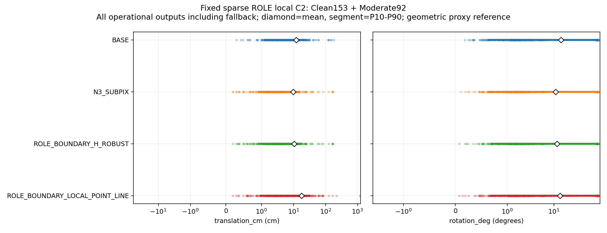

# 같은 sparse IMAGE_ROLE의 LOCAL point + unused physical line 보정

**N3→cornerSubPix보다 좋아지지 않았다.** 새 수치 자세는40장→115장으로 늘었지만, 쉬움153+중간92의245장 전체 위치 평균은17.8790cm(기존 N3 9.7545cm), 회전은13.4153°(10.9148°)다. 최대 위치1204.8027cm도 NEW 결과로 포함했다. 수치 산출·rank6·가림 일치를 실제 정확도 성공과 구분한다.

같은 고정 IMAGE_ROLE head의 sparse boundary q와, 점을 만드는 데 소비되지 않은 실제 physical/CAL 부분선만 사용했다. native N3 좌표와 자기 가림 초기2D 좌표를 최종 fit에 채우지 않는다. 초기 자세는 local optimizer start이며 residual prior가 없다. 새 R,t를 얻으면 H를 재투영으로 교체하고 다시 fit하지 않는다. 최신 범위는245장이며 이전 전체319장 기록과 Severe74를 보존했다. 이번 새 학습/RGB/seed는0이다.

- [상세 한국어 결과: 전체648moment·81CI·196time값·8이미지](RESULT_KO.md)
- [사전 고정 평가 계약](EVALUATION_CONTRACT_KO.md), [원래 재현 명령](REPRODUCE.md), [실행량/실패 이력](BUILD_LEDGER.json)
- [실제980score 원행 CSV](PUBLIC_FRAME_METRICS.csv), [전체 METRICS](METRICS.json), [독립 통계·CI 검산](VERIFICATION.json)
- [실제 geometry seal](GEOMETRY_SEAL.json), [독립655238 geometry 검사](VALIDATION_CHECKS.json)
- [mask label 오류 보완245행](MASK_POSE_AUDIT_ROWS.jsonl.gz), [실제48group audit](MASK_POSE_AUDIT_CHECKS.json)
- [600fresh 전체 경로 시간](RUNTIME_REVIEW.json), [원112104검사/300문자열 실패](RUNTIME_VALIDATION_CHECKS.json), [별도300개 수정 predicate](RUNTIME_ANCHOR_REVIEW_CHECKS.json), [조인된 검산 권위](JOINED_RUNTIME_CONTRACT_CHECKS.json)
- [원 그림 binding](FIGURE_BINDINGS.json), [여백 교정만 수행한8그림](FIGURE_LAYOUT_CHECKS.json), [실제6case 가독성 검토](VISUAL_LAYOUT_REVIEW.json)
- [CAL128 Base role 특징 재생](SOURCE_ROLE_CHECKS.json), [원본 byte 보관 manifest](ARCHIVE_MANIFEST.json)
- [private GT/weights 없이 공개 검토](PUBLIC_REVIEW_CHECKS.json), [처음 없던10원 gzip의 실제 복원](PUBLIC_FRESH_RESTORE_CHECKS.json), [fresh 공개 재검토](PUBLIC_FRESH_PUBLIC_REVIEW_CHECKS.json)
- [원본/weights/사용자 변경/이전 실험 보호](PROTECTION_AFTER.json)



[원 local solver](../../../scripts/research/pallet_sparse_local_line_20261010_v9/solver.py), [H fit 제외·재투영 조립](../../../scripts/research/pallet_sparse_local_line_20261010_v9/pipeline.py), [GT 전 geometry 실행](../../../scripts/research/pallet_sparse_local_line_20261010_v9/runner.py), [독립 geometry 검사](../../../scripts/research/pallet_sparse_local_line_20261010_v9/validation_checks.py), [fit/model 금지 scorer](../../../scripts/research/pallet_sparse_local_line_20261010_v9/evaluator.py), [원행 집계](../../../scripts/research/pallet_sparse_local_line_20261010_v9/statistics.py), [독립 stdlib moment/CI 검산](../../../scripts/research/pallet_sparse_local_line_20261010_v9/verify.py)를 공개한다. 추가 보고용 [mask audit](../../../scripts/research/pallet_sparse_local_line_20261010_v9/mask_pose_audit.py), [layout-only render](../../../scripts/research/pallet_sparse_local_line_20261010_v9/render_layout_review.py), [stdlib 공개 원행 검토](../../../scripts/research/pallet_sparse_local_line_20261010_v9/public_review.py)도 원 core를 바꾸지 않고 별도 protocol로 고정·실행했다.

원 METRICS/CSV의 LOCAL `mask_applied=False`는 기존 V8 method registry를 재사용한 보고용 label 오류다. 실제 H 제외가 없었다는 뜻이 아니다. 원행과 score를 바꾸지 않았으며 정확한 mask×T/R 진단은 별도 MASK_POSE_AUDIT를 읽는다. 원 runtime 검산도 literal 오류로 `passed=False`를 그대로 보존하고, 나머지111804검사+별도300수정 predicate의 조인 권위를 따로 제공한다.

원 gzip9개는 직접 게시하고59,994,742B runtime 원행만40MiB+나머지의2part로 보관한다. 공개 검토 전에 새 폴더로 복원하고 byte SHA를 검사한다. 다음 명령은 검토자 재현이며 기존 완료 receipt를 덮어쓰지 않는다.

```bash
python -I -S scripts/research/pallet_sparse_local_line_20261010_v9/restore_archives.py freeze --input _docs/experiments/pallet_sparse_local_line_20261010_v9 --output /tmp/v9-raw-restored --receipts /tmp/v9-restore-checks
python -I -S scripts/research/pallet_sparse_local_line_20261010_v9/restore_archives.py run --input _docs/experiments/pallet_sparse_local_line_20261010_v9 --output /tmp/v9-raw-restored --receipts /tmp/v9-restore-checks
```

복원 폴더에 accuracy core inputs/부모 의존성을 함께 둔 공개 dependency 환경에서 verify/public_review를 실행하는 명령은 [상세 보고서](RESULT_KO.md)의 검토 순서를 따른다. public_review는 private GT·weights·production import가 없지만 전체 모델 경로 재현에는 보존된 환경/모델/원 RGB가 필요하다. fresh bundle의 저장 산술 검토는 새 모델이나 물리 정답의 독립 검사가 아니다.

현재 원행은 이미 알려진 GEOMETRIC_PROXY DEV 평가다. 독립 물리 정답·unseen 일반화·전역 유일해를 증명하지 않는다. V9의 정해진 실험·검산·그림·전체 시간·fresh 복원은 완료했고 전체 정확도 개선 목표는 아직 미해결이다. 전용 research 브랜치의 실제 commit/remote SHA는 별도 게시 witness가 권위이며 main push/force push는 하지 않는다.
