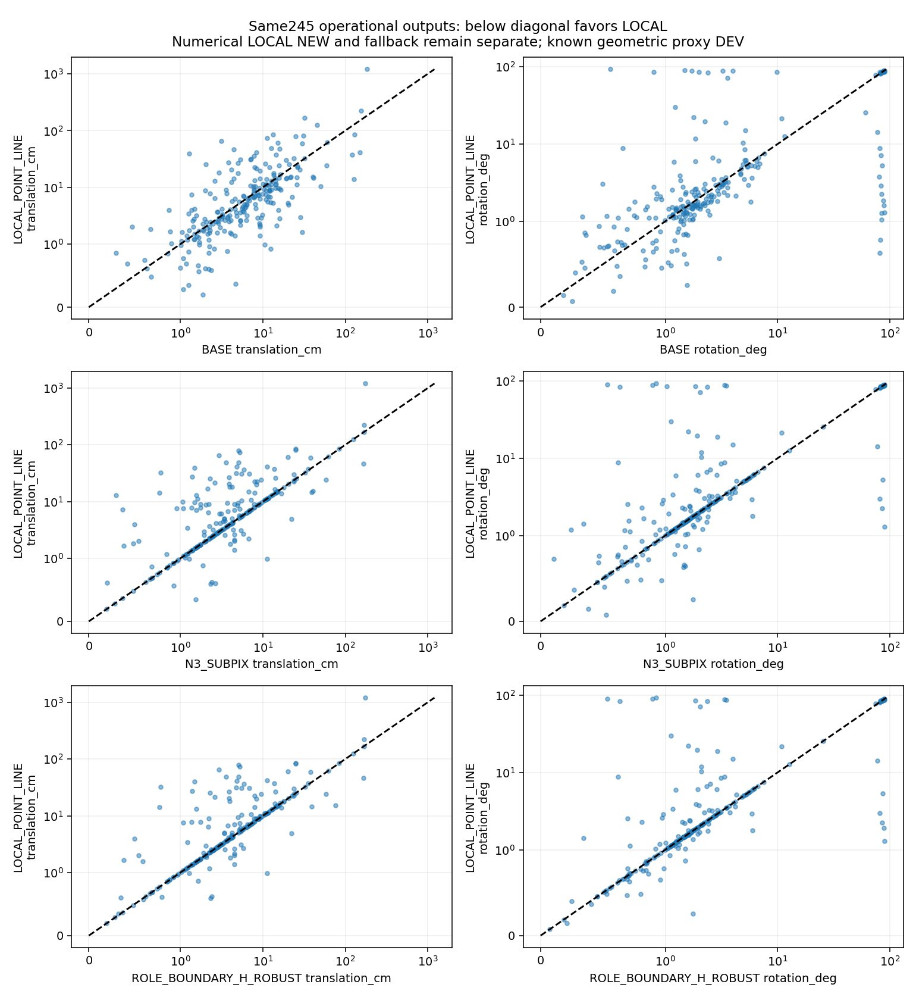
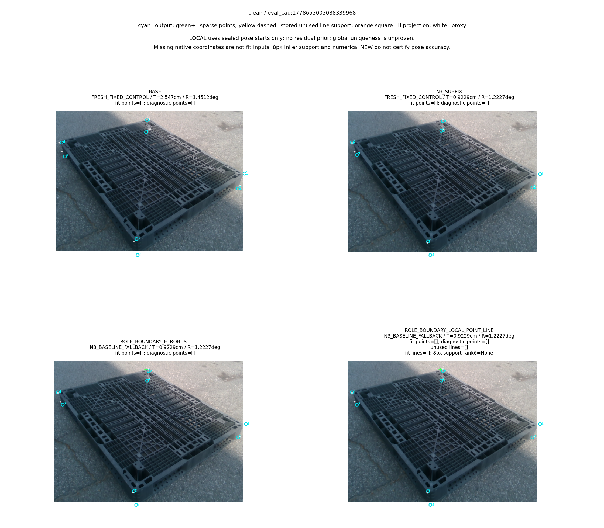
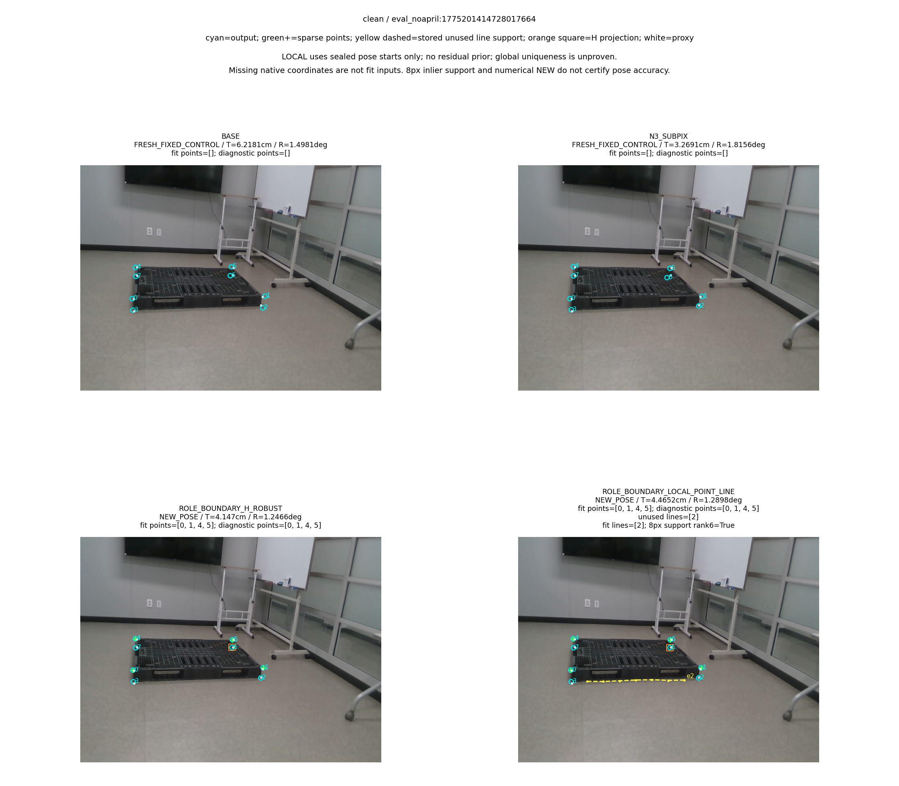
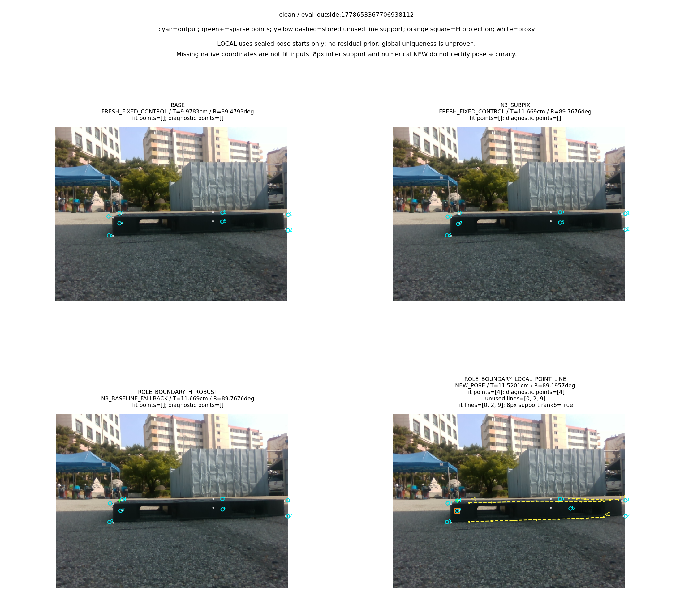
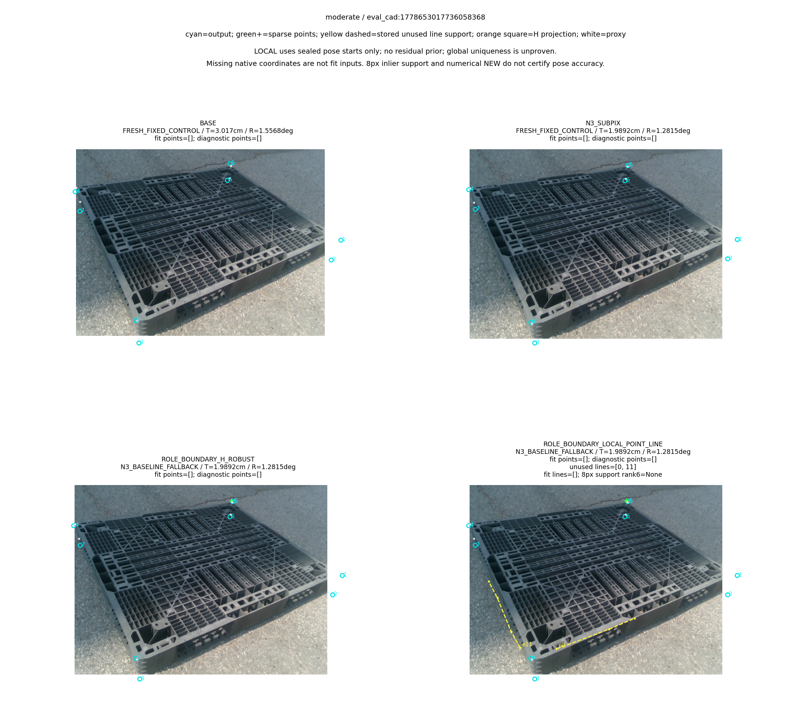
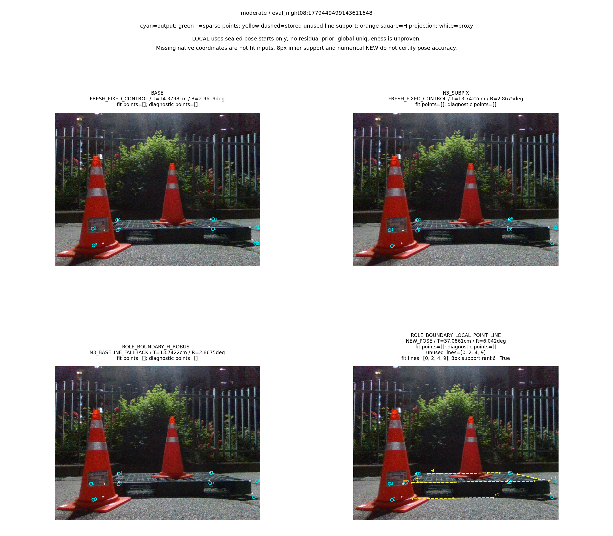
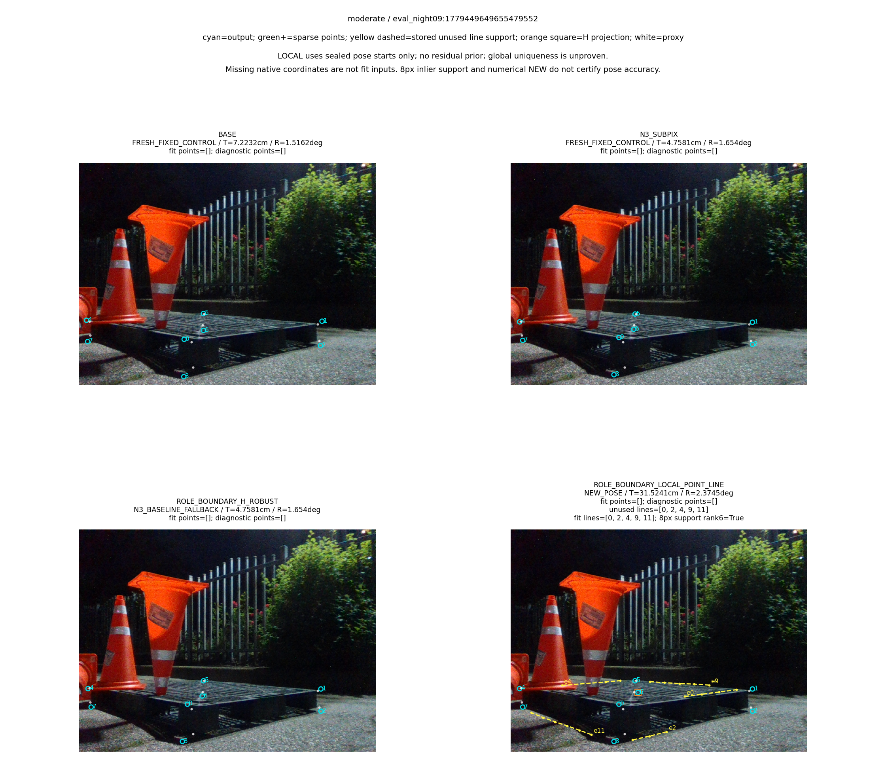

“가림 판단이 일부 틀려도 다른 유효 대응점으로 자세를 구하고 자기 가림 코너를 재투영했을 때, 기존 단순 대조보다 실제 위치·회전이 좋아졌는가?”

**아니요. 같은 희소 IMAGE_ROLE 관측에 남은 실제 부분선을 더해 새 수치 자세 산출을40장→115장으로 늘렸지만, 전체245장의 위치·회전은 N3→cornerSubPix보다 나빠졌다.** LOCAL의 위치 평균17.87901676799424cm·회전13.415258792985208°는 N3의9.754548028679153cm·10.914841863166323°보다 크다. 최대 위치 오차1204.8027435564068cm도 새 수치 자세로 남겼으며 실패로 빼지 않았다. 가림이 틀린데 T/R 모두 좋아진3장과 가림이 맞는데 둘 다 나빠진43장도 실제로 존재한다. 완벽한 가림 분류는 수치 자세 산출의 필요조건이 아니다. 수치 산출·rank6·8px inlier support 역시 올바른 물리 대응이나 실제 자세 정확도의 충분조건이 아니다.

# V9: 같은 IMAGE_ROLE 희소 점 + 소비하지 않은 실제 부분선의 LOCAL C2

## 1. 지금 문제인 부분과 이번에 풀어 확인한 부분

현재 코드가 자기 가림을 무시하거나 점이4개 미만이면 무조건 frame을 버리는 것이 문제는 아니다. 새 LOCAL 경로는170장의 “4점 미만 + 실제 남은 선” 중73장에서 자세를 실제 산출했다. 이73장은 N3 대비 T/R 모두 개선10·모두 악화42·혼합21이다. 실제 point-only fallback을 LOCAL NEW로 바꾼76장도 개선11·악화42·혼합23이다. **관측 부족 때문에 pose를 못 구하는 경로는 일부 해결했으나, 선택한 점·선의 실제 대응 정확도와 지역해의 신뢰성은 해결하지 못했다.** 추가 선이 없는 point LOCAL NEW15장은 선의 효과로 세지 않는다.

현재 확인되는 어려움은 코너의 semantic edge ownership과 실제 선 대응, 관측의 배치·conditioning, 지역 최적화가 고른 pose branch다. 이 실험은 어느 원인 하나의 인과 비율을 특정하지 않는다. 실제 채택된 boundary447점 중 proxy 기준8px 이내365·초과82, N3보다 오차 개선192·악화255다. local 전체 rank6 및115개 NEW의8px support rank6이 모두 통과해도 잘못된 대응이 서로 일관되거나 깊이·branch가 불안정할 수 있다. 최대12m대 위치 오차를 수치 정상이라는 이유로 정확도 성공으로 보고하지 않았다.

자기 가림 제외와 최종 재투영 동작은 이미 구현·검산되어 있다. H의 초기2D 좌표는 fit 입력에서 제외하며, 새 R,t가 나오면 H를 재투영으로 교체한다. 재투영점을 다시 관측으로 넣지 않는다. 현재 sparse decoded/admitted stage에서 채택 boundary의 H가0인 것은 그 stage의 공급 결과다. 이것을 native hybrid의 H exclusion 전체 효과가 없다는 주장으로 확대하지 않는다.

## 2. 범위와 이전 결과의 관계

최신 사용자 지시에 따라 **Clean153 + Moderate92 =245장**,13세션만 새 실행에 썼다. Severe74는 제외했다. 이전 main와 브랜치의319장(Clean153/Moderate92/Severe74) 기록은 보존하며 이번245장 결과로 대체하지 않았다. 새 실사 촬영·수동 어노테이션·RGB 생성·새 seed·학습 update는 모두0이다.

[최초 무학습6대조·마스크 스트레스·구감독 모델](../pallet_observation_refiner_20261009_v1/RESULT_KO.md), [물리 경계 감독 수정과 준비](../pallet_kp_supervision_repair_20261010_v1/RESULT_KO.md), [수정 감독의 실제 세조건 학습](../pallet_kp_corrected_supervision_20261010_v1/RESULT_KO.md), [같은 수정 head의 V7 실제 실행](../pallet_three_head_observation_20261010_v7/RESULT_KO.md), [같은 sparse q의 V8 일반/강건·마스크/무마스크 절제](../pallet_same_observation_controls_20261010_v8/RESULT_KO.md)를 구분해서 읽어야 한다. V8는 masked/no-mask robust의 실제 입력U가245장 모두 같고 Hremoved0이어서 pose도 같았다. 이는 현재 sparse 공급의 대조이며 모든 경로의 가림 판단이나 head 필요성을 없앤다는 결론이 아니다.

LOO도 단지 계획한 상태가 아니다. [V4 selection.py:130~176](../../../scripts/research/pallet_cornerwise_independent_20261010_v4/selection.py#L130)는 실제H와 held-out k를 모두 제외한 동일 강건 pose로 candidate/N3 residual을 비교한다. H∪{k}는 fit·branch 선택에서 빠지고 withheld projection은 관측이 아니다.8px cap과 strictly positive squared-residual gain을 사전에 고정했다. V7 native hybrid IMAGE_ROLE은 이 경로의245장 재생 parity를 확인했으며 위치약10.7034cm·회전약12.7702°로 N3보다 나빴다. V9는 최신 sparse route에 빠져 있던 LOCAL C2 하나를 실행한 것이며 새 LOO threshold나 성능에 맞춘 반복을 추가하지 않았다. [이전 방법 인과 감사](../pallet_three_head_observation_20261010_v7/METHOD_CAUSAL_AUDIT_KO.md)도 함께 남긴다.

위치·회전·ADDsym은 기존 N3 phase의 **GEOMETRIC_PROXY** reference에 대한 실제 저장 pose 오차다. 같은245장을 반복 개발에 사용했으므로 독립 unseen test 또는 독립 물리 측정 정답으로 부르지 않는다. 조건부 그룹의 개선 사례가 전체 운용 성능이나 일반화를 증명하지 않는다.

## 3. 사전 고정한 LOCAL 방법

사전 protocol SHA256은 `728c705cb04ed2f28cfbc0fa6b815ae8a66f7ef00cde61d291dec7517880d8e3`이다. [PROTOCOL](PROTOCOL.json), [평가 계약](EVALUATION_CONTRACT_KO.md), [원래 재현 명령](REPRODUCE.md)을 core 코드12개와 함께 고정했다. 이후 solver·threshold·head·학습량을 성능에 맞춰 바꾸지 않았다.

- 같은 V7 IMAGE_ROLE boundary-only q,K,치수,H와 원래 physical/CAL 부분선을 사용한다. 점을 만들 때 소비한 edge는 line factor에서 제외한다. 없는 native N3 코너를 채우거나 같은 선에서 만든 점+선을 중복 관측으로 세지 않는다.
- 초기 N3 pose와 저장된 유효 point-only pose는 local optimizer의 출발점이다. residual prior·초기 치수 prior·독립 치수 prior는 없다. 최대 두 pose 출발점×두 등록 치수를 시도하며 수치 출발점이 같으면 재사용한다. source GT나 human mask는 시작·선택에 쓰지 않는다.
- 실제점1개·고유 부분선1개가 각각 두 scalar residual을 제공한다. 최소6개 actual scalar factor, point 가중1·선 두 성분 각1/√2, `soft_l1` scale8px·`max_nfev=50`이다. 최종 비용은 같은 전체 실제 factor pool에서 비교한다.
- finite R,t/residual, optimizer 성공,8코너 positive camera depth, 최종 전체 observed-normal 및 modeled-normal joint Jacobian rank6을 요구한다. 서로 다른 지역해가 수치 동률이면 AMBIGUOUS다. **전역 유일해는 증명하지 않는다.**
- 8px point/line inlier와 그 support rank는 진단이다. 수락 후 사후4점·inlier-rank gate를 추가하지 않는다. 관측 부족·수치 실패·지역 다중해·NEW·N3 기본 출력·완전 실패를 분리한다.
- NEW가 나오면 실제 H를 재투영으로 교체하고 다시 fit하지 않는다. NEW가 없으면 원래 N3 전체 출력을 반환하거나 원래 pose도 없을 때 완전 실패한다. detector center와 missing corner의 표시 좌표를 보존하는 것과 fit 입력은 구분한다.

실제 코드는 [solver.py](../../../scripts/research/pallet_sparse_local_line_20261010_v9/solver.py), [pipeline.py](../../../scripts/research/pallet_sparse_local_line_20261010_v9/pipeline.py), [runner.py](../../../scripts/research/pallet_sparse_local_line_20261010_v9/runner.py), [독립 기하 checker](../../../scripts/research/pallet_sparse_local_line_20261010_v9/validation_checks.py), [fit/model/local optimizer 금지 scorer](../../../scripts/research/pallet_sparse_local_line_20261010_v9/evaluator.py), [원행 통계](../../../scripts/research/pallet_sparse_local_line_20261010_v9/statistics.py), [독립 stdlib 검산](../../../scripts/research/pallet_sparse_local_line_20261010_v9/verify.py)에 있다.

## 4. 실제 실행과 검산

CPU 최초14개 중12개 PASS와2개 fixture expectation 문제가 있었고 최초 실패를 보존했다. frozen solver/test를 바꾸지 않고 별도 targeted review2개를 실행하여 기존12개와 조인한14개 기능 계약을 확인했다. 나머지12개를 다시 실행한 것으로 세지 않는다. geometry는 GT-free245행/ledger245행을 한 번 완성한 뒤 stream close/fsync·환경·monkeypatch cleanup을 마치고 seal했다. geometry wall26.5946752047초는 보존 관측 replay이며 배포 latency가 아니다.

|실제 항목|수량|
|---|---:|
|geometry 실행|1|
|geometry / ledger / 완료frame|245 / 245 / 245|
|NEW / N3 fallback / 완전실패|115 / 130 / 0|
|INSUFFICIENT_LOCAL_FACTORS / AMBIGUOUS_LOCAL_POINT_LINE / LOCAL_NUMERICAL_FAILURE|61 / 67 / 2|
|4점미만+실제선 NEW / 선0개 pointLOCAL NEW|73 / 15|
|NEW 중 weak8pxsupport|0|
|SciPy 실제 optimizer entry / return / 성공return|448 / 448 / 441|
|residual / Jacobian callback|5954 / 4993|
|OpenCV 실제 projectPoints / Rodrigues|16259 / 1845|
|새solvePnP / Generic / LM / cornerSubPix|모두0|
|NEW 뒤H 재투영assignment|146|
|저장candidate / 선택결과재검사|440 / 115|
|독립scalar함수호출(서로다른pose수가아님)|555|

[GEOMETRY_SEAL](GEOMETRY_SEAL.json), [CONTROL_RECEIPT](CONTROL_RECEIPT.json), [VALIDATION_PROTOCOL](VALIDATION_PROTOCOL.json), [VALIDATION_CHECKS](VALIDATION_CHECKS.json)에서655,238검사/실패0, 최대scalar차3.2741809263825417e−11, 검사wall14.316415791399777초를 확인한다. 순수독립 checker는 저장 R,t/투영/actual point+unusedline residual/분석 Jacobian/rank witness/비용/동률/상태/driver 전달/H재투영/전체call·cleanup을 대조한다. 원래 full candidate witness를 삭제하지 않았다. 최대 차이는 absolute1e−7 + relative1e−12의 사전 허용 범위와 비교하며 원 SVD를 새로 실행하거나 hardware정확도·globaluniqueness를 인증하지 않는다.

GT는 전체 geometry seal+cleanup+독립 validation PASS 뒤에만 scorer에서 열었다. 실제 새 scorer980행은 LOCAL245+POINT245+BASE/N3 각245이며 기존 POINT245/fixed490의735점수가 일치했다. geometry나 optimizer가 score 단계에 들어오면 canary로 막는다. detector/N3/head/pose fit/local optimizer/ray 새 호출은 score에서0이다. [SCORING_RECEIPT](SCORING_RECEIPT.json), [SCORING_PARITY](SCORING_PARITY.json)를 확인한다.

통계는 실제980원행에서1회 계산했다. [METRICS](METRICS.json)와 [VERIFICATION](VERIFICATION.json)의 독립 stdlib 검산은 정확 조인22,257·numeric855·최대차1.8189894035458565e−12,648moment scalar·81CI·27paired group·33local diagnostic group을 확인했다. CI63개는 nonempty,18개는 None이다. 새 draw/seed0이며 기존13세션×10000count draw를 그대로 사용했다. 원행980·paired delta6714·nonempty resampled mean626433·resample denominator270000, 진단 ID membership2142·outcome 재계수4284·outcome ID set264를 기록한다. 조건부11그룹의 추가 moment는 producer 표 그대로이며 독립 checker가 그 moment까지 재계산한 것으로 주장하지 않는다.

CLI 실패도 실행량에 포함했다. validation의 isolated `-m` lookup 실패는 import/freeze/산술 전0work였고 같은 checker의 직접 경로 own freeze1/run1으로 진행했다. render 첫 `--input` argparse 오류도 decode/model/panel0에서 멈췄으며 원 attempt를 보존했다. runtime 첫 schema 오류와 이후 별도 input-schema-only review는 아래 시간 절에 구분한다. 성능 설정이나 threshold 반복은0이다.

보고서의 최종 전사는 별도 [report_scalar_check.py](../../../scripts/research/pallet_sparse_local_line_20261010_v9/report_scalar_check.py)가648 moment/81 CI/196 timing값과 표·local link를 저장 evidence와 대조한다. 자체 protocol과 실제 CHECKS receipt는 이 원문 고정 후 별도로 생성하며, 보고서에 미리 PASS로 적지 않는다. 조건부 추가 평균을 재계산하는 통계 실험이 아니다.

## 5. 전체 운용 결과와 산출률

표의 `BASE`=`BASE`, `N3`=`N3_SUBPIX`, `POINT`=`ROLE_BOUNDARY_H_ROBUST`, `LOCAL`=`ROLE_BOUNDARY_LOCAL_POINT_LINE`이다. BASE/N3의 `FRESH_FIXED_CONTROL`은 기존 고정 geometry에 현재 동일 scorer를 실행한 대조이며 이번 accuracy에서 detector/N3를 새로 forward한 뜻은 아니다. 모든 방법의 운용 분모를 유지했고 큰 오차를 수치 실패로 사후 제외하지 않았다.


|stratum|method|분모|산출|NEW|fallback|완전실패|fixed|T평균cm|R평균°|ADDsym평균cm|
|---|---|---|---|---|---|---|---|---|---|---|
|combined|BASE|245|245|0|0|0|245|12.188351368308584|14.232844378136992|22.431945806117554|
|combined|N3|245|245|0|0|0|245|9.754548028679153|10.914841863166323|17.028646667097725|
|combined|POINT|245|245|40|205|0|0|10.461849948586346|11.611525122485201|18.328032940838003|
|combined|LOCAL|245|245|115|130|0|0|17.87901676799424|13.415258792985208|26.64545714508252|
|easy|BASE|153|153|0|0|0|153|12.846348362759484|10.628204608338502|17.93860487754294|
|easy|N3|153|153|0|0|0|153|10.107072506393136|7.584578376689015|12.915132447282565|
|easy|POINT|153|153|37|116|0|0|11.267164662463289|8.696357041007952|15.024686291366251|
|easy|LOCAL|153|153|76|77|0|0|19.080348190580732|9.337368585359519|23.833929752896903|
|medium|BASE|92|92|0|0|0|92|11.094073757971767|20.227517038780135|29.904567132986195|
|medium|N3|92|92|0|0|0|92|9.168284495089601|16.45321483524272|23.86959966309468|
|medium|POINT|92|92|3|89|0|0|9.122576565725781|16.45957638842019|23.8216420426769|
|medium|LOCAL|92|92|39|53|0|0|15.881150380431924|20.196967507840974|31.321149438608597|


LOCAL은N3및POINT보다위치·회전평균이모두나쁘고,BASE보다회전평균은낮지만위치가나쁘다. 전체245장공통산출집합도245장전부다. NEW115장만보면T28.38685794476606cm/R16.46926575311549°이고, fallback130장은T8.583618803926868cm/R10.713637251331493°다. 이집합차이를전체평균개선으로오해하지않는다. T최대1204.8027435564068cm/ADD최대1206.0840052680007cm인 `wood_night_01:031426`도 NEW 집합에 포함했다. 이 행은 실제 point0개/unused line fit[2,4,9]/H[6,7], 회전84.79819202965425°이며 full-rank diagnostic support를 통과했어도 큰 오차를 냈다. median만낮거나일부case가좋아도평균·P90·산출률·전체paired효과를같이본다.

### 모든 주평가 moment:648 scalar

다음108행은3strata×4방법×3scope×3metric이다. 각 행의 n과 평균·표본분산(ddof1)·SD·median·P90·max를 [원 METRICS](METRICS.json)에서 그대로 옮겼다. operational은 모든 산출(반환 포함), new_pose는 NEW 산출만, fallback은 기본 반환만이다. `None`은 빈 집합 또는 분산 정의 불가이며0으로 채우지 않는다. T/ADD는cm, R은degree이고 분산은 단위의 제곱이다.


|stratum|method|scope|metric|n|mean|sample_variance|sample_std|median|P90|max|
|---|---|---|---|---|---|---|---|---|---|---|
|combined|BASE|operational|translation_cm|245|12.188351368308584|538.5790668295168|23.207306324291856|6.010803220063387|23.191871672208148|183.07850477473974|
|combined|BASE|operational|rotation_deg|245|14.232844378136992|851.3841553068099|29.178487885886238|1.839738412238616|82.81063875160255|90.00917492050102|
|combined|BASE|operational|ADDsym_cm|245|22.431945806117554|1506.0022047443758|38.80724423022557|6.405062242563096|110.03653211262429|188.9915223699912|
|combined|BASE|new_pose|translation_cm|0|None|None|None|None|None|None|
|combined|BASE|new_pose|rotation_deg|0|None|None|None|None|None|None|
|combined|BASE|new_pose|ADDsym_cm|0|None|None|None|None|None|None|
|combined|BASE|fallback|translation_cm|0|None|None|None|None|None|None|
|combined|BASE|fallback|rotation_deg|0|None|None|None|None|None|None|
|combined|BASE|fallback|ADDsym_cm|0|None|None|None|None|None|None|
|combined|N3|operational|translation_cm|245|9.754548028679153|575.9360241353828|23.99866713247598|3.5973495042103814|15.085014302122275|174.7568271983788|
|combined|N3|operational|rotation_deg|245|10.914841863166323|665.1806009914171|25.79109538176727|1.6659926895050734|76.09532476401336|89.77763362360415|
|combined|N3|operational|ADDsym_cm|245|17.028646667097725|1298.8108704540255|36.039018722129846|3.9369354820060027|68.43149389306842|180.98844156077627|
|combined|N3|new_pose|translation_cm|0|None|None|None|None|None|None|
|combined|N3|new_pose|rotation_deg|0|None|None|None|None|None|None|
|combined|N3|new_pose|ADDsym_cm|0|None|None|None|None|None|None|
|combined|N3|fallback|translation_cm|0|None|None|None|None|None|None|
|combined|N3|fallback|rotation_deg|0|None|None|None|None|None|None|
|combined|N3|fallback|ADDsym_cm|0|None|None|None|None|None|None|
|combined|POINT|operational|translation_cm|245|10.461849948586346|587.3004341635357|24.234282208547786|4.176239832740652|17.382818033885187|174.7568271983788|
|combined|POINT|operational|rotation_deg|245|11.611525122485201|711.8960908470923|26.681380977136328|1.6333214559488682|81.44737750526065|89.77763362360415|
|combined|POINT|operational|ADDsym_cm|245|18.328032940838003|1379.54602789238|37.1422404802454|4.3464356418875205|71.971884900335|180.98844156077627|
|combined|POINT|new_pose|translation_cm|40|7.8406135004065005|149.39243027499649|12.222619615900532|4.198278192453509|15.787048160094342|75.86896691888866|
|combined|POINT|new_pose|rotation_deg|40|5.390289662485843|362.9082709035157|19.05015146668172|0.9151553823740605|2.1612146562459174|88.84530231206573|
|combined|POINT|new_pose|ADDsym_cm|40|11.71716153263252|705.5824343702529|26.56280170407958|4.331863071141569|15.848203453156412|131.2087137441212|
|combined|POINT|fallback|translation_cm|205|10.9733107189629|672.2869585782458|25.928497036624506|3.933521588275837|19.076598223013658|174.7568271983788|
|combined|POINT|fallback|rotation_deg|205|12.825424724436296|773.0342870860874|27.803494152463777|1.8738873917606569|81.87094598353711|89.77763362360415|
|combined|POINT|fallback|ADDsym_cm|205|19.617959069268338|1504.913086293246|38.79320928066207|4.3464356418875205|79.60585489521766|180.98844156077627|
|combined|LOCAL|operational|translation_cm|245|17.87901676799424|6371.130065221301|79.81935896273097|5.361944784094475|31.280809407982254|1204.8027435564068|
|combined|LOCAL|operational|rotation_deg|245|13.415258792985208|774.2282019646461|27.824956459348613|1.8176433605042994|83.64724240084382|92.76801898557402|
|combined|LOCAL|operational|ADDsym_cm|245|26.64545714508252|7133.570379790449|84.46046637208705|5.503800245804545|83.41437218959408|1206.0840052680007|
|combined|LOCAL|new_pose|translation_cm|115|28.38685794476606|12963.771720476745|113.85856015459156|8.964660636086656|44.52747564179746|1204.8027435564068|
|combined|LOCAL|new_pose|rotation_deg|115|16.46926575311549|918.3190135840935|30.303778866406965|2.2344144729398563|84.77716309280791|92.76801898557402|
|combined|LOCAL|new_pose|ADDsym_cm|115|39.27656413349201|13771.678486970253|117.35279496871922|8.997940526274286|116.76622273618204|1206.0840052680007|
|combined|LOCAL|fallback|translation_cm|130|8.583618803926868|408.95729640874407|20.22269261025208|3.114981817036182|14.510347480565105|167.92537200948746|
|combined|LOCAL|fallback|rotation_deg|130|10.713637251331493|637.2238359518152|25.24329289042567|1.6917143454203178|31.16810907943069|88.90488273671434|
|combined|LOCAL|fallback|ADDsym_cm|130|15.471785578412593|1054.5856132273725|32.474383954547505|3.6041734472556897|67.11097831904885|175.19609981909667|
|easy|BASE|operational|translation_cm|153|12.846348362759484|790.4514324808421|28.114968121640153|4.668213987688899|19.836603231600556|183.07850477473974|
|easy|BASE|operational|rotation_deg|153|10.628204608338502|616.6247942414432|24.83193094065468|1.715555635657884|50.873618630439076|89.4792849588053|
|easy|BASE|operational|ADDsym_cm|153|17.93860487754294|1268.8858821312092|35.621424482061485|5.5161632734927135|53.33233728654386|188.9915223699912|
|easy|BASE|new_pose|translation_cm|0|None|None|None|None|None|None|
|easy|BASE|new_pose|rotation_deg|0|None|None|None|None|None|None|
|easy|BASE|new_pose|ADDsym_cm|0|None|None|None|None|None|None|
|easy|BASE|fallback|translation_cm|0|None|None|None|None|None|None|
|easy|BASE|fallback|rotation_deg|0|None|None|None|None|None|None|
|easy|BASE|fallback|ADDsym_cm|0|None|None|None|None|None|None|
|easy|N3|operational|translation_cm|153|10.107072506393136|859.7174702467877|29.320939109223424|2.6918845473520725|12.762645595341315|174.7568271983788|
|easy|N3|operational|rotation_deg|153|7.584578376689015|435.5445806846465|20.86970485379816|1.5416520299079417|5.923153455782191|89.76763723821307|
|easy|N3|operational|ADDsym_cm|153|12.915132447282565|1130.5845067555638|33.624165517608965|2.966195228583507|14.83116901630595|180.98844156077627|
|easy|N3|new_pose|translation_cm|0|None|None|None|None|None|None|
|easy|N3|new_pose|rotation_deg|0|None|None|None|None|None|None|
|easy|N3|new_pose|ADDsym_cm|0|None|None|None|None|None|None|
|easy|N3|fallback|translation_cm|0|None|None|None|None|None|None|
|easy|N3|fallback|rotation_deg|0|None|None|None|None|None|None|
|easy|N3|fallback|ADDsym_cm|0|None|None|None|None|None|None|
|easy|POINT|operational|translation_cm|153|11.267164662463289|882.6015432595791|29.70861059120031|3.184987415108408|14.525877097511145|174.7568271983788|
|easy|POINT|operational|rotation_deg|153|8.696357041007952|517.599211831631|22.75080683913498|1.5319427498538003|7.363037795221227|89.76763723821307|
|easy|POINT|operational|ADDsym_cm|153|15.024686291366251|1281.4567014655306|35.79743987306258|3.477928934480887|16.753890137882244|180.98844156077627|
|easy|POINT|new_pose|translation_cm|37|7.333612288238735|157.0024256679746|12.530060880457627|4.176239832740652|11.514123731860055|75.86896691888866|
|easy|POINT|new_pose|rotation_deg|37|5.711039849322413|391.7191175270057|19.791895248485066|0.8717732935875406|2.145232517619408|88.84530231206573|
|easy|POINT|new_pose|ADDsym_cm|37|11.520274817937006|762.5266668730836|27.613885399796306|4.239943742118908|11.58355229665832|131.2087137441212|
|easy|POINT|fallback|translation_cm|116|12.521832230103877|1110.8543153148435|33.32948117380232|2.9160664238545344|14.676581564814143|174.7568271983788|
|easy|POINT|fallback|rotation_deg|116|9.648570283183513|557.7240452821483|23.616181852326346|1.7613914001344706|11.730521185282882|89.76763723821307|
|easy|POINT|fallback|ADDsym_cm|116|16.142472709615234|1449.8359089768653|38.07671084766731|3.371502582008442|30.317303469199743|180.98844156077627|
|easy|LOCAL|operational|translation_cm|153|19.080348190580732|10015.419249959697|100.07706655353012|3.704090012694558|22.207926220214617|1204.8027435564068|
|easy|LOCAL|operational|rotation_deg|153|9.337368585359519|520.04302572518|22.804451883901528|1.5840007670291094|18.030169712372505|89.19567638483429|
|easy|LOCAL|operational|ADDsym_cm|153|23.833929752896903|10398.642701755147|101.9737353525659|4.153854029403211|45.61063819304124|1206.0840052680007|
|easy|LOCAL|new_pose|translation_cm|76|29.554358160880437|19444.408601912823|139.44320923556236|6.702009155482294|35.0238931724154|1204.8027435564068|
|easy|LOCAL|new_pose|rotation_deg|76|10.757826115848916|602.948353649056|24.555006692099596|1.6066306586686239|20.578097485997645|89.19567638483429|
|easy|LOCAL|new_pose|ADDsym_cm|76|35.85262994032487|19871.913594301826|140.9677750207537|7.1624744390197925|59.3030657627982|1206.0840052680007|
|easy|LOCAL|fallback|translation_cm|77|8.742364323791413|624.2923486592016|24.98584296475109|2.4978545868963478|13.37683866765037|167.92537200948746|
|easy|LOCAL|fallback|rotation_deg|77|7.9353585552660855|441.0620334693783|21.001476935429526|1.5840007670291094|7.00182017006499|88.12951624655447|
|easy|LOCAL|fallback|ADDsym_cm|77|11.971316580890093|899.8220111528459|29.99703337253279|2.92808114470051|14.58326558549212|175.19609981909667|
|medium|BASE|operational|translation_cm|92|11.094073757971767|121.84908661025794|11.038527375073993|7.851389680650634|26.036088792108245|60.431861873972714|
|medium|BASE|operational|rotation_deg|92|20.227517038780135|1194.6884557987921|34.564265590328866|1.9987798847057285|86.1592126325831|90.00917492050102|
|medium|BASE|operational|ADDsym_cm|92|29.904567132986195|1828.2143982088248|42.757623860649986|8.14224175976533|116.22280336782391|121.23894804412103|
|medium|BASE|new_pose|translation_cm|0|None|None|None|None|None|None|
|medium|BASE|new_pose|rotation_deg|0|None|None|None|None|None|None|
|medium|BASE|new_pose|ADDsym_cm|0|None|None|None|None|None|None|
|medium|BASE|fallback|translation_cm|0|None|None|None|None|None|None|
|medium|BASE|fallback|rotation_deg|0|None|None|None|None|None|None|
|medium|BASE|fallback|ADDsym_cm|0|None|None|None|None|None|None|
|medium|N3|operational|translation_cm|92|9.168284495089601|107.69999682699179|10.377860898421783|5.220474363250011|23.637317402450154|61.92360473915919|
|medium|N3|operational|rotation_deg|92|16.45321483524272|1006.4005633341411|31.723816972964354|1.981300412332817|85.51015694788309|89.77763362360415|
|medium|N3|operational|ADDsym_cm|92|23.86959966309468|1518.31450323667|38.96555534361944|5.436086461145542|112.13137378003826|121.34476566792532|
|medium|N3|new_pose|translation_cm|0|None|None|None|None|None|None|
|medium|N3|new_pose|rotation_deg|0|None|None|None|None|None|None|
|medium|N3|new_pose|ADDsym_cm|0|None|None|None|None|None|None|
|medium|N3|fallback|translation_cm|0|None|None|None|None|None|None|
|medium|N3|fallback|rotation_deg|0|None|None|None|None|None|None|
|medium|N3|fallback|ADDsym_cm|0|None|None|None|None|None|None|
|medium|POINT|operational|translation_cm|92|9.122576565725781|97.60032860408691|9.879287859157001|5.3906640255800795|21.910030971177253|61.92360473915919|
|medium|POINT|operational|rotation_deg|92|16.45957638842019|1006.2088935479889|31.72079591605464|2.0263434498509794|85.51015694788309|89.77763362360415|
|medium|POINT|operational|ADDsym_cm|92|23.8216420426769|1509.6892841105898|38.85472022947263|5.57461113208822|112.13137378003826|121.34476566792532|
|medium|POINT|new_pose|translation_cm|3|14.093628450475592|23.70300515112484|4.868573215134475|15.735608179346922|17.49025552883261|17.928917366204033|
|medium|POINT|new_pose|rotation_deg|3|1.434370691501493|0.38993215137805937|0.6244454751041594|1.3718001223174878|1.9445567257241172|2.0877458765757746|
|medium|POINT|new_pose|ADDsym_cm|3|14.14543101387722|23.815586493273646|4.88012156541962|15.800485228320483|17.546330836904467|17.982792239050465|
|medium|POINT|fallback|translation_cm|89|8.95501301904882|99.51807864651663|9.9758748311372|5.2413619383596055|22.427971155559224|61.92360473915919|
|medium|POINT|fallback|rotation_deg|89|16.966043996181494|1032.5469282943604|32.133268247944535|2.043990600654579|85.78982410123665|89.77763362360415|
|medium|POINT|fallback|ADDsym_cm|89|24.14780645937801|1557.315209025878|39.46283326151175|5.460732046702568|112.70867171184092|121.34476566792532|
|medium|LOCAL|operational|translation_cm|92|15.881150380431924|347.51632418784794|18.641789725985216|8.861720450912603|36.990924955641596|81.81758585102403|
|medium|LOCAL|operational|rotation_deg|92|20.196967507840974|1132.8533054628865|33.65788622987021|2.4130814960069937|85.98056702319597|92.76801898557402|
|medium|LOCAL|operational|ADDsym_cm|92|31.321149438608597|1722.8214499639603|41.50688436830642|8.990367871409887|116.91087117225864|126.88147329691115|
|medium|LOCAL|new_pose|translation_cm|39|26.111729318491886|506.1543809778471|22.497875032496893|20.288142920262302|61.87857232614424|81.81758585102403|
|medium|LOCAL|new_pose|rotation_deg|39|27.59925068727599|1372.549835701734|37.04793969577437|3.624330415489985|87.01922661289221|92.76801898557402|
|medium|LOCAL|new_pose|ADDsym_cm|39|45.94884615094592|2025.015807083683|45.0001756339204|27.02333982113271|119.9461307888489|126.88147329691115|
|medium|LOCAL|fallback|translation_cm|53|8.352988520350072|102.0098700091247|10.099993564806104|5.431215734498538|17.255508137387515|61.92360473915919|
|medium|LOCAL|fallback|rotation_deg|53|14.750004413539731|908.1407772614893|30.135374184859383|2.1267952113444473|82.91756694518398|88.90488273671434|
|medium|LOCAL|fallback|ADDsym_cm|53|20.55737261254905|1256.5542132995984|35.4479084474613|5.842834946270226|83.10254656766051|118.7610894834284|


### 같은frame의 paired효과와81개CI

모두 LOCAL−비교방법이며 음수는 LOCAL 개선이다. `common_operational`은 두 방법의 모든 공통 산출, `candidate_new_pose`는 LOCAL NEW인 공통 산출, `both_new_pose`는 둘 다 NEW인 공통 산출이다. BASE/N3는 fixed 대조여서 그 둘과의 both_new_pose는 빈 집합이다. 13세션 단위 고정10000draw의 nonempty만 분모로 사용하고 empty resample 수를 별도 기록한다. 같은 세션을 bootstrap하며 새 draw/seed를 만들지 않았다. CI는 통계적 구간이며 독립 실사 일반화 인증이 아니다.

전체 운용 LOCAL−N3 위치Δ+8.124468739315088cm의95%CI[3.039383181785946,13.13196951668404]는 악화 방향이다. 회전Δ+2.5004169298188836°의CI[−0.13082086687543265,5.590886322125532]는0을 포함하며 개선을 주장할 수 없다. ADDΔ+9.616810477984798cm의CI[2.9047335041287483,15.26513845196144]도 악화다.


|stratum|contrast|scope|metric|전체분모|pair_n|mean_delta|CI95low|CI95high|nonempty_resamples|empty_resamples|
|---|---|---|---|---|---|---|---|---|---|---|
|combined|LOCAL−BASE|common_operational|translation_cm|245|245|5.690665399685657|0.9159720657365663|11.439004664558757|10000|0|
|combined|LOCAL−BASE|common_operational|rotation_deg|245|245|-0.8175855851517843|-4.835847169662319|4.493580902440674|10000|0|
|combined|LOCAL−BASE|common_operational|ADDsym_cm|245|245|4.213511338964967|-4.017498764891999|12.71165335962594|10000|0|
|combined|LOCAL−BASE|candidate_new_pose|translation_cm|245|115|12.014477458362377|5.372309788312289|20.570299039526585|10000|0|
|combined|LOCAL−BASE|candidate_new_pose|rotation_deg|245|115|-1.2267612522359517|-8.851850423492664|9.364763521310062|10000|0|
|combined|LOCAL−BASE|candidate_new_pose|ADDsym_cm|245|115|9.883705987681|-3.751982946171356|23.71089885856134|10000|0|
|combined|LOCAL−BASE|both_new_pose|translation_cm|245|0|None|None|None|0|10000|
|combined|LOCAL−BASE|both_new_pose|rotation_deg|245|0|None|None|None|0|10000|
|combined|LOCAL−BASE|both_new_pose|ADDsym_cm|245|0|None|None|None|0|10000|
|combined|LOCAL−N3|common_operational|translation_cm|245|245|8.124468739315088|3.039383181785946|13.13196951668404|10000|0|
|combined|LOCAL−N3|common_operational|rotation_deg|245|245|2.5004169298188836|-0.13082086687543265|5.590886322125532|10000|0|
|combined|LOCAL−N3|common_operational|ADDsym_cm|245|245|9.616810477984798|2.9047335041287483|15.26513845196144|10000|0|
|combined|LOCAL−N3|candidate_new_pose|translation_cm|245|115|17.308650792453882|7.186492202169938|28.035367309370784|10000|0|
|combined|LOCAL−N3|candidate_new_pose|rotation_deg|245|115|5.326975198309795|-0.26615181601130394|11.77074144417689|10000|0|
|combined|LOCAL−N3|candidate_new_pose|ADDsym_cm|245|115|20.48798754005457|6.397370470891015|32.30361876024468|10000|0|
|combined|LOCAL−N3|both_new_pose|translation_cm|245|0|None|None|None|0|10000|
|combined|LOCAL−N3|both_new_pose|rotation_deg|245|0|None|None|None|0|10000|
|combined|LOCAL−N3|both_new_pose|ADDsym_cm|245|0|None|None|None|0|10000|
|combined|LOCAL−POINT|common_operational|translation_cm|245|245|7.417166819407896|2.862677032601817|12.920045225990389|10000|0|
|combined|LOCAL−POINT|common_operational|rotation_deg|245|245|1.803733670500007|-0.5316741824576916|5.026144717307752|10000|0|
|combined|LOCAL−POINT|common_operational|ADDsym_cm|245|245|8.317424204244519|2.222046400324501|14.726148144685979|10000|0|
|combined|LOCAL−POINT|candidate_new_pose|translation_cm|245|115|15.793137162646284|6.64657731082191|28.032715102436335|10000|0|
|combined|LOCAL−POINT|candidate_new_pose|rotation_deg|245|115|3.845424096796779|-1.060935982664705|10.823018790121699|10000|0|
|combined|LOCAL−POINT|candidate_new_pose|ADDsym_cm|245|115|17.712809581696852|4.640695201763157|31.67559331667811|10000|0|
|combined|LOCAL−POINT|both_new_pose|translation_cm|245|39|-1.4317099796113657|-2.4503085882543|0.09770981069504178|9997|3|
|combined|LOCAL−POINT|both_new_pose|rotation_deg|245|39|-2.2455369693358245|-3.8788023312633912|0.020005963790312376|9997|3|
|combined|LOCAL−POINT|both_new_pose|ADDsym_cm|245|39|-2.8467280233137715|-4.903750021768414|0.09093018023462672|9997|3|
|easy|LOCAL−BASE|common_operational|translation_cm|153|153|6.23399982782125|-2.0942222013796274|16.26161696392205|10000|0|
|easy|LOCAL−BASE|common_operational|rotation_deg|153|153|-1.290836022978982|-4.110452935486844|3.9079940762877525|10000|0|
|easy|LOCAL−BASE|common_operational|ADDsym_cm|153|153|5.895324875353962|-4.687930634862891|17.374543741927557|10000|0|
|easy|LOCAL−BASE|candidate_new_pose|translation_cm|153|76|10.858509526273993|-0.6595616291485731|26.434345489974234|10000|0|
|easy|LOCAL−BASE|candidate_new_pose|rotation_deg|153|76|-2.94337585621659|-8.701772453349104|5.065360906359338|10000|0|
|easy|LOCAL−BASE|candidate_new_pose|ADDsym_cm|153|76|10.813921795236539|-3.0162688620742935|27.87783237648566|10000|0|
|easy|LOCAL−BASE|both_new_pose|translation_cm|153|0|None|None|None|0|10000|
|easy|LOCAL−BASE|both_new_pose|rotation_deg|153|0|None|None|None|0|10000|
|easy|LOCAL−BASE|both_new_pose|ADDsym_cm|153|0|None|None|None|0|10000|
|easy|LOCAL−N3|common_operational|translation_cm|153|153|8.973275684187598|1.030356293350551|17.757700765836212|10000|0|
|easy|LOCAL−N3|common_operational|rotation_deg|153|153|1.7527902086705043|-0.17100784218681422|4.399647094808452|10000|0|
|easy|LOCAL−N3|common_operational|ADDsym_cm|153|153|10.918797305614342|1.3206544669253775|19.462556854321523|10000|0|
|easy|LOCAL−N3|candidate_new_pose|translation_cm|153|76|18.064620785272403|2.536171420156729|36.576896177645466|10000|0|
|easy|LOCAL−N3|candidate_new_pose|rotation_deg|153|76|3.5286434464024627|-0.3700077024718524|7.998284101506886|10000|0|
|easy|LOCAL−N3|candidate_new_pose|ADDsym_cm|153|76|21.981262996828875|3.182151219373096|39.323667707141276|10000|0|
|easy|LOCAL−N3|both_new_pose|translation_cm|153|0|None|None|None|0|10000|
|easy|LOCAL−N3|both_new_pose|rotation_deg|153|0|None|None|None|0|10000|
|easy|LOCAL−N3|both_new_pose|ADDsym_cm|153|0|None|None|None|0|10000|
|easy|LOCAL−POINT|common_operational|translation_cm|153|153|7.813183528117445|0.5952153364225892|17.485521933744018|10000|0|
|easy|LOCAL−POINT|common_operational|rotation_deg|153|153|0.6410115443515667|-0.36362490656762353|2.722853901289058|10000|0|
|easy|LOCAL−POINT|common_operational|ADDsym_cm|153|153|8.809243461530656|0.9548215566603794|18.667450440091706|10000|0|
|easy|LOCAL−POINT|candidate_new_pose|translation_cm|153|76|15.716078720412597|1.2402919238342907|36.23547707997982|10000|0|
|easy|LOCAL−POINT|candidate_new_pose|rotation_deg|153|76|1.2945235282225993|-0.7321371458520192|5.658160386565414|10000|0|
|easy|LOCAL−POINT|candidate_new_pose|ADDsym_cm|153|76|17.72392659828186|2.0491344576576096|38.77692504168007|10000|0|
|easy|LOCAL−POINT|both_new_pose|translation_cm|153|36|-1.54849758565667|-2.722089678038574|0.10194962230520213|9997|3|
|easy|LOCAL−POINT|both_new_pose|rotation_deg|153|36|-2.433117520919636|-4.2902025606325225|0.022628968116269774|9997|3|
|easy|LOCAL−POINT|both_new_pose|ADDsym_cm|153|36|-3.081470210991413|-5.429882082301839|0.0941229135760376|9997|3|
|medium|LOCAL−BASE|common_operational|translation_cm|92|92|4.7870766224601615|1.2936899085884592|8.170501301543075|10000|0|
|medium|LOCAL−BASE|common_operational|rotation_deg|92|92|-0.030549530939162153|-8.974293314531495|8.457523392981305|10000|0|
|medium|LOCAL−BASE|common_operational|ADDsym_cm|92|92|1.4165823056223992|-9.338856286418066|11.604811238889841|10000|0|
|medium|LOCAL−BASE|candidate_new_pose|translation_cm|92|39|14.267132915765384|7.400955805854184|24.08741548922763|10000|0|
|medium|LOCAL−BASE|candidate_new_pose|rotation_deg|92|39|2.1184364375724725|-15.245122569299769|22.69011854469327|10000|0|
|medium|LOCAL−BASE|candidate_new_pose|ADDsym_cm|92|39|8.070977747316356|-13.962999856807402|31.739900831779003|10000|0|
|medium|LOCAL−BASE|both_new_pose|translation_cm|92|0|None|None|None|0|10000|
|medium|LOCAL−BASE|both_new_pose|rotation_deg|92|0|None|None|None|0|10000|
|medium|LOCAL−BASE|both_new_pose|ADDsym_cm|92|0|None|None|None|0|10000|
|medium|LOCAL−N3|common_operational|translation_cm|92|92|6.712865885342327|3.094524609843561|10.728573849904311|10000|0|
|medium|LOCAL−N3|common_operational|rotation_deg|92|92|3.743752672598253|-1.7268942086762085|9.653928010644226|10000|0|
|medium|LOCAL−N3|common_operational|ADDsym_cm|92|92|7.451549775513922|0.6185126059608915|15.39136324820408|10000|0|
|medium|LOCAL−N3|candidate_new_pose|translation_cm|92|39|15.83547849875626|8.077051867426462|27.56336998273797|10000|0|
|medium|LOCAL−N3|candidate_new_pose|rotation_deg|92|39|8.831416561001006|-3.4729920631530056|23.857374018319447|10000|0|
|medium|LOCAL−N3|candidate_new_pose|ADDsym_cm|92|39|17.578014855058484|1.1466106478138354|37.164195135211955|10000|0|
|medium|LOCAL−N3|both_new_pose|translation_cm|92|0|None|None|None|0|10000|
|medium|LOCAL−N3|both_new_pose|rotation_deg|92|0|None|None|None|0|10000|
|medium|LOCAL−N3|both_new_pose|ADDsym_cm|92|0|None|None|None|0|10000|
|medium|LOCAL−POINT|common_operational|translation_cm|92|92|6.758573814706146|3.7445218432003347|10.21388310953344|10000|0|
|medium|LOCAL−POINT|common_operational|rotation_deg|92|92|3.7373911194207827|-1.7328942349385936|9.653765437618581|10000|0|
|medium|LOCAL−POINT|common_operational|ADDsym_cm|92|92|7.499507395931703|0.750553011405113|15.214699240212136|10000|0|
|medium|LOCAL−POINT|candidate_new_pose|translation_cm|92|39|15.943302332127319|9.58365265077551|26.269856417573877|10000|0|
|medium|LOCAL−POINT|candidate_new_pose|rotation_deg|92|39|8.816409820172103|-3.487016956528272|23.856904686120743|10000|0|
|medium|LOCAL−POINT|candidate_new_pose|ADDsym_cm|92|39|17.691145651941454|1.3917473613772828|36.46458985252824|10000|0|
|medium|LOCAL−POINT|both_new_pose|translation_cm|92|3|-0.03025870706771509|-0.3450571766772086|0.12714052773703166|8817|1183|
|medium|LOCAL−POINT|both_new_pose|rotation_deg|92|3|0.005429649669917806|-0.003601075143304211|0.009945012076528814|8817|1183|
|medium|LOCAL−POINT|both_new_pose|ADDsym_cm|92|3|-0.029821771182072965|-0.34458897439556857|0.12756183042467484|8817|1183|


## 6. 점수·부분선·rank와 실제T/R을 분리한 진단

아래 조건 그룹은 겹치므로 합산하지 않는다. frame ID와 T/R outcome의 ID 집합은 [METRICS](METRICS.json)의 `strata.*.local_point_line_diagnostics.groups`에 모두 저장했다. `bothbetter`는 T/R 모두 엄격히 낮음, `bothworse`는 둘 다 높음, `mixed`는 한쪽만 개선·동률·fallback 불변을 포함한다. 원행 저장값을 전사했고 33그룹의 ordered IDs/status/T/R outcome은 독립 verify로 확인했다. 조건 그룹의 T/R/ADD 평균은 저장된 producer 값이며 추가 conditional moment까지 독립 재계산했다고 말하지 않는다.


|stratum|condition|n|NEW|fallback|완전실패|N3bothbetter|N3bothworse|N3mixed|POINTbothbetter|POINTbothworse|POINTmixed|Tmean_cm|Rmean_deg|ADDmean_cm|
|---|---|---|---|---|---|---|---|---|---|---|---|---|---|---|
|combined|ALL|245|115|130|0|16|58|171|21|50|174|17.87901676799424|13.415258792985208|26.64545714508252|
|combined|ACTUAL_UNUSED_LINES_POSITIVE|198|100|98|0|13|51|134|16|49|133|20.816646427686006|15.340240673860306|30.868960342075262|
|combined|UNUSED_LINES_ZERO_POINT_LOCAL|47|15|32|0|3|7|37|5|1|41|5.503470542058719|5.305760656532662|8.852826655623758|
|combined|POINTS_LT4_WITH_ACTUAL_LINES|170|73|97|0|10|42|118|10|42|118|23.36463550440041|17.681531400650922|35.04202095120544|
|combined|POINTS_LT4_WITHOUT_LINES|32|0|32|0|0|0|32|0|0|32|4.6060655581290995|4.5842352777139235|6.495881408368794|
|combined|NUMERIC_RESCUE_OVER_POINT|76|76|0|0|11|42|23|11|42|23|39.56960248262731|23.248532294527703|54.73621762208859|
|combined|NUMERIC_RESCUE_POINTS_LT4_WITH_LINES|73|73|0|0|10|42|21|10|42|21|41.16569536974405|24.11551424570467|56.92174249379552|
|combined|NUMERIC_NEW_LINES_POSITIVE|100|100|0|0|13|51|36|16|49|35|31.53219646031468|17.91290339638092|43.08590227605067|
|combined|NUMERIC_NEW_LINES_ZERO_POINT_LOCAL|15|15|0|0|3|7|5|5|1|9|7.417934507775245|6.845014798012641|13.880976516434348|
|combined|NUMERIC_NEW_WITH_FULL_RANK_8PX_SUPPORT|115|115|0|0|16|58|41|21|50|44|28.38685794476606|16.46926575311549|39.27656413349201|
|combined|NUMERIC_NEW_WITH_WEAK_8PX_SUPPORT|0|0|0|0|0|0|0|0|0|0|None|None|None|
|easy|ALL|153|76|77|0|13|37|103|16|30|107|19.080348190580732|9.337368585359519|23.833929752896903|
|easy|ACTUAL_UNUSED_LINES_POSITIVE|120|64|56|0|10|32|78|12|30|78|23.135238346385034|10.800106068356959|28.319941361991415|
|easy|UNUSED_LINES_ZERO_POINT_LOCAL|33|12|21|0|3|5|25|4|0|29|4.335293078565091|4.018323192641554|7.521160265280514|
|easy|POINTS_LT4_WITH_ACTUAL_LINES|93|38|55|0|7|23|63|7|23|63|28.407647264893697|13.619242555812733|35.04234702867653|
|easy|POINTS_LT4_WITHOUT_LINES|21|0|21|0|0|0|21|0|0|21|2.8196461344407657|1.590436597631582|3.224186994788301|
|easy|NUMERIC_RESCUE_OVER_POINT|40|40|0|0|8|23|9|8|23|9|50.7780613622179|17.370926965096398|60.25735917799817|
|easy|NUMERIC_RESCUE_POINTS_LT4_WITH_LINES|38|38|0|0|7|23|8|7|23|8|53.40909959000101|18.147779818352408|63.32795748149788|
|easy|NUMERIC_NEW_LINES_POSITIVE|64|64|0|0|10|32|22|12|30|22|33.78561121027377|11.224832624962652|39.75483615001542|
|easy|NUMERIC_NEW_LINES_ZERO_POINT_LOCAL|12|12|0|0|3|5|4|4|0|8|6.987675230782663|8.267124733909007|15.04086348864189|
|easy|NUMERIC_NEW_WITH_FULL_RANK_8PX_SUPPORT|76|76|0|0|13|37|26|16|30|30|29.554358160880437|10.757826115848916|35.85262994032487|
|easy|NUMERIC_NEW_WITH_WEAK_8PX_SUPPORT|0|0|0|0|0|0|0|0|0|0|None|None|None|
|medium|ALL|92|39|53|0|3|21|68|5|20|67|15.881150380431924|20.196967507840974|31.321149438608597|
|medium|ACTUAL_UNUSED_LINES_POSITIVE|78|36|42|0|3|19|56|4|19|55|17.249581937379816|22.325063143865457|34.790528003742715|
|medium|UNUSED_LINES_ZERO_POINT_LOCAL|14|3|11|0|0|2|12|1|1|12|8.257031706007988|8.340434678561705|11.991754575718545|
|medium|POINTS_LT4_WITH_ACTUAL_LINES|77|35|42|0|3|19|55|3|19|55|17.273725196272153|22.5879322132477|35.041627117376706|
|medium|POINTS_LT4_WITHOUT_LINES|11|0|11|0|0|0|11|0|0|11|8.016502639715918|10.299669121507485|12.741843470658829|
|medium|NUMERIC_RESCUE_OVER_POINT|36|36|0|0|3|19|14|3|19|14|27.115759283082223|29.779204882784704|48.60161589330015|
|medium|NUMERIC_RESCUE_POINTS_LT4_WITH_LINES|35|35|0|0|3|19|13|3|19|13|27.87285650203649|30.594768766829986|49.96642336429011|
|medium|NUMERIC_NEW_LINES_POSITIVE|36|36|0|0|3|19|14|4|19|13|27.526125793720745|29.802806990013394|49.007797611224404|
|medium|NUMERIC_NEW_LINES_ZERO_POINT_LOCAL|3|3|0|0|0|2|1|1|1|1|9.138971615745572|1.1565750544271738|9.241428627604185|
|medium|NUMERIC_NEW_WITH_FULL_RANK_8PX_SUPPORT|39|39|0|0|3|21|15|5|20|14|26.111729318491886|27.59925068727599|45.94884615094592|
|medium|NUMERIC_NEW_WITH_WEAK_8PX_SUPPORT|0|0|0|0|0|0|0|0|0|0|None|None|None|


unused 선이 있는 198장 중 100장이 NEW, 선이 없는 47장 중 15장이 NEW다. 115 NEW 모두 whole pool과 8px diagnostic support rank6이지만 N3 대비 개선16·악화58·혼합41이다. 4점 미만+선 73 NEW의 평균은 T41.16569536974405cm·R24.11551424570467°, P90은 T60.69042377199481cm·R86.76157116570859°다. 관측 존재·충분한 rank·맞는 가림 분류를 실제 정확도와 구분한다. 선0개 NEW15장의 개선3·악화7·혼합5는 선의 효과라고 해석하지 않는다.

원래 실제 점 개수 histogram은 0점45/1점68/2점67/3점22/4점36/5점7이다. 독립 실제 point/고유 unused line 수와 accepted fit/inlier IDs를 [CONTROL_LEDGERS](CONTROL_LEDGERS.jsonl.gz)·[PREDICTIONS](PREDICTIONS.jsonl.gz)·[POSTHOC_ROWS](POSTHOC_ROWS.jsonl.gz)에서 확인할 수 있다. 수락되지 않은 candidate의 full witness도 원 geometry에 남아 있다. point+line pool에 따라 달라지는 조건 집합을 비교한 결과이며, 선의 인과 효과를 격리한 line-removal 절제를 새로 수행한 결과가 아니다.

## 7. 확인한 보고용mask label 오류와 별도 읽기전용 보완

**새 V9 method label을 기존 V8 annotator registry에 반영하지 않은 보고용 오류가 있었다.** [V8 evaluator.py:174](../../../scripts/research/pallet_same_observation_controls_20261010_v8/evaluator.py#L174)의 `method in C.METHODS`는 V9 LOCAL label을 모르므로, 실제 geometry의 `initial_H_applied=True`와 H fit 제외에도 저장된 `mask_audit.mask_applied=False`, `mask_wrong_on_known=None`이 245행 모두 남았다. [V9 evaluator.py](../../../scripts/research/pallet_sparse_local_line_20261010_v9/evaluator.py)는 그 annotate를 재사용했다. 초기 정적 통합 검토에서 이 차이를 놓쳤고 실제 결과 보고서 대조에서 발견했다.

이것은 T/R score·실제 fit·H 재투영 오류가 아니다. frozen 12 core·원 scored/METRICS/648 moments/81 CI/33 local groups를 덮어쓰거나 재실험하지 않았다. 원 METRICS의 mask×pose 표는 잘못된 `MASK_NOT_APPLIED` 분류이므로 가림 정확도나 가림 필요성의 증거로 사용하지 않는다. [별도 mask_pose_audit.py](../../../scripts/research/pallet_sparse_local_line_20261010_v9/mask_pose_audit.py)의 own protocol을 고정하고 기존980 score행만 읽어 실제 H 정책·H 집합·이미 저장된 human native states·동일 N3 T/R/ADD를 새로 감사했다.

[새 MASK_POSE_AUDIT_PROTOCOL](MASK_POSE_AUDIT_PROTOCOL.json), [CHECKS](MASK_POSE_AUDIT_CHECKS.json), [보완245원행](MASK_POSE_AUDIT_ROWS.jsonl.gz)은 원 false flag와 wrong=None을 그대로 남긴다. semantic known은 UNANNOTATED와 UNKNOWN을 둘 다 제외한다. raw legacy known(UNANNOTATED만 제외)은 원 known IDs/difference에 별도로 조인해 보존하여 UNKNOWN을 자기 가림 오판의 확정 증거로 쓰지 않는다. 245frame/980saved score/48그룹 own run1 PASS이며 새 GT·image·score·PnP·optimizer·학습 호출0이다. 이 보완의 추가 conditional moments는 stdlib single producer이며 다른 구현의 검산을 받았다는 주장은 하지 않는다.

실제 mask 오판61장에서는 T/R 모두 개선3 NEW·모두 악화15 NEW·혼합43(8 NEW/35 fallback)이다. mask가 맞은184장은 개선13 NEW·악화43 NEW·혼합128(33 NEW/95 fallback)이다. 가림을 완벽히 분류해야 pose를 얻는다고 결론내리지 않았고, mask가 맞으면 정확한 pose라는 결론도 내리지 않았다. 아래48행의 `MASK_NOT_APPLIED`는 모두0이며 원 invalid 표와 구분한다.


|stratum|actual_mask_pose_group|n|NEW|fallback|완전실패|Tmean_cm|Rmean_deg|ADDmean_cm|
|---|---|---|---|---|---|---|---|---|
|combined|WRONG_ON_KNOWN__BOTH_BETTER|3|3|0|0|8.50060339046263|1.4718288620387765|8.945396355305848|
|combined|WRONG_ON_KNOWN__BOTH_WORSE|15|15|0|0|100.50199162538819|20.215777245632186|109.54564382095921|
|combined|WRONG_ON_KNOWN__MIXED_OR_UNCHANGED|43|8|35|0|13.993861662929953|18.335642470952354|25.611398976756433|
|combined|WRONG_ON_KNOWN__POSE_UNAVAILABLE|0|0|0|0|None|None|None|
|combined|MATCHES_ON_KNOWN__BOTH_BETTER|13|13|0|0|9.08188591431922|14.630792352582944|21.68467370180487|
|combined|MATCHES_ON_KNOWN__BOTH_WORSE|43|43|0|0|23.3630767207041|24.6708880600208|39.260037370507085|
|combined|MATCHES_ON_KNOWN__MIXED_OR_UNCHANGED|128|33|95|0|8.772769970499724|7.340665199963692|13.95893463366498|
|combined|MATCHES_ON_KNOWN__POSE_UNAVAILABLE|0|0|0|0|None|None|None|
|combined|NO_KNOWN_VISIBILITY__BOTH_BETTER|0|0|0|0|None|None|None|
|combined|NO_KNOWN_VISIBILITY__BOTH_WORSE|0|0|0|0|None|None|None|
|combined|NO_KNOWN_VISIBILITY__MIXED_OR_UNCHANGED|0|0|0|0|None|None|None|
|combined|NO_KNOWN_VISIBILITY__POSE_UNAVAILABLE|0|0|0|0|None|None|None|
|combined|MASK_NOT_APPLIED__BOTH_BETTER|0|0|0|0|None|None|None|
|combined|MASK_NOT_APPLIED__BOTH_WORSE|0|0|0|0|None|None|None|
|combined|MASK_NOT_APPLIED__MIXED_OR_UNCHANGED|0|0|0|0|None|None|None|
|combined|MASK_NOT_APPLIED__POSE_UNAVAILABLE|0|0|0|0|None|None|None|
|easy|WRONG_ON_KNOWN__BOTH_BETTER|2|2|0|0|1.5018816160781217|1.3303652052482828|2.133219866070964|
|easy|WRONG_ON_KNOWN__BOTH_WORSE|11|11|0|0|116.32740758252817|11.608041054792336|117.54964760120305|
|easy|WRONG_ON_KNOWN__MIXED_OR_UNCHANGED|21|6|15|0|15.203770297538101|15.532657293329107|23.107578859283393|
|easy|WRONG_ON_KNOWN__POSE_UNAVAILABLE|0|0|0|0|None|None|None|
|easy|MATCHES_ON_KNOWN__BOTH_BETTER|11|11|0|0|8.959959443673629|9.468158198637218|18.99002374666318|
|easy|MATCHES_ON_KNOWN__BOTH_WORSE|26|26|0|0|19.602359632916862|20.885645486449725|32.928215145237|
|easy|MATCHES_ON_KNOWN__MIXED_OR_UNCHANGED|82|20|62|0|8.648633487004117|3.962266897002202|9.743849729432233|
|easy|MATCHES_ON_KNOWN__POSE_UNAVAILABLE|0|0|0|0|None|None|None|
|easy|NO_KNOWN_VISIBILITY__BOTH_BETTER|0|0|0|0|None|None|None|
|easy|NO_KNOWN_VISIBILITY__BOTH_WORSE|0|0|0|0|None|None|None|
|easy|NO_KNOWN_VISIBILITY__MIXED_OR_UNCHANGED|0|0|0|0|None|None|None|
|easy|NO_KNOWN_VISIBILITY__POSE_UNAVAILABLE|0|0|0|0|None|None|None|
|easy|MASK_NOT_APPLIED__BOTH_BETTER|0|0|0|0|None|None|None|
|easy|MASK_NOT_APPLIED__BOTH_WORSE|0|0|0|0|None|None|None|
|easy|MASK_NOT_APPLIED__MIXED_OR_UNCHANGED|0|0|0|0|None|None|None|
|easy|MASK_NOT_APPLIED__POSE_UNAVAILABLE|0|0|0|0|None|None|None|
|medium|WRONG_ON_KNOWN__BOTH_BETTER|1|1|0|0|22.498046939231646|1.754756175619764|22.56974933377561|
|medium|WRONG_ON_KNOWN__BOTH_WORSE|4|4|0|0|56.98209774325322|43.88705177044178|87.53463342528866|
|medium|WRONG_ON_KNOWN__MIXED_OR_UNCHANGED|22|2|20|0|12.83894887534945|21.011219231410905|28.001409088889783|
|medium|WRONG_ON_KNOWN__POSE_UNAVAILABLE|0|0|0|0|None|None|None|
|medium|MATCHES_ON_KNOWN__BOTH_BETTER|2|2|0|0|9.752481502869975|43.02528019928444|36.50524845508417|
|medium|MATCHES_ON_KNOWN__BOTH_WORSE|17|17|0|0|29.11476167849634|30.46008258430598|48.94400077386135|
|medium|MATCHES_ON_KNOWN__MIXED_OR_UNCHANGED|46|13|33|0|8.994056745426676|13.363027392199392|21.472781636862486|
|medium|MATCHES_ON_KNOWN__POSE_UNAVAILABLE|0|0|0|0|None|None|None|
|medium|NO_KNOWN_VISIBILITY__BOTH_BETTER|0|0|0|0|None|None|None|
|medium|NO_KNOWN_VISIBILITY__BOTH_WORSE|0|0|0|0|None|None|None|
|medium|NO_KNOWN_VISIBILITY__MIXED_OR_UNCHANGED|0|0|0|0|None|None|None|
|medium|NO_KNOWN_VISIBILITY__POSE_UNAVAILABLE|0|0|0|0|None|None|None|
|medium|MASK_NOT_APPLIED__BOTH_BETTER|0|0|0|0|None|None|None|
|medium|MASK_NOT_APPLIED__BOTH_WORSE|0|0|0|0|None|None|None|
|medium|MASK_NOT_APPLIED__MIXED_OR_UNCHANGED|0|0|0|0|None|None|None|
|medium|MASK_NOT_APPLIED__POSE_UNAVAILABLE|0|0|0|0|None|None|None|


[PUBLIC_FRAME_METRICS.csv](PUBLIC_FRAME_METRICS.csv)는 원 scored행의 flag를 보존하여 V9 LOCAL mask_applied 열이 false다. 이 열을 정답이 있는 mask 분류로 해석하면 안 된다. 수정된 진단은 위 별도245행을 사용한다. score 표와 기하 fit이 수정된 것처럼 말하지 않는다.

## 8. 보이는 코너 손상과 숨은 점 재투영

직접 가시1503코너의 출력 pixel 오차 평균은 N3 19.853023651037→LOCAL 19.90250298328869px이며, N3≤5px였던 점이 출력>10px가 된 손상은2점이다. 실제 H 재투영146점은 평균10.865677567963322→16.338015294814756px, P90 18.197454766621647→54.48730033644896px로 악화했다. H median은6.286944712909209→4.58950474218261px로 낮아졌지만 mean/P90와 최종 T/R을 뒤집는 개선으로 주장하지 않는다. 사람 SELF335점에는 NEW가 없는 frame도 포함하며 actual reprojected146점과 분모가 다르다.

아래는 변경 없는 V7 posthoc kernel이 생성한 corner diagnostic full moments의 전사다. 주648 pose moment의 독립 검산 범위와 동일시하지 않는다. input 관측은 희소하여 분모가 다르며 hidden input0은 fit에서의 제외를 의미한다. 원 [POSTHOC_ROWS](POSTHOC_ROWS.jsonl.gz)·[METRICS](METRICS.json)에 corner ID/phase/reference validity/오차/직접 가시 damage/H 재투영을 분리했다.


|stratum|corner_group|coordinates|n|mean_px|sample_variance|sample_std|median|P90|max|
|---|---|---|---|---|---|---|---|---|---|
|combined|DIRECT_VISIBLE|N3|1503|19.853023651037|3580.8329182598645|59.84006114853046|4.4280440607544715|21.434210641657124|498.8323321808732|
|combined|DIRECT_VISIBLE|input|438|11.426930345210229|1465.9060246732006|38.28715221419844|3.5898567784249114|13.044645675587315|366.09397007771366|
|combined|DIRECT_VISIBLE|output|1503|19.90250298328869|3570.1555694286426|59.750778818594846|4.489495789337892|21.32859221313023|498.8323321808732|
|combined|SELF_OCCLUDED|N3|335|19.65428204564917|2632.328826817118|51.30622600442482|7.06713621098236|26.523561830776252|470.4854786473229|
|combined|SELF_OCCLUDED|input|0|None|None|None|None|None|None|
|combined|SELF_OCCLUDED|output|335|22.159960548436363|2853.3271602018826|53.41654388110375|6.4405560134500766|53.970049559156614|470.4854786473229|
|combined|ACTUALLY_REPROJECTED|N3|146|10.865677567963322|488.7370351302257|22.107397746687095|6.286944712909209|18.197454766621647|233.23322152800213|
|combined|ACTUALLY_REPROJECTED|input|0|None|None|None|None|None|None|
|combined|ACTUALLY_REPROJECTED|output|146|16.338015294814756|988.5559917890156|31.441310274685048|4.58950474218261|54.48730033644896|201.0683155816789|
|easy|DIRECT_VISIBLE|N3|1000|14.523580965933517|2532.2121215206134|50.32109022587461|4.150628867564405|13.752123318850076|445.23623618558383|
|easy|DIRECT_VISIBLE|input|337|7.594663825812957|618.4035230290601|24.867720503276132|3.499034596243577|11.487938513202382|337.0879908815907|
|easy|DIRECT_VISIBLE|output|1000|14.604681922187698|2530.9237167079946|50.30828675981716|4.243783376393715|14.508471906987866|445.23623618558383|
|easy|SELF_OCCLUDED|N3|222|13.997933839192722|1417.1901186420587|37.645585646155894|6.16068742193906|18.463458149490716|371.04296039790614|
|easy|SELF_OCCLUDED|input|0|None|None|None|None|None|None|
|easy|SELF_OCCLUDED|output|222|14.76992960847635|1524.7153054459782|39.047603069151094|5.000302125665291|20.382449064499223|371.04296039790614|
|easy|ACTUALLY_REPROJECTED|N3|101|7.787507425367417|107.8885071914983|10.386939260027388|4.659952986706147|13.216543184735109|65.2007913022628|
|easy|ACTUALLY_REPROJECTED|input|0|None|None|None|None|None|None|
|easy|ACTUALLY_REPROJECTED|output|101|9.401020756298422|358.0228955505685|18.921492952475194|3.418056749882489|17.28102970557635|128.19869673249067|
|medium|DIRECT_VISIBLE|N3|503|30.448337140308336|5505.699319764235|74.20039972779281|5.364837354146124|101.99757931314895|498.8323321808732|
|medium|DIRECT_VISIBLE|input|101|24.213799820822903|4113.541700450939|64.13689811996632|4.333304443672908|57.495582108862834|366.09397007771366|
|medium|DIRECT_VISIBLE|output|503|30.434950420865217|5478.316618397127|74.01565117187802|5.448883328146888|101.99757931314895|498.8323321808732|
|medium|SELF_OCCLUDED|N3|113|30.766753743289268|4865.554007166791|69.75352325988122|8.426180916963826|84.99358277665483|470.4854786473229|
|medium|SELF_OCCLUDED|input|0|None|None|None|None|None|None|
|medium|SELF_OCCLUDED|output|113|36.67842841278257|5179.521371010947|71.96889168947197|8.425600454253365|110.90740747256346|470.4854786473229|
|medium|ACTUALLY_REPROJECTED|N3|45|17.774459443567466|1294.843729214064|35.98393709996259|8.77670054252935|25.739736411196596|233.23322152800213|
|medium|ACTUALLY_REPROJECTED|input|0|None|None|None|None|None|None|
|medium|ACTUALLY_REPROJECTED|output|45|31.907714147929205|2085.6663529870943|45.6690962576127|9.074926402625833|77.79808854863967|201.0683155816789|


자세 후 H 집합이 바뀐 frame10개는 기록하며 그 차이만으로 실패시키지 않았다. 채택 경계447점의 accepted NEW fit259·8px point inlier257·표시259이고, 새로운 pose의 선도 diagnostic line inliers를 따로 기록한다. point inlier 수만으로 line 관측까지 없는 것처럼 세지 않는다. 후보482·채택447·화면에 실제 표시259는 서로 다른 분모다. proxy8px 품질은 물리 semantic ownership의 완전한 정답이 아니며 정확한 ownership 오류 비율을 분리 식별했다고 주장하지 않는다.

## 9. 실제 영상8개와 가독성 교정

그림은 [원래6case protocol](../pallet_boundary_corner_refiner_20261010_v2/VISUAL_CASE_PROTOCOL.json)을 그대로 썼다. 새 score로 개선 case를 고르지 않았다. original8 PNG·24case panel·원행/원 RGB SHA를 [FIGURE_BINDINGS](FIGURE_BINDINGS.json)에 묶었다. 직접 열어본 case03/04에서 global disclaimer와 method/panel title 겹침을 발견하여 [원 시각 검토](VISUAL_REVIEW_6.json)에 제한을 기록했다. original PNG나 frozen renderer를 고치지 않았다.

별도 [render_layout_review.py](../../../scripts/research/pallet_sparse_local_line_20261010_v9/render_layout_review.py), [FIGURE_LAYOUT_PROTOCOL](FIGURE_LAYOUT_PROTOCOL.json), [CHECKS](FIGURE_LAYOUT_CHECKS.json)를 자체 고정한 뒤 같은6 원 RGB를 decode하고 같은 좌표·24panel labels·unused line support의 여백과 줄바꿈만 바꿔 다시 그렸다. 집계 plot2는 byte-identical 복사여서 통계 plot을 다시 계산한 것이 아니다. actual case render6+copy2=8출력이고 new cases·models·fits·score·bootstrap0이다. [새 실제6case 시각 검토](VISUAL_LAYOUT_REVIEW.json)는 겹침 해소/제목·fit·inlier·line·H 표시를6개 모두 직접 열어 읽었다. root는 원2 plot을 실제 읽었고 복사 byte 동일성을 분리 확인했다. 이미지 확인을 물리 ownership·정답 인증으로 표현하지 않는다.

노랑 점선은 원래 저장된 unused line support, 초록+는 실제 sparse q, cyan은 표시 출력, 주황 사각은 새 pose의 H projection, 흰 점은 proxy다. missing native 표시는 fit 입력이 아니다. fit point/line IDs와8px diagnostic support, NEW/fallback/고정 출력을 제목에 명시했다.




case01은 관측 부족으로 두 경로 모두 fallback, case02는 LOCAL4점+선2로 NEW이나 POINT보다 T/R 악화, case03은1점+선0/2/9로 수치 NEW이지만 회전89°대가 남는 예, case04는 unused 선0/11이 있어도 fallback인 예다. case05/06은 point0개와 실제 선4개/5개로 rank6 NEW이지만 N3보다 T/R 모두 나빠지는 예다. 이6개를 전체 분포나 좋은 case만의 성공 근거로 대신하지 않는다.













## 10. 과거 감독 오류와 Base 역할 특징의 실제 검사

원래 [training.py.targets():91–94](../../../scripts/research/pallet_observation_refiner_20261009_v1/training.py#L91)는 `hit`가 finite하지 않거나 depth 일치 검사가 실패하면 실제 물리 대응이 존재해도 `no_match`로 감독했다. source-test의2164query가 이 오류에 해당했다. main N3 문제가 아니라 별도 새 경계 대응 head 학습 오류다. [full_source_prepare.py:98–110](../../../scripts/research/pallet_kp_supervision_gate_20261010_v1/full_source_prepare.py#L98)에서 실제 mesh/wire의 인증된 POSITIVE와 불확실한 IGNORE를 준비하고, [recover_front_none_v3.py:109](../../../scripts/research/pallet_kp_supervision_repair_20261010_v1/recover_front_none_v3.py#L109)에서 finite first-hit/실제 triangle/depth가 앞면 부재를 증명할 때만 NONE을 복구했다. [retrain.py:100–122](../../../scripts/research/pallet_kp_supervision_repair_20261010_v1/retrain.py#L100)는 그 수정된 target 배열을 읽고 POSITIVE/NONE/IGNORE의 구조를 검사한다.

POSITIVE/NONE/IGNORE 준비와 CPU gradient 검사까지 완료됐지만 수정 감독 재학습은 없었던 시점이 최초 읽기전용 오류 인수인계다. 이후 계속 해결하라는 사용자 지시에 따라 수정 감독의3조건×3000update, 합계9000update를 [이전 corrected 결과](../pallet_kp_corrected_supervision_20261010_v1/RESULT_KO.md)에 실제 완료했다. **그 후속 학습 이력과 이번 V9의 train0을 구분한다.** 잘못된 감독으로 학습한 옛 IMAGE_ROLE0/319 NEW를 수정 모델의 결과로 쓰지 않는다. 이미 고친 targets를 다시 고치지 않았고, 네 합성 통제 변형을 old P0에서 검증했다는 주장도 하지 않는다.

[기존 model.initial_geometry():47](../../../scripts/research/pallet_observation_refiner_20261009_v1/model.py#L47)의 role은 Base keypoint→일반 pose→투영 convex hull의 BOUNDARY/INTERNAL/UNAVAILABLE 특징이다. role 입력의 hull은 실제 팔레트 mask나 supervision GT를 대신하는 것이 아니다. GEO head는 role을 유지하는 기존 설정이므로 기하만 head가 role 정보까지 없는 조건이라고 부르지 않는다.

새 [Source_ROLE protocol](SOURCE_ROLE_PROTOCOL.json)·[CHECKS](SOURCE_ROLE_CHECKS.json)·[128 replay원행](SOURCE_ROLE_ROWS.jsonl.gz)은 사전 고정 CAL index768..895만 검사했다. 128 Base 기하 경로에서10752query/2096640role channel 값의 cache 불일치0·onehot/bin/edge/ID 오류0, role0/role1 각5376query, 모두 pose available을 확인했다. 실제 Generic256/LM128/project128/Rodrigues1022/convexHull128, solvePnP0/SubPix0이며 wall0.43425902910530567초는 latency가 아니다. detector/N3/head/image/depth/ray/training/RGB/new GT pose 입력0이다.

READY_SOURCE JSON 전체를 parse하는 과정에 GT R,t나 label을 포함한 metadata 필드가 존재한다. 이를 “GT metadata를 전혀 parse하지 않았다”고 쓰지 않는다. 기하 재생의 숫자 입력·보존은 Base points/K/registered dimensions/raw hw whitelist뿐이며 GT R,t·query label·depth는 숫자로 접근·보존하거나 geometry 입력에 쓰지 않았다. **원래 feature 초기 pose/hull witness가 미보존이라 historical_pose_identity_verified=False는 계속 유지한다.** role 일치가 과거 동일 R,t를 증명하거나 실제 physical boundary/visibility를 인증하지 않는다. full1024 target-wire supervision 검사를 새로 반복한 것도 아니다.

## 11. 실제 전체 경로 runtime600

원래 runtime.py 첫 시도는 COHORT의 `image`가 dict인데 `Path/source_root/frame['image']`로 읽는 input-schema 오류였다. [RUNTIME_CLI_ATTEMPT_A](RUNTIME_CLI_ATTEMPT_A.json)의 STARTED/image decode/model/timed call0을 보존했다. frozen accuracy/runtime 원 코드·protocol·preflight를 바꾸지 않고 새 [runtime_review.py](../../../scripts/research/pallet_sparse_local_line_20261010_v9/runtime_review.py)와 [REVIEW 계약](RUNTIME_REVIEW_CONTRACT_KO.md)·[own protocol](RUNTIME_REVIEW_PROTOCOL.json)을 만들어 enriched canonical frame 입력 join·자연 pose field parity·fresh detector 전체 candidate witness 보존을 보완했다. solver·schedule·timing boundaries·130measured/20warmup 설정은 같다. 성능 튜닝이나600회 재측정이 아니다.

[RUNTIME_REVIEW](RUNTIME_REVIEW.json)는 actual600 fresh calls·cleanup 완료·모든 기록된 resource quiet를 기록한다. 13세션의 고정26frame에서 각4방법20warmup+5×26measured=150호출, 합계600이다. model load 및 원 RGB decode26회는 interval 밖이다. interval은 RAM BGR/K/등록 치수부터 fresh detector·N3·initial pose·Base role geometry/feature+head/CAL decode·sparse robust·optional LOCAL point/unused line·H 치환·prediction/metadata return까지 포함한다. GT score·durable log·resource probe·post-interval parity는 밖이다. 캐시 accuracy 좌표를 input으로 쓴 time이나 기존 단계 time 합산이 아니다. 전체 full time을 동일 interval에서 직접 측정했다.

|실제 전체경로 계수|값|
|---|---:|
|freshcall 완료(BASE/N3/POINT/LOCAL각150)|600|
|measured/arm, warmup/arm|130 / 20|
|detector pipelinecall / 실제forward(초기화1회포함)|600 / 601|
|N3 / IMAGE_ROLE 실제forward|450 / 300|
|Base role 초기geometry / sparse point path / LOCAL path|300 / 300 / 150|
|actualSciPy entry / return|278 / 278|
|residual/Jcallback|3446 / 2931|
|actualsolvePnP / Generic / LM|1800 / 780 / 2172|
|actualprojectPoints / Rodrigues / cornerSubPix|11801 / 9044 / 3513|
|LOCAL actualHassignment|112|
|image decode(interval밖)|26|
|accuracy GT평가 / 새학습 / 새RGB|모두0|

아래28행은4방법×7단계의 n+6moment, 총196 저장값을 그대로 전사한다. 모든 단위는 ms, 분산은 ms²·ddof1이다. full은 직접 측정한 전체이며 세부 mean의 합으로 대체하지 않는다. BASE의 N3_correction 값은 branch bookkeeping 구간이며 BASE의 N3 network forward를 뜻하지 않는다. 모든 방법의 full 산출/반환 시간을 측정하고 NEW만의 빠른 frame 집합을 선택하지 않았다.


|method|stage|n|mean_ms|sample_variance|sample_std|median|P90|maximum|
|---|---|---|---|---|---|---|---|---|
|BASE|full|130|11.361117430769232|0.3612180353142937|0.6010141723073539|11.2911055|11.846554900000001|16.197033|
|BASE|detector|130|9.751521461538461|0.33846283932128923|0.581775591892002|9.659340499999999|10.187277|14.600745|
|BASE|N3_correction|130|0.020537307692307695|1.645017911389386e-05|0.004055882038952053|0.0193575|0.0254809|0.052664|
|BASE|initial_pose|130|1.4410054923076923|0.0046416468825464545|0.06812963292537583|1.4240095|1.5373473|1.766382|
|BASE|boundary_observation|130|0.006367123076923077|2.468051488610614e-06|0.0015710033381920658|0.006043|0.0065091|0.018218|
|BASE|final_pose_reprojection_and_metadata|130|0.12687304615384615|0.0020320028789745977|0.04507774261178789|0.1071985|0.17371340000000002|0.342379|
|BASE|return|130|0.014813|3.3164497364341087e-06|0.0018211122251069836|0.014315999999999999|0.0162844|0.02408|
|N3|full|130|15.23147046923077|0.482922458622809|0.6949262253094274|15.1102485|15.947086500000001|18.096767|
|N3|detector|130|9.732356976923075|0.33590855844946454|0.579576188649486|9.631429|10.2083129|12.270305|
|N3|N3_correction|130|3.997585284615385|0.07537380090212767|0.2745428944666528|3.920668|4.3629022|5.148815|
|N3|initial_pose|130|1.366620553846154|0.005050837448605605|0.07106924404132638|1.349249|1.4453748000000002|1.751319|
|N3|boundary_observation|130|0.006176976923076923|5.411527669051878e-07|0.0007356308632087072|0.006019|0.006440700000000001|0.010726|
|N3|final_pose_reprojection_and_metadata|130|0.1135699923076923|0.001960025747403041|0.04427217802867893|0.0947855|0.16185120000000003|0.314045|
|N3|return|130|0.015160684615384615|5.225713628443649e-06|0.002285981983403117|0.0145175|0.016221700000000002|0.028187|
|POINT|full|130|24.22965873846154|5.5639473249007825|2.358802095323129|23.600959000000003|26.659739599999998|34.588308|
|POINT|detector|130|9.652120023076924|0.10937684116844137|0.3307216974563982|9.6012675|10.080844|11.171821|
|POINT|N3_correction|130|3.9767539615384617|0.08735158950372722|0.29555302316797105|3.8993045000000004|4.2880985|6.13041|
|POINT|initial_pose|130|1.3736493307692308|0.0056775054457734635|0.07534922325925772|1.3565135000000001|1.4645351|1.71501|
|POINT|boundary_observation|130|7.849025246153846|1.2528667642514117|1.1193153104694904|7.657374000000001|9.3750122|11.31013|
|POINT|final_pose_reprojection_and_metadata|130|1.3616671|1.8799962593045558|1.3711295559882575|0.9305220000000001|3.2564171|7.511387|
|POINT|return|130|0.01644307692307692|4.984481311866427e-06|0.0022325951965966487|0.0158025|0.017673600000000005|0.026652|
|LOCAL|full|130|37.095245946153845|68.20844176212411|8.25884021894867|36.7776815|46.11837920000001|101.085766|
|LOCAL|detector|130|9.701543315384617|0.20025779716403158|0.44750172867155674|9.6278925|10.052768|12.614969|
|LOCAL|N3_correction|130|4.001328476923077|0.12475765443381728|0.3532104959281608|3.9023785|4.327177900000001|6.149383|
|LOCAL|initial_pose|130|1.365242892307692|0.003308458096918546|0.0575191976379934|1.3474|1.4426012000000001|1.566384|
|LOCAL|boundary_observation|130|8.112390346153846|21.501025598108512|4.636919839517232|7.5884855|9.1416083|59.285482|
|LOCAL|final_pose_reprojection_and_metadata|130|13.892260176923077|29.040340335853713|5.388909011651033|14.324642|22.568662|26.914968|
|LOCAL|return|130|0.02248073846153846|8.35568075277281e-06|0.0028906194410148168|0.0223315|0.0259343|0.034549|


전체 평균은 BASE11.361117430769232ms/N3 15.23147046923077ms/POINT24.22965873846154ms/LOCAL37.095245946153845ms다. LOCAL은 새 수치 산출을 늘렸지만 위치·회전 성능과 cost를 함께 보면 현재 채택할 개선이 아니다.

[원 독립 runtime 검산](RUNTIME_VALIDATION_CHECKS.json)은600행/112104검사/196moment를 실제 한 번 재계산했으나 `passed=False`, 실패300을 보존했다. 모두 learned300행의 Base anchor 문자열 비교였다. 실제 producer의 `unchanged original Base predictions`를 checker가 `original Base predictions; unchanged training feature distribution`으로 잘못 기대했다. 다른 physical/call/pose/cleanup/moment 검사는111804개 통과했으며, moment 분산 최대차1.4210854715202004e−14, 전체구간 분해차2.842170943040401e−14ms, H 투영차1.1368683772161603e−13px였다. 첫 검산을 PASS로 바꾸지 않았다.

별도 [runtime_anchor_review.py](../../../scripts/research/pallet_sparse_local_line_20261010_v9/runtime_anchor_review.py)·[own protocol](RUNTIME_ANCHOR_REVIEW_PROTOCOL.json)·[실제 review PASS](RUNTIME_ANCHOR_REVIEW_CHECKS.json)는 저장600행에서 실패300개가 모두 AST로 묶인 잘못된 literal 하나였음을 확인하고 실제 source literal에 대한300 predicate만 바로잡았다. [JOINED_RUNTIME_CONTRACT_CHECKS](JOINED_RUNTIME_CONTRACT_CHECKS.json)는 기존111804 accepted + 새300 corrected =112104 accepted로 명시한다. 나머지111804검사·196moment를 다시 계산하지 않았고, 모델/image/GT/timing/optimizer/PnP/J/SVD 새 호출은0이다. 원 결과의 `passed=False`는 계속 남는다.

이 독립 검산은 저장 duration·candidate witness·현재 source hook의 대조다. 절대 clock tick이 미보존이고 stored SVD의 singular-value rank 재계수만 수행했으므로 새로운 SVD나 hardware authenticity 검증이라고 주장하지 않는다. 기록된 resource quiet는 측정 중 모든 순간의 외부 간섭이 없었다는 독립 인증도 아니다.

## 12. 공개 원행 검토와 byte 보관·복원

[PUBLIC_REVIEW_PROTOCOL](PUBLIC_REVIEW_PROTOCOL.json)·[CHECKS](PUBLIC_REVIEW_CHECKS.json)·[public_review.py](../../../scripts/research/pallet_sparse_local_line_20261010_v9/public_review.py)는 private weights/GT·production module 없이 stdlib만으로980scored/245geometry/245ledger/245posthoc·108moment n/648scalars/12status 집합을 직접 원행에서 재검산했다. 완료된81CI/33진단 verify receipt는 byte binding으로 대조하며 CI를 다시 계산하지 않았다. 원 gzip 전체 SHA를 stream 전후 확인했고 full serialized candidate witness를 보존했다. 원 false mask flag를 올바르게 해석했다는 주장과 이 공개 byte/moment PASS를 구분한다.

[ARCHIVE_PROTOCOL](ARCHIVE_PROTOCOL.json)·[MANIFEST](ARCHIVE_MANIFEST.json)·[실제 CHECKS](ARCHIVE_CHECKS.json)는 원 gzip10개/73555543B를 보존한다.9개는 원본 그대로 게시하며, 50MiB를 넘는 runtime 원행59994742B 하나만40MiB(41943040B)+18051702B의 순서 있는2part로 byte 분할했다. 재압축·원본 삭제·원 seal/receipt 변경·metric 산술은0이다.

[PUBLIC_FRESH_BEFORE](PUBLIC_FRESH_BEFORE.json)와 [실제 fresh 복원](PUBLIC_FRESH_RESTORE_CHECKS.json)은 새 dependency bundle에서10개 원 gzip이 모두 처음에는 없었음을 기록한 뒤 실제10개/73555543B를 byte-identical 생성했다. `existing_unchanged_files=0`, 실패0이다. 이미 있던 파일을 그대로 읽고 fresh restore라고 부른 것이 아니다. [PUBLIC_FRESH_BUNDLE_CHECKS](PUBLIC_FRESH_BUNDLE_CHECKS.json)의192파일/541736116B는 dependency bundle이며 새 전체 Git clone이 아니다. 검증된 V8 dependency bundle에서 현재 SHA가 정확히 같은 부모 입력을 재사용했다.

현재 clone의 첫 공개검토와 [fresh의 두 번째 실제 공개검토](PUBLIC_FRESH_PUBLIC_REVIEW_CHECKS.json)는 각각100 core byte bindings,980scored/245geometry/245ledger/245posthoc,108denominators/648moment scalars/12status groups를 PASS했다. 최대 산술차는 두 번 모두1.8189894035458565e−12다. 새 CI 산술·전체 geometry scalar 검산·private GT/weights/model/RGB/score/PnP 실행은 fresh에서0이다. 복원된 원 bytes와 저장 집계의 공개 검토이며 별도의 물리 정답이나 모델 재실행 검증은 아니다. 당시 bundle에 복사된 보고서 초안은 **최종 보고서 전사의 권위가 아니며**, 마지막 RESULT/README/BUILD_LEDGER는 별도 보고서 검사와 게시 index로 묶는다.

## 13. 다른 사람이 직접 검토하는 순서

1. [평가계약](EVALUATION_CONTRACT_KO.md)·[PROTOCOL](PROTOCOL.json)을읽어245분모·fixedmodels·sameq/unusedline·GTgate·global미증명을확인한다.
2. [원행CSV](PUBLIC_FRAME_METRICS.csv), [LOCAL원행](PREDICTIONS.jsonl.gz), [POINT원행](COMPARATOR_PREDICTIONS.jsonl.gz), [fixed원행](FIXED_PREDICTIONS.jsonl.gz), [geometry](GEOMETRY_SEALED.jsonl.gz), [ledger](CONTROL_LEDGERS.jsonl.gz)를frameID로조인한다. runtime대용량원gzip은manifest의parts를복원해야한다.
3. actualmask×pose그룹은[보완245행](MASK_POSE_AUDIT_ROWS.jsonl.gz)과[CHECKS](MASK_POSE_AUDIT_CHECKS.json)를읽는다. 원flagfalse/oldMASK_NOT_APPLIED를selfocc무시의증거로쓰지않는다.
4. [METRICS](METRICS.json)의108moment행·27pairedgroups81CI와조건부11그룹IDs/outcomes를[독립VERIFICATION](VERIFICATION.json)와비교한다. fullcornerdiagnostics및조건부추가moment의검산범위를과장하지않는다.
5. reviewed8그림의fit/inlier/line/H/NEW/fallback을24case원행과대조한다. [원그림binding](FIGURE_BINDINGS.json)·[layout새receipt](FIGURE_LAYOUT_CHECKS.json)·[실제시각검토](VISUAL_LAYOUT_REVIEW.json)의원본보존과가독성검사를구분한다.
6. runtime600fullpath·현실callcounts·cleanup/resource·originalfail및supplemental검사를읽는다. reportedwholelatency를replaywall이나stage합산으로바꾸지않는다.

사전에 고정한 [REPRODUCE](REPRODUCE.md)는 불변이다. 뒤에 추가한 read-only supplemental 검산은 다음처럼 새 출력 폴더에서 실행할 수 있다. 원래 완료 receipt를 덮어쓰지 않는다. 먼저 archive를 복원해야 해당 원행 SHA를 읽을 수 있다. 명령들은 검토자가 수행하는 재현이며 이번 실행량에 추가했다고 보고하지 않는다.

```bash
python -I -S scripts/research/pallet_sparse_local_line_20261010_v9/verify.py freeze --input _docs/experiments/pallet_sparse_local_line_20261010_v9 --protocol _docs/experiments/pallet_sparse_local_line_20261010_v9/PROTOCOL.json --output /tmp/v9-independent-statistics-review
python -I -S scripts/research/pallet_sparse_local_line_20261010_v9/verify.py run --input _docs/experiments/pallet_sparse_local_line_20261010_v9 --protocol _docs/experiments/pallet_sparse_local_line_20261010_v9/PROTOCOL.json --output /tmp/v9-independent-statistics-review
python -I -S scripts/research/pallet_sparse_local_line_20261010_v9/public_review.py freeze --input _docs/experiments/pallet_sparse_local_line_20261010_v9 --output /tmp/v9-public-review --statistics-verification _docs/experiments/pallet_sparse_local_line_20261010_v9/VERIFICATION.json
python -I -S scripts/research/pallet_sparse_local_line_20261010_v9/public_review.py run --input _docs/experiments/pallet_sparse_local_line_20261010_v9 --output /tmp/v9-public-review --statistics-verification _docs/experiments/pallet_sparse_local_line_20261010_v9/VERIFICATION.json
python -I -S scripts/research/pallet_sparse_local_line_20261010_v9/mask_pose_audit.py freeze --input _docs/experiments/pallet_sparse_local_line_20261010_v9 --output /tmp/v9-mask-pose-review
python -I -S scripts/research/pallet_sparse_local_line_20261010_v9/mask_pose_audit.py run --input _docs/experiments/pallet_sparse_local_line_20261010_v9 --output /tmp/v9-mask-pose-review
```

단순 공개 검산은 weights/private GT 없이 실행되지만 fresh 모델 전체 path 재현은 보존된 모델/원 RGB/원 환경을 필요로 한다. 공개부의 저장 산술 검산을 새 GPU 시간·실제 mesh first-hit·새 실사 정답의 독립 검사라고 부르지 않는다.

## 14. 확인한 오류·수정 완료·실패·미해결을 구분한 결론

|상태|확인된내용|코드·숫자증거|
|---|---|---|
|과거 실제 오류|물리 ray 수치 miss를 대응없음으로 감독한2164query|[v1 targets:91–94](../../../scripts/research/pallet_observation_refiner_20261009_v1/training.py#L91), [인증된 target 준비:98](../../../scripts/research/pallet_kp_supervision_gate_20261010_v1/full_source_prepare.py#L98); main N3가 아님|
|이미수정완료|mesh/wire/depth감독·POS/NONE/IGNORE·CPUgradient와수정감독9000update이력|supervision_repair/corrected_supervision 결과;현재train0|
|이미동작검사|Hfit제외·NEW후146H재투영·재fit0·마스크틀려도frame유지|geometry245·655238scalarPASS·maskwrong61중3bothbetter|
|누락경로실제실행완료|최신sparseC2 245frame/115NEW·130fallback|localsolver/runner/controlreceipt·73under4+lineNEW|
|실패한현재방법|LOCAL전체T17.8790/R13.4153가N3보다나쁨;최대T1204.8027cm|980실제score/648moments/81CI·전체산출245유지|
|새보고용오류발견·보완|V8method-registry label누락으로원maskflagfalse245|annotate:174·별도maskaudit48그룹,원12core/원score불변|
|표시문제발견·보완|originalcase03/04 titleoverlap|원시각제한보존·layout-only6case+2copy·actual6view|
|실제미해결|점/선semanticownership·실제대응정확도·conditioning·지역branch의정확한기여|wrongpoint82/447·rank6NEW115중58N3bothworse;인과비율식별안됨|
|독립미검증|원sourcepose/hull identity·실제물리GT·unseen일반화·globaluniqueness|roleagreement0mismatch에도historicidentityFalse;knownGEOMETRIC_PROXY DEV|

추가9,000학습·새 RGB·seed·6D loss·PnP 역전파·대형 분할/CLIP/DINO·추가 실사 촬영·수동 정답·논문/PPT/PDF 수정은 이번 V9에서 실행하지 않았다. 원본 영상/weights/사용자 변경/마감 실험·이전 실패를 보존했다. 정해진 geometry/실제 pose 평가/기하·통계 검산/시각 검토/600 fresh 전체 경로 측정/공개 byte 복원 검토는 완료했고, 사용자의 전체 정확도 개선 목표는 아직 달성하지 못했다.

다음 판단은 가림 분류 개수나 rank만 보고 새 head가 필요하다고 주장하는 방향이 아니다. 먼저 기존 원행의 큰 실패에서 실제 q/unused line의 ownership·배치/condition·branch·proxy reference를 분리하는 읽기전용 증거가 필요하다. 같은 관측에 대한 추가 fit 또는 학습을 성능에 맞춰 반복했다는 주장은 하지 않는다. LOO와 self-occ 제외가 이미 작동한 점, 강건 PnP 대조가 이미 실행된 점, 최종 H 재투영이 이미 검산된 점과 현재의 실제 위치·회전 실패를 구분한다.

[PROTECTION_AFTER](PROTECTION_AFTER.json)는17294 tracked 파일+24추가 완료 감사, frozen Python12개+계약문서2개, 원 checkout 상태·diff·source HEAD를 byte 대조하여 PASS했다. root 보호 helper의 mapping/list 및14/12개 schema 착각으로 생긴 두 CLI 실패는 [ATTEMPT_A](PROTECTION_CLI_ATTEMPT_A.json)·[ATTEMPT_B](PROTECTION_CLI_ATTEMPT_B.json)에 그대로 남겼다. 각 실패의 numeric/model/GT/PnP 호출0, 원본 변경0이며 최종 보호 receipt를 첫 시도 PASS로 설명하지 않는다.

게시 권위는 전용 research 브랜치의 정상 commit/remote SHA witness에 따른다. main 자동 merge·main push·force push는 하지 않는다. [BUILD_LEDGER](BUILD_LEDGER.json)에 실제 실행량·실패 attempt·검산 범위를 남긴다. 게시 SHA는 별도 publication/index receipt를 확인해야 하며 보고서 원문의 사전 고정 hash와 섞지 않는다.
