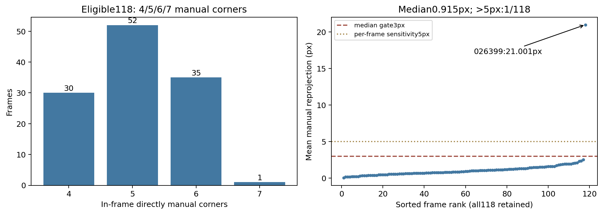
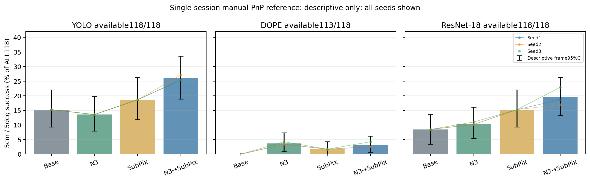
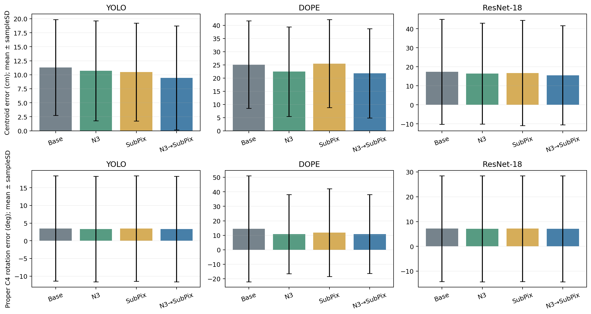
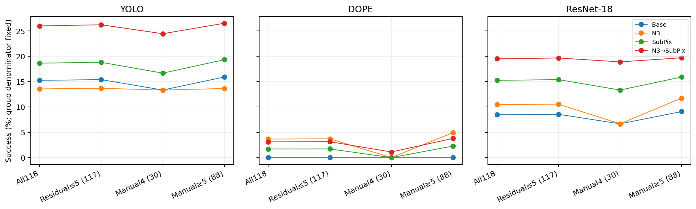

[확인] GREEN0918 수동점 PnP 참조 118장 평가를 완료했다: 잔차 게이트 PASS, 결론은 단일 세션의 FEASIBILITY_ONLY다.

# 정사각형 GREEN0918 수동 키포인트 PnP 참조 6D 평가

[확인] 새 사용자 계약은 화면 안 직접 수동 코너≥4, 기존 SQPnP→RefineLM, 등록 W/D/H=[1.1,1.1,0.15]m를 cuboid의 W/H/D=[1.1,0.15,1.1]m로 전달하며 proper C4를 사용한다. 직사각형의 6점 최소·LOO QA 필터·축 승인 절차를 이번 평가에 적용하지 않았다. 참조는 수동점과 K·치수만으로 생성하며 예측 코너는 입력하지 않는다. 이는 독립적인 물리 측정 GT가 아닌 **manual_keypoint_PnP_reference**다.

## 입력과 실제 재현 게이트

[확인] 119장·1세션 0918_dataset, 원영상 480×640의 RGB/JSON SHA와 K·치수·ID를 확인했다. 수동 코너 수는 3점1장/4점30장/5점52장/6점35장/7점1장이다. 029844는 3점으로 제외하고 주분모118을 유지했다. 적격118장은 모두 한 면에만 몰린 점 집합이 아니다. 선언 수동점602개, 화면 안600개를 그대로 유지했다. [입력 감사](INPUT_AUDIT.json).

[확인] 기존 YOLO·DOPE·ResNet-18 Base/N3 예측과 checkpoint를 재사용했다. 기존 2D Square 평가의 두 분모와 모든 seed를 실제 다시 채점하여 39,004개 수치 비교의 최대 절대차0.0을 확인했다. 모델을 다시 추론하거나 학습하지 않았다. [2D parity](TWO_D_PARITY.json).

[확인] 참조118/118개를 산출했다. 평균 재투영 잔차의 영상별 중앙값은 0.9154px, mean>5px는 1/118=0.8475%로 사전 게이트(중앙값≤3px, >5px비율≤10%)를 통과했다. 026399의 mean21.0013px를 주결과에서 제외하지 않았다. 민감도 범위 mean≤5px는117장이다. [참조 자세](SQUARE_REFERENCE_POSES.json), [잔차 게이트](REFERENCE_GATE.json).

[확인] ≥5점88장의477회 LOO를 추가 계산했고 최대 proper C4 R 변화와 centroid T 변화 및 LOO 실패를 영상별로 기록했다. 4점30장에는 LOO를 적용하지 않았으며 LOO 수치를 필터나 승인 조건으로 사용하지 않았다. 원 RGB 참조 검수 sheet6개는 저장소 외부의 지정 `--private-dir`에만 저장했다. [private 파일명·SHA](PRIVATE_REVIEW_RECEIPT.json).

## 세 기반의 고정 경로와 모든 seed

| 기반 | 경로 | 자세 n/118 | T cm 평균±SD | R° 평균±SD | ADDsym cm 평균±SD | IoU3D 평균±SD | 5cm·5° % |
| --- | --- | --- | --- | --- | --- | --- | --- |
| YOLO | Base | 118/118 | 11.3122 ± 8.5488 | 3.4933 ± 14.8916 | 12.4560 ± 11.6601 | 0.6434 ± 0.1664 | 15.2542 |
| YOLO | N3 | 118/118 | 10.7219 ± 8.9228 | 3.3262 ± 14.9293 | 11.8291 ± 12.0078 | 0.6566 ± 0.1676 | 13.5593 |
| YOLO | SubPix | 118/118 | 10.5009 ± 8.7498 | 3.4825 ± 14.9514 | 11.6425 ± 11.8958 | 0.6618 ± 0.1726 | 18.6441 |
| YOLO | N3→SubPix | 118/118 | 9.4469 ± 9.2976 | 3.3380 ± 14.9487 | 10.5460 ± 12.3990 | 0.6887 ± 0.1762 | 25.9887 |
| DOPE | Base | 113/118 | 25.1044 ± 16.6194 | 14.4983 ± 36.6510 | 30.1914 ± 23.1167 | 0.4192 ± 0.1665 | 0.0000 |
| DOPE | N3 | 113/118 | 22.4401 ± 16.9884 | 10.8349 ± 27.2764 | 26.1837 ± 21.2760 | 0.4942 ± 0.2122 | 3.6723 |
| DOPE | SubPix | 113/118 | 25.4713 ± 16.6979 | 11.8769 ± 30.3024 | 29.5069 ± 21.3165 | 0.4205 ± 0.1681 | 1.6949 |
| DOPE | N3→SubPix | 113/118 | 21.7831 ± 16.9466 | 10.8915 ± 27.2753 | 25.5879 ± 21.3116 | 0.4988 ± 0.2137 | 3.1073 |
| ResNet-18 | Base | 118/118 | 17.3821 ± 27.5595 | 7.1686 ± 21.3514 | 19.5060 ± 29.8145 | 0.5717 ± 0.2040 | 8.4746 |
| ResNet-18 | N3 | 118/118 | 16.4404 ± 26.5756 | 7.0601 ± 21.3758 | 18.6057 ± 28.9455 | 0.5842 ± 0.2018 | 10.4520 |
| ResNet-18 | SubPix | 118/118 | 16.7759 ± 27.6174 | 7.1578 ± 21.3232 | 18.9517 ± 29.8807 | 0.5852 ± 0.2132 | 15.2542 |
| ResNet-18 | N3→SubPix | 118/118 | 15.5230 ± 26.0511 | 7.0848 ± 21.3707 | 17.7503 ± 28.4991 | 0.5998 ± 0.2112 | 19.4915 |

[확인] seed-mean은 같은 ID의 세 seed 오차 또는 먼저 판정한 이진 성공 여부를 평균한 뒤 영상 통계를 계산한다. 영상 수를 3배로 간주하지 않는다. SD는 영상별 표본산포(ddof=1)이며 seed 산포나 평균의 CI가 아니다. 아래 raw와 METRICS에는 표본분산·중앙값·P90·최대·유효 n 및 기술용 95%CI를 모두 남겼다.

seed 1·2·3 각각의 결과

| 기반 | seed | 경로 | 자세 n/118 | T cm 평균±SD; 중앙값/P90 | R° 평균±SD; 중앙값/P90 | 성공률 % [기술CI] |
| --- | --- | --- | --- | --- | --- | --- |
| YOLO | 1 | Base | 118/118 | 11.3122 ± 8.5488; 9.7867/17.9880 | 3.4933 ± 14.8916; 1.7553/4.0359 | 15.2542 [9.3220, 22.0339] |
| YOLO | 1 | N3 | 118/118 | 10.7704 ± 8.8557; 9.0640/16.2335 | 3.3296 ± 14.9308; 1.4561/3.8197 | 13.5593 [7.6271, 20.3390] |
| YOLO | 1 | SubPix | 118/118 | 10.5009 ± 8.7498; 9.0196/18.1138 | 3.4825 ± 14.9514; 1.7940/4.0252 | 18.6441 [11.8644, 26.2712] |
| YOLO | 1 | N3→SubPix | 118/118 | 9.3783 ± 9.2876; 7.1699/16.2574 | 3.3439 ± 14.9433; 1.6400/3.6405 | 25.4237 [17.7966, 33.8983] |
| YOLO | 2 | Base | 118/118 | 11.3122 ± 8.5488; 9.7867/17.9880 | 3.4933 ± 14.8916; 1.7553/4.0359 | 15.2542 [9.3220, 22.0339] |
| YOLO | 2 | N3 | 118/118 | 10.6283 ± 9.0092; 8.4197/16.4451 | 3.3299 ± 14.9332; 1.4588/3.9508 | 13.5593 [7.6271, 20.3390] |
| YOLO | 2 | SubPix | 118/118 | 10.5009 ± 8.7498; 9.0196/18.1138 | 3.4825 ± 14.9514; 1.7940/4.0252 | 18.6441 [11.8644, 26.2712] |
| YOLO | 2 | N3→SubPix | 118/118 | 9.3663 ± 9.3423; 7.2280/16.1472 | 3.3379 ± 14.9482; 1.6272/3.7931 | 27.1186 [19.4915, 35.5932] |
| YOLO | 3 | Base | 118/118 | 11.3122 ± 8.5488; 9.7867/17.9880 | 3.4933 ± 14.8916; 1.7553/4.0359 | 15.2542 [9.3220, 22.0339] |
| YOLO | 3 | N3 | 118/118 | 10.7672 ± 8.9674; 8.8475/16.7066 | 3.3190 ± 14.9248; 1.4940/3.8639 | 13.5593 [7.6271, 20.3390] |
| YOLO | 3 | SubPix | 118/118 | 10.5009 ± 8.7498; 9.0196/18.1138 | 3.4825 ± 14.9514; 1.7940/4.0252 | 18.6441 [11.8644, 26.2712] |
| YOLO | 3 | N3→SubPix | 118/118 | 9.5960 ± 9.3774; 7.5193/17.2350 | 3.3322 ± 14.9568; 1.6048/3.6408 | 25.4237 [17.7966, 33.0508] |
| DOPE | 1 | Base | 113/118 | 25.1044 ± 16.6194; 19.9155/51.0033 | 14.4983 ± 36.6510; 4.7397/13.9349 | 0.0000 [0.0000, 0.0000] |
| DOPE | 1 | N3 | 113/118 | 22.6132 ± 17.0964; 17.7581/50.2038 | 10.4001 ± 26.7047; 4.5297/13.6609 | 3.3898 [0.8475, 6.7797] |
| DOPE | 1 | SubPix | 113/118 | 25.4713 ± 16.6979; 21.1354/52.7182 | 11.8769 ± 30.3024; 4.8834/13.4974 | 1.6949 [0.0000, 4.2373] |
| DOPE | 1 | N3→SubPix | 113/118 | 21.9167 ± 17.0057; 16.9683/48.2000 | 10.4586 ± 26.7022; 4.7803/13.9297 | 2.5424 [0.0000, 5.9322] |
| DOPE | 2 | Base | 113/118 | 25.1044 ± 16.6194; 19.9155/51.0033 | 14.4983 ± 36.6510; 4.7397/13.9349 | 0.0000 [0.0000, 0.0000] |
| DOPE | 2 | N3 | 113/118 | 22.2319 ± 17.0132; 16.9489/50.6290 | 11.7169 ± 30.5511; 4.7544/14.0726 | 3.3898 [0.8475, 6.7797] |
| DOPE | 2 | SubPix | 113/118 | 25.4713 ± 16.6979; 21.1354/52.7182 | 11.8769 ± 30.3024; 4.8834/13.4974 | 1.6949 [0.0000, 4.2373] |
| DOPE | 2 | N3→SubPix | 113/118 | 21.6511 ± 17.0310; 15.7506/48.7650 | 11.7649 ± 30.5584; 4.8622/14.3924 | 2.5424 [0.0000, 5.9322] |
| DOPE | 3 | Base | 113/118 | 25.1044 ± 16.6194; 19.9155/51.0033 | 14.4983 ± 36.6510; 4.7397/13.9349 | 0.0000 [0.0000, 0.0000] |
| DOPE | 3 | N3 | 113/118 | 22.4752 ± 16.9287; 18.0625/51.3131 | 10.3877 ± 26.6837; 4.8981/13.6908 | 4.2373 [0.8475, 8.4746] |
| DOPE | 3 | SubPix | 113/118 | 25.4713 ± 16.6979; 21.1354/52.7182 | 11.8769 ± 30.3024; 4.8834/13.4974 | 1.6949 [0.0000, 4.2373] |
| DOPE | 3 | N3→SubPix | 113/118 | 21.7814 ± 16.9182; 16.7144/49.9371 | 10.4511 ± 26.6996; 5.0140/13.8886 | 4.2373 [0.8475, 8.4746] |
| ResNet-18 | 1 | Base | 118/118 | 17.3821 ± 27.5595; 10.8999/27.6415 | 7.1686 ± 21.3514; 2.8767/8.6094 | 8.4746 [3.3898, 13.5593] |
| ResNet-18 | 1 | N3 | 118/118 | 16.5543 ± 26.5767; 9.9403/24.6810 | 7.0929 ± 21.3907; 2.9698/8.7377 | 10.1695 [5.0847, 16.1017] |
| ResNet-18 | 1 | SubPix | 118/118 | 16.7759 ± 27.6174; 10.2708/28.2908 | 7.1578 ± 21.3232; 2.8688/8.8253 | 15.2542 [9.3220, 22.0339] |
| ResNet-18 | 1 | N3→SubPix | 118/118 | 15.6617 ± 26.0239; 8.9941/24.2761 | 7.1000 ± 21.3930; 2.7956/8.7861 | 18.6441 [11.8644, 25.4237] |
| ResNet-18 | 2 | Base | 118/118 | 17.3821 ± 27.5595; 10.8999/27.6415 | 7.1686 ± 21.3514; 2.8767/8.6094 | 8.4746 [3.3898, 13.5593] |
| ResNet-18 | 2 | N3 | 118/118 | 16.5259 ± 26.6503; 10.2162/24.7598 | 7.0508 ± 21.3715; 3.0296/8.4630 | 10.1695 [5.0847, 16.1017] |
| ResNet-18 | 2 | SubPix | 118/118 | 16.7759 ± 27.6174; 10.2708/28.2908 | 7.1578 ± 21.3232; 2.8688/8.8253 | 15.2542 [9.3220, 22.0339] |
| ResNet-18 | 2 | N3→SubPix | 118/118 | 15.6575 ± 26.1093; 9.2712/25.5208 | 7.0683 ± 21.3609; 2.9949/8.4641 | 16.9492 [10.1695, 23.7288] |
| ResNet-18 | 3 | Base | 118/118 | 17.3821 ± 27.5595; 10.8999/27.6415 | 7.1686 ± 21.3514; 2.8767/8.6094 | 8.4746 [3.3898, 13.5593] |
| ResNet-18 | 3 | N3 | 118/118 | 16.2411 ± 26.5152; 9.7488/24.0235 | 7.0366 ± 21.3658; 2.8903/8.4224 | 11.0169 [5.9322, 16.9492] |
| ResNet-18 | 3 | SubPix | 118/118 | 16.7759 ± 27.6174; 10.2708/28.2908 | 7.1578 ± 21.3232; 2.8688/8.8253 | 15.2542 [9.3220, 22.0339] |
| ResNet-18 | 3 | N3→SubPix | 118/118 | 15.2499 ± 26.0614; 8.7377/24.1415 | 7.0862 ± 21.3599; 2.8907/8.4050 | 22.8814 [15.2542, 30.5085] |

## 같은 영상의 paired 기술 비교

| 기반 | 비교 | Δ성공 %p [기술95%CI] | ΔT cm [CI] | ΔR° [CI] | seed별 Δ성공 %p |
| --- | --- | --- | --- | --- | --- |
| YOLO | N3_MINUS_BASE | -1.6949 [-5.6497, 1.9774] | -0.5903 [-0.9338, -0.2358] | -0.1671 [-0.2315, -0.1030] | -1.6949, -1.6949, -1.6949 |
| YOLO | SEQUENCE_MINUS_BASE | 10.7345 [3.9548, 17.7966] | -1.8654 [-2.4897, -1.2533] | -0.1553 [-0.2382, -0.0722] | 10.1695, 11.8644, 10.1695 |
| YOLO | SEQUENCE_MINUS_SUBPIX | 7.3446 [1.6949, 13.2768] | -1.0540 [-1.4827, -0.6227] | -0.1445 [-0.2192, -0.0716] | 6.7797, 8.4746, 6.7797 |
| DOPE | N3_MINUS_BASE | 3.6723 [0.8475, 7.3446] | -2.6643 [-3.3518, -1.9306] | -3.6634 [-8.1083, -0.1755] | 3.3898, 3.3898, 4.2373 |
| DOPE | SEQUENCE_MINUS_BASE | 3.1073 [0.5650, 6.2147] | -3.3213 [-4.0392, -2.5339] | -3.6067 [-8.0432, -0.1135] | 2.5424, 2.5424, 4.2373 |
| DOPE | SEQUENCE_MINUS_SUBPIX | 1.4124 [-0.8475, 4.5198] | -3.6883 [-4.4833, -2.8338] | -0.9854 [-4.0006, 1.0957] | 0.8475, 0.8475, 2.5424 |
| ResNet-18 | N3_MINUS_BASE | 1.9774 [-1.9774, 6.2147] | -0.9416 [-1.3349, -0.5787] | -0.1085 [-0.1752, -0.0438] | 1.6949, 1.6949, 2.5424 |
| ResNet-18 | SEQUENCE_MINUS_BASE | 11.0169 [5.6497, 16.9492] | -1.8590 [-2.4765, -1.2777] | -0.0838 [-0.1723, 0.0041] | 10.1695, 8.4746, 14.4068 |
| ResNet-18 | SEQUENCE_MINUS_SUBPIX | 4.2373 [-1.1299, 9.6045] | -1.2529 [-1.8341, -0.7387] | -0.0729 [-0.1553, 0.0099] | 3.3898, 1.6949, 7.6271 |

[확인] 모든 paired CI는 고정118영상의 같은 multinomial frame draw10,000회, seed20260917을 공유한다. 민감도·수동점 집단은 같은 master draw에서 해당 ID만 취한다. 한 세션이므로 cluster bootstrap을 하지 않았으며 frame CI는 세션 내 상관을 해결하지 않는 기술용 수치다. SUPPORTED 또는 독립 확증을 주장하지 않는다. [PAIRED](PAIRED.json), [VERDICT](VERDICT.json).

[확인] YOLO의 N3 단독 성공률은 Base보다 낮았고(15.2542%→13.5593%), DOPE SubPix의 T 평균도 Base보다 높았다. 불리한 경로·seed·큰 유한 오차를 제거하거나 clipping하지 않았다. DOPE의 미산출5개 ID와 모든 경로의 손상·회복 ID는 [FAILURES.json](FAILURES.json)에 보존했다.

## 고정 민감도와 4점 불안정성

| 범위 | 기반 | 경로 | 자세 n/전체 | T cm 평균±SD | R° 평균±SD | 성공률 % |
| --- | --- | --- | --- | --- | --- | --- |
| reference_residual_mean_le5 | YOLO | Base | 117/117 | 11.3512 ± 8.5750 | 2.1310 ± 1.6740 | 15.3846 |
| reference_residual_mean_le5 | YOLO | N3 | 117/117 | 10.7564 ± 8.9533 | 1.9601 ± 1.6452 | 13.6752 |
| reference_residual_mean_le5 | YOLO | SubPix | 117/117 | 10.4960 ± 8.7873 | 2.1144 ± 1.6488 | 18.8034 |
| reference_residual_mean_le5 | YOLO | N3→SubPix | 117/117 | 9.4299 ± 9.3357 | 1.9696 ± 1.5900 | 26.2108 |
| reference_residual_mean_le5 | DOPE | Base | 112/117 | 25.2473 ± 16.6242 | 13.1374 ± 33.8265 | 0.0000 |
| reference_residual_mean_le5 | DOPE | N3 | 112/117 | 22.5673 ± 17.0106 | 9.4452 ± 23.0329 | 3.7037 |
| reference_residual_mean_le5 | DOPE | SubPix | 112/117 | 25.6271 ± 16.6902 | 10.4936 ± 26.6147 | 1.7094 |
| reference_residual_mean_le5 | DOPE | N3→SubPix | 112/117 | 21.9081 ± 16.9704 | 9.5022 ± 23.0341 | 3.1339 |
| reference_residual_mean_le5 | ResNet-18 | Base | 117/117 | 17.4378 ± 27.6714 | 5.8174 ± 15.5732 | 8.5470 |
| reference_residual_mean_le5 | ResNet-18 | N3 | 117/117 | 16.4936 ± 26.6836 | 5.7027 ± 15.5423 | 10.5413 |
| reference_residual_mean_le5 | ResNet-18 | SubPix | 117/117 | 16.8132 ± 27.7332 | 5.8114 ± 15.5834 | 15.3846 |
| reference_residual_mean_le5 | ResNet-18 | N3→SubPix | 117/117 | 15.5290 ± 26.1630 | 5.7290 ± 15.5520 | 19.6581 |
| manual4 | YOLO | Base | 30/30 | 11.7333 ± 7.8615 | 2.2329 ± 2.1416 | 13.3333 |
| manual4 | YOLO | N3 | 30/30 | 11.0044 ± 8.8944 | 2.1798 ± 2.1337 | 13.3333 |
| manual4 | YOLO | SubPix | 30/30 | 10.8093 ± 7.6866 | 2.1853 ± 2.0839 | 16.6667 |
| manual4 | YOLO | N3→SubPix | 30/30 | 9.8529 ± 8.8709 | 2.1131 ± 2.1052 | 24.4444 |
| manual4 | DOPE | Base | 27/30 | 24.7292 ± 18.0017 | 17.0287 ± 43.1110 | 0.0000 |
| manual4 | DOPE | N3 | 27/30 | 22.1970 ± 17.4596 | 5.8047 ± 4.2747 | 0.0000 |
| manual4 | DOPE | SubPix | 27/30 | 24.8520 ± 17.8099 | 11.3628 ± 30.8157 | 0.0000 |
| manual4 | DOPE | N3→SubPix | 27/30 | 21.2202 ± 17.4815 | 5.8466 ± 4.3305 | 1.1111 |
| manual4 | ResNet-18 | Base | 30/30 | 12.8369 ± 11.0642 | 4.4662 ± 3.7836 | 6.6667 |
| manual4 | ResNet-18 | N3 | 30/30 | 12.2596 ± 10.6307 | 4.4068 ± 3.8341 | 6.6667 |
| manual4 | ResNet-18 | SubPix | 30/30 | 12.1886 ± 11.3390 | 4.4525 ± 3.8750 | 13.3333 |
| manual4 | ResNet-18 | N3→SubPix | 30/30 | 10.8031 ± 11.1213 | 4.4465 ± 3.8198 | 18.8889 |
| manual_ge5 | YOLO | Base | 88/88 | 11.1687 ± 8.8091 | 3.9229 ± 17.2036 | 15.9091 |
| manual_ge5 | YOLO | N3 | 88/88 | 10.6256 ± 8.9813 | 3.7170 ± 17.2515 | 13.6364 |
| manual_ge5 | YOLO | SubPix | 88/88 | 10.3957 ± 9.1225 | 3.9247 ± 17.2743 | 19.3182 |
| manual_ge5 | YOLO | N3→SubPix | 88/88 | 9.3085 ± 9.4840 | 3.7555 ± 17.2728 | 26.5152 |
| manual_ge5 | DOPE | Base | 86/88 | 25.2222 ± 16.2713 | 13.7038 ± 34.6239 | 0.0000 |
| manual_ge5 | DOPE | N3 | 86/88 | 22.5164 ± 16.9414 | 12.4141 ± 31.0513 | 4.9242 |
| manual_ge5 | DOPE | SubPix | 86/88 | 25.6658 ± 16.4378 | 12.0383 ± 30.3204 | 2.2727 |
| manual_ge5 | DOPE | N3→SubPix | 86/88 | 21.9598 ± 16.8761 | 12.4754 ± 31.0466 | 3.7879 |
| manual_ge5 | ResNet-18 | Base | 88/88 | 18.9316 ± 31.1621 | 8.0899 ± 24.5954 | 9.0909 |
| manual_ge5 | ResNet-18 | N3 | 88/88 | 17.8657 ± 30.0674 | 7.9646 ± 24.6237 | 11.7424 |
| manual_ge5 | ResNet-18 | SubPix | 88/88 | 18.3397 ± 31.1952 | 8.0801 ± 24.5576 | 15.9091 |
| manual_ge5 | ResNet-18 | N3→SubPix | 88/88 | 17.1321 ± 29.3453 | 7.9843 ± 24.6192 | 19.6970 |

[추정] 4점에서는 작은 영상 잔차가 참조의 깊이·회전 안정성이나 물리적 정확성을 보장하지 않을 수 있다. 4점과≥5점을 나누어 보고했고, LOO는 기록 가능한≥5점에서만 계산했다. 수동 PnP 참조와 예측이 같은 영상 기하를 사용하므로 독립 참조로 일반화하지 않는다.

## 실행량·검산·재현

[확인] 실제 F 4,248회, SQPnP 4,188회, RefineLM 4,188회다. 원 참조 solve118회와 LOO477회는 이 F 횟수와 구분한다. cornerSubPix 코너 호출은 16,740회다. 새 학습·모델/N3 forward·합성 생성·촬영·주석 수정은0이다. 실제 캐시 기반 실행 시간은 배포 latency가 아니다. [EXECUTION](EXECUTION.json).

[확인] 정사각형의90° W/D 교환은 proper C4 등가여서 회전오차나 이 표로 직사각형 뒤바뀜을 측정할 수 없다. 직사각형과는 최소점·참조 생성·분모가 다르므로 두 결과를 합치거나 직접 순위를 비교하지 않았다.

[확인] 독립 검산은 저장된 R/t에서 T/R/ADD를 다시 계산하고, 참조 재투영·잔차 gate·마스크/중심 보존·모든 통계/paired frame CI를 확인한다. IoU의 raw 통계는 검산하며 intersection geometry는 독립 재구현하지 않았다. [VERIFICATION](VERIFICATION.json), [방법](METHOD_KO.md), [재현](REPRODUCE.md), [원고 표](PAPER_TABLE_KO.md).
