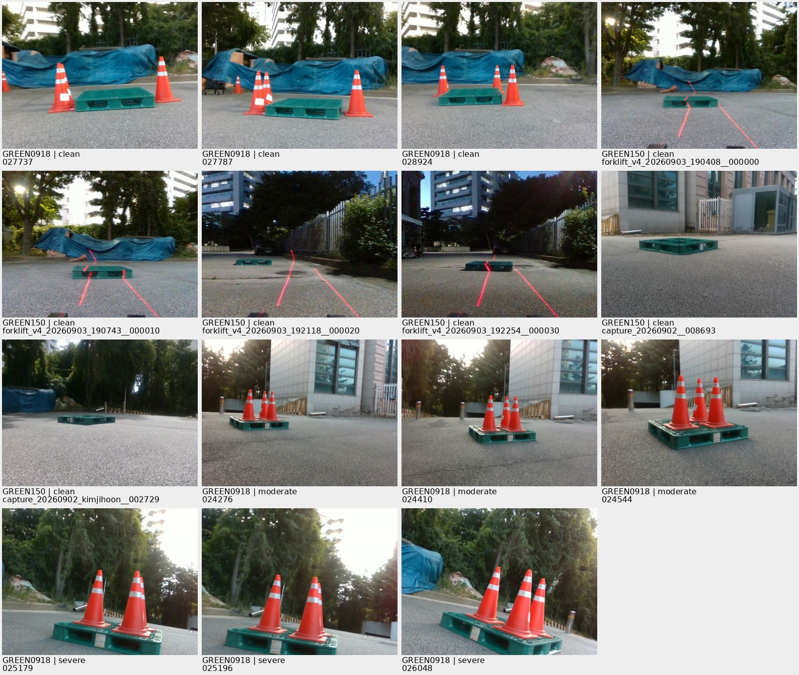
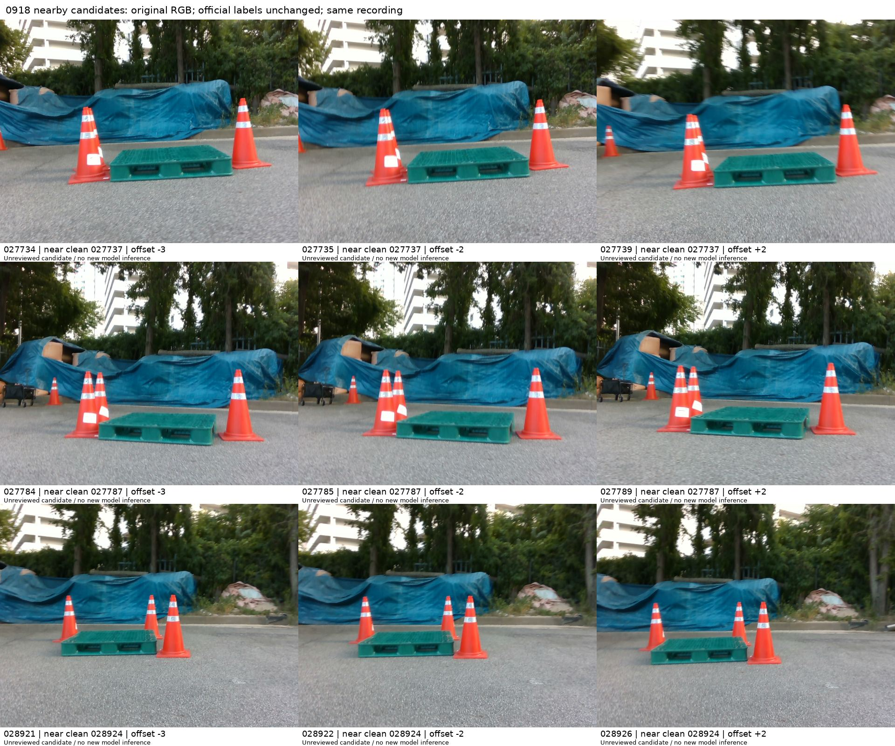

# 정사각형 pallet clean 이미지 재확인 — 2026-10-07

**저장된 사람 입력에서 clean으로 분류된 서로 다른 이미지 106장을 확인했다. “clean 3장”은 GREEN0918 선별 119장 안의 수치다.**

| 자료 | 전체 | clean / 가림 없음 | 중간 | 어려움 | 미분류 |
|---|---:|---:|---:|---:|---:|
| GREEN0918 선별 자료 · 1세션 | 119 | 3 | 85 | 31 | 0 |
| 기존 GREEN150 · 7세션 | 150 | 103 | 44 | 3 | 0 |
| 두 고정 패널의 분류 합계 | 269 | **106** | 129 | 34 | 0 |

두 패널의 원본 269장 파일 SHA256과 decoded pixel 해시를 재확인했다. 패널 안과 패널 사이의 완전 이미지 중복은 0이고, clean 106장도 서로 다른 픽셀 이미지다. 입력 이력 488/198건이 현재 분류와 일치함을 재확인했다. 이는 저장된 분류의 집계이며, 등급 의미의 독립적인 정답성 검증이나 독립 평가 표본 수를 뜻하지 않는다. 판정 기준의 사람 확인은 기존 자료에서 `NOT_CONFIRMED`로 남아 있다.

0918의 저장 clean 세 장은 **027737 / 027787 / 028924**다. GREEN150은 별도의 과거 촬영·평가 패널이므로 이 106장을 현재119장 성능표의 분모나 새 미사용 테스트로 합치지 않는다.

[clean 106장 개별 사진](CLEAN106_GALLERY.md) · [clean 경로·원본 SHA·미리보기 SHA](CLEAN106_IMAGES.csv) · [269장 전체 저장 분류](ALL269_LABELS.csv) · [재확인 영수증](RECHECK.json)



## 0918 원촬영에서 찾은 추가 후보 9장

`0918 데이터셋.zip`에는 024276–032636의 PNG **8,361장**이 있다. 현재 선별119장 모두 ZIP 원본과 encoded SHA256이 일치했다. 선별119장 밖에는 8,242장이 있으며, 전체의 clean 등급을 전수 분류한 결과는 없다.

기존 clean 세 장 근처의 고정 offset −3, −2, +2에서 다음9장을 추출해 육안으로 살폈다.

| 기준 clean ID | 추가 후보 ID |
|---|---|
| 027737 | 027734 / 027735 / 027739 |
| 027787 | 027784 / 027785 / 027789 |
| 028924 | 028921 / 028922 / 028926 |

이9장은 육안상 clean으로 보이는 **VISUAL_CANDIDATE, official=false**다. 같은 녹화의 인접 프레임이며 정식 등급·코너 주석이 없다. 공식 clean106장에 합산하지 않았고 기존 주석도 변경하지 않았다. 후보9장 서로, 그리고 기존clean106장과 픽셀 완전중복은0이다. 영상 유사성이나 촬영 독립성은 픽셀 완전중복 검사와 다르다.

[후보별 원본 ZIP member·SHA·개별 사진 경로](SOURCE_MEMBERS.json) · [CSV](SOURCE_MEMBERS.csv) · [사진 폴더](images/candidates/)



## 공개 자료와 검산

GitHub에서 직접 볼 수 있게 clean106장과 후보9장의 **원래 해상도 JPEG 미리보기**를 게시했다. JPEG는 손실 압축된 검토용 사본이며 원본PNG SHA와 공개JPEG SHA를 구분한다. 학습·평가 입력과 원본 주석은 변경하지 않았다.

네 원출처 snapshot/사람 입력을 [inputs](inputs/)에 gzip 사본으로 함께 제공한다. 각 압축을 풀었을 때의 SHA는 RECHECK의 원출처 SHA와 일치한다. 아래 검산은 이 공개 사본·CSV·사진·checksum만 읽으며 모델·개인 캐시·원본ZIP을 요구하지 않는다.

```bash
python3 _docs/experiments/pallet_square_clean_recheck_20261007_v1/verify.py
```

원본269장/ZIP119장의 내용 비교와 육안 확인은 재확인 당시의 실행 기록이다. 공개JPEG만으로 원본PNG 내용 일치를 다시 주장하지 않는다. 학습·모델추론·PnP·공식 재분류는0회다.
