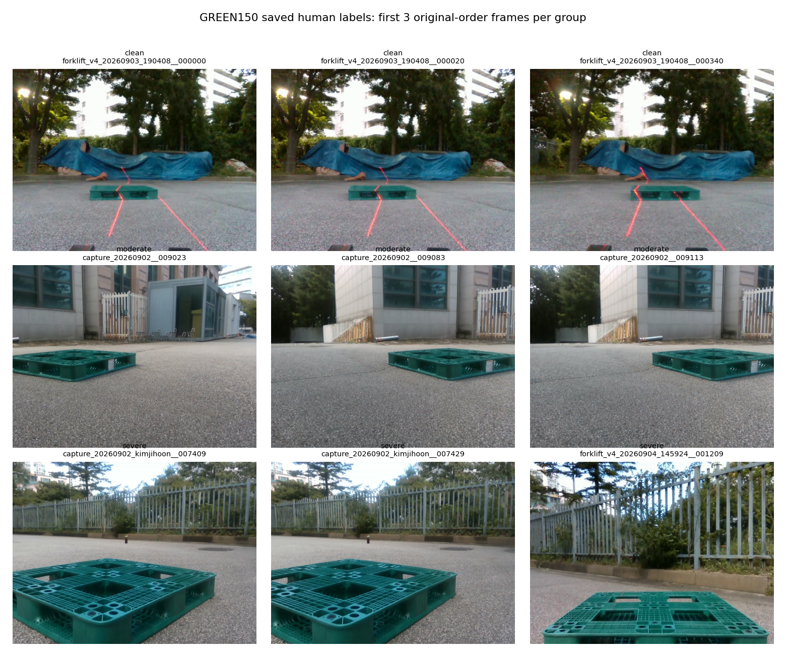

# 기존 정사각형150장 분류 완료 확인

**PASS: 20/20 검증 통과.150/150장과7/7촬영 세션의 가림 등급 입력이 모두 저장됐다. 미분류0장.**

| 자료 | 가림 없음 | 중간 | 어려움 | 합계 |
|---|---:|---:|---:|---:|
| 기존 정사각형150 | 103 | 44 | 3 | 150 |
| 별도촬영0918 정사각형119 | 3 | 85 | 31 | 119 |
| 정사각형 합계(두 패널 유지) | 106 | 129 | 34 | 269 |

입력 이력198건을 재생해 현재150개 레코드와 일치함을 확인했다.150개의 세션별 개별JSON도 현재 레코드와 모두 일치한다. 서로 다른 세션의 같은 숫자 파일명이 겹치더라도 별도 폴더에 저장되어 유실되지 않았다.

원본150장 RGB와 동결 코너GT·snapshot 해시는 보존됐다.119장과150장은 encoded 및decoded pixel 중복0장으로 확인했다.269장은 두 고정 패널의 분류 수 합계이며 동일 실험계약·독립성·참조 규약을 혼합한 성능표가 아니다.

코너 가시성·대상 대응·독립6D 참조의 검수 완료로 승격하지 않았다. 분류 기준은 앞서 요청한 외부 가림 정도/전체 난이도 확인을 대기한다. 이 검산은 저장 무결성 확인이며 등급 의미나 모든 이미지 판정의 정답성을 보증하지 않는다.

**실험 성능표·원고에는 아직 반영하지 않았다.** 실제 분류를 아래 입력 스냅샷과검산JSON에 고정했다.

[검산JSON](VALIDATION.json) · [150장 최신 분류와 원본 연결](EFFECTIVE_FRAME_LABELS.json)

새 학습·optimizer update·추론·원본 덮어쓰기·외부 업로드·push·PDF생성:0회.
