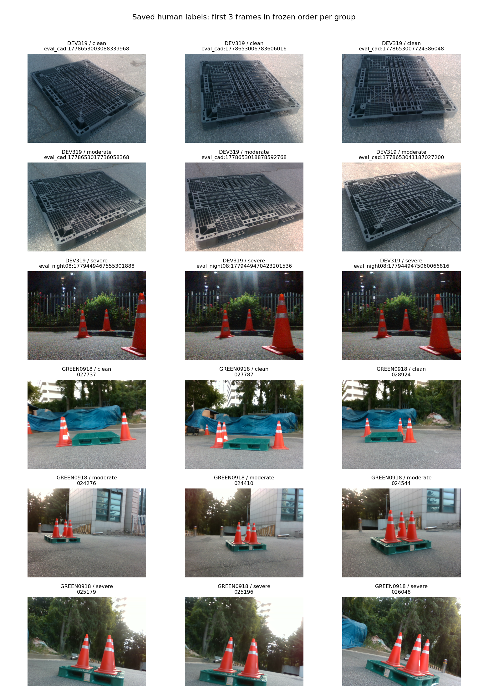

# 직사각형·정사각형 가림 분류 저장 검증

검증 결과: **PASS · 17/17 검사 통과**. 실제 저장 파일과 수정 이력을 원본 평가 이미지에 대조했다. 가림 등급을 자동으로 바꾸지 않았다.

| 평가 자료 | 가림 없음 | 중간 | 어려움 | 미분류 |
|---|---:|---:|---:|---:|
| 직사각형 319장 | 153 | 92 | 74 | 0 |
| 별도 촬영 정사각형 119장 | 3 | 85 | 31 | 0 |

이번 신규 입력은 435장(직사각형 316장, 정사각형 119장)이다. 직사각형 3장은 기존 승인 분류를 재사용했다. 이 중 한 장의 R 초기화 2회는 이력에 남아 있으며 기존 분류로 돌아갔다.

직사각형의 이전 151/87/81 분류에서 42장 등급이 변경됐다. 원래 승인 결과·manifest·원본 이미지·GT는 보존했다. 새 판정은 별도 수정본에 저장됐다.

재사용한 3장:
- `plastic_night_01:034035`: `clean`
- `plastic_night_01:034193`: `clean`
- `plastic_night_01:035421`: `moderate`

원본 438장 이미지와 GT·출처 해시, 개별 435개 저장 JSON, 488건의 이력 재생, 집단 목록의 분모와 중복 여부를 확인했다.

가림 등급 입력은 완료됐다. 코너 가시성·대상 대응·독립 6D 참조는 이번 입력으로 검수 완료 처리하지 않았다. 식별자는 자동 로컬 별칭이며 신원·예측 노출 이력 확인 상태도 그대로 보존했다.

**이미지 내용 검수에서 분류 기준 확인이 남았다.** 아래 직사각형 중간 예시 3장에서는 외부 물체의 가림이 보이지 않는 것으로 판단된다. 이는 원본을 본 질적 관찰이며 사용자의 등급을 자동으로 변경하지 않았다. 실제 외부 가림 정도인지 시점·거리·조명 등을 포함한 전체 난이도인지 사용자에게 확인을 요청했다. 저장 무결성 PASS를 가림 판정 정답성 PASS로 해석하면 안 된다.

**원고·실험 지표 반영은 아직 하지 않았다.** 기존 보고서는 이전 직사각형 집계와 정사각형 대기 상태를 사용한다. 분류 기준을 확인한 뒤 새 검증 집계를 별도 수정본으로 연결해야 하며, 아래 검증 파일이 그 입력을 고정한다.

[검산 결과](VALIDATION.json) · [42장 변경 목록](RECTANGULAR_LABEL_CHANGES.json) · [유효한 438장 분류와 출처](EFFECTIVE_FRAME_LABELS.json)

아래 이미지는 각 집단에서 고정 순서의 첫 3장을 보여준다. 모델 예측·오차를 표시하지 않았다. 표본 그림만으로 전체 가림 판정의 정답성을 보증하지 않는다.



실행 명령:

```bash
/home/minjae/anaconda3/envs/pallet-yolo26/bin/python scripts/research/pallet_static_registry_review_20261003_v1/audit_native_severity.py
```

새 학습·optimizer update·추론·원본 덮어쓰기·외부 업로드·push·PDF 생성: 0회.
