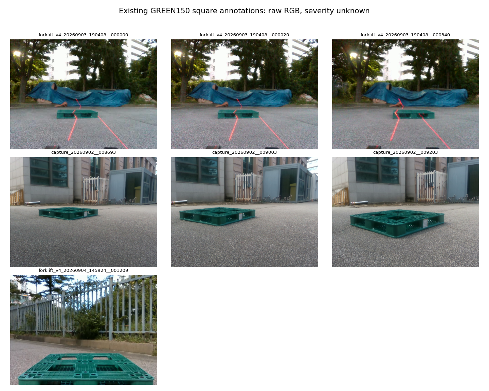

# 정사각형 기존 어노테이션 범위 정정

‘가림 없음 3장’은 최근 0918 평가 자료 119장에서 이번 사용자가 고른 값이다. 정사각형 전체의 어노테이션 수나 전체 무가림 개수가 아니다. 기존 별도 정사각형 150장 자료를 누락하고 최근119장만 설명한 범위를 정정한다.

| 자료 | 코너 주석 있는 이미지 | 가림 등급 |
|---|---:|---|
| 최근 0918 별도 촬영 | 119 | 이번 입력: 없음3·중간85·어려움31 |
| 기존 GREEN150 저장 라벨 평가본 | 150 | 기존 파일150개 모두 unknown |
| 원본 live_capture_gt | 851 | 기존 파일851개 모두 unknown |
| 전체 검토 복사본 | 862 | 기존851 + 추가11;862개 모두 unknown |

GREEN150은 전체검토862장의 일부다. 150과862를 합산하지 않는다. 최근119와 기존150은 encoded 이미지 해시가0장 겹치며, 기존0918 감사에서도 decoded pixel 해시 중복0을 기록했다. 두 기존 고정 평가 패널은 구분해269장으로 표시할 수 있다. 862장 모두를 정식 독립 평가 자료나 가림 검수 완료 자료로 승격하지 않는다.

119장에는 수동 코너602점(화면 안600점), 기존150장에는 수동 코너681점이 이미 있다. 코너 주석의 존재만으로 가림 없음 등급을 지정하지 않는다. 기존150protocol은 최종humanQA 미완료를 명시하며 카메라·과거노출 이력 등의 제한도 원본에 보존한다.

이번 ‘없음’ 입력은027737·027787·028924의3장이다. 실제 입력 이력에서도 세 장만1번으로 선택했다. 이번 선택을 자동으로 변경하지 않았다.

[원본 기존150장 목록](../../../paper/final_dimension_v1/green150_saved_labels_v1/DATASET_SNAPSHOT.json) · [범위 검산 JSON](SQUARE_PRIOR_ANNOTATION_AUDIT.json)

아래는 기존150장의 촬영 집단별 고정 순서 첫3장이다. 이미지를 보기 위한 예시이며 가림 등급을 추정·확정하지 않았다.

