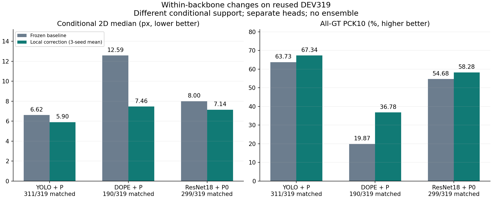
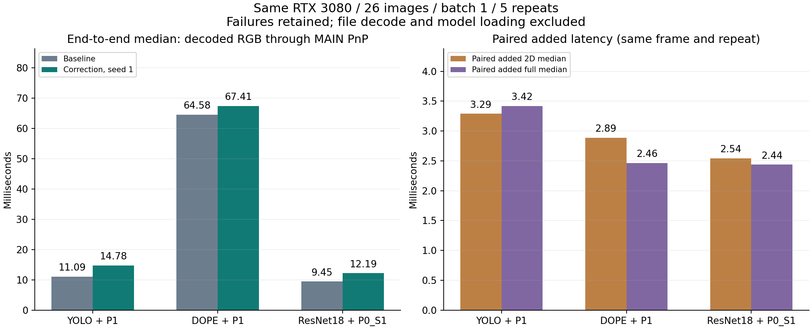

# 세 백본 보정 실험 최종 정리

기존 봉인 결과에서 YOLO·DOPE·ResNet18 각각의 보정 전후 조건부 2D 중앙값 감소를 확인했다. **치수 입력 자체의 안정적인 T·R 공동 개선이나 독립 TEST 일반화는 입증되지 않았다.** 이 문서는 결과 정리의 완료를 뜻하며 연구 목표 전체의 달성이나 투고·채택 완료를 뜻하지 않는다. 새 학습·추론·PnP·bootstrap 실행은 모두 0회다.

## 논문에서 방어할 수 있는 세 가지 결과

1. 재사용 DEV319에서 backbone별로 따로 학습한 local probability 보정은 조건부 2D 중앙값을 YOLO **6.616→5.905px**, DOPE **12.585→7.461px**, ResNet18 FULL+P0 **8.001→7.143px**로 낮췄다. 세 비교의 탐색적 세션 구간도 감소 방향이다. 하나의 공통 head 가중치를 다른 backbone에 무학습 전이한 실험은 아니다.
2. 동일 RTX 3080·동일 26영상에서 대표 seed1 head의 전처리부터 2D 출력 및 같은 MAIN PnP까지 다시 측정했다. 보정은 추가 latency를 요구한다. 아래 비용은 측정 범위를 고정한 데스크톱 기술 통계이며 Jetson·처리량·새 정확도 반복이 아니다.
3. 치수 조건부 ResNet과 P5의 통제 비교는 효과의 한계를 드러낸다. P5−P5_CONSTANT의 2D·T·R 구간은 모두 0을 포함한다. 치수의 추가 정보가 세 지표를 함께 안정적으로 개선한다는 결론은 낼 수 없다.

## Backbone 안에서의 보정 전후

| 기반 | 방법 | 2D median px↓ | P90 px↓ | ALL-GT PCK10 %↑ | matched / 319 | T cm↓ | R °↓ | pose coverage % |
|---|---|---|---|---|---|---|---|---|
| YOLO | R0 | 6.616 | 38.670 | 63.73 | 311/319 | 7.897 | 2.262 | 100.00 |
| YOLO | D | 6.430 | 37.566 | 64.57 | 311/319 | 7.597 | 2.190 | 100.00 |
| YOLO | P | 5.905 | 37.766 | 67.34 | 311/319 | 7.153 | 2.089 | 100.00 |
| DOPE | DOPE | 12.585 | 50.609 | 19.87 | 190/319 | 10.046 | 3.441 | 65.83 |
| DOPE | D | 7.867 | 48.487 | 36.05 | 190/319 | 8.323 | 3.018 | 65.83 |
| DOPE | P | 7.461 | 50.713 | 36.78 | 190/319 | 8.529 | 2.884 | 65.83 |
| ResNet18 | FULL | 8.001 | 52.054 | 54.68 | 299/319 | 11.007 | 3.252 | 100.00 |
| ResNet18 | D0 | 7.852 | 51.928 | 55.26 | 299/319 | 9.837 | 3.218 | 100.00 |
| ResNet18 | P0 | 7.143 | 52.086 | 58.28 | 299/319 | 10.001 | 3.018 | 100.00 |
| ResNet18 | P5 | 7.048 | 51.839 | 58.62 | 299/319 | 9.911 | 2.982 | 100.00 |
| ResNet18 | P5_CONSTANT | 7.122 | 51.848 | 58.45 | 299/319 | 9.982 | 3.009 | 100.00 |

주 비교는 YOLO P, DOPE P, ResNet P0다. ResNet P0는 동일 local probability 보정 원리를 잇는 치수 없는 head이며, 통합 runtime 주 비교도 P0_S1을 사용했다. 더 낮은 DEV 수치를 보고 P5로 주 비교를 교체하지 않았다. D/D0와 P5/P5_CONSTANT는 함께 공개한 통제·보조 비교다.

보정 수치는 seed1/2/3에서 계산한 통계의 산술평균이며 예측 앙상블이 아니다. 세 기반은 같은 DEV319·13세션·감독 landmark 2,818점을 사용하지만 조건부 매칭은 **YOLO 311장/2,756점, DOPE 190장/1,710점, ResNet 299장/2,644점**이다. median/P90은 고정 baseline box IoU≥0.5 및 9점 유한 조건에 따른다. ALL-GT PCK10은 제외·결측점을 실패로 포함한다. DOPE pose는 210/319만 유효하고 나머지 109장의 실패를 coverage에 남긴다. 따라서 조건부 숫자만으로 세 backbone의 정확도 순위를 정하지 않는다.

DOPE P와 ResNet P0의 P90은 baseline보다 약간 커졌다. 작은 중앙값 감소는 모든 프레임·꼬리 오차의 개선을 뜻하지 않는다. YOLO P도 기존 PoseFix-derived PRIOR보다 중앙오차가 0.336232px 높았으며 최상 정확도 주장이 아니다.

[YOLO 원문](../pallet_sensors_submission_v1/FINAL_REPORT_KO.md) · [YOLO 수치](../pallet_sensors_submission_v1/UNIFIED_DEV_RESULTS.json) · [DOPE 원문](../pallet_dope_refiner_20261001_v1/REPORT_KO.md) · [DOPE 수치](../pallet_dope_refiner_20261001_v1/DEV_RESULTS.json) · [ResNet 보정 V3](../pallet_resnet18_dim_refiner_report_20261002_v3/REPORT_KO.md) · [ResNet 수치](../pallet_resnet18_dim_refiner_20261002_v1/DEV_RESULTS.json)

## 동일 조건에서 재측정한 실행시간

| 기반 / 대표 head | baseline 2D ms | 보정 2D ms | paired 추가 2D ms | baseline 전체 ms | 보정 전체 ms | paired 추가 전체 ms |
|---|---|---|---|---|---|---|
| YOLO / YOLO_P1 | 9.554 | 13.174 | 3.288 | 11.092 | 14.779 | 3.419 |
| DOPE / DOPE_P1 | 62.894 | 66.291 | 2.886 | 64.585 | 67.411 | 2.463 |
| ResNet18 / RESNET_P0_S1 | 7.835 | 10.520 | 2.544 | 9.453 | 12.193 | 2.436 |

주 추가 시간은 동일 frame ID·repeat의 보정 시간−baseline 시간을 먼저 계산한 **130개 paired 차이의 median**이다. 봉인 runtime의 `paired_added_two_d_ms`와 `paired_added_full_ms`를 인용했고 전체 측정 행에서도 다시 검산했다. 각 arm의 median 차이와는 다른 통계이며, 아래에 보조 값으로 함께 보존한다.

| 보조 통계: 각 arm median 차이 | Δ2D ms | Δ전체 ms |
|---|---|---|
| YOLO | 3.620 | 3.687 |
| DOPE | 3.397 | 2.826 |
| ResNet18 | 2.685 | 2.740 |

예를 들어 YOLO paired 추가 전체 시간은3.419ms이고 각 arm median 차이는3.687ms다. 전체 median은 2D median과 PnP median의 합으로 만들지 않고 저장된 전체 시간에서 직접 가져왔다. 정확도는 3-seed 평균, latency는 seed1이다.

batch1, 이미 RAM에 디코딩한 native BGR 시작, arm당 warmup20회와 26장×5반복=130회다. 주 6arm과 ResNet 보조 3arm을 합쳐 1,170 측정 호출을 모두 보존했다. 파일 읽기·디코딩·모델 로드·검산은 timer 밖이다. CPU Torch intra/inter-op 및 OpenCV thread는 각각1이며 GPU 수치 설정은 각 원 실험과 맞췄다. DOPE의 검출/PnP 실패 호출도 시간에 포함되므로 성공 경로만의 비용과 다르다. 단일 시점 관측이며 CI나 에너지·실시간 보장은 없다.

기존 개별 보고서의 오래된 latency는 이 표와 섞지 않았다. ResNet V3의 “해당 실행에는 latency 없음”은 당시 정확도 실행의 설명이고, 여기서는 나중에 완료한 별도의 통합 runtime을 연결한다. [통합 속도 원문](../pallet_three_backbone_runtime_20261002_v1/REPORT_KO.md) · [고정 protocol](../pallet_three_backbone_runtime_20261002_v1/PROTOCOL.json) · [1,170행 원결과](../pallet_three_backbone_runtime_20261002_v1/RESULTS.json) · [9arm CSV](RUNTIME_SUMMARY.csv)

## 치수 입력은 어디에 들어갔는가

| 경로 | 추정기 신경망 | 보정 head | PnP |
|---|---|---|---|
| 기존 YOLO + P | RGB | 이미지 특징·기존 점/box, 치수 입력 없음 | K·등록 물리 치수 |
| DOPE + P | RGB | 이미지 특징·기존 점/box, 치수 입력 없음 | K·등록 물리 치수 |
| ResNet FULL + P0 | RGB + 정규화 W,D,H·비율 5값 | 치수 벡터 없음 | K·등록 물리 치수 |
| ResNet FULL + P5 | RGB + 치수 5값 | 치수 5값 추가 | K·등록 물리 치수 |
| ResNet FULL + P5_CONSTANT | 동일 FULL | 동일 P5 구조·초기값, 문맥만 0 | K·등록 물리 치수 |

보정기 증분 치수 효과는 **P5−P5_CONSTANT**로 판단한다. P5−P0는 경로·용량도 달라지는 package 비교이고 P5−FULL은 보정 전체의 효과다. 모든 ResNet head는 이미 치수 조건부 FULL을 공유하므로 시스템 전체의 RGB-only 대조군은 아니다.

| 비교 | 지표 | 차이 [세션 95% CI] |
|---|---|---|
| YOLO P_minus_R0 | conditional_2D_median_px | -0.710767 [-1.173744, -0.411083] |
| DOPE P_minus_DOPE | conditional_2D_median_px | -5.123778 [-6.303513, -3.984492] |
| ResNet18 P0_minus_FULL | conditional_2D_median_px | -0.858910 [-1.318024, -0.620721] |
| ResNet18 P0_minus_FULL | ALL_GT_PCK10 | +0.035959 [+0.025152, +0.049856] |
| ResNet18 P0_minus_FULL | translation_median_cm | -1.006926 [-1.667555, +0.186852] |
| ResNet18 P0_minus_FULL | rotation_median_deg | -0.234295 [-0.502148, -0.022081] |
| ResNet18 P5_minus_FULL | conditional_2D_median_px | -0.953919 [-1.403254, -0.686964] |
| ResNet18 P5_minus_FULL | ALL_GT_PCK10 | +0.039390 [+0.027280, +0.055371] |
| ResNet18 P5_minus_FULL | translation_median_cm | -1.096293 [-1.813723, +0.188690] |
| ResNet18 P5_minus_FULL | rotation_median_deg | -0.270048 [-0.519917, -0.075686] |
| ResNet18 P5_minus_P0 | conditional_2D_median_px | -0.095010 [-0.182284, +0.009170] |
| ResNet18 P5_minus_P0 | ALL_GT_PCK10 | +0.003430 [+0.001389, +0.006657] |
| ResNet18 P5_minus_P0 | translation_median_cm | -0.089367 [-0.506597, +0.247581] |
| ResNet18 P5_minus_P0 | rotation_median_deg | -0.035754 [-0.133277, +0.098289] |
| ResNet18 P5_minus_P5_CONSTANT | conditional_2D_median_px | -0.074363 [-0.116383, +0.019118] |
| ResNet18 P5_minus_P5_CONSTANT | ALL_GT_PCK10 | +0.001774 [+0.000109, +0.003973] |
| ResNet18 P5_minus_P5_CONSTANT | translation_median_cm | -0.070516 [-0.115347, +0.070873] |
| ResNet18 P5_minus_P5_CONSTANT | rotation_median_deg | -0.026874 [-0.066558, +0.024515] |

2D/T/R 차이는 음수가 개선이고 PCK 차이는 양수가 개선이다. 표의 PCK 차이는 0–1 비율 단위이며 100을 곱하면 percentage point다. 13세션 bootstrap10,000회, seed20260914의 기존 결과를 그대로 옮겼으며 다중비교 보정이 없다. P5−P5_CONSTANT의 PCK10 구간만 양수인 사실로 2D/T/R 전체의 인과 성공을 선언하지 않는다. ResNet P0−FULL의 T 구간도 0을 포함한다. [claim audit](../pallet_resnet18_dim_refiner_report_20261002_v3/CLAIM_AUDIT.json) · [전체 paired CSV](PAIRED_SUMMARY.csv)

## Direct ResNet 치수 실험은 별도 endpoint

CONSTANT/SHAPE/FULL 세 arm은 같은 구조·학습 순서의 고정 epoch10, 각 34,990 updates·559,800 source exposures이며 arm당 학습 seed는 하나다. FULL은 canonical W,D,H와 두 비율, SHAPE는 두 비율, CONSTANT는 0 문맥이다. 실패한 초기 heatmap-MSE 모델과 이후 진단을 덮어쓴 결과가 아니라 별도 DSNT 학습의 완료 결과를 인용한다.

| 집단 | arm | matched / 전체 | corner8 median px | P90 px | ALL-GT PCK10 % |
|---|---|---|---|---|---|
| DEV319 | CONSTANT | 292/319 | 8.222 | 62.639 | 52.26 |
| GREEN150_MANUAL_DECLARED | CONSTANT | 132/150 | 5.785 | 21.079 | 64.90 |
| GREEN0918_119_MANUAL_DECLARED | CONSTANT | 117/119 | 6.584 | 17.073 | 72.43 |
| DEV319 | SHAPE | 299/319 | 7.908 | 62.278 | 56.38 |
| GREEN150_MANUAL_DECLARED | SHAPE | 134/150 | 5.601 | 19.112 | 67.25 |
| GREEN0918_119_MANUAL_DECLARED | SHAPE | 117/119 | 6.497 | 18.432 | 73.75 |
| DEV319 | FULL | 299/319 | 8.012 | 57.501 | 54.62 |
| GREEN150_MANUAL_DECLARED | FULL | 133/150 | 4.826 | 18.361 | 68.72 |
| GREEN0918_119_MANUAL_DECLARED | FULL | 118/119 | 6.298 | 16.195 | 73.26 |

이 표는 **관측 corner8·whole-object symmetry 평가**다. 위 보정 표의 canonical 9점 및 pose 평가와 분모·endpoint가 달라 FULL 수치가 같지 않다. 예를 들어 direct FULL DEV319 median은 8.012px이고 보정용 FULL은 8.001px다. 두 값이나 서로 다른 rotation 값으로 보정 효과를 계산하지 않았다. Direct pose는 `R_physical=R_cf@Q`를 physical-frame GT와 비교한다. 주 세 백본·보정기 표의 canonical MAIN은 `R_cf`를 `R_gt_representative`와 비교하며 W/D parity는 `axis_accuracy`로 따로 보고한다. FULL의 physical-frame R은3.581°·AUC0.316284이고 canonical R은3.252°·AUC0.312959다. Translation은 수치 정밀도 범위에서 같고, 축이 맞는234/319프레임은 회전 계약이 일치하지만 축 오류85프레임은 달라진다. Direct IoU도 선택된 예측 extents를, canonical 평가는 GT extents를 사용하므로 축 오류에서 차이가 난다. 차이가 R에만 한정된다고 해석하지 않는다. 여기의 AUC는 허용된 proper-group C2 변환에서 대응점 ADD를 계산한 값이며, 최근접점에 자유롭게 대응하는 ADD-S가 아니다. 같은 direct physical-frame 평가의 pose는 아래와 같다.

| direct arm | T median cm | R median ° | PnP available |
|---|---|---|---|
| CONSTANT | 9.739 | 4.342 | 319/319 |
| SHAPE | 10.717 | 3.740 | 319/319 |
| FULL | 11.007 | 3.581 | 319/319 |

Direct FULL은 CONSTANT보다 DEV T median이 악화되고 R median은 감소했다. SHAPE보다도 T가 크다. 치수 입력이 pose 두 축을 함께 개선했다고 볼 수 없다. ResNet은 한 팔레트가 있다고 가정해 9점을 항상 출력하므로 direct matched coverage는 detector recall이 아니고 pose coverage는 PnP 해의 존재 비율이다. [direct 보고서](../pallet_resnet18_dimension_20261002_v1/REPORT_KO_V2.md) · [직접 실험 CSV](DIRECT_DIMENSION_SUMMARY.csv)

플라스틱 canonical **W×D×H=110×130×11cm**, 목재 **80×59×14cm**, 정사각형 **110×110×15cm**다. long/short 정렬 순서와 canonical 축 순서를 섞지 않는다. source TRAIN의 W/D/H 축별 범위는 각각0.590–1.363 / 0.818–1.720 / 0.064–0.244m다. 목재 D=0.59m는 밖에 있고 정규화 문맥도 일부 범위를 벗어나므로 외삽이다. 범위 안인 경우도 분포 동일성을 보장하지 않는다.

GREEN150과 0918-119는 각 집단에서 치수가 모두 고정돼 있어 프레임별 치수 변화의 인과 효과를 식별할 수 없다. 0918은 GREEN150과 encoded/decoded RGB가 중복되지 않지만 독립 TEST는 아니며 `split=train`, `population_role=DEV`가 함께 기록돼 있다. 119장에 manual click602점(이미지 안600점), PnP 생성350점, 자동 center119점이 있다. canonical pose·signed axis가 확정되지 않아 T/R 정답 집단으로 쓰지 않았다. 정사각형 결과는 direct 모델에 한정하며 이번 ResNet correction head는 두 square 집단에서 평가하지 않았다. [0918 자료 감사](../pallet_green0918_dimension_audit_v1/REPORT_KO.md)

## 기존 실제 RGB와 물리 치수

아래는 이미 생성된 원본 갤러리를 상대경로로 임베드했다. 새 이미지 생성·추론은 하지 않았다. DOPE와 direct ResNet의 개선·악화 극단 사례로서 결과를 보고 선택된 설명용 그림이며 집계 성능을 대표하지 않는다. direct 정사각형 그림을 P0/P5 보정 결과로 해석하면 안 된다.

[DOPE 전체 RGB·K·치수 및 선택 manifest](../pallet_dope_refiner_20261001_v1/GALLERY_MANIFEST.json)

[direct 전체 갤러리](../pallet_resnet18_dimension_20261002_v1/GALLERY.md) · [ID·원영상·치수·표시 선택 manifest](../pallet_resnet18_dimension_20261002_v1/DSNT_GALLERY_MANIFEST.json)

## 원고용 문장과 제한

사용 가능한 표현: “동결된 세 기반 추정기에 각각 source-only로 학습한 local probability 보정기를 적용했을 때, 재사용 DEV319에서 기반별 조건부 2D 중앙오차가 감소했다. 같은 영상·장치에서 대표 head의 추가 지연시간도 측정했다.” 이 결과는 세 고정 설정에 대한 적용 근거이며 모든 backbone에 대한 무학습 일반화 증명이 아니다.

치수 관련 표현: “ResNet baseline과 보정 head의 치수 입력을 통제 비교했다. P5의 상수 문맥 대조군 대비 증분은 작고 2D·T·R의 탐색적 신뢰구간이 0을 포함했으며, 안정적 공동 개선은 확인되지 않았다.”

실사 DEV는 반복 개발에 사용됐고 독립 TEST가 없다. Pose reference는 2D 주석·K·등록 치수로 재구성했으며 독립 물리 계측 6D GT가 아니다. 새 보정 학습은 합성 source만 사용했지만 전체 시스템의 모든 사전학습·교사 이력까지 real-GT-free라고 주장하지 않는다. Backbone 초기화·훈련 예산·usable source support가 다르므로 백본 자체의 우열이나 동일 학습 예산 실험으로 주장하지 않는다. 새로 넣은 학습 치수 기능은 ResNet과 P5에 해당하며 YOLO/DOPE 기존 P에도 적용됐다고 소급하지 않는다.

## 출처와 재검증

[SOURCE_BINDINGS.json](SOURCE_BINDINGS.json)은 원 JSON/MD/기존 그림의 정확한 SHA-256·크기를 고정한다. [REPORT_MANIFEST.json](REPORT_MANIFEST.json)은 검증한 기존 receipt 연결, 출력 hash, 그림 입력값과 실행 범위를 기록한다. [SUMMARY.json](SUMMARY.json), [정확도 CSV](ACCURACY_SUMMARY.csv), [속도 CSV](RUNTIME_SUMMARY.csv), [속도 차이 CSV](RUNTIME_OVERHEAD.csv), [paired CSV](PAIRED_SUMMARY.csv), [direct CSV](DIRECT_DIMENSION_SUMMARY.csv), [direct pose CSV](DIRECT_POSE_SUMMARY.csv)가 전체 정밀도를 보존한다.

[생성 코드](../../../scripts/research/pallet_three_backbone_closeout_20261002_v1/report.py) · [검증 테스트](../../../scripts/research/pallet_three_backbone_closeout_20261002_v1/test_report.py) · [테스트 결과](TEST_RESULTS.json)

기존 metric을 원영상/GT에서 다시 평가하지 않았다. 검증 범위는 봉인 JSON/MD의 byte 일치, 기존 receipt 연결, seed 통계와 runtime1,170행의 재집계, 표·그림·CSV·링크 일치다. 원 checkpoint·대용량 raw 데이터는 열거나 복사하지 않았다. 기존 파일과 원고를 수정하지 않았고 git add/commit/push 또는 학술지 제출을 수행하지 않았다.
