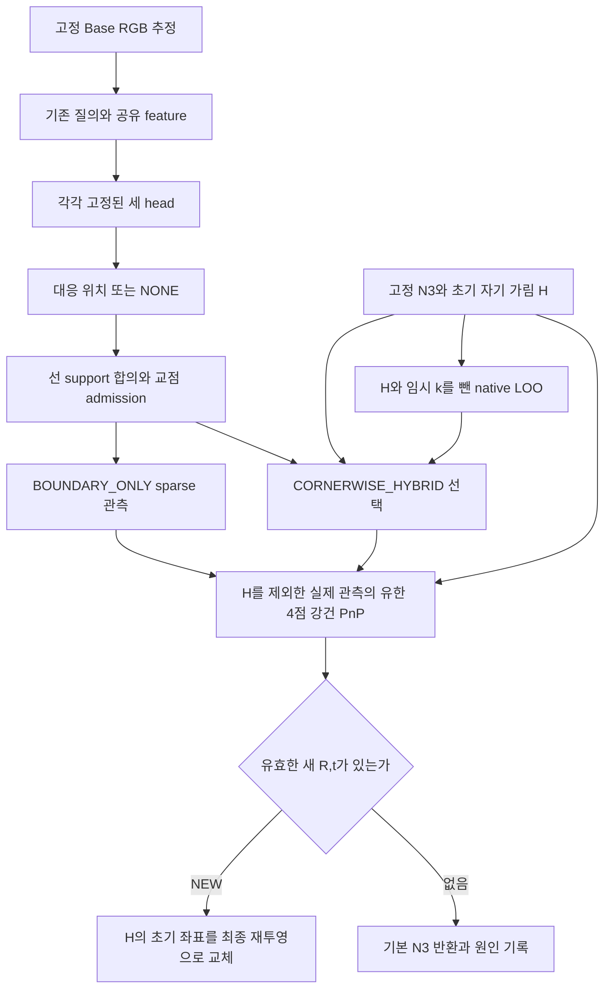
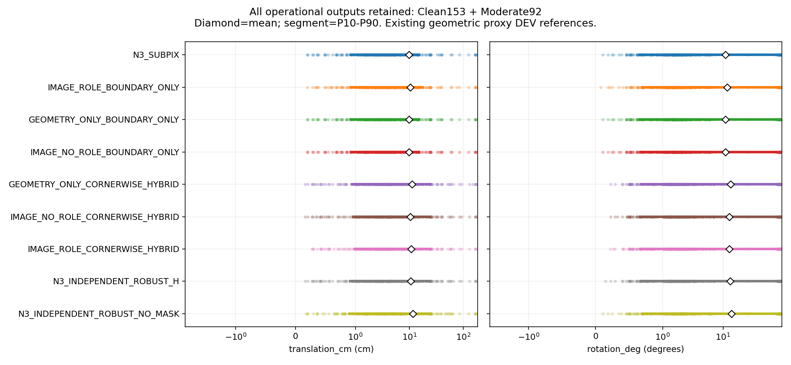
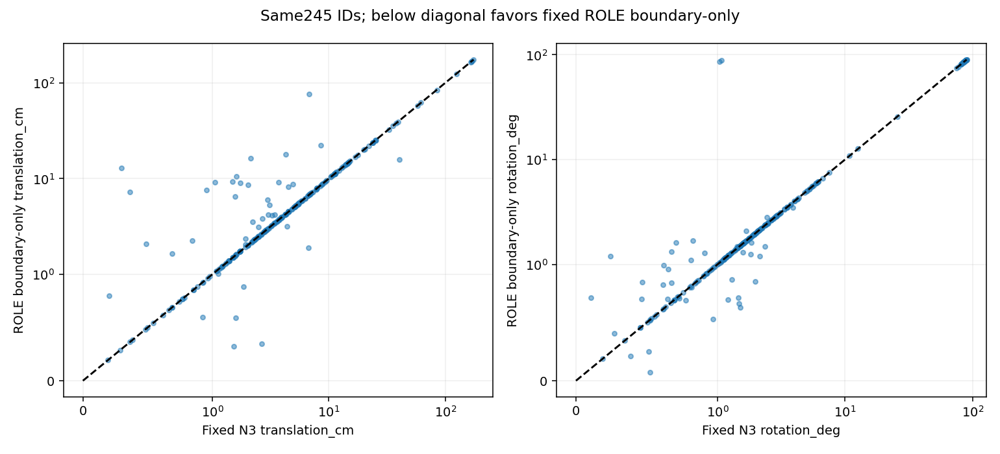
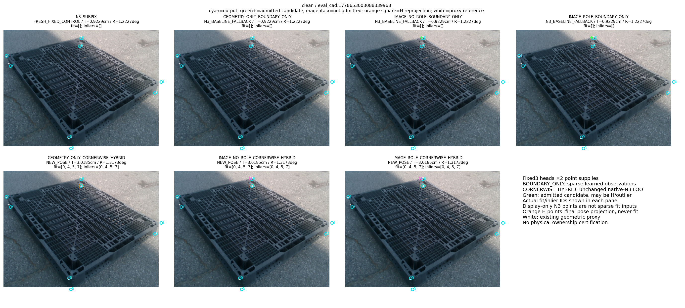
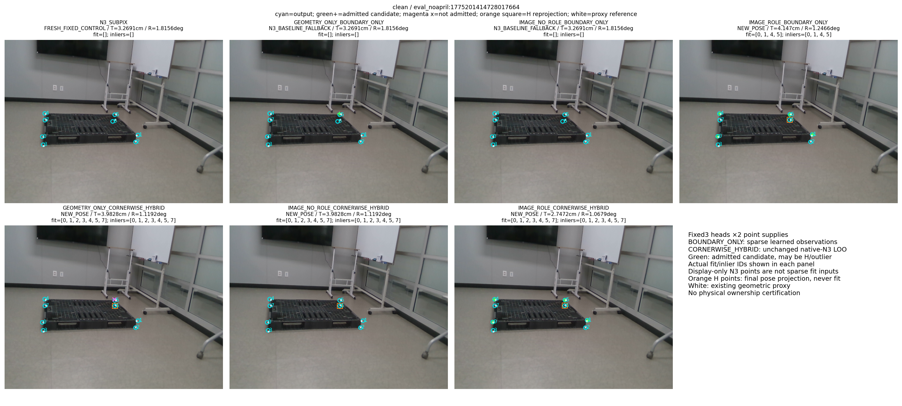
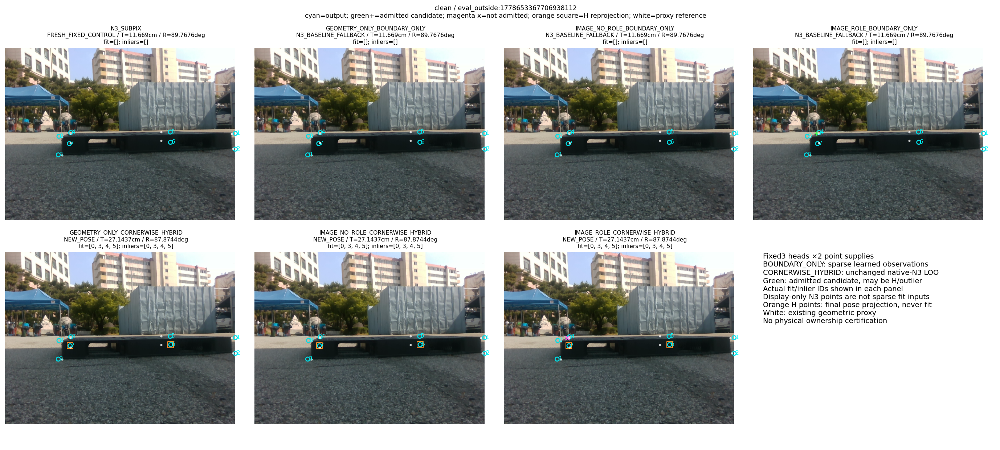
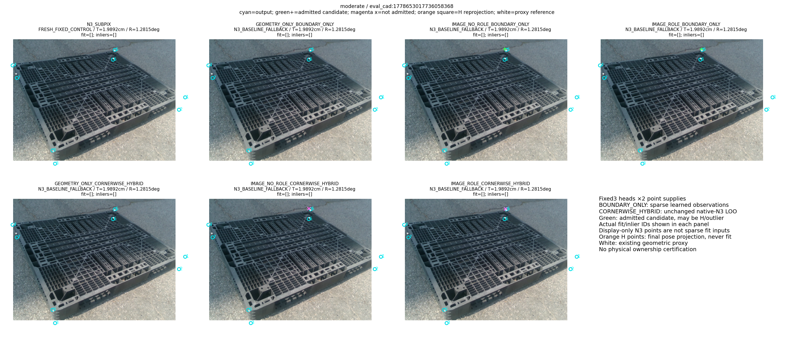
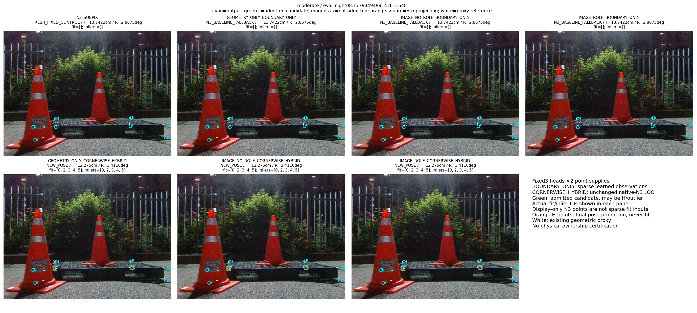
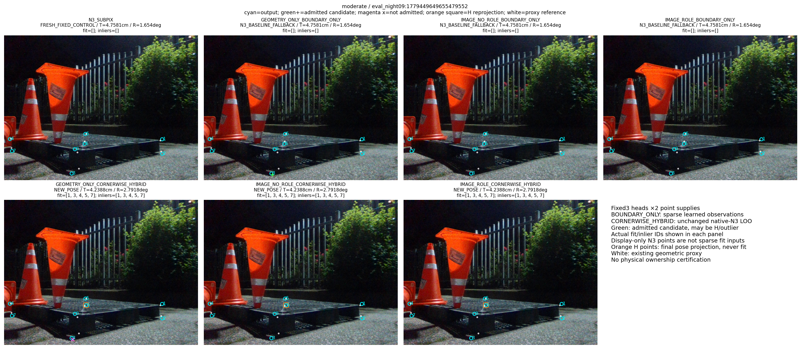

“가림 판단이 일부 틀려도 다른 유효 대응점으로 자세를 구하고 자기 가림 코너를 재투영했을 때, 기존 단순 대조보다 실제 위치·회전이 좋아졌는가?”

**고정 N3→cornerSubPix보다 좋아지지 않았다.** primary IMAGE_ROLE_BOUNDARY_ONLY의245장 전체 운용 평균은 위치10.46185cm·회전11.61153°·ADDsym18.32803cm로 N3의9.75455cm·10.91484°·17.02865cm보다 나빴다. Base의12.18835cm·14.23284°보다는 낮지만, 고정 N3 대조를 이긴 최상위 목표는 미달성이다. primary는40새 자세/205기본 N3 반환/완전 실패0이다. 위치·회전 차이의95% CI는0을 포함하며 정확도 우위를 확인하지 못했다. 이 수치는 기존 GEOMETRIC_PROXY 참조의 실제 실사 실행 결과이고 독립 실측 physical pose truth는 아니다. 실제 scoring·통계·검산·1500회 전체 경로 시간·8개 그림 생성과 검토·공개 byte 복원과 독립 숫자 검토는 완료됐으며, 게시 완료는 별도 영수증으로 확인한다.

**현재 문제는 H를 초기 좌표로 남기거나 LOO를 생략한 것이 아니다.** 자기 가림 H와 held-out 코너 k를 fit에서 빼는 구현 및 NEW 후 H 재투영은 코드·원행 검산을 통과했다. 병목은 head가 정한 선과 교점이 해당 코너의 정확한 대응인지, 남은 점이 충분히 모여 안정적인 자세를 정하는지다. ROLE sparse는 채택447점 중 기존 참조에서8px를 넘는 점82개가 남았고, 같은 코너의 N3보다 좋아진 점192개·나빠진 점255개였다. 이것은 관측 선택의 상대 정확도가 확보되지 않았다는 증거다. 모든82점의 실제 물리적 소유권이 틀렸다는 별도 증명으로 확대하지 않는다. 강건 합의·LOO는 실행되었지만 전체245장의 위치·회전 개선까지 만들지 못했다.

## 이번 비교가 확인하는 질문

기존 corrected 세 head의 학습은 이미 각3000update, batch16, 같은 초기화·배치 순서로 완료됐고 이번 학습은0이다. v7은 그 corrected 마지막 checkpoint들을 같은 confidence·선 교점 decoder와 같은 prior-free point PnP에 적용한다. 두 공급을 모두 고정해 실제 관측 교점만으로 충분한지, 또는 native N3와 코너별 비교를 해야 하는지 확인한다. 기존 RGB·feature cache·cohort를 사용하며 새 RGB·annotation·GT에 의한 threshold 조정은 하지 않는다.

이 비교는 named arm의 의미를 정확히 읽어야 한다. [원 forward](../../../scripts/research/pallet_observation_refiner_20261009_v1/model.py#L26)에서 `GEOMETRY_ONLY`는 image/neck0:19만0으로 만들고 geometry19:25와 초기 role25:28을 유지한다. `IMAGE_NO_ROLE`은 role25:28을0으로 만들고 image/neck·geometry를 유지한다. 따라서 **GEOMETRY_ONLY와 IMAGE_NO_ROLE의 차이는 image와 role을 함께 바꾸며 순수한 영상 효과를 분리하지 못한다.** IMAGE_ROLE과 IMAGE_NO_ROLE의 차이는 같은 image 채널에서 role 사용 여부를 바꾼다. 다만 head별 학습된 weight와 같은 source-only 규칙으로 계산한 각자 calibration 계수까지 포함하는 전체 방법 비교다. 단일 고정 head에서 role 채널만 제거하는 인과 실험이었다고 주장하지 않는다.

role은 초기 Base feature pose에서 projected cuboid의 virtual boundary/internal/unavailable 상태다. 실제 팔레트의 물리적인 변이나 교점 소유권을 인증하는 classifier가 아니다. 올바른 physical wire에서 얻은 source 감독과 실사에서 선택한 이미지 선의 physical ownership은 서로 다른 증거다. 마스크 완전 분류도 성공의 필요조건으로 삼지 않는다.

## 고정 모집단·감독·source calibration

사용자가 마지막에 지정한 쉬움153·중간92, 총245장/13session이 평가 모집단이다. severe74는 제외하고 이전319장 자료와 결과는 보존한다. 중간 난도에 부분 가림이 있을 수 있으므로245장을 무가림으로 부르지 않는다. authority는 기존 frozen cohort이며 성능을 보고 쉬운 ID만 다시 고르지 않는다.

연구용 selector의 과거 [targets](../../../scripts/research/pallet_observation_refiner_20261009_v1/training.py#L59)는 exact physical edge ray가 수치적으로 miss되면 [no_match](../../../scripts/research/pallet_observation_refiner_20261009_v1/training.py#L94)로 처리했다. source-test128의2164개 infinite-NONE은 이후 actual owned wire·enclosure·원 mask/depth 정책으로 POSITIVE proposal이 검증됐고, full1024 감독은 [READY 검증](../pallet_kp_supervision_repair_20261010_v1/DEPTH_RECOVERY_VALIDATION.json)과 corrected loader 경로에서 수리됐다. 역사 코드의 buggy 함수를 덮어쓴 것이 아니며 main의 N3→cornerSubPix 오류도 아니다. [corrected loader](../../../scripts/research/pallet_kp_supervision_repair_20261010_v1/retrain.py#L100)는 READY 배열을 읽고 [SHA 검사](../../../scripts/research/pallet_kp_supervision_repair_20261010_v1/retrain.py#L152)를 거쳐 학습하며, [checkpoint의 repaired_target_sha256](../../../scripts/research/pallet_kp_supervision_repair_20261010_v1/retrain.py#L376)이 이 경로를 기록한다.

오류 인수인계와 [감독 복구 보고서](../pallet_kp_supervision_repair_20261010_v1/RESULT_KO.md) 당시의 “수정 후 재학습0”은 그 시점의 상태다. 이후 별도 승인된 고정 [corrected 학습](../pallet_kp_corrected_supervision_20261010_v1/TRAINING_COMPLETION.json)이 세 arm각3000·batch16, 같은 초기화·배치 순서·학습량으로9000update/144000exposure 실제 완료됐다. [checkpoint metadata](../pallet_kp_corrected_supervision_20261010_v1/CHECKPOINT_METADATA.json)와 완료 영수증을 그대로 쓰며 v7 새 학습은0이다. 수정 전 원래9000과 corrected9000은 별도 이력이고 formal 누적18000이다. **과거 IMAGE_ROLE의 실사0/319 NEW는 수정 전 잘못된 감독 모델의 결과**이며 corrected 모델의 결과로 재사용하지 않는다. 이후 corrected66-way decoder245장의 ROLE220NEW/25기본 반환, T15.20239cm/R14.56122°도 [별도 실제 결과](../pallet_kp_corrected_supervision_20261010_v1/RESULT_KO.md)이며 이번 새로운 관측 decoder의 결과와 섞지 않는다. 감독 수리와 학습 완료만으로 실사 교점의 상대 정확도가 확보되었다고 말하지 않는다.

source CAL은 index768..895의 기존128family만 사용했다. [실제 완료](source_calibration/COMPLETION.json)에서 GEOMETRY_ONLY8batch·128exposure, IMAGE_NO_ROLE8batch·128exposure, 총16forward·256exposure가 한 번 완료됐다. IMAGE_ROLE의9파일은 exact-byte 재사용이며 이번 forward0이다. 원 ROLE의 과거8forward는 별도 영수증에 남아 있다. source-test·실사·새 RGB·detector·N3·PnP·ray·feature 재생성·학습은 이 source 단계에서0이었다. code/input/protection17017개와 원 사용자 checkout449항목의 상태가 그대로였다는 완료 영수증을 보존한다.

source calibration 수치 본문은 변경 없는 기존 알고리즘이다. `p_best/(p_best+p_NONE)`와 certified source POS의≤2px correctness, genuine NONE·IGNORE 구분, least-restrictive Wilson cutoff와 uncertainty·geometry 규칙을 head마다 같은 CAL128에 적용한다. correlated query와 cutoff scan의 Wilson 수치를 실사95% precision 보증으로 확대하지 않는다. source 미지원 edge는 `MODEL_CALIBRATION_UNSUPPORTED`이며 실사 physical absence 판정이 아니다.

[Source 계약9개](SOURCE_CALIBRATION_CONTRACT_CHECKS.json)와 [pipeline synthetic 검사13개](PIPELINE_CHECKS.json)는 각각 실제 한 번 PASS다. pipeline 검사는 분석적으로 만든 기하와 명시된 dispatch stub을 사용했으며 actual learned head·실사 RGB·private GT 호출은0이다. 실제 OpenCV 호출 Generic1028·LM142·projectPoints48은 CPU 기하 검사 비용이며 실사 정확도 결과와 섞지 않는다.

[Source CAL 독립 산술](SOURCE_CALIBRATION_CHECKS.json)은 실제 한 번198848개 check PASS였다. GEOM은 알려진 accepted2545개 중≤2px correctness2436개(조건부0.9571709234), NO_ROLE은1642개 중1575개(0.9591961023)였다. 별도 IGNORE query의 acceptance는193/21개로 알려진 precision 분모에 넣지 않는다. 실제 원 logits·READY scalar·confidence cutoff·Wilson 전체 scan·query scale·source support-line 교점125/100개와 geometry 계수를 stdlib로 확인했다. GEOM/NO_ROLE cutoff는 각각0.9734667969/0.9888733685이며 confidence·geometry는 둘 다 enabled였다. 이 독립 checker의 new head/PnP/ray/학습/RGB/실사 row는0이다. source known-label precision과 actual wire support-line의 virtual 교점만 확인하며 GPU forward 진실성·실사 physical corner truth를 다시 인증하지 않는다.

full raw witness를 메모리에 전부 모으는 위험을 줄이기 위해 수치 policy를 바꾸지 않고 streaming writer/reader를 준비했다. [stream fixture 첫 시도](STREAMING_CHECKS_ATTEMPT_A.json)는 네 그룹 중2PASS·2FAIL이었다. 실제 fsync/duplicate guard는 올바른 RuntimeError를 냈지만 test harness가 AssertionError를 기대한 의미 없는 예외형 오류였다. [원 test byte·이유](STREAMING_CHECKS_ATTEMPT_A_REASON.json)를 보존하고 기대 예외형만 수정한 [두 번째 시도](STREAMING_CHECKS.json)에서4PASS였다. production writer·수치 policy·원행은 바뀌지 않았고 두 시도의 모델/PnP/GT/학습/RGB 호출은0이다. 별도 static 문서 CLI도 package import 경로 오류1회 후 같은 source를 올바른 repository cwd로 실행해 완료됐으며 accuracy 실행과 구분한다.

## 두 공급과 후단의 의미

코너의 특성과 실제 처리를 다음처럼 나눈다. 모든 가림 종류의 완전 분류를 이 처리가 동작하는 전제조건으로 두지 않는다.

| 관측 상태/역할 | 처리할 정보 | 실제 구현과 성공 조건 |
|---|---|---|
| 직접 가시인 유효 경계/교점 | 검색 질의의 유효 위치, 두 선의 support·uncertainty와 교점 | [decoder](../../../scripts/research/pallet_boundary_corner_refiner_20261010_v2/observations.py#L134)와 [admission](../../../scripts/research/pallet_boundary_corner_refiner_20261010_v2/pipeline.py#L40). 실제 영상에서 정확한 위치인지와 물리 경계 소유권은 별도로 검증해야 한다. |
| 초기 자기 가림 H | 사용하지 않을 초기2D ID, 최종 자세로 채울 ID | [최종 solve](../../../scripts/research/pallet_three_head_observation_20261010_v7/pipeline.py#L273)의 blocked H와 [조립](../../../scripts/research/pallet_boundary_corner_refiner_20261010_v2/pipeline.py#L109). H는 final fit에 들어가지 않고 NEW R,t가 있을 때만 한 번 재투영된다. |
| 외부 가림·검색 범위 밖·물리 대응 없음 | 대응 위치 또는 NONE, 불확실 감독 IGNORE | source POS/NONE/IGNORE를 구분한다. 실사에서 일부 오판이 남아도 유효 대응이 충분하면 [강건 합의](../../../scripts/research/pallet_cornerwise_independent_20261010_v4/pose.py#L136)가 이상치를 제외할 수 있다. mask 차이만으로 frame을 버리지 않는다. |
| LOO로 비교할 후보 k | 다른 관측으로 얻은 heldout 예측에 대한 두 실제 좌표의 residual | [코너별 선택](../../../scripts/research/pallet_cornerwise_independent_20261010_v4/selection.py#L128)의 exclusion은 H∪{k}다. k는 temporary exclusion이며 새로운 self-occlusion label이 아니다. 최종 fit에서는 선택된 실제 관측을 쓴다. |
| 관측이 부족하거나 배치가 불안정 | 사용 가능한 point ID·수·공간 배치·rank·다중해 | 최소4실제 대응을 비롯한 조건을 통과해야 NEW다. 부족/수치실패/동점 물리 다중해를 기본 출력 반환과 구분한다. 기본 N3가 반환됐다고 새 방법의 자세 산출로 세지 않는다. |

따라서 “self occ는 무시하는가?”의 정확한 답은 **적용 H의 초기 영상 좌표를 PnP 관측에서 제외한다**는 것이다. SELF 종류를 완벽히 알아야 다른 점으로 solve할 수 있는 것은 아니다. H가 한 점 틀린 경우에도 남은 관측의 수·배치·합의가 충분하면 NEW를 허용한다. no-mask native 경로는 그 효과를 비교하기 위한 별도 대조다.

위 그림의 N3→PnP 입력은 hybrid의 유효 native 관측 또는 별도 native 대조에만 해당한다. BOUNDARY_ONLY의 sparse 결측은 native 좌표로 채우지 않는다. H 재투영에서 PnP로 돌아가는 경로는 없다. v7에서는 선 자체도 별도 pose factor로 더하지 않는다.

`BOUNDARY_ONLY`는 같은 decoder에서 최종 선 support radius와 corner uncertainty≤8px를 통과한 실제 교점만 sparse pool에 넣는다. native N3 거리 gate와 corner LOO를 사용하지 않는다. 없는 좌표는 NaN이고 fit pool을 native 좌표로 채우지 않는다. initial H는 실제 fit에서 제외한다. 출력에 유지된 unobserved non-H native 좌표는 독립 관측이나 fit 증거가 아니다.

`CORNERWISE_HYBRID`는 변경 없는 v4 prior-free 선택이다. 같은 후보를 native N3≤8px basin 안에서, H∪{k}를 제외한 다른 native 관측의 실제 heldout pose에 대해 비교하고 고정 residual 조건에서 strict improvement가 있을 때만 교체한다. initial H와 Base proposal 의존성은 남아 있으므로 numeric fit exclusion과 완전한 통계적 독립성을 구분한다.

여섯 head/supply 경로와 nativeH 대조는 initial H를 가설 생성·scoring·refit에서 제외한다. no-mask native 대조는 H=[]이며 predicted H는 별도 진단이다. 최대70개 finite4-ID subset, 양쪽 registry 치수 분기, 최소4실제 관측·배치·수치·cheirality·강건 합의·ambiguity 기준을 그대로 유지한다. 새 final R,t가 있으면 실제 H를 한 번 재투영해 초기 좌표를 대체하고 다시 PnP에 넣지 않는다. 새 pose가 없으면 full N3 fallback을 반환한다. mask가 한 점 틀리거나 재추정 후 달라졌다는 사실 자체는 frame 실패 사유가 아니다.

`selected_corner_ids`는 공급 단계의 proposal ID다. 실제 solver used/fit/final inlier와 같다고 가정하지 않는다. 특히 hybrid에서 같은 ID의 native 점이 inlier인 경우를 새 boundary 교점의 inlier로 잘못 세지 않는다. BOUNDARY_ONLY에는 LOO residual이 존재하지 않아None이며 이를 추정하거나0오차로 채우지 않는다.

## 실사 결과: 고정 N3보다 위치·회전 평균이 나빠졌다

formal accuracy protocol [PROTOCOL.json](PROTOCOL.json)의 SHA는 `f02830c4e6fe60dce31c12fa3026218ba1cc9df8c6a500fff2b3bd9fceb50f58`이며 GT 접근 전에 고정됐다. 서로 다른 foreign CPU 작업에 의해 preflight CLI가 두 번 거절됐고, 첫 infer CLI도 자체 before-model guard에서 멈췄다. [preflight A](PREFLIGHT_GUARD_ATTEMPT_A.json)·[B](PREFLIGHT_GUARD_ATTEMPT_B.json)·[infer A](INFERENCE_GUARD_ATTEMPT_A.json)와 resource snapshot을 보존한다. 이 세 거절의 모델·PnP·실사 GT 호출은0이며 사용자 작업을 kill하거나 guard를 우회하지 않았다. CLI 거절을 수치 accuracy 재실행이나 method 실패로 세지 않는다.

이후 세 번째 preflight가 quiet window에서 통과했고 fresh inference는 실제 한 번 완료됐다. [완료 영수증](INFERENCE_RECEIPT.json)과 [원행 봉인](GEOMETRY_SEAL.json)은245프레임, `(head_arm,id)` 관측735행, `(method,id)` geometry1960행, fixed Base/N3490행을 기록한다. 모든 stream은 close·fsync 후 게시됐고 `cleanup_error=None`, `inference_error=None`, `GT_access_during_inference=false`다. actual detector forward246(모델 초기화1 포함), N3245, 각 head245(합계735), final pose 경로1960, cornerLOO672(개별 arm155/94/423)이 실제 기록됐다. 완료 wall115.371703859초는 throughput 실행의 벽시계 시간이며 runtime latency 측정으로 쓰지 않는다. [Base/N3 fresh parity](BASE_N3_PARITY.json)도 통과했다. 이 단계의 완성은 점수 개선을 의미하지 않는다.

봉인된 GT-free 원행에 대한 [추가 독립 scalar protocol](VALIDATION_PROTOCOL.json)은 complete geometry 이후, 그 검사 자체의 산술 실행 이전에 별도로 고정됐다. formal accuracy core·policy는 바꾸지 않았다. [실제 검사](VALIDATION_CHECKS.json)는1회9095709check·0FAIL, wall33.181573183초였다. 저장 후보 packet121160건과 선택 후보 재검사1921건, 합계123081산술 호출을 구분하며 이를 고유 물리 해의 개수로 부르지 않는다. 실제 driver1960행은1238NEW/722fallback이고, heldout solve를 포함한 packet1878NEW에는640LOO NEW가 더 있다. scalar R,t/projection·잔차/consensus·active ID/H∪{k} 제외·최종 actual_pose 연결·decoder/source 계수·rank witness를 검사했다. stored singular value의 rank 산술이며 새 Jacobian/SVD 또는 전역 유일성의 증명은 아니다. 최대 절대 차이1.835823059e−5는 큰 condition number에서 `ATOL1e−7 + RTOL1e−12×값의 크기` 허용 범위였다. 전 항목이 순수 절대1e−7 이내였다고 쓰지 않는다. historical ROLE의 exact-byte 실행 영수증에는 `N3_calls` 필드가 없어 이를 기록된0으로 바꾸지 않았다. 이번 source CAL의 새 N30은 별도 완료 기록이다. 이 검사는 모델·PnP·GT 점수·rays·RGB·학습을 새로 실행하지 않았고 실제 자세 오차는 이후 점수 단계에서만 판단한다.

complete geometry와 성공 cleanup 이후 [V4 ROLE hybrid 대조](V4_CONTROL_PARITY.json)를 reference 접근 전에 실제 검산했고245/245의 비교 숫자가 정확히 일치했다. 과거 V4 geometry는 새 pose/선택에 사용하지 않았다. 이어 [채점](SCORING_RECEIPT.json)도 실제 한 번 완료됐다.1960새 방법+490fixed행, frozen N3 phase의 기존 reference를 썼고 새 detector/head/PnP fit/ray는0이다. score wall116.892290511초를 latency로 인용하지 않는다. 통계·독립 CI 검산은 이 완성된 원행으로 실제 완료했다.

다음 표는 [METRICS.json](METRICS.json)과 [METRICS.csv](METRICS.csv)의 실제 저장값이다. 모든10방법이 같은245장의 최종 운용 출력을 유지했고 완전 실패는0이다. NEW가 없는 기본 반환을 새 자세 산출로 세지 않았다. `B`는 BOUNDARY_ONLY, `H`는 CORNERWISE_HYBRID를 나타내는 표 안의 약칭이다. native H는 예측 자기 가림을 제외한 native 대조이며 hybrid의 약칭 H와는 다른 method다.

| 약칭 | 원 method |
| --- | --- |
| BASE | BASE |
| N3 | N3_SUBPIX |
| ROLE_B | IMAGE_ROLE_BOUNDARY_ONLY |
| GEOM_B | GEOMETRY_ONLY_BOUNDARY_ONLY |
| NO_ROLE_B | IMAGE_NO_ROLE_BOUNDARY_ONLY |
| GEOM_H | GEOMETRY_ONLY_CORNERWISE_HYBRID |
| NO_ROLE_H | IMAGE_NO_ROLE_CORNERWISE_HYBRID |
| ROLE_H | IMAGE_ROLE_CORNERWISE_HYBRID |
| NATIVE_H | N3_INDEPENDENT_ROBUST_H |
| NATIVE_NO_MASK | N3_INDEPENDENT_ROBUST_NO_MASK |

| 방법 | 운용 n | NEW | N3기본 반환 | 완전 실패 | 평균 T(cm) | 평균 R(°) | 평균 ADDsym(cm) |
| --- | --- | --- | --- | --- | --- | --- | --- |
| BASE | 245 | 0 | 0 | 0 | 12.18835 | 14.23284 | 22.43195 |
| N3 | 245 | 0 | 0 | 0 | 9.75455 | 10.91484 | 17.02865 |
| ROLE_B | 245 | 40 | 205 | 0 | 10.46185 | 11.61153 | 18.32803 |
| GEOM_B | 245 | 0 | 245 | 0 | 9.75455 | 10.91484 | 17.02865 |
| NO_ROLE_B | 245 | 2 | 243 | 0 | 9.78929 | 10.91538 | 17.06200 |
| GEOM_H | 245 | 238 | 7 | 0 | 11.21107 | 13.41336 | 20.29882 |
| NO_ROLE_H | 245 | 238 | 7 | 0 | 10.48624 | 12.75806 | 19.23963 |
| ROLE_H | 245 | 238 | 7 | 0 | 10.70340 | 12.77024 | 19.46002 |
| NATIVE_H | 245 | 238 | 7 | 0 | 10.62196 | 13.11272 | 19.68147 |
| NATIVE_NO_MASK | 245 | 244 | 1 | 0 | 11.59638 | 13.89985 | 20.51034 |

**GEOM_B의9.75455cm/10.91484°는245/245 N3 기본 반환의 동일 점수다. 경계 대응 모델의 성공이 아니다.** NO_ROLE_B도2NEW/243기본 반환이며, ROLE_B는40NEW/205기본 반환이다. 높은 산출률의 hybrid와 native 강건 대조는 모두 N3보다 전체 운용 평균 T/R이 높았다. 따라서 가림을 사용하지 않는 강건 PnP만으로 충분하다는 주장도 이 결과가 뒷받침하지 않는다. 반대로 ROLE classifier나 추가 학습이 필요하다는 주장도 이 부정 결과만으로 확정할 수 없다.

### 쉬움153·중간92를 따로 본 전체 운용

**쉬움153**

| 방법 | 운용 n | NEW | 기본 반환 | 완전 실패 | 평균 T(cm) | 평균 R(°) | 평균 ADDsym(cm) |
| --- | --- | --- | --- | --- | --- | --- | --- |
| BASE | 153 | 0 | 0 | 0 | 12.84635 | 10.62820 | 17.93860 |
| N3 | 153 | 0 | 0 | 0 | 10.10707 | 7.58458 | 12.91513 |
| ROLE_B | 153 | 37 | 116 | 0 | 11.26716 | 8.69636 | 15.02469 |
| GEOM_B | 153 | 0 | 153 | 0 | 10.10707 | 7.58458 | 12.91513 |
| NO_ROLE_B | 153 | 2 | 151 | 0 | 10.16271 | 7.58544 | 12.96854 |
| GEOM_H | 153 | 152 | 1 | 0 | 10.62982 | 8.14006 | 13.57096 |
| NO_ROLE_H | 153 | 152 | 1 | 0 | 9.72152 | 7.63107 | 12.60133 |
| ROLE_H | 153 | 152 | 1 | 0 | 9.77572 | 7.64096 | 12.64980 |
| NATIVE_H | 153 | 152 | 1 | 0 | 9.62631 | 7.64049 | 12.52183 |
| NATIVE_NO_MASK | 153 | 153 | 0 | 0 | 10.64309 | 8.33607 | 13.64369 |

**중간92**

| 방법 | 운용 n | NEW | 기본 반환 | 완전 실패 | 평균 T(cm) | 평균 R(°) | 평균 ADDsym(cm) |
| --- | --- | --- | --- | --- | --- | --- | --- |
| BASE | 92 | 0 | 0 | 0 | 11.09407 | 20.22752 | 29.90457 |
| N3 | 92 | 0 | 0 | 0 | 9.16828 | 16.45321 | 23.86960 |
| ROLE_B | 92 | 3 | 89 | 0 | 9.12258 | 16.45958 | 23.82164 |
| GEOM_B | 92 | 0 | 92 | 0 | 9.16828 | 16.45321 | 23.86960 |
| NO_ROLE_B | 92 | 0 | 92 | 0 | 9.16828 | 16.45321 | 23.86960 |
| GEOM_H | 92 | 86 | 6 | 0 | 12.17769 | 22.18308 | 31.48756 |
| NO_ROLE_H | 92 | 86 | 6 | 0 | 11.75800 | 21.28447 | 30.27942 |
| ROLE_H | 92 | 86 | 6 | 0 | 12.24616 | 21.30047 | 30.78571 |
| NATIVE_H | 92 | 86 | 6 | 0 | 12.27777 | 22.21327 | 31.58826 |
| NATIVE_NO_MASK | 92 | 91 | 1 | 0 | 13.18176 | 23.15265 | 31.92988 |

### 전체·쉬움·중간의 mean·분산·SD·중앙값·P90·최대값

아래 분산은 표본분산(ddof=1)이고 단위는 해당 metric의 제곱이다. SD와 나머지 수치는 metric의 단위다. 숫자는 공개 원행에서 이미 계산한 METRICS의 값을 옮겼으며 이 보고서를 위해 detector/PnP/score/bootstrap을 반복하지 않았다. NEW/fallback의 같은 전체 moment는 [METRICS.csv](METRICS.csv)의 scope 열에서 별도로 검토할 수 있다.

**전체245**

| 방법 | 지표 | n | mean | sample variance | SD | median | P90 | max |
| --- | --- | --- | --- | --- | --- | --- | --- | --- |
| BASE | T(cm) | 245 | 12.18835 | 538.57907 | 23.20731 | 6.01080 | 23.19187 | 183.07850 |
| BASE | R(°) | 245 | 14.23284 | 851.38416 | 29.17849 | 1.83974 | 82.81064 | 90.00917 |
| BASE | ADDsym(cm) | 245 | 22.43195 | 1506.00220 | 38.80724 | 6.40506 | 110.03653 | 188.99152 |
| N3 | T(cm) | 245 | 9.75455 | 575.93602 | 23.99867 | 3.59735 | 15.08501 | 174.75683 |
| N3 | R(°) | 245 | 10.91484 | 665.18060 | 25.79110 | 1.66599 | 76.09532 | 89.77763 |
| N3 | ADDsym(cm) | 245 | 17.02865 | 1298.81087 | 36.03902 | 3.93694 | 68.43149 | 180.98844 |
| ROLE_B | T(cm) | 245 | 10.46185 | 587.30043 | 24.23428 | 4.17624 | 17.38282 | 174.75683 |
| ROLE_B | R(°) | 245 | 11.61153 | 711.89609 | 26.68138 | 1.63332 | 81.44738 | 89.77763 |
| ROLE_B | ADDsym(cm) | 245 | 18.32803 | 1379.54603 | 37.14224 | 4.34644 | 71.97188 | 180.98844 |
| GEOM_B | T(cm) | 245 | 9.75455 | 575.93602 | 23.99867 | 3.59735 | 15.08501 | 174.75683 |
| GEOM_B | R(°) | 245 | 10.91484 | 665.18060 | 25.79110 | 1.66599 | 76.09532 | 89.77763 |
| GEOM_B | ADDsym(cm) | 245 | 17.02865 | 1298.81087 | 36.03902 | 3.93694 | 68.43149 | 180.98844 |
| NO_ROLE_B | T(cm) | 245 | 9.78929 | 575.52513 | 23.99010 | 3.60668 | 15.08501 | 174.75683 |
| NO_ROLE_B | R(°) | 245 | 10.91538 | 665.16960 | 25.79088 | 1.66599 | 76.09532 | 89.77763 |
| NO_ROLE_B | ADDsym(cm) | 245 | 17.06200 | 1297.94086 | 36.02695 | 3.96966 | 68.43149 | 180.98844 |
| GEOM_H | T(cm) | 245 | 11.21107 | 618.32945 | 24.86623 | 3.92262 | 23.99886 | 172.16453 |
| GEOM_H | R(°) | 245 | 13.41336 | 808.91002 | 28.44134 | 1.86920 | 83.08608 | 90.10153 |
| GEOM_H | ADDsym(cm) | 245 | 20.29882 | 1558.64371 | 39.47966 | 4.15549 | 99.06497 | 179.33022 |
| NO_ROLE_H | T(cm) | 245 | 10.48624 | 528.75685 | 22.99471 | 3.98665 | 23.98240 | 169.89322 |
| NO_ROLE_H | R(°) | 245 | 12.75806 | 767.32963 | 27.70072 | 1.86920 | 82.42241 | 89.79172 |
| NO_ROLE_H | ADDsym(cm) | 245 | 19.23963 | 1431.17535 | 37.83088 | 4.25485 | 79.84000 | 176.47061 |
| ROLE_H | T(cm) | 245 | 10.70340 | 534.42161 | 23.11756 | 3.92262 | 23.99886 | 169.89322 |
| ROLE_H | R(°) | 245 | 12.77024 | 771.38069 | 27.77374 | 1.82384 | 82.42241 | 90.10153 |
| ROLE_H | ADDsym(cm) | 245 | 19.46002 | 1438.09894 | 37.92227 | 4.21950 | 79.84000 | 176.47061 |
| NATIVE_H | T(cm) | 245 | 10.62196 | 536.23843 | 23.15682 | 3.92262 | 24.06498 | 169.89322 |
| NATIVE_H | R(°) | 245 | 13.11272 | 791.16155 | 28.12759 | 1.89309 | 83.08608 | 90.10153 |
| NATIVE_H | ADDsym(cm) | 245 | 19.68147 | 1478.19924 | 38.44736 | 4.15549 | 87.36127 | 176.47061 |
| NATIVE_NO_MASK | T(cm) | 245 | 11.59638 | 621.46600 | 24.92922 | 3.93352 | 24.97292 | 174.75683 |
| NATIVE_NO_MASK | R(°) | 245 | 13.89985 | 831.97883 | 28.84404 | 2.02219 | 83.54838 | 89.81269 |
| NATIVE_NO_MASK | ADDsym(cm) | 245 | 20.51034 | 1513.11172 | 38.89874 | 4.33745 | 86.24036 | 180.98844 |

**쉬움153**

| 방법 | 지표 | n | mean | sample variance | SD | median | P90 | max |
| --- | --- | --- | --- | --- | --- | --- | --- | --- |
| BASE | T(cm) | 153 | 12.84635 | 790.45143 | 28.11497 | 4.66821 | 19.83660 | 183.07850 |
| BASE | R(°) | 153 | 10.62820 | 616.62479 | 24.83193 | 1.71556 | 50.87362 | 89.47928 |
| BASE | ADDsym(cm) | 153 | 17.93860 | 1268.88588 | 35.62142 | 5.51616 | 53.33234 | 188.99152 |
| N3 | T(cm) | 153 | 10.10707 | 859.71747 | 29.32094 | 2.69188 | 12.76265 | 174.75683 |
| N3 | R(°) | 153 | 7.58458 | 435.54458 | 20.86970 | 1.54165 | 5.92315 | 89.76764 |
| N3 | ADDsym(cm) | 153 | 12.91513 | 1130.58451 | 33.62417 | 2.96620 | 14.83117 | 180.98844 |
| ROLE_B | T(cm) | 153 | 11.26716 | 882.60154 | 29.70861 | 3.18499 | 14.52588 | 174.75683 |
| ROLE_B | R(°) | 153 | 8.69636 | 517.59921 | 22.75081 | 1.53194 | 7.36304 | 89.76764 |
| ROLE_B | ADDsym(cm) | 153 | 15.02469 | 1281.45670 | 35.79744 | 3.47793 | 16.75389 | 180.98844 |
| GEOM_B | T(cm) | 153 | 10.10707 | 859.71747 | 29.32094 | 2.69188 | 12.76265 | 174.75683 |
| GEOM_B | R(°) | 153 | 7.58458 | 435.54458 | 20.86970 | 1.54165 | 5.92315 | 89.76764 |
| GEOM_B | ADDsym(cm) | 153 | 12.91513 | 1130.58451 | 33.62417 | 2.96620 | 14.83117 | 180.98844 |
| NO_ROLE_B | T(cm) | 153 | 10.16271 | 859.01722 | 29.30900 | 2.79459 | 12.76265 | 174.75683 |
| NO_ROLE_B | R(°) | 153 | 7.58544 | 435.53270 | 20.86942 | 1.54165 | 5.92315 | 89.76764 |
| NO_ROLE_B | ADDsym(cm) | 153 | 12.96854 | 1129.62914 | 33.60996 | 3.01518 | 14.83117 | 180.98844 |
| GEOM_H | T(cm) | 153 | 10.62982 | 842.83489 | 29.03162 | 2.92707 | 15.98197 | 172.16453 |
| GEOM_H | R(°) | 153 | 8.14006 | 466.14862 | 21.59048 | 1.53805 | 7.74545 | 87.87444 |
| GEOM_H | ADDsym(cm) | 153 | 13.57096 | 1133.27009 | 33.66408 | 3.30787 | 17.73547 | 179.33022 |
| NO_ROLE_H | T(cm) | 153 | 9.72152 | 705.85349 | 26.56790 | 2.87755 | 15.47787 | 169.89322 |
| NO_ROLE_H | R(°) | 153 | 7.63107 | 432.27845 | 20.79131 | 1.53805 | 7.22163 | 87.87444 |
| NO_ROLE_H | ADDsym(cm) | 153 | 12.60133 | 986.84525 | 31.41409 | 3.24034 | 16.16024 | 176.47061 |
| ROLE_H | T(cm) | 153 | 9.77572 | 704.94641 | 26.55083 | 3.01854 | 15.47787 | 169.89322 |
| ROLE_H | R(°) | 153 | 7.64096 | 432.21258 | 20.78972 | 1.58249 | 7.22163 | 87.87444 |
| ROLE_H | ADDsym(cm) | 153 | 12.64980 | 985.77904 | 31.39712 | 3.32525 | 16.16024 | 176.47061 |
| NATIVE_H | T(cm) | 153 | 9.62631 | 706.77618 | 26.58526 | 2.86150 | 15.47787 | 169.89322 |
| NATIVE_H | R(°) | 153 | 7.64049 | 432.16215 | 20.78851 | 1.50644 | 7.22163 | 87.87444 |
| NATIVE_H | ADDsym(cm) | 153 | 12.52183 | 987.95095 | 31.43169 | 3.11109 | 16.16024 | 176.47061 |
| NATIVE_NO_MASK | T(cm) | 153 | 10.64309 | 862.20456 | 29.36332 | 2.96464 | 15.45832 | 174.75683 |
| NATIVE_NO_MASK | R(°) | 153 | 8.33607 | 476.11369 | 21.82003 | 1.70511 | 7.33482 | 89.81269 |
| NATIVE_NO_MASK | ADDsym(cm) | 153 | 13.64369 | 1152.87957 | 33.95408 | 3.30787 | 16.48938 | 180.98844 |

**중간92**

| 방법 | 지표 | n | mean | sample variance | SD | median | P90 | max |
| --- | --- | --- | --- | --- | --- | --- | --- | --- |
| BASE | T(cm) | 92 | 11.09407 | 121.84909 | 11.03853 | 7.85139 | 26.03609 | 60.43186 |
| BASE | R(°) | 92 | 20.22752 | 1194.68846 | 34.56427 | 1.99878 | 86.15921 | 90.00917 |
| BASE | ADDsym(cm) | 92 | 29.90457 | 1828.21440 | 42.75762 | 8.14224 | 116.22280 | 121.23895 |
| N3 | T(cm) | 92 | 9.16828 | 107.70000 | 10.37786 | 5.22047 | 23.63732 | 61.92360 |
| N3 | R(°) | 92 | 16.45321 | 1006.40056 | 31.72382 | 1.98130 | 85.51016 | 89.77763 |
| N3 | ADDsym(cm) | 92 | 23.86960 | 1518.31450 | 38.96556 | 5.43609 | 112.13137 | 121.34477 |
| ROLE_B | T(cm) | 92 | 9.12258 | 97.60033 | 9.87929 | 5.39066 | 21.91003 | 61.92360 |
| ROLE_B | R(°) | 92 | 16.45958 | 1006.20889 | 31.72080 | 2.02634 | 85.51016 | 89.77763 |
| ROLE_B | ADDsym(cm) | 92 | 23.82164 | 1509.68928 | 38.85472 | 5.57461 | 112.13137 | 121.34477 |
| GEOM_B | T(cm) | 92 | 9.16828 | 107.70000 | 10.37786 | 5.22047 | 23.63732 | 61.92360 |
| GEOM_B | R(°) | 92 | 16.45321 | 1006.40056 | 31.72382 | 1.98130 | 85.51016 | 89.77763 |
| GEOM_B | ADDsym(cm) | 92 | 23.86960 | 1518.31450 | 38.96556 | 5.43609 | 112.13137 | 121.34477 |
| NO_ROLE_B | T(cm) | 92 | 9.16828 | 107.70000 | 10.37786 | 5.22047 | 23.63732 | 61.92360 |
| NO_ROLE_B | R(°) | 92 | 16.45321 | 1006.40056 | 31.72382 | 1.98130 | 85.51016 | 89.77763 |
| NO_ROLE_B | ADDsym(cm) | 92 | 23.86960 | 1518.31450 | 38.96556 | 5.43609 | 112.13137 | 121.34477 |
| GEOM_H | T(cm) | 92 | 12.17769 | 248.61352 | 15.76748 | 6.24911 | 30.73349 | 92.07825 |
| GEOM_H | R(°) | 92 | 22.18308 | 1265.81691 | 35.57832 | 2.47536 | 86.86238 | 90.10153 |
| GEOM_H | ADDsym(cm) | 92 | 31.48756 | 2083.61892 | 45.64667 | 6.56136 | 118.58081 | 137.23432 |
| NO_ROLE_H | T(cm) | 92 | 11.75800 | 236.13923 | 15.36682 | 5.92434 | 29.36067 | 92.07825 |
| NO_ROLE_H | R(°) | 92 | 21.28447 | 1217.71399 | 34.89576 | 2.58477 | 86.45327 | 89.79172 |
| NO_ROLE_H | ADDsym(cm) | 92 | 30.27942 | 1991.77320 | 44.62929 | 6.52107 | 117.25767 | 137.23432 |
| ROLE_H | T(cm) | 92 | 12.24616 | 251.60855 | 15.86217 | 6.41762 | 30.73349 | 92.07825 |
| ROLE_H | R(°) | 92 | 21.30047 | 1228.58082 | 35.05112 | 2.44832 | 86.90999 | 90.10153 |
| ROLE_H | ADDsym(cm) | 92 | 30.78571 | 2001.76662 | 44.74111 | 6.73833 | 117.25767 | 137.23432 |
| NATIVE_H | T(cm) | 92 | 12.27777 | 252.83832 | 15.90089 | 6.26949 | 31.20445 | 92.07825 |
| NATIVE_H | R(°) | 92 | 22.21327 | 1265.42525 | 35.57282 | 2.58477 | 86.90999 | 90.10153 |
| NATIVE_H | ADDsym(cm) | 92 | 31.58826 | 2083.80469 | 45.64871 | 6.73833 | 118.58081 | 137.23432 |
| NATIVE_NO_MASK | T(cm) | 92 | 13.18176 | 222.11356 | 14.90347 | 6.45866 | 32.54463 | 63.60210 |
| NATIVE_NO_MASK | R(°) | 92 | 23.15265 | 1296.93215 | 36.01294 | 2.22438 | 87.51993 | 89.77763 |
| NATIVE_NO_MASK | ADDsym(cm) | 92 | 31.92988 | 1920.33112 | 43.82158 | 7.05659 | 114.72815 | 125.04820 |

### NEW와 fallback을 분리했을 때

| 방법 | 출력 종류 | n | 평균 T(cm) | 평균 R(°) | 평균 ADDsym(cm) | T P90 | R P90 |
| --- | --- | --- | --- | --- | --- | --- | --- |
| ROLE_B | NEW | 40 | 7.84061 | 5.39029 | 11.71716 | 15.78705 | 2.16121 |
| ROLE_B | N3기본 반환 | 205 | 10.97331 | 12.82542 | 19.61796 | 19.07660 | 81.87095 |
| GEOM_B | NEW | 0 | — | — | — | — | — |
| GEOM_B | N3기본 반환 | 245 | 9.75455 | 10.91484 | 17.02865 | 15.08501 | 76.09532 |
| NO_ROLE_B | NEW | 2 | 5.55366 | 0.58192 | 5.58126 | 7.29866 | 0.74938 |
| NO_ROLE_B | N3기본 반환 | 243 | 9.82415 | 11.00043 | 17.15649 | 15.16906 | 76.64985 |
| GEOM_H | NEW | 238 | 11.48302 | 13.74263 | 20.81864 | 24.09796 | 83.29484 |
| GEOM_H | N3기본 반환 | 7 | 1.96473 | 2.21811 | 2.62495 | 2.69500 | 4.86902 |
| NO_ROLE_H | NEW | 238 | 10.73687 | 13.06806 | 19.72830 | 24.05675 | 83.07387 |
| NO_ROLE_H | N3기본 반환 | 7 | 1.96473 | 2.21811 | 2.62495 | 2.69500 | 4.86902 |
| ROLE_H | NEW | 238 | 10.96042 | 13.08060 | 19.95517 | 24.11518 | 83.07387 |
| ROLE_H | N3기본 반환 | 7 | 1.96473 | 2.21811 | 2.62495 | 2.69500 | 4.86902 |
| NATIVE_H | NEW | 238 | 10.87659 | 13.43315 | 20.18313 | 24.18759 | 83.24007 |
| NATIVE_H | N3기본 반환 | 7 | 1.96473 | 2.21811 | 2.62495 | 2.69500 | 4.86902 |
| NATIVE_NO_MASK | NEW | 244 | 11.63307 | 13.93166 | 20.57234 | 24.98140 | 83.84649 |
| NATIVE_NO_MASK | N3기본 반환 | 1 | 2.64541 | 6.13669 | 5.38301 | 2.64541 | 6.13669 |

NEW만 고르면 방법마다 모집단이 달라진다. 다음 대조에서 common-operational245와 candidate-new/both-new를 따로 사용하며, 후보가 어렵거나 큰 오차의 frame을 fallback으로 돌려 평균이 좋아 보이는 효과를 전체 운용과 함께 확인한다.

### 고정16대조와 같은13session bootstrap

Δ는 앞 방법−뒤 방법이며 음수가 개선이다. 아래는 모든245장의 common-operational 대조다. 같은 기존10000×13 session draw를 재사용했고 새 draw/seed는0이다. 다른 scope와 strata도 [METRICS.json](METRICS.json)에 남긴다.

| 대조 | n | ΔT | T CI95 | ΔR | R CI95 | ΔADDsym | ADD CI95 |
| --- | --- | --- | --- | --- | --- | --- | --- |
| GEOM_B − N3 | 245 | 0.00000 | [0.00000, 0.00000] | 0.00000 | [0.00000, 0.00000] | 0.00000 | [0.00000, 0.00000] |
| GEOM_H − N3 | 245 | 1.45652 | [0.41572, 2.79466] | 2.49851 | [0.92500, 4.85202] | 3.27018 | [1.11322, 6.46071] |
| NO_ROLE_B − N3 | 245 | 0.03474 | [0.00000, 0.08774] | 0.00054 | [-0.00016, 0.00158] | 0.03336 | [0.00000, 0.08402] |
| NO_ROLE_H − N3 | 245 | 0.73169 | [-0.89225, 2.48786] | 1.84322 | [0.04380, 4.35283] | 2.21099 | [-0.34884, 5.70579] |
| ROLE_B − N3 | 245 | 0.70730 | [-0.20504, 2.14588] | 0.69668 | [-0.02659, 1.94410] | 1.29939 | [-0.21331, 3.80854] |
| ROLE_H − N3 | 245 | 0.94885 | [-0.48717, 2.37524] | 1.85540 | [0.13733, 4.05516] | 2.43137 | [0.11944, 5.40803] |
| GEOM_H − GEOM_B | 245 | 1.45652 | [0.41572, 2.79466] | 2.49851 | [0.92500, 4.85202] | 3.27018 | [1.11322, 6.46071] |
| NO_ROLE_H − NO_ROLE_B | 245 | 0.69695 | [-0.91095, 2.44927] | 1.84268 | [0.04369, 4.35283] | 2.17763 | [-0.35993, 5.66832] |
| ROLE_H − ROLE_B | 245 | 0.24155 | [-0.94037, 2.06769] | 1.15872 | [-0.53512, 3.91215] | 1.13199 | [-1.33649, 5.03715] |
| NO_ROLE_B − GEOM_B | 245 | 0.03474 | [0.00000, 0.08774] | 0.00054 | [-0.00016, 0.00158] | 0.03336 | [0.00000, 0.08402] |
| ROLE_B − NO_ROLE_B | 245 | 0.67256 | [-0.20824, 2.06021] | 0.69614 | [-0.02647, 1.94247] | 1.26603 | [-0.21618, 3.72694] |
| NO_ROLE_H − GEOM_H | 245 | -0.72483 | [-1.49260, 0.02904] | -0.65530 | [-1.49956, 0.00569] | -1.05919 | [-2.27061, 0.02328] |
| ROLE_H − NO_ROLE_H | 245 | 0.21716 | [-0.46991, 0.77654] | 0.01219 | [-1.00830, 1.08059] | 0.22039 | [-1.26646, 1.65821] |
| NATIVE_H − NATIVE_NO_MASK | 245 | -0.97442 | [-2.90535, 0.97681] | -0.78713 | [-3.46917, 1.87903] | -0.82887 | [-4.05608, 2.43262] |
| ROLE_B − NATIVE_H | 245 | -0.16011 | [-2.46786, 1.34850] | -1.50119 | [-4.62258, 0.45860] | -1.35344 | [-5.96876, 1.59471] |
| ROLE_B − NATIVE_NO_MASK | 245 | -1.13453 | [-4.09445, 1.07812] | -2.28832 | [-6.47202, 0.55818] | -2.18231 | [-7.83578, 1.88876] |

primary ROLE_B−N3의 T/R 평균은 각각+0.70730cm/+0.69668°였고 CI95는[−0.20504,2.14588]cm/[−0.02659,1.94410]°로0을 포함했다. 정확도 개선의 증거가 아니며, 평균은 목표와 반대 방향이다. ROLE_H−NO_ROLE_H도+0.21716cm/+0.01219°이고 두 CI가0을 포함하여 role 추가의 우위를 확인하지 못했다. NO_ROLE_H−GEOM_H의 평균은 내려갔지만 두 CI는0을 포함하며 image와 role을 함께 바꾸는 confound도 남아 있다. ROLE_B−두 native 강건 대조의 평균은 내려갔지만 CI가0을 포함하고 기본 N3 반환 비율이 크게 다르므로 모델 관측만의 효과라고 해석하지 않는다.

같은 primary의 subset 해석은 다음과 같다. fixed N3는 NEW method가 아니므로 both-new scope가0이며 CI를0으로 만들지 않고None으로 남긴다.

| scope | n | 빈 resample | ΔT | T CI95 | ΔR | R CI95 | ΔADDsym | ADD CI95 |
| --- | --- | --- | --- | --- | --- | --- | --- | --- |
| common_operational | 245 | 0 | 0.70730 | [-0.20504, 2.14588] | 0.69668 | [-0.02659, 1.94410] | 1.29939 | [-0.21331, 3.80854] |
| candidate_new_pose | 40 | 3 | 4.33222 | [-2.47164, 8.25580] | 4.26718 | [-0.23484, 7.48806] | 7.95874 | [-2.59390, 14.65914] |
| both_new_pose | 0 | 10000 | — | — | — | — | — | — |

실제 통계와 독립 검산은144paired group·432CI 자리이며339자리는 nonempty CI,93자리는None이다. 독립 검산은525894 exact·89680 numeric check PASS, 최대 차이9.09e−13이었다.3337719개의 nonempty bootstrap mean 산술을 수행했고 새 모델/PnP/score/draw는0이다. [VERIFICATION.json](VERIFICATION.json)의 범위를 확인한다. CLI첫 시도는 시스템 Python의 NumPy 의존성 import에서 산술 전에 실패했고 [실패 영수증](VERIFICATION_CLI_ATTEMPT_A.json)을 보존했다. 코드나 수치 policy를 바꾸지 않고 기존 venv에서 두 번째 CLI로 최초 실제 산술1회를 완료했다. 독립 mean/quantile/CI 본문은 stdlib 산술이며 statistics.py를 import하지 않는다. entry wrapper는 frozen production POLICY 검증을 위해 NumPy/OpenCV 의존 모듈을 import하므로 전체 entrypoint가 완전 stdlib-only/no-production-import라고 주장하지 않는다.

다른 사람이 private weights/GT 없이 CI를 확인하도록 [새 공개 checker](../../../scripts/research/pallet_three_head_observation_20261010_v7/public_ci_review.py)를 추가했다. 기존 정확도 protocol/code/원행을 바꾸지 않고, 기존 통계 이후 **이 검사 자체의 산술 이전**에 [PUBLIC_CI_PROTOCOL](PUBLIC_CI_PROTOCOL.json)을 따로freeze했다. [실제 공개 CI 검사](PUBLIC_CI_CHECKS.json)는 최초1회PASS,2450scored row·1620moment·144paired group·432CI 슬롯(339nonempty·93None),25078exact·2730numeric, 최대 차이4.55e−13이었다. 독립 fsum·선형 quantile로42384paired delta·1440000resample 분모·3337719nonempty mean을 계산했고 새draw·모델·PnP·GT·score·학습·RGB는0이다. elapsed14.58329초는 저장자료 감사 비용이고 pose 처리시간이 아니다. 이는 기존 VERIFICATION의1회와 구분하는 추가 공개 산술1회이며 private GT truth·GPU 실행 진위·독립 일반화까지 인증하지 않는다.

### 어떤 경계 관측이 실제 fit에 들어갔는가

다음 count는 코너 proposal incidence다. 한 head의 같은 computed 관측을 B/H 두 공급에서 공유하므로 두 행을 더해 새 관측 총수로 부르지 않는다. selected는 admission/공급 단계, fit/inlier는 성공 NEW만, display는 실제 boundary 좌표로 표시된 경우다.

| 방법 | computed | admission | selected | selected 중 H | non-H | NEW fit | NEW inlier | 실제 display |
| --- | --- | --- | --- | --- | --- | --- | --- | --- |
| ROLE_B | 482 | 447 | 447 | 0 | 447 | 167 | 167 | 167 |
| GEOM_B | 174 | 157 | 157 | 0 | 157 | 0 | 0 | 0 |
| NO_ROLE_B | 115 | 97 | 97 | 0 | 97 | 8 | 8 | 8 |
| GEOM_H | 174 | 157 | 48 | 0 | 48 | 48 | 48 | 48 |
| NO_ROLE_H | 115 | 97 | 35 | 0 | 35 | 35 | 35 | 35 |
| ROLE_H | 482 | 447 | 133 | 0 | 133 | 133 | 133 | 133 |

현재 CAL decoder의 sparse admission은 실제 H ID에 교점을 공급하지 않았다(세 B경로 selected-excluded-H0). 따라서 현재 같은 sparse q에서 H/noH를 바꾸어도 수치 U가 같을 수 있다는 정적 근거가 있다. 아직 같은 관측의 noH 후단 비교를 실제 실행했다고 쓰지는 않는다. hybrid는 나머지 native N3를 사용하므로 boundary-selected-H0을 근거로 hybrid의 H exclusion이 무효라고 확대하지 않는다.

| 선택 공급 | 후보 n | proxy≤8px | proxy>8px | unknown | N3보다 정확 | N3보다 악화 | 평균 Δpx | 교점 medianpx | P90px |
| --- | --- | --- | --- | --- | --- | --- | --- | --- | --- |
| ROLE_B | 447 | 365 | 82 | 0 | 192 | 255 | 0.66234 | 3.62735 | 14.16512 |
| GEOM_B | 157 | 118 | 39 | 0 | 55 | 102 | 0.72272 | 4.82239 | 37.44265 |
| NO_ROLE_B | 97 | 79 | 18 | 0 | 34 | 63 | 0.74937 | 3.71473 | 10.52906 |
| GEOM_H | 48 | 37 | 11 | 0 | 31 | 17 | -0.66635 | 3.75784 | 18.90686 |
| NO_ROLE_H | 35 | 33 | 2 | 0 | 19 | 16 | -0.09269 | 2.63355 | 7.28334 |
| ROLE_H | 133 | 120 | 13 | 0 | 80 | 53 | -0.24975 | 2.74857 | 7.51308 |

ROLE_B의447admitted 교점 중192개는 N3보다 정확했고255개는 나빴다. ROLE_H의 LOO는133개를 골랐고80개가 더 정확·53개가 악화했다. LOO 뒤 선택 집합의 상대 좌표 품질과 전체 pose 개선은 구분한다. 선택 집합의 평균 Δ는−0.24975px였지만 hybrid의 실제 자세는 N3를 이기지 못했다. 이 조건부 선택 통계만으로 LOO의 독립 인과 효과나 완전한 진위 인증을 주장하지 않는다. GEO/NO_ROLE의 sparse 관측 부족과 ROLE의 관측 정확도 문제를 모두 단순 가림 분류 실패로 합치지 않는다. ≤8px proxy agreement는 독립 physical ownership truth가 아니며 오소유권·appearance전이·선편향·reference 불확실성의 인과 비율은 아직 식별하지 못했다.

### mask가 틀렸는데 pose가 좋아진 경우와 그 반대

known mask가 다른61frame, known mask가 같은184frame을 각각 유지한다. mixed에는 T/R의 방향이 다른 경우와 unchanged fallback이 함께 있으므로 실제 NEW/fallback을 분리한 POSTHOC 원행을 확인한다. 이 mask 차이만으로 frame을 veto하지 않았다.

| 방법 | wrong+둘다 개선 | wrong+둘다 악화 | wrong+혼합/동일 | matching+둘다 개선 | matching+둘다 악화 | matching+혼합/동일 | H변경 기록 |
| --- | --- | --- | --- | --- | --- | --- | --- |
| ROLE_B | 0 | 3 | 58 | 5 | 13 | 166 | 1 |
| GEOM_B | 0 | 0 | 61 | 0 | 0 | 184 | 0 |
| NO_ROLE_B | 0 | 0 | 61 | 0 | 1 | 183 | 0 |
| GEOM_H | 12 | 21 | 28 | 49 | 54 | 81 | 6 |
| NO_ROLE_H | 12 | 22 | 27 | 43 | 55 | 86 | 6 |
| ROLE_H | 13 | 22 | 26 | 43 | 53 | 88 | 8 |
| NATIVE_H | 12 | 23 | 26 | 49 | 54 | 81 | 6 |

ROLE_H는 mask가 틀린13frame에서도 T/R 둘 다 개선했으며, mask가 맞는53frame에서는 둘 다 악화했다. ROLE_B에서는 wrong-mask BOTH_BETTER0/BOTH_WORSE3, matching BOTH_BETTER5/BOTH_WORSE13이었다. no-mask native 대조는 mask를 적용하지 않아 별도 분류이며18둘다 개선·51둘다 악화·176혼합/동일이다. 그 경로에서 H변경241은 빈 appliedH와 새 pose의 예측H 차이를 기록한 것이며 mask오판241이나 frame 실패241이 아니다.

### 직접 가시 코너 손상과 숨은 코너 재투영

human DIRECT_VISIBLE1503corner, human SELF_OCCLUDED335corner와 실제 H 교체 집합은 다르다. sparse input의 평균은 존재하는 일부 좌표만의 분모이므로 전체 DIRECT output 평균과 직접 비교해 개선이라고 부르지 않는다. 아래는 같은 각 집합의 N3→출력 평균/P90이다.

| 방법 | DIRECT≤5→>10손상 | DIRECT N3 meanpx | output meanpx | 실제 H n | H N3 meanpx | H output meanpx | H N3 P90 | H output P90 |
| --- | --- | --- | --- | --- | --- | --- | --- | --- |
| ROLE_B | 1 | 19.85302 | 19.86384 | 56 | 4.68358 | 3.14196 | 10.03207 | 5.34231 |
| GEOM_B | 0 | 19.85302 | 19.85302 | 0 | — | — | — | — |
| NO_ROLE_B | 0 | 19.85302 | 19.85448 | 3 | 2.40798 | 1.75163 | 3.10949 | 3.16057 |
| GEOM_H | 0 | 19.85302 | 19.83033 | 291 | 19.06989 | 18.80780 | 26.68655 | 35.00491 |
| NO_ROLE_H | 0 | 19.85302 | 19.84466 | 291 | 19.06989 | 18.78659 | 26.68655 | 34.75270 |
| ROLE_H | 0 | 19.85302 | 19.82732 | 291 | 19.06989 | 18.83056 | 26.68655 | 34.78236 |
| NATIVE_H | 0 | 19.85302 | 19.84682 | 291 | 19.06989 | 18.80189 | 26.68655 | 34.75270 |
| NATIVE_NO_MASK | 0 | 19.85302 | 19.85302 | 0 | — | — | — | — |

ROLE_B의 실제 H56개는 평균4.68358→3.14196px, P9010.03207→5.34231px로 좋아졌지만 최종 T/R은 악화했다. 숨은 코너 오차만으로 pose 성공을 주장하지 않는다. ROLE_H의 H291개는 평균19.06989→18.83056px로 조금 내려갔지만 P9026.68655→34.78236px로 커졌다. DIRECT의 평균 변화와 극단 손상 조건도 따로 남긴다. human SELF335의 전체 before/after moment 및 unknown count는 METRICS diagnostics에서 검토할 수 있다.

[H 독립 scalar 검사](REPROJECTION_CHECKS.json)도 실제1회 PASS했다.1960행/1238NEW에서 H1223개가 final R,t의 직접 scalar 투영과 최대2.273736754e−13px로 일치했다(tol1e−9). non-H 실제 관측8579개, display-only 미관측 non-H102개, center1960개와 fallback의 full N3 유지도 별도로 확인했다. projection을 새 fit 관측으로 재사용하지 않았다는 저장 witness를 검사하며 물리적 GT의 진실성이나 자세 개선을 이 PASS로 인증하지 않는다. actual_pose와 선택 solver R,t의 직접 연결은 별도 VALIDATION_CHECKS가 함께 확인한다.

## 실제 전체 경로 시간·실행량·원행·이미지 검토

[RUNTIME.json](RUNTIME.json)의 실제1회 측정은 고정10경로×(20warmup+130measurement), 총1500fresh full path로 완료됐다.26개 사전 eligible panel/13session에서5repeat를 썼으며 같은 cyclic rotation/odd-block reversal을 유지했다.1300measured interval의 결과는 아래와 같다. raw1500행에는 warmup200행도 포함한다.

RAM native BGR·K·물리 치수 입력→fresh detector→필요한 고정 N3→fresh 초기 N3 pose→요청 head의 Base-query feature/forward→source CAL evidence/admission→sparse 또는 실제 LOO선택→fresh 유한 강건 PnP→H 재투영/metadata 반환을 전체 interval에 포함했다. model/checkpoint load, RGB file/decode, GT scoring, parity, durable journal, resource snapshot은 밖이다.26decode는 실제 수행했지만 interval 밖으로 기록했다. cached 좌표 재생이나 기존 stage 평균 합산으로 full 비용을 대신하지 않았다.

| 방법 | n | mean(ms) | sample variance(ms²) | SD(ms) | median(ms) | P90(ms) | max(ms) |
| --- | --- | --- | --- | --- | --- | --- | --- |
| BASE | 130 | 11.46675 | 2.41107 | 1.55276 | 11.10098 | 12.09131 | 23.06819 |
| N3 | 130 | 15.00669 | 2.08187 | 1.44287 | 14.72293 | 15.89234 | 29.01349 |
| ROLE_B | 130 | 23.45618 | 5.15244 | 2.26990 | 22.74069 | 25.38051 | 35.68814 |
| GEOM_B | 130 | 22.74409 | 2.78644 | 1.66926 | 22.70674 | 24.87242 | 28.14755 |
| NO_ROLE_B | 130 | 21.38298 | 2.27923 | 1.50971 | 21.13034 | 23.42847 | 29.43121 |
| GEOM_H | 130 | 70.87783 | 1049.27986 | 32.39259 | 60.88053 | 95.87055 | 237.02467 |
| NO_ROLE_H | 130 | 60.11653 | 498.11909 | 22.31858 | 57.45861 | 76.34912 | 213.06304 |
| ROLE_H | 130 | 89.17207 | 2618.04533 | 51.16684 | 76.14745 | 149.45669 | 291.69256 |
| NATIVE_H | 130 | 49.39980 | 306.10290 | 17.49580 | 50.48709 | 52.48564 | 174.52475 |
| NATIVE_NO_MASK | 130 | 61.15653 | 444.20966 | 21.07628 | 61.50414 | 63.77886 | 182.23150 |

ROLE_B의 mean23.45618ms는 N3의15.00669ms보다 길다. sparse GEOM의 낮은 시간은245/245기본 반환, NO_ROLE의 낮은 시간도 대부분 fallback이라는 정확도 결과와 함께 읽어야 한다. hybrid의 더 많은 cornerLOO/유한 가설 비용은 actual full interval에 포함됐다. source CAL10.57초·accuracy wall115.37초·score116.89초·runtime job wall101.83829초를 per-frame latency로 바꾸거나 서로 합산하지 않았다.

실제 runtime detector1501(초기화1 포함)·N31350·각 head300/총900 forward, 초기 pose1500·feature pose900·final pose1200·LOO338(GEOM90/NO_ROLE51/ROLE197)이 기록됐다. 원시 OpenCV solvePnP4500·Generic107178·LM8622·SubPix10539는 warmup+measured 전체 진입 계수다. head pre/post hook은 각300attempted/300completed이며 capture의 decoder counter에서 단순 추정한 횟수가 아니다. 모든1500 interval은 sealed output/metadata와 parity를 통과했다. official statistics=true, pipeline close와 row close/fsync, hook cleanup 오류0이다. GPU는 RTX3080, Python3.10.20/Torch2.1.1+cu118/NumPy1.26.4/OpenCV4.9.0, batch1·Torch threads4/OpenCV threads1이었다. 실제24 resource snapshot은 모두 foreign CPU/GPU 없음·quiet·80°C 미만이었다. snapshot 사이 transient 경합까지 독립 보증하지는 않는다. 본 runtime 동안 parent와 report agent도 bulk 읽기/산술/문서 작업을 멈췄다.

resource 범위에는 실제 한계가 있다. fresh inference의 모든 저장 snapshot은 quiet였지만, 별도 scalar 검사와 score 종료 후 다른 사용자 WD의 `stage3_official_runtime` CPU/GPU process가 실행 중인 것이 발견됐다. [발견 영수증](POST_GEOMETRY_RESOURCE_INCIDENT.json)의 process 시작12:47:52 UTC, scalar 검사12:48:40–12:49:13, score12:49:47–12:51:44와12:53:45 발견 시각은 실행기간 겹침의 근거다. 정확한 자원 공유량이나 그 외부 실험의 timing 유효성은 이 자료로 판정하지 않는다. 발견 이후 bulk 산술·원행 읽기를 중지했고 외부 작업을 kill하지 않았다. 따라서 전체 작업기간에 다른 실행이 전혀 없었다고 주장하지 않는다. 이 두 단계는 저장 원행 산술·채점이며 우리의 latency 측정이 아니다. 외부 timing과 뒤이은 verify가 끝난 뒤12:56:09 UTC의 [quiet 회복 검사](POST_GEOMETRY_QUIET_RECOVERY.json)는 foreign CPU/GPU가 없음을 확인했고, 그때만 후속 bulk 작업을 재개했다. 이후 별도 quiet window에서 위1500 full-path runtime을 실제 측정했다. accuracy 산술/채점 기간의 외부 경합 사건과 이 별도 latency interval을 섞지 않는다.

저장된 runtime의 추가 독립 stdlib 감사도 완료했다. 첫 [attempt A](RUNTIME_VALIDATION_ATTEMPT_A/REASON.json)는 최초841검사 뒤 known primitive의0회 key까지 항상 존재한다고 잘못 가정해2FAIL을 기록했고, 실패 evidence의 set을 JSON으로 직렬화하지 못해 partial JSON을 남겼다. 해당 protocol·started·원 partial JSON·당시 checker byte는 모두 그대로 보존했다. 이는 runtime 측정 실패나 accuracy 실패가 아니라 사후 checker의 schema/실패 출력 오류다. production/core·원 runtime·시간 설정은 변경하지 않았다.

새 [attempt B protocol](RUNTIME_VALIDATION_ATTEMPT_B/RUNTIME_VALIDATION_PROTOCOL.json)을 그 자체의 산술 전에 freeze한 [성공 B](RUNTIME_VALIDATION_ATTEMPT_B/RUNTIME_VALIDATION_CHECKS.json)가 완료 authority다.1500행·70summary block·490moment slot,148824check/0FAIL,734H 직접 투영·768driver NEW R,t 연결·338LOO, OpenCV4500/8622/10539/107178와 각 head300pre/300post를 독립 계산/연결했다. 최대 partition 차이2.84e−14ms·H 투영2.27e−13px·moment variance4.55e−13ms²였고 elapsed5.97000초는 사후 저장자료 검산 비용이다. 자체freeze2회·scalar attempt2회(A실패/B성공), 공식 runtime 측정은 여전히1회이며 새 model·PnP·GT·accuracy 재실행은0이다. 원 절대 t0/t1·center/box 원값·fallback 초기 R,t는 runtime 행에 없으므로 그 항목은 저장 flag/분할 scalar의 검산이다. runtime 후보 witness는 개수를 세었고 새 geometry/Jacobian/SVD를 재계산하지 않았다. hardware 실행 진위나 모든 transient 간섭의 독립 인증으로 확대하지 않는다.

### 실제 검토한8개 그림

render는 실제1회8PNG 완료이며 [FIGURE_BINDINGS.json](FIGURE_BINDINGS.json)에 그림·renderer·사전 case protocol·[42개 panel의 수치 원행](FIGURE_CASE_ROWS.jsonl.gz) SHA가 있다. 새 detector·fit·학습·RGB생성은0이다. 두 수치 그림과6사례를 root/report agent가 실제 local `view_image`로 모두 검토했다. title의 method/status/T,R/fit·inlier ID와 좌표 label, fallback과 H 재투영의 구분은 읽을 수 있었다. 이 시각 검토는 실제 물리 경계 소유권·GT 진실성·인과 효과를 인증하는 검사가 아니다.

cyan은 최종 표시 좌표, green+는 공급 단계 admitted/selected 후보, magenta×는 선택하지 않은 후보, orange□는 H 최종 재투영, white 점은 기존 geometric proxy다. **green+를 최종 inlier로 읽지 않는다.** 각 panel의 actual fit/inlier ID가 그 증거이며 sparse NEW에서 표시만 남는 native N3 점은 fit 관측이 아니다. 원 RGB 전체/weight/GT를 공개 자료에 복사하지 않고 요청된 사례의 파생 overlay를 공개한다.

첫 그림은 전체 운용 분포다. 그림의 각 방법은 같은245ID를 유지하며 NEW/fallback 분모는 위 표와 함께 확인한다. GEO_B의 N3 동일 분포는 전부 기본 반환이라는 의미다.

둘째 그림은 같은 frame의 pair다. 대각선 가까운 점에는205기본 반환이 포함되고, 벗어난40NEW의 변화가 T/R에서 서로 다를 수 있다. 일부 좋은 점만 골라 전체 개선이라고 부르지 않는다.

**case01 · clean · `eval_cad:1778653003088339968`**. N3는T0.92290cm/R1.22275°. 세 sparse 경로는 기본 반환이고 ROLE_H는4실제 fit ID `[0,4,5,7]`로 NEW를 얻지만 T3.01854cm/R1.31733°로 둘 다 나빠졌다. H6만 orange 재투영으로 교체됐으며 이 frame의 hybrid는 boundary 교체0이므로 새 head 효과로 부르지 않는다.

**case02 · clean · `eval_noapril:1775201414728017664`**. N3는T3.26909/R1.81556°. ROLE_B의 fit/inlier `[0,1,4,5]`는T4.14696/R1.24660°로 위치 악화·회전 개선이고 H6을 교체했다. ROLE_H는같은4boundary 후보와 다른 유효 native 관측을 사용해 fit `[0,1,2,3,4,5,7]`, T2.74724/R1.06793°로 둘 다 개선했다. 이 사례는 방법이 어떤 frame에서도 불가능하다는 결론과 구분하지만 전체245장의 부정 판정을 바꾸지 않는다.

**case03 · clean · `eval_outside:1778653367706938112`**. 낮은 관측각의 N3 회전 오차89.76764°는 모든 sparse 기본 반환에 그대로 포함된다. ROLE_H는4점 `[0,3,4,5]` NEW, T27.14374/R87.87444°로 회전이 조금 내려가도 위치는 나빠졌다. 큰 오차를 frame 실패로 빼지 않고 전체 운용에 남겼다.

**case04 · moderate · `eval_cad:1778653017736058368`**. N3는T1.98922/R1.28154°, 세 sparse와 세 hybrid 모두 기본 반환이다. fit/inlier `[]`, H 재투영0이다. 표시된 좌표가 존재한다는 사실을 NEW 성공으로 세지 않는다.

**case05 · moderate · `eval_night08:1779449499143611648`**. 야간 cones와 함께 있는 고정 사례다. N3는T13.74224/R2.86746°, sparse는 모두 기본 반환, hybrid는5점 `[0,2,3,4,5]`로T12.27500/R3.41162°이다. 위치 개선·회전 악화이며 H6/7을 최종 재투영했다. 영상만 보고 새 external-occlusion 라벨을 만들지 않았다.

**case06 · moderate · `eval_night09:1779449649655479552`**. N3는T4.75808/R1.65402°, sparse는 모두 기본 반환, hybrid는5점 `[1,3,4,5,7]`로T4.23880/R2.79178°이다. 위치는 내려가고 회전은 커진다. H6의 orange 투영과 실제 fit ID를 구분한다.

[ARCHIVE_MANIFEST.json](ARCHIVE_MANIFEST.json)은 V7의 원 geometry·scored·runtime gzip3개,531259789B를 ordered byte slice14개로 보존한다. 각 부분은최대41943040B이고 decompress/recompress 없이 연결해 original byte/SHA를 유지한다. 원행·seal·receipt는 변경하지 않았다.8PNG와6고정 사례의42panel 행은 [FIGURE_BINDINGS](FIGURE_BINDINGS.json)에 묶고 [실제 시각 검토](VISUAL_REVIEW.json)에서 root2장·보고서 담당6장, 총8장을 실제 확인했다. status·fit/inlier ID·H 재투영 범례가 읽히는지와 큰 오차/기본 반환 사례가 남아 있는지 검토했으며 새 RGB·수동 annotation·그림 재생성은0이다.

**공개 복원은 원 gzip이 이미 있는 환경에서의 hash 통과로 끝내지 않았다.** [실제 fresh dependency bundle 검사](PUBLIC_FRESH_BUNDLE_CHECKS.json)는207파일·944333100B를 별도 bundle에 복사했고 V4/V7의6개 original gzip이 모두 없는 상태를 먼저 확인했다. [V4 restore](PUBLIC_FRESH_V4_RESTORE.json)와 [V7 restore](PUBLIC_FRESH_V7_RESTORE.json)는6개·873655209B를 실제 새로 연결했으며 `existing_unchanged=false`였다. 그 bundle에서 [다시 실행한 public review](PUBLIC_FRESH_REVIEW.json)는2450scored row·735관측·1620moment·59public frozen binding PASS다. 이는 실제 두 번째 public-moment 검토이며 accuracy/model/PnP/score 반복이 아니다. fresh bundle에서 CI 산술까지 반복했다고 주장하지 않는다. 공개 CI 검사는 앞 문단의 별도 stdlib 실행1회로 완료했다. saved scalar의 재현성은 확인했지만 private pose reference의 물리적 진실은 별도 한계다.

[게시 전 보존 검사](PROTECTION_PRE_PUBLICATION.json)는17017tracked·24additional 완료 감사와 원 사용자 checkout449status/6tracked byte가 보존됐음을 실제 확인했다. original local main은`7e92` 이력 그대로이며, 원격 main의 별도 외부 변경을 이 branch의 push로 보고하지 않는다. 이번 자료는 전용 `research/observation-refiner-robust-pnp-20261009`에 정상 commit/push하고 게시 commit/원격 SHA를 별도 publication 영수증으로 확인한다. 이 문서가 작성된 단계에서는 그 게시 영수증을 앞당겨 만들어 놓지 않았다. main 변경·main push·force push·새 촬영·수동 annotation·논문/PPT/LaTeX/PDF 수정은 이번 작업에서0이다.

## 실제 오류·완료된 수정·남은 최소 확인

실제로 잘못됐던 것은 별도 selector 학습의 수치 ray miss→NONE 감독2164개였다. 물리 wire·mask·depth를 사용한 READY 감독 수리와 corrected9000update 학습은 이미 완료됐고, 같은 함수를 다시 수정하거나 main N3의 문제로 보고하지 않는다. 이번에는 수정 모델 세 조건의 실제 후단 평가를 완료했으며, primary와 다른 learned 경로 모두 전체 운용 평균 위치·회전에서 고정 N3를 이기지 못했다. 감독 복구 완료와 실사 방법 성공은 서로 다른 판정이다.

역할 채널은 sparse NEW 산출 수를 늘렸지만 정확도 우위나 필요성을 증명하지 못했다. 코너 LOO를 쓰는 hybrid는 세 조건 모두238새 자세를 산출했지만 평균 위치·회전은 N3보다 나빴다. 강건 PnP의 inlier는 저장된 대응의 기하 합의이며 그 선이 해당 물리 코너의 선이라는 인증이 아니다. H 재투영은 최종 R,t 뒤의 좌표 교체이므로 이 단계 자체가 이미 구한 R,t를 개선하지 않는다. 숨은 점 오차가 줄어도 최종 pose 개선으로 바꾸어 말하지 않는다.

기존 P0 자료의 정확 감독을 사용해 새 RGB를 만들지 않았으므로 외부 가림·비가림 방해물·저대비를 포함한 four controlled variants coverage는 여전히 공백이다. source initial feature-pose witness가 보존되지 않은 role3의 독립 semantic replay도 미검증으로 남으며 one-hot 검사만으로 의미를 증명하지 않는다. 기존 GEOMETRIC_PROXY 참조, 반복해서 본245장, source 조건부 calibration의 범위 밖에서 일반화가 성립한다고 주장하지 않는다. 최상위 목표는 아직 해결되지 않았다.

[독립 방법 감사](METHOD_CAUSAL_AUDIT_KO.md)는 실제 코드의 어느 단계가 어떤 관측을 처리하는지와 이미 수정된 H/LOO 계약을 설명한다. 현재 V7의 masked robust sparse IMAGE_ROLE 관측과 **완전히 같은 좌표**에서 H+standard·noH+robust를 비교하는 원래 C3 항목은 이번8방법 목록에 없다. 이전 corrected66-way decoder의 같은 이름 절제는 실제 완료됐고, V2의 no-mask hybrid/standard native도 존재하지만 현재 sparse 관측의 대조로 바꾸어 부르지 않는다. 남은 최소 원인 분리 실험은 같은 sparse q·K·치수·head/CAL을 고정한 세 경로(current H+robust 재사용, H+standard, noH+robust)다. 이 보고서에서는 그 비교를 구현·실행하지 않았으며, 현재 primary/판정/정책을 사후에 바꾸지 않는다. no-mask는 진단 대조로만 두고 배포 주경로의 H fit 제외·NEW 후 재투영 교체·재fit 금지 원칙을 유지한다.
