# 18장 코너 확인 후 frozen 모델 재평가

> **2026-09-24 정정:** 지시문 재감사에서 가시성 metadata 충돌 QA **2점**이 누락된 것을 확인했습니다.
> 아래 수치와 그림은 기존66점 평가 기록이며, 해당 QA 완료 전까지 잠정 결과로 보존합니다.
> [누락 조건과 후속 조치](DIRECTIVE_COMPLETION_KO.md). 아래의 ‘QA0/종료’는 정정 전 판단입니다.

## 결론

**이번 visible 코너에서 기존 기준이 크게 잘못됐다는 근거는 없습니다. 모델의 큰 오차는 일부 그대로 확인됐습니다.**
PRIMARY: REFERENCE_STABLE_ENOUGH_FOR_NEXT_MODEL_WORK. SECONDARY: MODEL_ERROR_CONFIRMED_WITH_VERIFIED_VISIBLE_POINTS.
추가 사진/재클릭 없이 이번 파일럿을 종료합니다. 신규 학습·추론·기존 GT 수정 모두 0회. 전체 성능 우승 모델은 정하지 않습니다.

## 진행 과정과 실제 작업량

모델 결과 없이 18장 선정 → 사용자 요청에 따라 기존 annotation.py + PnP로 키포인트 입력 → 직접 클릭의 상태만 별도 확인 → 입력 잠금 → legacy 기준의 QA 대상 확인 → 기존 R0/OLD_S1/T0/T1/T2 예측 hash 잠금 및 재사용 → fixed-identity visible-only 채점.
**엄격한 blind annotation이 아닙니다.** 모델/이전 정답 좌표는 표시하지 않았지만 PnP 보조를 사용했습니다. 평가 기준은 사람의 직접 클릭+상태 판단이며 독립 6D GT가 아닙니다.

|항목|수량|
|---|---|
|선정 / 저장|18 / 16장|
|추가 선정|0장|
|미저장 심함|2장, 그대로 보존·미대체|
|저장된 직접 클릭 코너|75개 (클릭 이벤트 횟수와 다름)|
|화면 밖 직접 클릭|3개 제외|
|상태 검수|72개 완료|
|DIRECT_VISIBLE / EXTERNAL_OCCLUDED|66 / 6개|
|PnP 보완 / 직선 연장|52 / 1개, 주평가 제외|
|QA 재검토 / 변경|0 / 0|
|분/장|별도 측정하지 않음|
|전체144 상태 분류|미완료: 미입력·비수동 점 미분류로 제외|

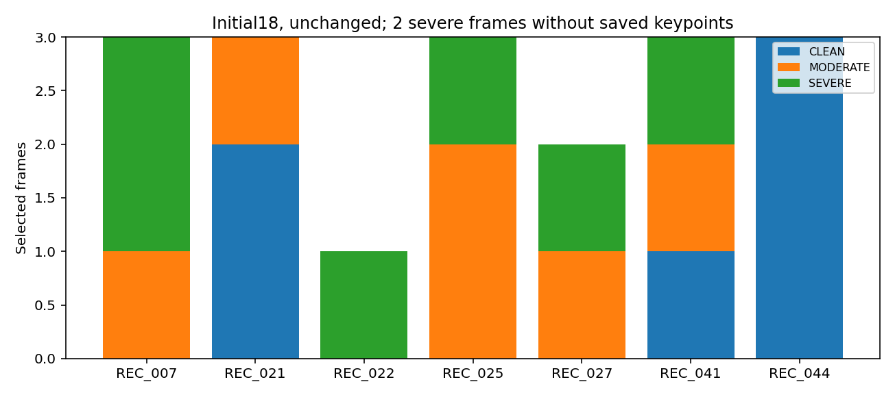

## 코너 정의와 coverage

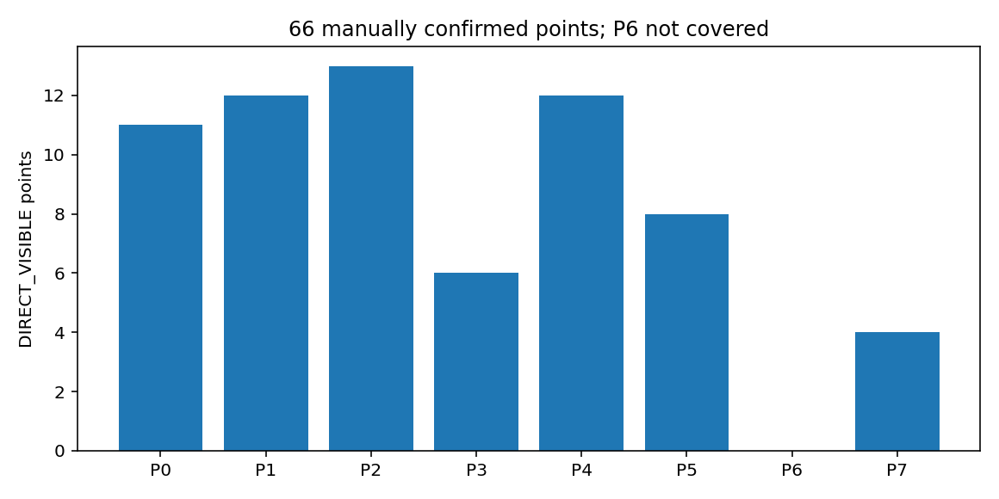

직접 보이는 점: CLEAN30 / MODERATE22 / SEVERE14, 16장·6 recording. 선택18장은7 recording이었지만 검증점은6 recording에만 있습니다. P6=0, 다른7개 ID는 각각3회 이상. 총60·난도별12·ID5종·recording3 기준을 충족해 추가6장을 요구하지 않습니다.
사람이 입력할 수 있었던 가시점만 비교하므로 심한 가림 전체·숨은 점·저장 못한2장으로 일반화할 수 없습니다.

## 신규 클릭과 기존 기준의 차이

중앙값 **2.83px**, P90 **5.37px**. 5px 이내57/66, 10px 이내65/66, 20px 초과0/66. QA 조건(>20px/불확실 메모)에 해당하는 점0개. 기존 정답을 자동 수정하지 않았습니다.
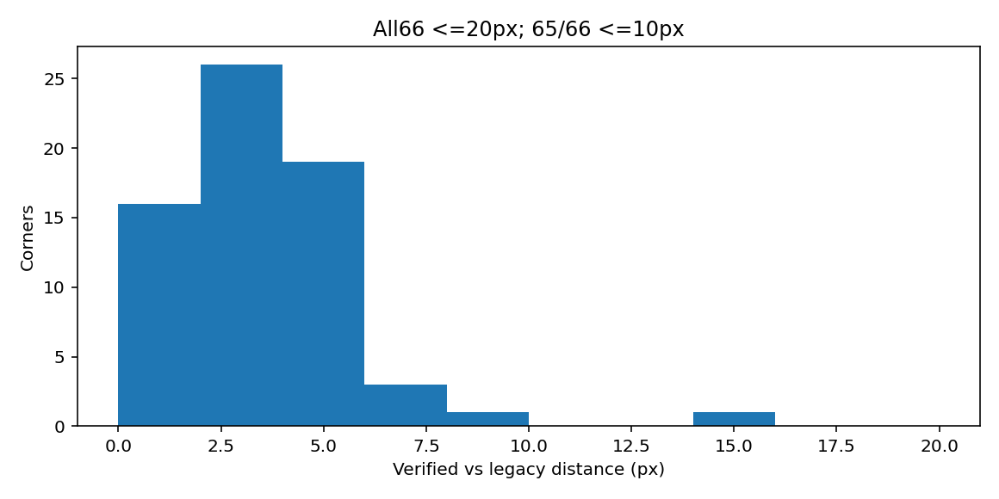

## 모델 재평가: 직접 보이는66점, 번호 고정

|모델|PCK5|PCK10|PCK20|중앙값 px|P90 px|>20px|
|---|---|---|---|---|---|---|
|R0|21/66|44/66 (66.67%)|60/66|7.14|18.39|6|
|OLD_S1|22/66|41/66 (62.12%)|61/66|7.03|17.45|5|
|T0|27/66|44/66 (66.67%)|61/66|7.09|17.88|5|
|T1|26/66|45/66 (68.18%)|62/66|6.61|19.33|4|
|T2|25/66|43/66 (65.15%)|61/66|6.39|19.75|5|

T0: 추가 clean pseudo 학습, T1: 추가 hard pseudo 학습, T2: 같은 hard의 기존 수동 좌표 학습. OLD_S1은 이전 EASY→HARD 학생. 모두 저장된 예측 그대로이며 보정기·selector·confidence threshold를 바꾸지 않았습니다.
T1의 PCK10이 가장 높지만 R0/T0보다 **1점** 더 맞습니다. T2는 중앙값이 가장 낮지만 PCK10은 T1보다2점 적습니다. 모델 선택이나 일반적인 우월성 결론에 쓰지 않습니다.
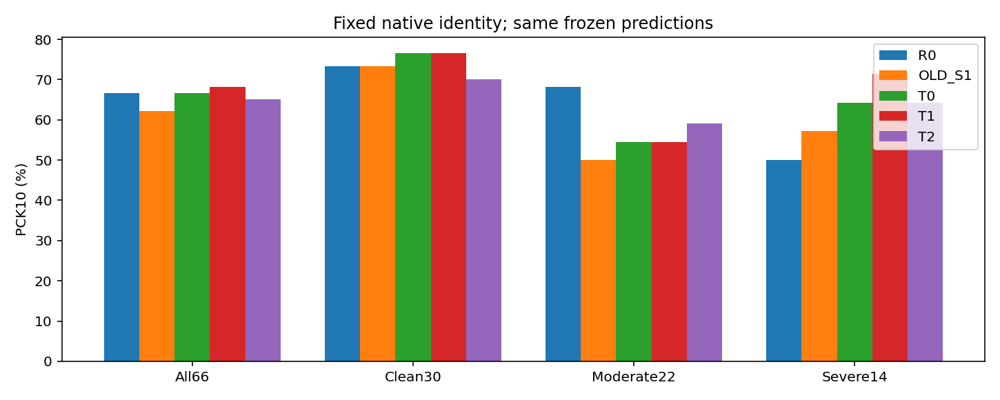

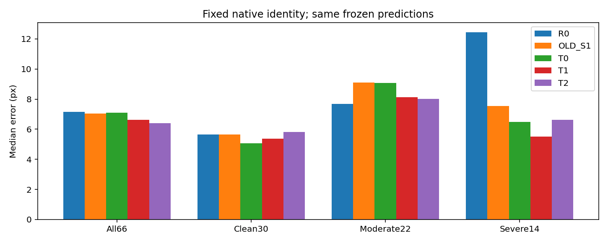

## 난도별 PCK10

|모델|CLEAN30|중간22|심함14|
|---|---|---|---|
|R0|22/30|15/22|7/14|
|OLD_S1|22/30|11/22|8/14|
|T0|23/30|12/22|9/14|
|T1|23/30|12/22|10/14|
|T2|21/30|13/22|9/14|

심함에서 R0 7/14 → T1 10/14지만 작은 가시점 부분집합입니다. 중간에서는 R0 15/22가 가장 높아 일관된 hard 개선으로 부를 수 없습니다.

## 같은66점에서 legacy로 채점했을 때와 비교

|모델|legacy PCK10|새 reference PCK10|
|---|---|---|
|R0|45|44|
|OLD_S1|44|41|
|T0|43|44|
|T1|43|45|
|T2|44|43|

몇 픽셀 차이로 10px 경계의 정답 수와 순서가 달라집니다. 큰 GT 오류의 증거는 아니며, 소표본에서 한두 점 차이로 모델을 고르면 안 된다는 한계입니다. 과거 전체128장 결과와 이번66점 결과의 분모를 혼합하지 않습니다.

## 쌍별 변화와 recording 민감도

|비교(뒤−앞)|PCK10 정답수 변화|중앙값 변화 px|프레임 win/loss/tie|
|---|---|---|---|
|OLD_S1-minus-R0|-3|-0.111|{'win': 8, 'loss': 8, 'tie': 0}|
|T0-minus-R0|0|-0.057|{'win': 9, 'loss': 7, 'tie': 0}|
|T1-minus-T0|1|-0.471|{'win': 6, 'loss': 10, 'tie': 0}|
|T2-minus-T1|-2|-0.220|{'win': 9, 'loss': 7, 'tie': 0}|
|T2-minus-T0|-1|-0.692|{'win': 7, 'loss': 9, 'tie': 0}|

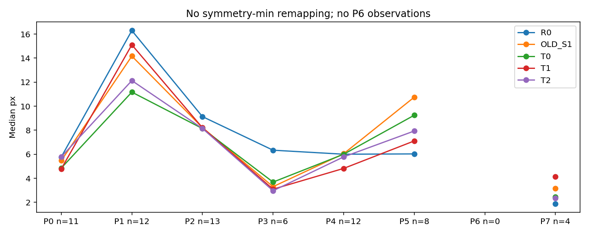

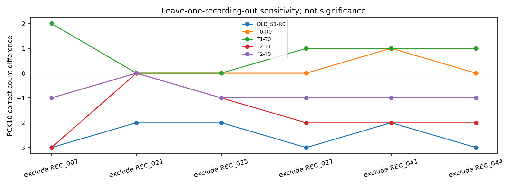

## 사례 이미지

초록 +: 신규 직접 클릭, 자홍 ×: legacy, 노랑 마름모: 모델. PnP wireframe이 아니라 실제 모델 키포인트입니다. 원본 대신 팔레트 ROI만 표시하고 검출된 얼굴은 모자이크합니다. 표시용 crop/resize는 평가 좌표에 영향을 주지 않습니다.
legacy >20px 불일치 사례가 없으므로 아래 첫6장은 단순히 차이가 큰 순서입니다. 오류라고 단정하지 않습니다. 모델 오류 사례는 실제 해당 프레임만, 임의 대조6장은 고정 hash 순서로 표시합니다.

### 사례 1: largest_legacy_difference

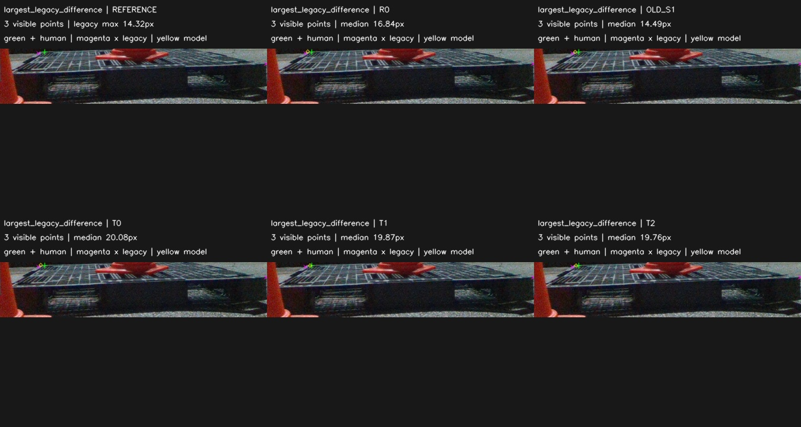

### 사례 2: largest_legacy_difference

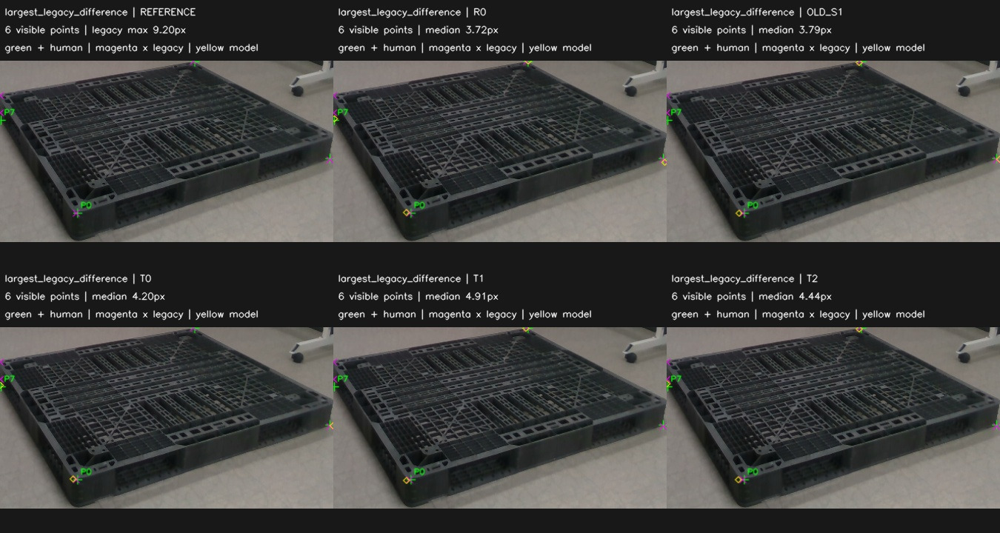

### 사례 3: largest_legacy_difference

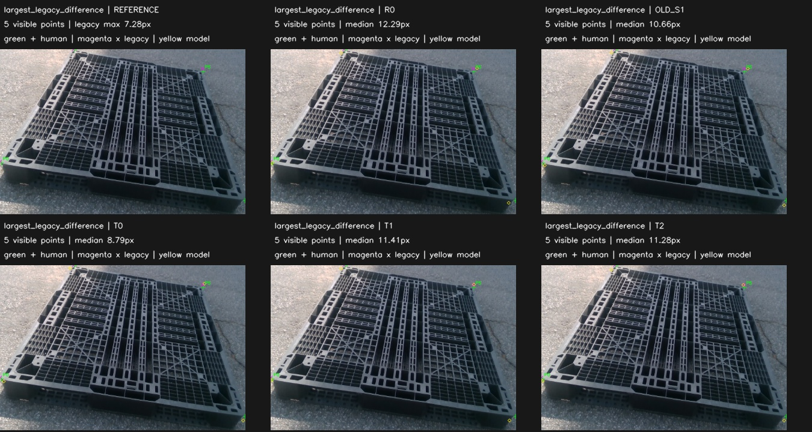

### 사례 4: largest_legacy_difference

### 사례 5: largest_legacy_difference

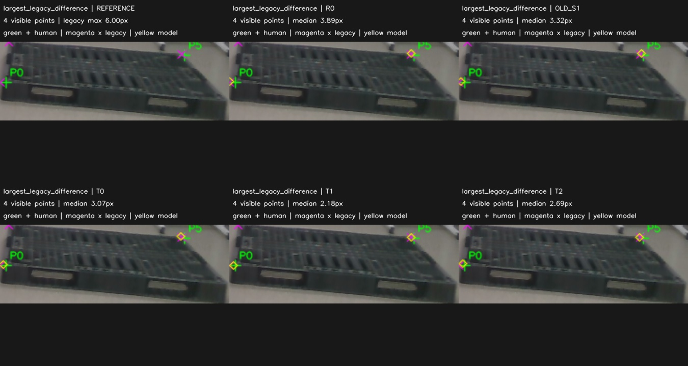

### 사례 6: largest_legacy_difference

### 사례 7: confirmed_model_error

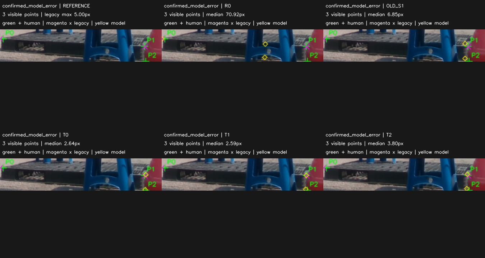

### 사례 8: confirmed_model_error

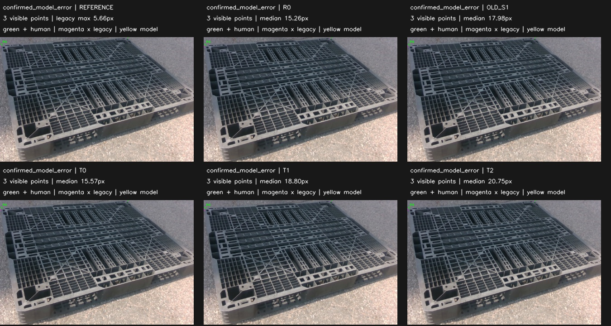

### 사례 9: confirmed_model_error

### 사례 10: confirmed_model_error

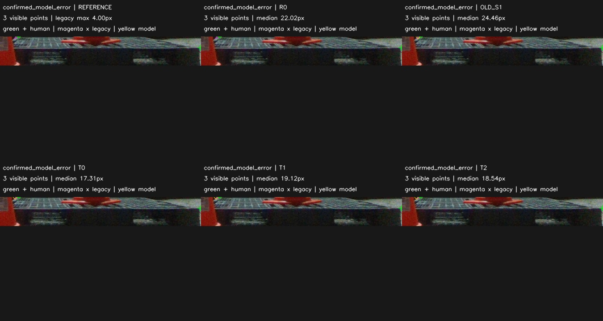

### 사례 11: confirmed_model_error

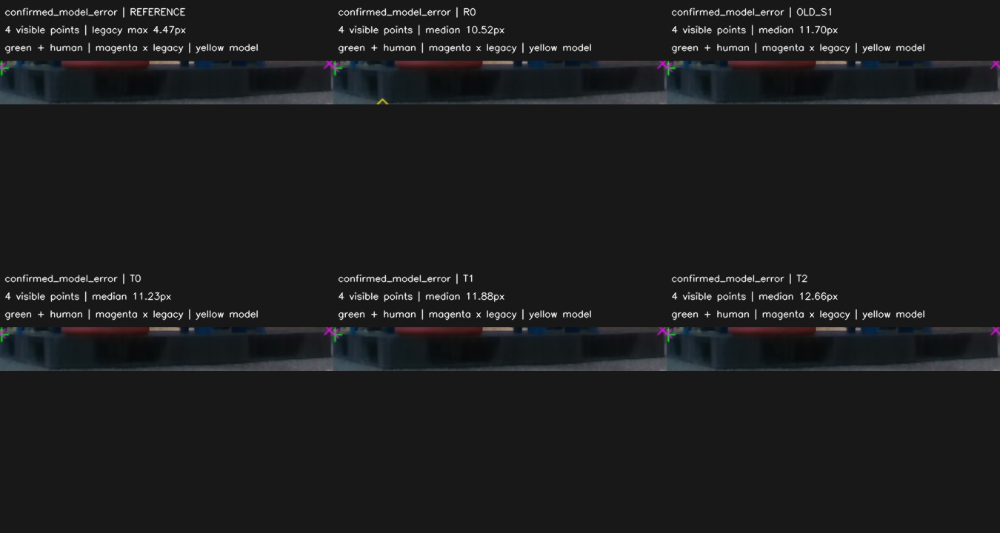

### 사례 12: confirmed_model_error

### 사례 13: fixed_random_control

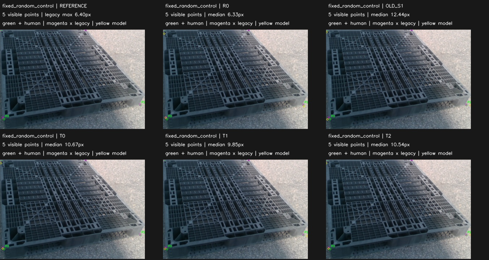

### 사례 14: fixed_random_control

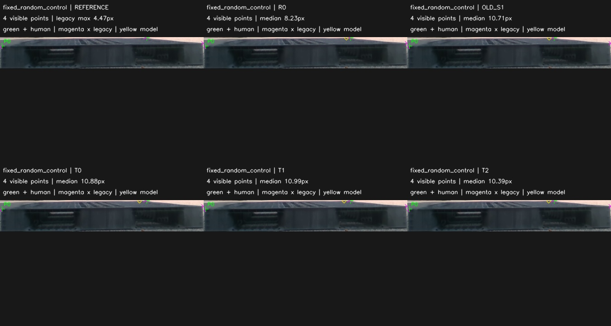

### 사례 15: fixed_random_control

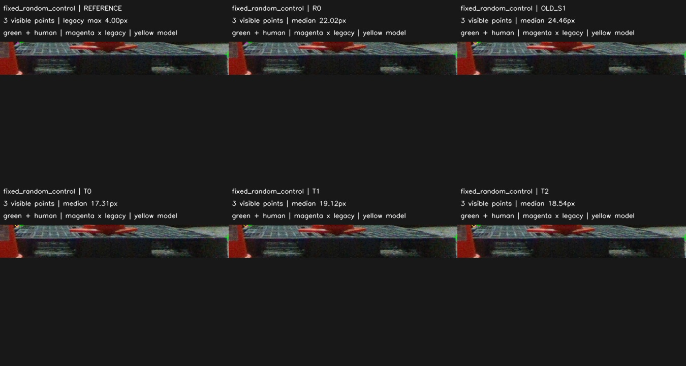

### 사례 16: fixed_random_control

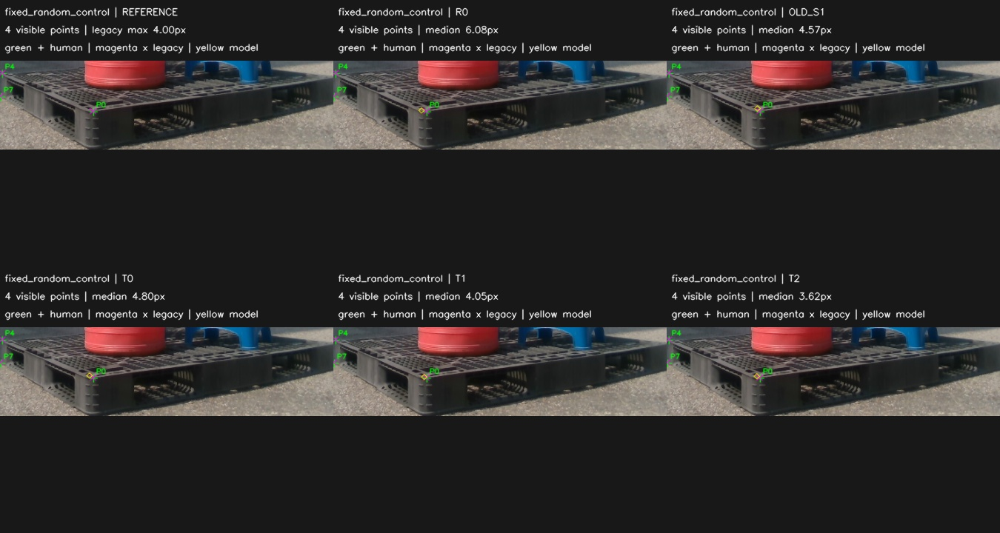

### 사례 17: fixed_random_control

### 사례 18: fixed_random_control

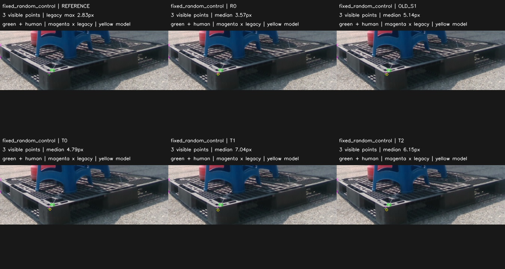

## 다음 최소 행동과 한계

추가 어노테이션 필요성이 입증된 것은 아닙니다. 기존 기준과66점이 모두20px 이내여서 지금은 단순 RGB 수 증가나 대규모 GT 재작성보다, 이미 가진 학습 자료에서 큰 잔차가 남는 원인을 먼저 확인하는 것이 타당합니다.
당초 다음 행동으로 제안했던 **기존 T2 TRAIN H36에서 >20px로 남았던 3점의 ID/좌표 변환/학습 입력 일치 감사는 2026-09-24 완료**했습니다. [결과표·비교 이미지 3개·loss 진단 보고서](../pallet_existing_data_transfer_v1/THREE_CORNER_ANALYSIS_KO.md)를 확인하세요. 세 점은 같은 이미지의 코너 번호 불일치 패턴이며, 실제 학습 입력·좌표 변환은 정상이고 RLE gradient도 존재했습니다. 왜 이번 학습이 번호 불일치를 해소하지 못했는지는 단일 원인으로 확정하지 않았습니다. 새 학습·레이블링·튜닝은 실행하지 않았습니다. 이 anchor는 절대 TRAIN에 사용하지 않습니다.
소규모·균형 진단이며 독립 TEST/운영분포 평가가 아닙니다. PnP 보조, 입력 가능한 점의 선택 편향, P6 부재, 미저장2장, 고유 recording6개, 재사용 DEV의 한계가 있습니다. 6D 정답을 새로 만들거나 기존6D 표에 섞지 않습니다.

## 재현과 저장

FIRST_PASS_LOCK → VERIFIED_LABELS(private) → PREDICTIONS_LOCK → VERIFIED_RESULTS 순서로 고정. 좌표와 프레임 매핑은 private 로컬 파일에 보존. 공개용 JSON에는 집계만 남깁니다. 코드 `audit_completed_status.py`, `evaluate.py`, `report.py`를 참조하세요.
이 보고서는 비교 표·차트·사례 이미지 26개와 함께 저장소에 포함합니다. 원본 RGB, 개인별 좌표 JSON, 정확한 프레임 매핑은 공개 대상에서 제외합니다.

검증: 준비 단계 33개 검사와 완료 평가 16개 검사를 통과했습니다. 독립 산술 재계산, 예측 hash, 직접 클릭 provenance, 원본 GT 보존 및 보고서의 26개 이미지 연결을 확인했습니다.
`DECISION.json`은 준비 당시 기록이고, 현재 완료 상태는 `FINAL_DECISION.json`을 기준으로 합니다.
