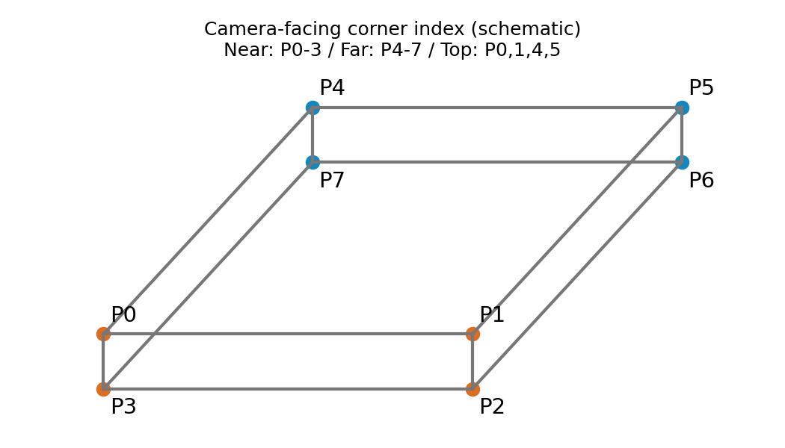

# Minimal verified visible-corner anchor — 준비 보고서

> **후속 완료:** 상태72개 확인 → DIRECT_VISIBLE66개 → 추가 QA0개 → frozen 모델 재채점 완료.
> 최신 표와 사례 이미지는 [최종 평가 보고서](EVALUATION_REPORT_KO.md)에 있습니다. 아래는 준비 당시 기록입니다.

> 사용자 변경: [기존 annotation.py에서 18장 키포인트를 먼저 입력](KEYPOINTS_FIRST_KO.md)한 뒤
> D/V 상태 검수를 별도로 진행합니다. 기존 PnP 기능을 사용하므로 아래 최초 설계의
> 엄격한 blind first-pass 조건은 현재 작업 방식에 해당하지 않습니다. 새 학습·재평가는 아직 없습니다.

## 현재 상태

**WAITING_FOR_HUMAN_LABELING · 0/18장**. 새 학습·추론·평가 0회.
기존 HELDOUT128의 플라스틱에서 CLEAN/MODERATE/SEVERE 각 6장을 모델 결과 없이 선정했습니다.
기존 GT와 모델 성능은 아직 비교하지 않았습니다. 결과 수치는 어노테이션 완료 전에는 만들지 않습니다.

## 점 정의와 확인 방법

[조작 안내](ANNOTATION_GUIDE_KO.md)를 따라 각 장 P0~P7의 상태를 확인합니다.
직접 확인 가능한 점만 클릭하고, 가림·화면 밖·판단 불가인 점은 상태만 선택합니다.
18장 × 8점 = 144개 상태이며, 144번 클릭하라는 뜻이 아닙니다.
현재 확인 이미지/직접 클릭/QA 재검토 모두 0. 시간은 아직 측정하지 않았습니다.

## 범위 및 선정

녹색/목재는 이 파일럿 대상이 아닙니다. REC_001/REC_002는 제외했습니다.
난도별 기록 균형을 우선하고, 64×48 grayscale 이미지 간 거리로 다양성을 확보했습니다.
MAD≤2/255 근접 중복은 제외. 고정 seed 20260923. 모델 오차·confidence·기존 좌표를 선정에 쓰지 않았습니다.
정확한 매핑/원본/좌표는 local private 경로에 두고 공개하지 않습니다.
[선정 집계](ANCHOR_SELECTION_SUMMARY.json)에 recording 제한 완화와 이유를 기록했습니다.

## 이후 절차

사람의 첫 입력을 잠근 뒤 coverage 확인 → 필요할 때만 최대 6장 추가 → 일부 점 QA → frozen 예측 재채점.
60개 DIRECT_VISIBLE, 난도별 12개, 5개 이상의 ID 각각 3회, 최소 3 recording이 최초 coverage 기준입니다.
18장으로 충분하면 추가 0장, 최대 24장 이후 추가 요구하지 않습니다.
이번 단계는 UI/선정 준비까지이며 후속 QA/재평가를 완료했다고 주장하지 않습니다.
새 좌표는 TRAIN에 쓰지 않으며 기존 legacy GT를 수정하지 않습니다.
균형 소규모 reused-DEV 진단이며 독립 TEST/운영 평균/hidden GT/6D GT가 아닙니다.

## 재현

`python -m scripts.research.pallet_verified_anchor_v1.label_anchor`

입력 잠금은 INPUT_BINDINGS.json, 코너 계약은 CORNER_CONTRACT.json을 참조하세요.
실제 이미지 예시는 blind first pass 완료 전 보고서에 생성하지 않습니다.

## 준비 검증

33개 자동 준비 검사 통과: HELDOUT 소속, 학습 기록 배제, 고정·재현 가능한 선정,
근접 중복 없음, 원본 SHA, 코너 계약, 상태/좌표 일관성, 보고서 이미지 경로 등.
실제 데스크톱 GUI도 열었으며 임시 파일로 클릭/native 좌표, 확대·이동, 가림 상태의 좌표 삭제,
되돌리기, 자동 저장, 이미지 이동을 검사했습니다. 이 테스트는 실제 사람의 입력으로 저장하지 않았습니다.
사람 입력 후의 QA·예측 잠금·재채점 검사는 아직 대기 중입니다.

정확한 선정은 총 7 recording을 포함합니다. CLEAN은 후보 recording이 3개이나
그중 1개에 후보가 1장뿐이므로 ‘기록당 최대 2장’을 지키면 최대 5장입니다.
따라서 CLEAN에서만 최대 3장으로 완화했습니다. 선정 후 프레임을 바꾸지 않습니다.
