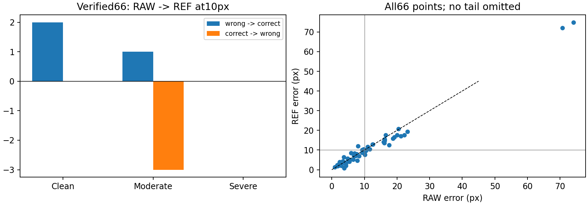
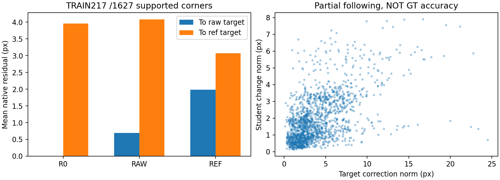

# 검수 가시점 전달 진단 — 학습 전 결과

## 결론

보정 감독은 **부분적으로 전달**됐다. 학습217장의 공통 감독1627코너에서 corrected 타깃 잔차는 RAW4.078px→REF3.070px이다. 보정량이1px 이상인1492점 중 학생 변화의82.64%가 보정 방향과 양의 내적을 가지며, 투영 비율 중앙값은0.319다. 이는 완전 전달도, GT 정확도 증명도 아니다. 마지막 구간 loss 감소와 남은 잔차를 근거로 학습량 한 변수의640update 짝 실험만 잠근다. 원인 확정/필터 개발은 하지 않는다.

## 66점 동률: 진입·이탈과 난도 상쇄

| 모델 | PCK5 | PCK10 | PCK20 | 평균px | 중앙값px | P90px | >20px |
| --- | --- | --- | --- | --- | --- | --- | --- |
| R0 | 21/66 | 44/66 | 60/66 | 10.407 | 7.144 | 18.390 | 6 |
| TEACHER | 30/66 | 50/66 | 63/66 | 9.001 | 5.489 | 13.759 | 3 |
| RAW_LR5 | 22/66 | 43/66 | 60/66 | 10.543 | 7.046 | 19.574 | 6 |
| REF_LR5 | 26/66 | 43/66 | 63/66 | 10.082 | 7.097 | 17.343 | 3 |

| 난도 | 점 | 진입 | 이탈 | 순변화 |
| --- | --- | --- | --- | --- |
| CLEAN | 30 | 2 | 0 | 2 |
| MODERATE_OCCLUSION | 22 | 1 | 3 | -2 |
| SEVERE_OCCLUSION | 14 | 0 | 0 | 0 |

RAW→REF 정답 진입3/이탈3, Clean+2·Moderate−2·Severe0을 원자료로 재확인했다. 연속 오차는34점 개선/32점 악화, 평균 변화−0.461px다. 동일PCK10은 동등성 증명이 아니다. PCK5/20은 설명용이며 주 문턱10px를 바꾸지 않았다. 양 학생 각각 교사만 정답10, 학생만 정답3, 둘 다 정답40, 둘 다 오답13이며 집합이 반드시 같은 것은 아니다. 교사가 평가점에서 맞았다는 것은 그 점으로 학생을 학습했다는 뜻이 아니다.

## 참조와 표본을 분리

| 동일66점 | legacy PCK10 | verified PCK10 | legacy 평균 | verified 평균 |
| --- | --- | --- | --- | --- |
| R0 | 45/66 | 44/66 | 10.443 | 10.407 |
| RAW_LR5 | 45/66 | 43/66 | 10.549 | 10.543 |
| REF_LR5 | 44/66 | 43/66 | 9.992 | 10.082 |

두 참조 좌표 차이 중앙값2.828px, P905.374px. 같은prediction·fixed ID·native 좌표·결측 처리·no-IoU-gate로 계산했다. 참조를 자동 수정하지 않았다. 전체128장과66점은 표본도 다르며 원래 전체 지표에는 매칭/대칭 계약도 있다. JSON의 full128_harmonized_fixedID_no_matching→legacy_same66→groups.ALL을 차례로 비교해야 한다. 전체 격차를 GT 오류 하나로 설명할 수 없다.

## TRAIN 타깃 추종

| 모델 | raw타깃 mean/med | ref타깃 mean/med | ref unique-image mean | ref occurrence mean |
| --- | --- | --- | --- | --- |
| R0 | 0.000/0.000 | 3.963/3.010 | 4.022 | 3.952 |
| RAW_LR5 | 0.693/0.475 | 4.078/3.097 | 4.135 | 4.073 |
| REF_LR5 | 1.987/1.634 | 3.070/2.369 | 3.107 | 3.034 |

실사217 unique/epoch512 occurrence + 합성512 슬롯을 복원했다. 원래100px reflection padding과 저장학습RGB가 bit-exact, label→native roundtrip 오차<1e−5px, raw/ref 박스·support·원래confidence·center 보존을 확인했다. R0 재추론↔raw export 차이 평균<1e−6px이므로 현 추론 계약과 저장raw 좌표가 일치한다. 후보는 최고confidence만 사용했고 타깃에 가까운 후보로 교체하지 않았다. 코너·recording·bbox크기·유효support·반복노출별 집계는 TRAIN_TARGET_TRANSFER.json에 있다. Center는 별도 집계했다.

실사 GT 없는 타깃 추종 진단이다. native 입력만 추론했으며 증강 tensor cache는 없으므로 증강된 모든 입력/학습 tensor의 전수 일치는 주장하지 않는다. CSV pose loss는 혼합real/source·면적/support정규화 값이고 pixel 오차가 아니다. 동일 구현이라도1:1 이미지 노출은 loss 기여량1:1을 뜻하지 않는다. true-ignore는 증강 후 v1에 적용되며 out-of-frame 변환은v0를 만들 수 있다.

## 곡선과 한 개입의 근거

| 학생 | epoch1..5 pose loss | 최종 학습률 |
| --- | --- | --- |
| RAW_LR5 | 0.33651, 0.32798, 0.33831, 0.32862, 0.32190 | 1.85942e-06 |
| REF_LR5 | 0.40641, 0.38346, 0.39042, 0.37385, 0.36602 | 1.85942e-06 |

전체와 마지막 구간에서는 감소하지만 epoch3에서 반등하여 단조 감소가 아니다. 추가 최적화 가설을 시험할 관찰적 근거이지 학습량 부족의 확증이 아니다. 모순된pseudo·증강·혼합replay·동결표현·학습밖 전이가 경쟁 설명이다.

640update를 각 학생R0부터 재실행하며 첫320의 기존cosine5 경로와 E2ELoss의one2many/one2one 경로를 유지한다. 321..640은 실제epoch5 학습률1.859423525e−6을 유지한다. 단순epochs10은 LR뿐 아니라 E2ELoss 스케줄도 바꾸므로 쓰지 않는다. 기존last는optimizer가 제거돼 이어학습으로 가장하지 않는다. 첫320의loss/LR CSV와 저장EMA weight를 기존과 비교하고 불일치 시 중단한다. last-only, 다른loss/필터/선택기/교사 변경0.

## 선행 근거와 적용 한계

[Soft Teacher §3.3](https://arxiv.org/pdf/2106.09018)는 jitter된 상자의 회귀 분산을 위치 pseudo 선별에 쓴다. [Unbiased Teacher v2 §3.3.2](https://arxiv.org/html/2206.09500)는 교사와 학생의 경계별 상대 불확실성으로 회귀 감독을 선택한다. box에서의 결과를 팔레트keypoint 효과로 간주하지 않는다. 이번에는 검증된 위치 calibration이 없고 TRAIN 기반 예산 가설을 선택했으므로 B는 실행하지 않는다. 원래confidence 보존은 corrected 위치 정확도 재측정이 아니며 안정적으로 틀릴 수 있다. 어려운 점을 제거하면 가림 감독도 줄어든다. [scikit-learn 데이터 누출 지침](https://scikit-learn.org/1.5/common_pitfalls.html)에 따라 평가 좌표는 fitting/calibration/threshold 선택에 쓰지 않는다. CVF 직접열기는403/오류여서 동일 저자의arXiv 원문을 확인했다.

## 증거 범위와 종료

66점은16장에 묶인 반복DEV이며독립66표본 검정하지 않는다. recording별 paired/LORO를 JSON에 남겼고 ORDER43/44는초기화seed 반복이 아닌 순서민감도다. LR4와 모든ORDER 결과도 보존하며 유리한 설정으로 주비교를 교체하지 않는다. 기존전체128장/teacher50점/학생43점 표는 각각다른질문이다. 별도독립확인 없음. 추가학습결과와 무관하게보고서·영문원고·재현문서까지닫고방법개발을종료한다.
