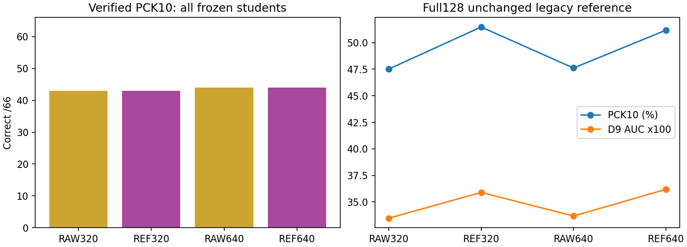
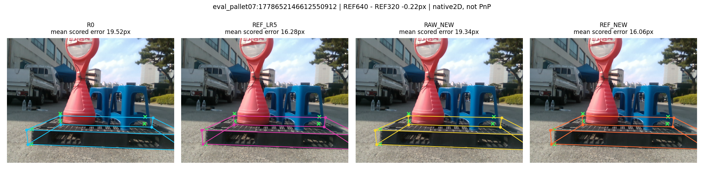
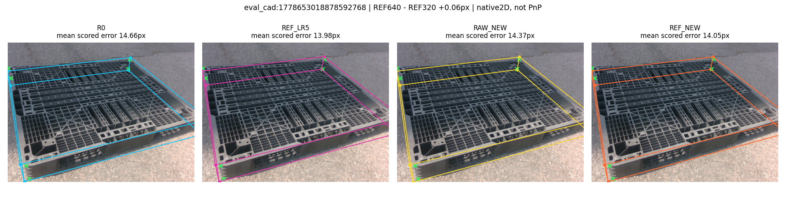
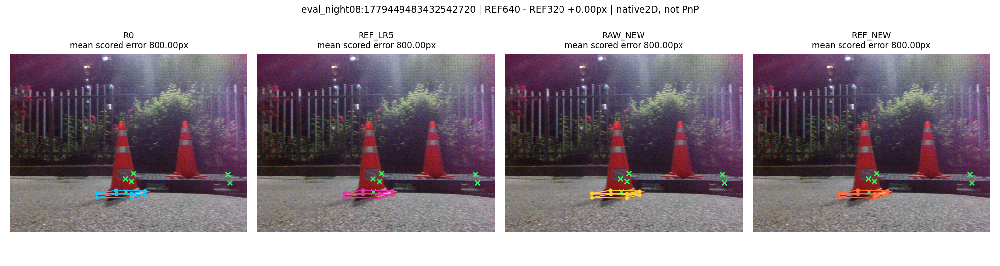

# 제한된 가시점 전달 실험 — 최종 보고

## 최종 판단: 부분 전달은 확인, 학습량 연장만으로 가시점 우위는 확보하지 못함

RAW와 REF 모두 320→640 update에서 검수 PCK10이 43/66→44/66으로 늘었지만 **두 학생의 동률은 유지**됐다. 기존 REF 대비 신규 REF는 정답 진입 1점/이탈 0점이며, 신규 RAW 대비는 진입 2점/이탈 2점이다. 신규 REF의 가시점 평균 오차는 기존보다 0.042px 감소했지만 중앙값은 7.097→7.120px로 소폭 악화됐다. PCK5/20은 26/63개로 그대로다.

REF의 TRAIN corrected-target 평균 잔차는 3.070→2.994px로 0.076px만 줄었다. 128장에서는 기존 REF 대비 PCK10이 507/985→504/985(−0.305pp), matched P90이 42.085→42.160px로 악화됐고, D9 AUC는 0.35902→0.36189로 개선됐다. 반면 같은 640 update의 RAW 대비 REF는 PCK10 +3.553pp, AUC +0.02509로 여전히 우세하다. 보정 타깃의 기존 DEV 추가 가치는 유지되지만, 학습량 연장이 그 효과를 일관되게 키우지는 않았다.

**판정은 혼합이며 기존 320-update 주 비교를 교체하지 않는다.** 이 결과는 추가 320 update로 해당 병목이 해소되지 않았음을 보일 뿐, 모든 학습량 가설을 기각하거나 다른 원인 하나를 증명하지 않는다. 독립 검증은 여전히 없으며, 새 방법 탐색 없이 원고를 닫는다.

## 실행 요약

기존 R0 / RAW_LR5 / REF_LR5와 Replay 9장·38코너를 고정했다. 추가 RGB·수동좌표·교사/선택기 학습은 0이다. TRAIN 근거로 A(학습량)만 골라 RAW_NEW와 REF_NEW 각 640 update, 총 1,280 update 한 쌍을 완료했다. 첫 320의 loss/LR 및 저장 EMA weight는 각기 기존 학생과 bit-exact이며 동결 backbone·검출부·모든 buffer도 보존했다. B 신뢰도 처리·재시도·best epoch 선택은 하지 않았다.

## 1. 왜 기존에는 동률이었나

같은 66점에서 RAW→REF 진입 3점과 이탈 3점이 상쇄됐다. Clean +2·Moderate −2·Severe 0이다. 연속 오차는 34점 개선/32점 악화, 평균 −0.461px여서 완전히 같은 출력은 아니다. 같은 66점의 legacy 참조는 RAW 45/REF 44, verified는 43/43이었다. 따라서 전체 128장의 RAW 468/REF 507 이득이 작은 66점에서 사라진 현상을 참조 오류만으로 설명할 수 없다. 그 subset은 참조 변경 전부터 REF가 우세하지 않았다. legacy↔verified 동일점 차이 중앙값은 2.828px, P90은 5.374px이며 자동 GT 수정은 0회다.

## 2. 학습 타깃 전달은 어느 정도였나

| 학생 | raw타깃 평균px | corrected타깃 평균px |
| --- | --- | --- |
| RAW_LR5 | 0.693 | 4.078 |
| REF_LR5 | 1.987 | 3.070 |
| RAW_NEW | 0.644 | 4.032 |
| REF_NEW | 2.132 | 2.994 |

217장의 1,627 유효 코너에 대한 증강 없는 원영상 좌표 오차다. 이미지 균등·실제 occurrence 가중 및 center 별도 결과는 JSON을 참조한다. 기존 RAW의 corrected 타깃 잔차 4.078px→기존 REF 3.070px, 방향 정렬 82.64%(보정량 ≥1px인 1,492점)로 **전달 0이 아니라 부분 전달**이었다. pseudo는 GT가 아니므로 이 표의 낮은 값은 타깃 모방일 뿐 실사 물리 정확도 증명이 아니다. 남은 잔차와 마지막 loss 감소는 학습량 가설을 시험할 근거지만 원인의 확증은 아니다.

## 3. 검수 66점: 기존 REF 대비와 신규 RAW 대비를 분리

| 모델 | 추가 update | PCK5 | PCK10 | PCK20 | 평균px | 중앙값px | P90px | >20px |
| --- | --- | --- | --- | --- | --- | --- | --- | --- |
| R0 | 0 | 21/66 | 44/66 | 60/66 | 10.407 | 7.144 | 18.390 | 6 |
| RAW_LR5 | 320 | 22/66 | 43/66 | 60/66 | 10.543 | 7.046 | 19.574 | 6 |
| REF_LR5 | 320 | 26/66 | 43/66 | 63/66 | 10.082 | 7.097 | 17.343 | 3 |
| RAW_NEW | 640 | 22/66 | 44/66 | 60/66 | 10.486 | 6.966 | 19.577 | 6 |
| REF_NEW | 640 | 26/66 | 44/66 | 63/66 | 10.040 | 7.120 | 17.005 | 3 |

| 대조 (B-minus-A) | 66점 진입/이탈 | 66점 PCK10 순변화 | 66점 평균오차 변화 | 128장 PCK10 Δpp | 128장 AUC Δ |
| --- | --- | --- | --- | --- | --- |
| REF_LR5-minus-RAW_LR5 | 3/3 | 0 | -0.461 | +3.959 | +0.02429 |
| REF_NEW-minus-RAW_NEW | 2/2 | 0 | -0.446 | +3.553 | +0.02509 |
| REF_NEW-minus-REF_LR5 | 1/0 | 1 | -0.042 | -0.305 | +0.00288 |
| RAW_NEW-minus-RAW_LR5 | 1/0 | 1 | -0.057 | +0.102 | +0.00209 |

PCK10을 주 지표로 유지했다. PCK5/20, 평균/중앙값/P90과 전체 진입·이탈도 함께 공개한다. 자세한 난도/recording/corner·교사/학생 4범주와 recording LORO는 RESULTS.json에 있다. 66점은 16장에 묶여 있고 독립 66표본으로 검정하지 않았다. ORDER43/44를 새 초기화 seed 실험이라 부르지 않는다.

## 4. 전체 128장: 같은 legacy·D9 계약

| 모델 | PCK10 % | ADDsym AUC | matched P90px | R med° | t med cm | 검출/pose |
| --- | --- | --- | --- | --- | --- | --- |
| R0 | 49.14 | 0.33796 | 40.902 | 3.530 | 9.353 | 128/128 |
| RAW_LR5 | 47.51 | 0.33472 | 41.958 | 3.942 | 9.226 | 128/128 |
| REF_LR5 | 51.47 | 0.35902 | 42.085 | 3.766 | 9.186 | 128/128 |
| RAW_NEW | 47.61 | 0.33681 | 41.917 | 3.907 | 9.188 | 128/128 |
| REF_NEW | 51.17 | 0.36189 | 42.160 | 3.759 | 9.002 | 128/128 |

분모는 985 supported corners, matched 120장/931점, 검출 128장이다. D9는 corner0..7으로 풀고 기존 center 포함 selector residual을 그대로 쓴다. GT 박스 매칭·oracle 후보·GEO 교체·난도별 모델 선택은 추론에 없다. 6D는 geometry-derived reference이며 독립 측정 GT가 아니다. 전체 난도/recording·회전/yaw/이동/IoU3D/axis는 RESULTS.json에 모두 있다.

## 5. 실제 이미지: 개선·악화·작은 변화

이전 보고서에서 이미 공개한 13개 예시 ID 안에서 동일 규칙(min/max/min-absolute 평균 오차 변화)으로 선정했다. 새로운 RGB 공개 범위를 넓히지 않았다. 전체 성능은 모든 128장/66점으로 계산하며 이 그림 선정은 수치에 영향이 없다. Green=legacy reference, 선=native 2D 예측이며 PnP 재투영이 아니다. 점수 동률은 동일 좌표를 의미하지 않는다.

### most_improved: -0.220px

### most_worsened: +0.063px

### least_changed: +0.000px

## 6. 합성보류셋과측정범위

원래framework synthetic val32를같은모델들로평가했으며 reliability calibration/새test로바꾸지않았다.

| 모델 | Box AP50–95 | Pose AP50–95 |
| --- | --- | --- |
| R0 | 0.94486 | 0.98863 |
| RAW_LR5 | 0.94486 | 0.98863 |
| REF_LR5 | 0.94486 | 0.98863 |
| RAW_NEW | 0.94486 | 0.98863 |
| REF_NEW | 0.94486 | 0.98863 |

## 7. 해석·한계·종료

새 update 규칙의 효과(기존 REF→신규 REF)와 보정 좌표의 추가 효과(신규 RAW→신규 REF)를 구별했다. 하나의 문턱에서 한 점 늘거나 보조 지표가 하락했다고 전체 성공/실패로 자동 결론 내리지 않는다. 기존 주 표·LR4/order 민감도·teacher 50/66·학생 43/66 표를 지우지 않고 사후 보완 실험으로 추가했다.

독립 확인 감사 결과를 재사용하며 현재 66/128은 REUSED_DEV_ONLY다. 예측→D9→hash lock→scoring 순서를 지켰지만 이미 본 DEV가 독립 TEST로 바뀌지 않는다. 기존 수동 감독 9장/38점은 teacher에, 66점은 평가에만 있다. 학생 학습 217장의 진짜 pseudo 정확도·숨은 점·새 재료/세션 일반화·물리 6D 정확도는 확인되지 않았다. 학습량·증강·source 혼합·표현·모순 타깃 중 단일 원인 확정은 불가다.

**방법 개발 STOP. 추가 모듈/레이블/조건 탐색 없음. 사용자 추가 작업 없음.** 영문 원고 사후 진단절, 재현 문서, 빌드/검수까지 마무리한다. 기존 8페이지 release는 9238735 Git 이력으로 보존된다.

## 전체 66점 공개 및 주요 손상

PAIRED_66_NEW_ROWS.json에는 모든 66점의 오류와 결측 여부를 같은 규칙으로 공개했다(정답/예측 좌표는 비공개). 아래는 기존 REF→신규 REF 연속 오차 증가 상위 3점이며, 사후 설명용이다. 이 점들만 평가하거나 제거하지 않았다.

| 이미지 | 코너 | 기존 REF px | 신규 REF px | 증가 px |
| --- | --- | --- | --- | --- |
| eval_outside:1778651650839160832 | 1 | 72.062 | 72.328 | +0.265 |
| eval_pallet09:1778653661653195264 | 7 | 6.413 | 6.663 | +0.250 |
| eval_cad:1778653006783606016 | 1 | 12.869 | 13.105 | +0.236 |
