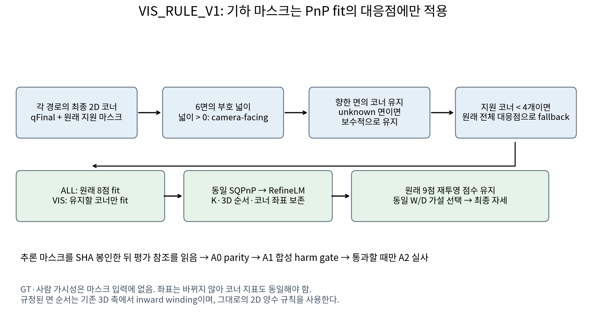

# VIS_RULE_V1과 square 참조 게이트

[확인] 새 기능은 코너를 옮기는 보정기가 아니라, 각 경로의 최종 2D 코너로 면의 방향을 계산하여 PnP fit에 쓰는 대응점만 줄이는 추론 후단이다. 원래 BASE, N3_DIM_SYM, SUBPIX, N3_THEN_SUBPIX의 좌표·중심 8·지원 정보·선택 검출·box·score·confidence·K·등록 치수는 유지한다. [visibility.py](../../../scripts/research/pallet_vispnp_square6d_20261011/visibility.py)와 [adapter.py](../../../scripts/research/pallet_vispnp_square6d_20261011/adapter.py).



## 기하 마스크

[확인] x는 오른쪽, y는 아래인 원영상 pixel 좌표다. 기존 cuboid 인덱스는 0 좌상, 1 우상, 2 우하, 3 좌하, 4~7은 대응하는 뒤쪽 꼭짓점이며 8은 중심이다. 실제 F의 [기존 3D 정의](../../../scripts/paper/pose_metric_closure_v1/run_pose_evaluation.py#L38)는 X 오른쪽, Y 아래, Z 앞 방향을 사용한다.

```text
front (0,1,2,3)    back (4,7,6,5)
top (0,4,5,1)      bottom (3,2,6,7)
left (0,3,7,4)     right (1,5,6,2)
area = Σ(x_i*y_next - x_next*y_i)/2
facing = area > 0
visible(k) = any(incident face is facing or unknown)
retained = visible & original_usable
effective = original_usable if count(retained)<4 else retained
```

[확인] 규정된 면 순서는 기존 3D 축에서 inward winding이다. 첨부의 “외향 법선 기준” 설명과는 다르지만, 사전 지정된 2D 양수 규칙을 그대로 보존했으며 A0의 수치 parity를 검산했다. unknown 면은 하나라도 비지원·결측·비유한·[-1,-1] 코너를 포함한 경우다. incident unknown이 있으면 해당 코너는 보수적으로 보임으로 둔다. 넓이가 정확히 0이면 facing이 아니다. 새 threshold를 고르지 않았다. [A0.json](A0.json), [METHOD_LOCK.json](METHOD_LOCK.json).

[확인] 실제 지원 코너가 4개보다 적게 남으면 원래 전체 대응점으로 fallback한다. 이 상태는 후단 no_pose와 별개다. 마스크 생성에는 참조 자세, GT 코너, 사람 visibility를 사용하지 않는다. 사람 상태와의 교차표는 추론 입력이 아닌 A0 사후 진단이다.

## 동일 F에서 바뀌는 부분

[확인] `adapter.correspondence_mask(q9,K,mask8)`는 각 기존 F 호출 동안 `cv2.solvePnP` 및 `solvePnPRefineLM`에 전달되는 canonical 대응점만 같은 인덱스로 필터링한다. K, 원래 8점의 순서·값과 3D 좌표를 확인한다. `projectPoints`는 그대로 유지하므로 가설 점수는 **원래 9점 전체**로 계산한다. 따라서 제외한 코너도 기존 가설 선택 점수에는 남는다. fit과 selector의 적용 범위를 구분한다.

[확인] ALL 마스크는 OpenCV 인자를 그대로 전달한다. selector는 원래 q9를 받고 기존 W/D 후보, SQPnP, RefineLM, proper 대칭 오차를 유지한다. 미지원 코너나 잘못된 shape에서 adapter 계약이 성립하지 않으면 조용히 no_pose로 바꾸지 않고 중단한다. [adapter.py](../../../scripts/research/pallet_vispnp_square6d_20261011/adapter.py), [UNIT_CHECKS.json](UNIT_CHECKS.json).

[확인] 3D API의 치수 순서는 [W,H,D], 등록 문맥은 [W,D,H]다. 기존 cornerSubPix의 win=(5,5), zeroZone=(-1,-1), EPS|COUNT 40 및 0.001, 원래 Base 중심의 최종 대각선 1% cap을 보존한다. 이미 저장된 실사 네 경로는 좌표를 그대로 재사용한다. 새 VIS 코너 지표는 기존 ALL과 정확히 같아야 한다.

## 사전등록 주지표와 gate

[확인] 기존 [scripts/self_training/metrics.py:134-143](../../../scripts/self_training/metrics.py#L134)는 `T=100*||t_gt-t_pred||₂` cm, `R_single=degrees(acos(clip((trace(R_gt R_predᵀ)-1)/2,-1,1)))`를 계산해 strict `T<5 cm and R_single<5°`로 성공을 판정한다. 이번에는 동일한 T와, 고정 물리 축으로 변환한 회전에서 proper 대칭 그룹 G의 `R_sym=min_Q∈G degrees(acos(clip((trace((R_gt Q)ᵀ R_pred)-1)/2,-1,1)))`를 사용하여 strict `T<5 cm and R_sym<5°`로 판정한다. [현재 회전·위치 오차](../../../scripts/research/pallet_dim_conditioned_p_v1/pose.py#L39), [현재 성공 판정](../../../scripts/research/pallet_vispnp_square6d_20261011/verdict.py#L26). 따라서 두 코드의 ‘5 cm·5° 성공률’은 회전 정의가 달라 같은 지표로 합치지 않는다. 이번 실사 ALL/VIS는 둘 다 동일한 R_sym을 사용하므로 짝 비교의 정의는 일치한다.

[확인] 주비교는 N3_THEN_SUBPIX_VIS−N3_THEN_SUBPIX다. 혼동은 `rotation_deg>45 and abs(yaw_deg)>=60`, 성공은 `translation_cm<5 and rotation_deg<5`다. 등호 경계를 바꾸지 않는다. 각 seed에서 이진 판정을 먼저 하고 같은 ID의 세 판정을 평균한다. 평균 오차에 threshold를 적용하지 않는다.

[확인] SUPPORTED는 주지표 하나 이상의 개선 CI가 0을 제외하고, 다른 주지표에 유의한 악화가 없으며, 해당 개선 방향이 2개 이상의 seed에서 같을 때다. 혼동 CI 하한>0 또는 성공 CI 상한<0이면 WORSENED다. 나머지는 UNRESOLVED다. 주비교에 미산출 자세가 하나라도 있으면 NOT_ESTIMABLE로 결론을 유보한다. 전체 분모의 기술적 이진 비율에서는 미산출을 false로 기록하되, 그것을 개선 증거로 쓰지 않는다. [verdict.py](../../../scripts/research/pallet_vispnp_square6d_20261011/verdict.py).

[확인] A1의 고정 frame bootstrap에서 WORSENED/NOT_ESTIMABLE이면 A2 실사를 실행하지 않는다. A1의 scenario cluster CI는 별도 보조 진단이다. A2는 원래 13세션 paired cluster bootstrap 10,000회, seed 20260917을 사용한다. 다중비교 보정은 하지 않는다. 결과를 보고 지표, threshold, 주경로, seed, 사례 규칙을 바꾸지 않는다.

[확인] 원 실행의 A0는 실제 ALL F 1,276회와 정확한 parity를 확인했지만, 새 A0 코드의 실행 직전 SHA는 당시 기록하지 못했다. A1/A2의 핵심 9개 소스는 새 VIS 결과가 나오기 전에 SHA를 봉인하고 불변성을 검사했다. 이후 preflight에 추가한 pre-A0 SHA 기록은 향후 재현의 provenance 보완이며 원 A0의 누락을 소급해서 채우지 않는다. [SOURCE_LOCK.json](SOURCE_LOCK.json), [A0.json](A0.json), [독립 검산](VERIFICATION.json).

## B: 같은 참조 절차라는 전제의 불일치

[확인] B1의 화면 내 직접 수동 코너≥4 규칙은 구현했지만, 현재 직사각형 참조 생성기는 finite 코너≥6과 전체 `keypoint_annotations.xy`를 사용한다. source를 직접 수동점으로 필터링하지 않고 두 W/D 가설을 SQPnP→RefineLM으로 풀어 평균 재투영 잔차가 작은 것을 고른다. 기존 5 px 품질바는 검토용이며 자동 제외하지 않는다. 생성기 자체에는 LOO/robust-z가 없다. [SQUARE_INPUT_AUDIT.json](SQUARE_INPUT_AUDIT.json)의 source SHA와 행 번호를 근거로 한다.

[확인] 별도 legacy `qa_risk.py`는 non-sentinel projected_cuboid로 PnP를 풀며 4·5점에서는 ITERATIVE, 6점 이상에서는 SQPnP를 사용한다. LOO의 남은 점<4이면 NaN이다. 최대 LOO 및 중앙 재투영 잔차를 bbox diagonal로 정규화하고 1.4826×MAD(MAD=0이면 nanstd)로 robust-z를 계산한다. hard flag 또는 z>5는 RED, z>3은 AMBER다. 별도 `audit_gt_data.py`의 저장 pose 비교 QA와 섞지 않는다.

[확인] 따라서 직접 수동점만으로 B1 적격 118장 모두를 “같은 참조 생성+동일 LOO QA”로 완료할 수 없다. 새 절차·threshold·예외를 정하거나 PnP 파생점으로 부족분을 채우지 않았다. `SQUARE_REFERENCE_POSES.json`은 차단 상태와 빈 `frames`를 기록하며 실제 참조 자세 파일로 해석하면 안 된다. B4 검수 sheet나 사용자 축 승인 요청에 도달하지 않았고 승인 전 B5 평가도 실행하지 않았다.
