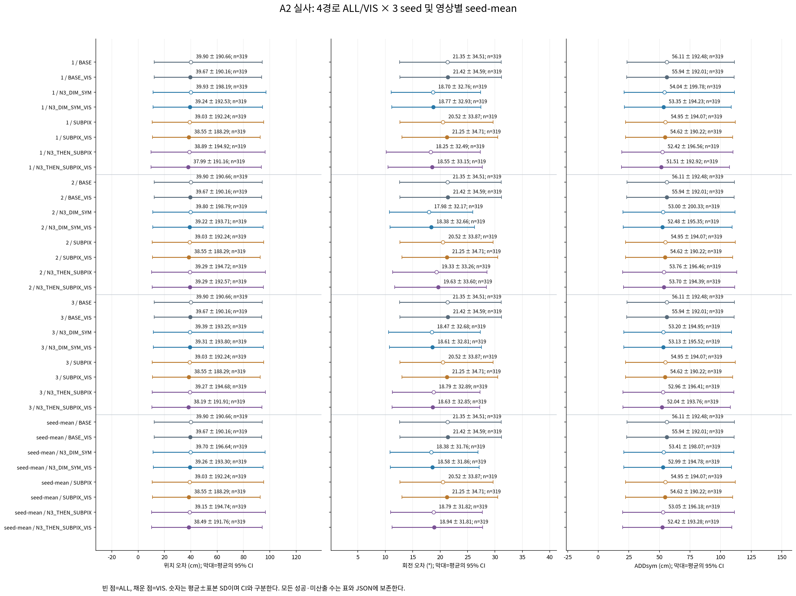
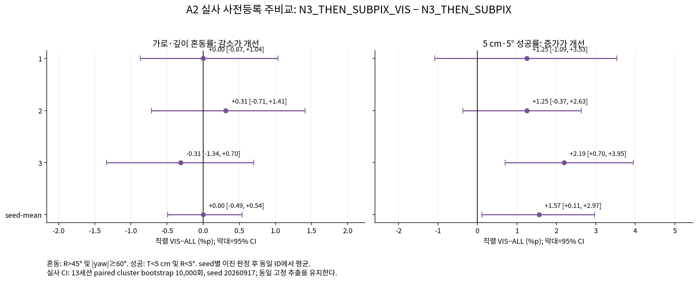
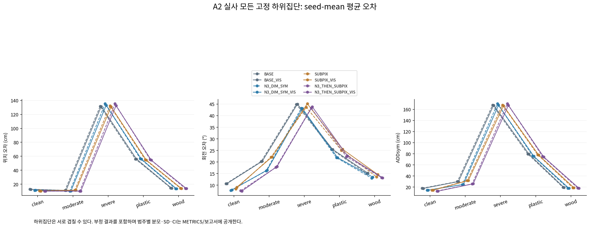
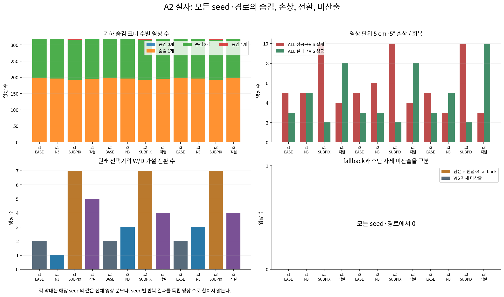
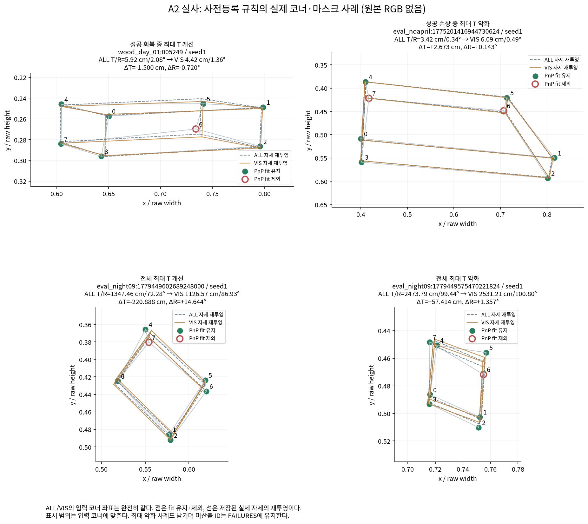
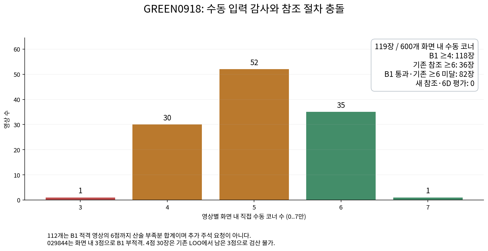

[확인] A=SUPPORTED (A2 실사); B=BLOCKED_REFERENCE_PROCEDURE_CONFLICT. 사전등록 판정과 참조 절차 불일치를 기록했다.

[확인] **SUPPORTED는 실사 주경로의 5 cm·5° 성공률 증가에 한정한다.** 46.8130%→48.3804%, Δ1.5674 %p [0.1142, 2.9690]이며 세 seed 모두 같은 개선 방향이다. 혼동률 Δ0.0000 %p [-0.4931, 0.5420]는 미해결이다.
[확인] T 평균은 39.1523→38.4898 cm로 감소했지만 R 평균 18.7916→18.9385°, T 중앙값 5.1462→5.3366 cm, T P90 36.6086→39.4525 cm는 악화했다. 큰 실패를 모두 포함한 결과이며 전반적인 6D 정확도 개선으로 확대하지 않는다.
[확인] 선행 합성에서는 직렬 성공률 48.0101%→47.5399%로 세 seed 모두 감소했다(Δ-0.4702 %p, CI [-1.2091, 0.2519]). 합성 판정 UNRESOLVED는 안전성 또는 동등성을 확증한 결과가 아니다.

# 기하 자기가림 코너를 제외한 PnP와 GREEN0918 참조 감사

[확인] 주비교 직렬 VIS−ALL의 혼동률 차이는 0.0000 %p [-0.4931, 0.5420], 5 cm·5° 성공률 차이는 1.5674 %p [0.1142, 2.9690]다. 상세 판정은 [VERDICT.json](VERDICT.json)에 있다.

[확인] 폴더 이름의 20261011은 요청된 실험 namespace다. 실제 실행 client date는 METHOD_LOCK.json에 기록된 2026-10-10이며 날짜를 소급해서 표시하지 않는다. 새 학습·새 합성 RGB·새 촬영·새 수동 주석은 모두 0이다. 기존 실험 폴더와 원고·LaTeX·PDF는 보존했다.

## A0: 전제와 실제 parity

| 검사 | 실제 결과 | 근거 |
| --- | --- | --- |
| 319장×네 경로 seed1 ALL F 재실행 | 1276 | A0.json |
| 자세 지표 최대 절대차 | 0.0 | 허용≤1e−7 |
| 모든 R/t 및 코너 필드 | True | 기존 원행과 대조 |
| N3 seed1 front facing | 319 | 319/319 |
| N3 숨김 1개/2개 | {"1": 196, "2": 123} | 첨부 사후 진단과 정확 일치 |
| BASE 숨김 1개/2개 | {"1": 197, "2": 122} | 첨부 사후 진단과 정확 일치 |

[확인] 사람 visibility와의 교차표는 마스크를 먼저 SHA 봉인한 뒤 읽었다. 원래 코드의 3D 면 winding은 첨부의 외향 설명과 달랐으므로 규정된 2D 넓이 양수 규칙을 그대로 적용하고 수치 parity로 확인했다. [A0.json](A0.json), [COORDINATES_SEAL.json](COORDINATES_SEAL.json), [METHOD_LOCK.json](METHOD_LOCK.json).

[확인] 기존 [scripts/self_training/metrics.py:134-143](../../../scripts/self_training/metrics.py#L134)는 `T=100*||t_gt-t_pred||₂` cm, `R_single=degrees(acos(clip((trace(R_gt R_predᵀ)-1)/2,-1,1)))`를 계산해 strict `T<5 cm and R_single<5°`로 성공을 판정한다. 이번에는 동일한 T와, 고정 물리 축으로 변환한 회전에서 proper 대칭 그룹 G의 `R_sym=min_Q∈G degrees(acos(clip((trace((R_gt Q)ᵀ R_pred)-1)/2,-1,1)))`를 사용하여 strict `T<5 cm and R_sym<5°`로 판정한다. [현재 회전·위치 오차](../../../scripts/research/pallet_dim_conditioned_p_v1/pose.py#L39), [현재 성공 판정](../../../scripts/research/pallet_vispnp_square6d_20261011/verdict.py#L26). 따라서 두 코드의 ‘5 cm·5° 성공률’은 회전 정의가 달라 같은 지표로 합치지 않는다. 이번 실사 ALL/VIS는 둘 다 동일한 R_sym을 사용하므로 짝 비교의 정의는 일치한다.

| 경로 | 상태 | 숨김 | 보임 |
| --- | --- | --- | --- |
| N3_DIM_SYM | DIRECT_VISIBLE | 26 | 1750 |
| N3_DIM_SYM | SELF_OCCLUDED | 411 | 51 |
| N3_DIM_SYM | EXTERNAL_OCCLUDED | 3 | 215 |
| N3_DIM_SYM | OUT_OF_FRAME | 2 | 41 |
| BASE | DIRECT_VISIBLE | 27 | 1749 |
| BASE | SELF_OCCLUDED | 408 | 54 |
| BASE | EXTERNAL_OCCLUDED | 4 | 214 |
| BASE | OUT_OF_FRAME | 2 | 41 |

## 실행 gate와 분모

[확인] 합성 gate를 통과한 뒤 실사 A2를 한 번 실행했다. ALL은 고정된 기존 3,828행, VIS는 같은 319장·네 경로·세 seed의 새 F 결과다. 원래 13세션, clean 153/moderate 92/severe 74 및 plastic 194/wood 125를 유지했다. 실사는 반복 개발 DEV이며 독립 확증 holdout이 아니다.

[확인] 이번 정확도 표의 모집단은 REAL_DEV319, 원래 영상 319장, 고정 seed 1·2·3이다. 각 seed의 이진 결과를 ID별로 평균하므로 3배 영상 수를 독립 분모로 취급하지 않는다. 미산출 자세의 T/R/ADD/IoU 통계는 available-only로 n을 명시한다. 주지표의 전체 분모 기술 비율에서는 미산출 false를 기록하지만 주비교에 미산출이 있으면 NOT_ESTIMABLE로 중단한다.

[확인] SD는 표본 오차 산포(ddof=1)이며 평균의 95% CI, 표준오차, seed 간 산포와 구분한다. 큰 유한 오차나 나쁜 영상, seed, 그룹을 제외하거나 clipping/winsorization하지 않았다. 두 경로의 코너 지표는 그대로 같으며 변화는 pose fit에서 발생한다.

### A1 합성 gate의 실제 선행 결과

[확인] SYNTH_HELDOUT 1,985장·1,505 scenario에서 ALL/VIS 각각 23,820행을 실제 평가했다. G38 1,025장, P0 480장, TEX 480장과 C1/C2를 고정했다. A1 판정은 **UNRESOLVED**이며 독립 확증이 아니라 harm gate의 미해결 결과로 A2 진입을 허용했다. 합성 frame primary와 scenario 보조 CI를 구분한다.

| 경로 | ALL 혼동/성공률 % | VIS 혼동/성공률 % | Δ혼동 %p [CI] | Δ성공 %p [CI] |
| --- | --- | --- | --- | --- |
| BASE | 18.9421 / 59.6977 | 19.1436 / 59.6977 | 0.2015 [-0.0504, 0.5038] | 0.0000 [-0.6549, 0.6549] |
| N3_DIM_SYM | 19.2107 / 60.7557 | 19.2611 / 60.6045 | 0.0504 [-0.1175, 0.2351] | -0.1511 [-0.6045, 0.3191] |
| SUBPIX | 20.7557 / 51.5869 | 20.7557 / 50.3275 | 0.0000 [-0.4030, 0.4030] | -1.2594 [-2.1662, -0.3526] |
| N3_THEN_SUBPIX | 20.8564 / 48.0101 | 20.7893 / 47.5399 | -0.0672 [-0.4198, 0.2687] | -0.4702 [-1.2091, 0.2519] |

| 주비교 seed | Δ혼동 %p [frame CI] | Δ성공 %p [frame CI] |
| --- | --- | --- |
| 1 | -0.3023 [-0.7557, 0.1511] | -0.1008 [-0.9572, 0.7557] |
| 2 | 0.1511 [-0.3023, 0.6045] | -0.5038 [-1.4106, 0.4030] |
| 3 | -0.0504 [-0.4534, 0.3526] | -0.8060 [-1.7128, 0.0504] |

| seed-mean 主지표 | scenario cluster 보조 Δ%p [CI] |
| --- | --- |
| confusion_rate | -0.0672 [-0.4188, 0.2710] |
| success_rate | -0.4702 [-1.1928, 0.2537] |

[확인] 합성의 모든 seed·경로·고정 하위집단 통계, 실패 ID와 gate는 [SYNTH_METRICS.json](SYNTH_METRICS.json), [SYNTH_PAIRED.json](SYNTH_PAIRED.json), [SYNTH_FAILURES.json](SYNTH_FAILURES.json), [SYNTH_VERDICT.json](SYNTH_VERDICT.json)에 그대로 보존한다. 실사 수치와 합산하지 않는다.

## 모든 경로·seed의 정확도

| seed | 경로 | 자세 산출/전체 | 미산출 | T cm 평균±SD [CI] | R ° 평균±SD [CI] | ADDsym cm 평균±SD [CI] | IoU3D 평균±SD [CI] |
| --- | --- | --- | --- | --- | --- | --- | --- |
| 1 | BASE | 319/319 | 0 | 39.8968 ± 190.6607 [12.2361, 94.2096] | 21.3519 ± 34.5092 [12.6152, 31.1584] | 56.1092 ± 192.4846 [23.4583, 111.2848] | 0.5487 ± 0.2571 [0.4926, 0.6255] |
| 1 | BASE_VIS | 319/319 | 0 | 39.6714 ± 190.1570 [12.1758, 93.8960] | 21.4221 ± 34.5865 [12.6627, 31.1895] | 55.9384 ± 192.0057 [23.3066, 111.0298] | 0.5503 ± 0.2587 [0.4928, 0.6301] |
| 1 | N3_DIM_SYM | 319/319 | 0 | 39.9262 ± 198.1943 [11.2822, 97.1476] | 18.6999 ± 32.7560 [11.0872, 27.3673] | 54.0371 ± 199.7755 [21.2193, 111.2139] | 0.5761 ± 0.2553 [0.5186, 0.6514] |
| 1 | N3_DIM_SYM_VIS | 319/319 | 0 | 39.2418 ± 192.5252 [11.3875, 94.4598] | 18.7651 ± 32.9285 [11.1556, 27.4527] | 53.3548 ± 194.2260 [21.3846, 108.7698] | 0.5739 ± 0.2568 [0.5156, 0.6520] |
| 1 | SUBPIX | 319/319 | 0 | 39.0311 ± 192.2443 [10.7307, 95.3866] | 20.5231 ± 33.8700 [12.6886, 29.6811] | 54.9500 ± 194.0732 [22.2249, 112.0449] | 0.5780 ± 0.2614 [0.5105, 0.6521] |
| 1 | SUBPIX_VIS | 319/319 | 0 | 38.5464 ± 188.2887 [10.8871, 92.6401] | 21.2493 ± 34.7143 [13.0444, 30.5024] | 54.6174 ± 190.2176 [22.3917, 109.9014] | 0.5761 ± 0.2714 [0.5018, 0.6557] |
| 1 | N3_THEN_SUBPIX | 319/319 | 0 | 38.8950 ± 194.9175 [9.8879, 96.4935] | 18.2523 ± 32.4933 [10.1771, 27.3344] | 52.4234 ± 196.5581 [19.2348, 110.0390] | 0.6100 ± 0.2626 [0.5379, 0.6894] |
| 1 | N3_THEN_SUBPIX_VIS | 319/319 | 0 | 37.9877 ± 191.1588 [9.7832, 93.6884] | 18.5545 ± 33.1505 [10.5108, 27.6817] | 51.5127 ± 192.9175 [19.0302, 107.3964] | 0.6086 ± 0.2669 [0.5329, 0.6900] |
| 2 | BASE | 319/319 | 0 | 39.8968 ± 190.6607 [12.2361, 94.2096] | 21.3519 ± 34.5092 [12.6152, 31.1584] | 56.1092 ± 192.4846 [23.4583, 111.2848] | 0.5487 ± 0.2571 [0.4926, 0.6255] |
| 2 | BASE_VIS | 319/319 | 0 | 39.6714 ± 190.1570 [12.1758, 93.8960] | 21.4221 ± 34.5865 [12.6627, 31.1895] | 55.9384 ± 192.0057 [23.3066, 111.0298] | 0.5503 ± 0.2587 [0.4928, 0.6301] |
| 2 | N3_DIM_SYM | 319/319 | 0 | 39.7969 ± 198.7949 [11.0184, 97.3053] | 17.9758 ± 32.1657 [10.7570, 25.9377] | 52.9993 ± 200.3260 [20.1910, 111.7561] | 0.5804 ± 0.2562 [0.5200, 0.6586] |
| 2 | N3_DIM_SYM_VIS | 319/319 | 0 | 39.2192 ± 193.7058 [11.1616, 94.8657] | 18.3770 ± 32.6576 [10.8494, 26.2799] | 52.4828 ± 195.3508 [20.4452, 109.3068] | 0.5771 ± 0.2579 [0.5157, 0.6583] |
| 2 | SUBPIX | 319/319 | 0 | 39.0311 ± 192.2443 [10.7307, 95.3866] | 20.5231 ± 33.8700 [12.6886, 29.6811] | 54.9500 ± 194.0732 [22.2249, 112.0449] | 0.5780 ± 0.2614 [0.5105, 0.6521] |
| 2 | SUBPIX_VIS | 319/319 | 0 | 38.5464 ± 188.2887 [10.8871, 92.6401] | 21.2493 ± 34.7143 [13.0444, 30.5024] | 54.6174 ± 190.2176 [22.3917, 109.9014] | 0.5761 ± 0.2714 [0.5018, 0.6557] |
| 2 | N3_THEN_SUBPIX | 319/319 | 0 | 39.2912 ± 194.7188 [10.3061, 96.6287] | 19.3323 ± 33.2569 [11.3587, 28.5293] | 53.7639 ± 196.4647 [20.0617, 113.1684] | 0.6012 ± 0.2665 [0.5254, 0.6836] |
| 2 | N3_THEN_SUBPIX_VIS | 319/319 | 0 | 39.2883 ± 192.5656 [10.5537, 95.2105] | 19.6333 ± 33.6036 [11.6840, 28.4217] | 53.6966 ± 194.3929 [20.5998, 111.6493] | 0.6004 ± 0.2715 [0.5234, 0.6848] |
| 3 | BASE | 319/319 | 0 | 39.8968 ± 190.6607 [12.2361, 94.2096] | 21.3519 ± 34.5092 [12.6152, 31.1584] | 56.1092 ± 192.4846 [23.4583, 111.2848] | 0.5487 ± 0.2571 [0.4926, 0.6255] |
| 3 | BASE_VIS | 319/319 | 0 | 39.6714 ± 190.1570 [12.1758, 93.8960] | 21.4221 ± 34.5865 [12.6627, 31.1895] | 55.9384 ± 192.0057 [23.3066, 111.0298] | 0.5503 ± 0.2587 [0.4928, 0.6301] |
| 3 | N3_DIM_SYM | 319/319 | 0 | 39.3877 ± 193.2513 [11.6263, 94.8935] | 18.4739 ± 32.6814 [10.6132, 27.3400] | 53.2005 ± 194.9543 [20.8980, 109.0182] | 0.5727 ± 0.2537 [0.5171, 0.6452] |
| 3 | N3_DIM_SYM_VIS | 319/319 | 0 | 39.3149 ± 193.7993 [11.5946, 95.1970] | 18.6117 ± 32.8118 [10.7676, 27.5665] | 53.1341 ± 195.5167 [20.8911, 109.2282] | 0.5705 ± 0.2539 [0.5137, 0.6457] |
| 3 | SUBPIX | 319/319 | 0 | 39.0311 ± 192.2443 [10.7307, 95.3866] | 20.5231 ± 33.8700 [12.6886, 29.6811] | 54.9500 ± 194.0732 [22.2249, 112.0449] | 0.5780 ± 0.2614 [0.5105, 0.6521] |
| 3 | SUBPIX_VIS | 319/319 | 0 | 38.5464 ± 188.2887 [10.8871, 92.6401] | 21.2493 ± 34.7143 [13.0444, 30.5024] | 54.6174 ± 190.2176 [22.3917, 109.9014] | 0.5761 ± 0.2714 [0.5018, 0.6557] |
| 3 | N3_THEN_SUBPIX | 319/319 | 0 | 39.2706 ± 194.6811 [10.5626, 96.6733] | 18.7901 ± 32.8896 [11.3063, 27.2906] | 52.9640 ± 196.4050 [20.2648, 110.8485] | 0.6045 ± 0.2670 [0.5347, 0.6799] |
| 3 | N3_THEN_SUBPIX_VIS | 319/319 | 0 | 38.1933 ± 191.9051 [10.3496, 94.1229] | 18.6276 ± 32.8497 [11.2359, 27.2223] | 52.0362 ± 193.7608 [20.0939, 108.1062] | 0.6074 ± 0.2669 [0.5379, 0.6821] |
| seed-mean | BASE | 319/319 | 0 | 39.8968 ± 190.6607 [12.2361, 94.2096] | 21.3519 ± 34.5092 [12.6152, 31.1584] | 56.1092 ± 192.4846 [23.4583, 111.2848] | 0.5487 ± 0.2571 [0.4926, 0.6255] |
| seed-mean | BASE_VIS | 319/319 | 0 | 39.6714 ± 190.1570 [12.1758, 93.8960] | 21.4221 ± 34.5865 [12.6627, 31.1895] | 55.9384 ± 192.0057 [23.3066, 111.0298] | 0.5503 ± 0.2587 [0.4928, 0.6301] |
| seed-mean | N3_DIM_SYM | 319/319 | 0 | 39.7036 ± 196.6436 [11.3250, 96.4479] | 18.3832 ± 31.7577 [10.8579, 26.8914] | 53.4123 ± 198.0667 [20.7950, 110.7426] | 0.5764 ± 0.2531 [0.5181, 0.6515] |
| seed-mean | N3_DIM_SYM_VIS | 319/319 | 0 | 39.2586 ± 193.2996 [11.4398, 94.8303] | 18.5846 ± 31.8602 [10.9317, 27.1061] | 52.9906 ± 194.7809 [20.9145, 109.0156] | 0.5738 ± 0.2536 [0.5154, 0.6515] |
| seed-mean | SUBPIX | 319/319 | 0 | 39.0311 ± 192.2443 [10.7307, 95.3866] | 20.5231 ± 33.8700 [12.6886, 29.6811] | 54.9500 ± 194.0732 [22.2249, 112.0449] | 0.5780 ± 0.2614 [0.5105, 0.6521] |
| seed-mean | SUBPIX_VIS | 319/319 | 0 | 38.5464 ± 188.2887 [10.8871, 92.6401] | 21.2493 ± 34.7143 [13.0444, 30.5024] | 54.6174 ± 190.2176 [22.3917, 109.9014] | 0.5761 ± 0.2714 [0.5018, 0.6557] |
| seed-mean | N3_THEN_SUBPIX | 319/319 | 0 | 39.1523 ± 194.7440 [10.2627, 96.6131] | 18.7916 ± 31.8166 [10.9912, 27.6953] | 53.0505 ± 196.1767 [19.8839, 111.4275] | 0.6053 ± 0.2610 [0.5328, 0.6838] |
| seed-mean | N3_THEN_SUBPIX_VIS | 319/319 | 0 | 38.4898 ± 191.7610 [10.2202, 94.2934] | 18.9385 ± 31.8119 [11.2095, 27.7424] | 52.4152 ± 193.2800 [19.9668, 109.1677] | 0.6055 ± 0.2627 [0.5320, 0.6854] |

| seed | 경로 | 혼동률 % [CI] | 5 cm·5° 성공률 % [CI] | 분모 |
| --- | --- | --- | --- | --- |
| 1 | BASE | 21.6301 [11.5789, 32.5466] | 33.2288 [19.7410, 51.2608] | 319 |
| 1 | BASE_VIS | 21.6301 [11.5789, 32.5466] | 32.6019 [18.7495, 50.5496] | 319 |
| 1 | N3_DIM_SYM | 18.4953 [10.0000, 28.1690] | 36.6771 [22.3170, 55.6716] | 319 |
| 1 | N3_DIM_SYM_VIS | 18.4953 [10.0000, 28.1690] | 36.6771 [22.3349, 55.2197] | 319 |
| 1 | SUBPIX | 20.3762 [11.8768, 30.4474] | 43.8871 [30.3277, 59.6208] | 319 |
| 1 | SUBPIX_VIS | 21.3166 [12.4030, 31.3219] | 41.3793 [27.5947, 56.8182] | 319 |
| 1 | N3_THEN_SUBPIX | 17.8683 [8.9743, 27.9505] | 48.2759 [34.2205, 64.2863] | 319 |
| 1 | N3_THEN_SUBPIX_VIS | 17.8683 [9.1482, 27.9014] | 49.5298 [35.3303, 65.3849] | 319 |
| 2 | BASE | 21.6301 [11.5789, 32.5466] | 33.2288 [19.7410, 51.2608] | 319 |
| 2 | BASE_VIS | 21.6301 [11.5789, 32.5466] | 32.6019 [18.7495, 50.5496] | 319 |
| 2 | N3_DIM_SYM | 17.5549 [9.8683, 26.0586] | 37.3041 [22.8835, 56.3335] | 319 |
| 2 | N3_DIM_SYM_VIS | 18.1818 [10.0000, 26.6467] | 36.3636 [22.5886, 54.3072] | 319 |
| 2 | SUBPIX | 20.3762 [11.8768, 30.4474] | 43.8871 [30.3277, 59.6208] | 319 |
| 2 | SUBPIX_VIS | 21.3166 [12.4030, 31.3219] | 41.3793 [27.5947, 56.8182] | 319 |
| 2 | N3_THEN_SUBPIX | 19.1223 [10.7042, 29.0223] | 45.7680 [31.6175, 61.0431] | 319 |
| 2 | N3_THEN_SUBPIX_VIS | 19.4357 [11.0666, 28.7585] | 47.0219 [33.0118, 62.1521] | 319 |
| 3 | BASE | 21.6301 [11.5789, 32.5466] | 33.2288 [19.7410, 51.2608] | 319 |
| 3 | BASE_VIS | 21.6301 [11.5789, 32.5466] | 32.6019 [18.7495, 50.5496] | 319 |
| 3 | N3_DIM_SYM | 18.1818 [9.4935, 28.1155] | 36.3636 [21.3541, 55.3511] | 319 |
| 3 | N3_DIM_SYM_VIS | 18.1818 [9.6896, 28.0449] | 36.9906 [22.0689, 55.8594] | 319 |
| 3 | SUBPIX | 20.3762 [11.8768, 30.4474] | 43.8871 [30.3277, 59.6208] | 319 |
| 3 | SUBPIX_VIS | 21.3166 [12.4030, 31.3219] | 41.3793 [27.5947, 56.8182] | 319 |
| 3 | N3_THEN_SUBPIX | 18.4953 [10.2645, 27.9875] | 46.3950 [32.5581, 61.9055] | 319 |
| 3 | N3_THEN_SUBPIX_VIS | 18.1818 [10.1648, 27.7374] | 48.5893 [34.7015, 63.6844] | 319 |
| seed-mean | BASE | 21.6301 [11.5789, 32.5466] | 33.2288 [19.7410, 51.2608] | 319 |
| seed-mean | BASE_VIS | 21.6301 [11.5789, 32.5466] | 32.6019 [18.7495, 50.5496] | 319 |
| seed-mean | N3_DIM_SYM | 18.0773 [9.8242, 27.4255] | 36.7816 [22.1544, 55.7770] | 319 |
| seed-mean | N3_DIM_SYM_VIS | 18.2863 [9.9892, 27.5826] | 36.6771 [22.3923, 55.0275] | 319 |
| seed-mean | SUBPIX | 20.3762 [11.8768, 30.4474] | 43.8871 [30.3277, 59.6208] | 319 |
| seed-mean | SUBPIX_VIS | 21.3166 [12.4030, 31.3219] | 41.3793 [27.5947, 56.8182] | 319 |
| seed-mean | N3_THEN_SUBPIX | 18.4953 [10.0101, 28.2975] | 46.8130 [32.8282, 62.4003] | 319 |
| seed-mean | N3_THEN_SUBPIX_VIS | 18.4953 [10.1824, 28.1070] | 48.3804 [34.4503, 63.6706] | 319 |

표본분산·SD·중앙값·P90·최대·유효 n: 모든 경로와 seed

**위치 cm**

| seed | 경로 | n | 표본분산 | SD | 중앙값 | P90 | 최대 |
| --- | --- | --- | --- | --- | --- | --- | --- |
| 1 | BASE | 319 | 36351.5141 | 190.6607 | 7.8969 | 40.5302 | 2563.8368 |
| 1 | BASE_VIS | 319 | 36159.6984 | 190.1570 | 7.9006 | 39.4540 | 2552.0614 |
| 1 | N3_DIM_SYM | 319 | 39280.9953 | 198.1943 | 7.0392 | 38.1358 | 2586.9494 |
| 1 | N3_DIM_SYM_VIS | 319 | 37065.9660 | 192.5252 | 7.5146 | 38.0339 | 2575.4814 |
| 1 | SUBPIX | 319 | 36957.8766 | 192.2443 | 5.7942 | 39.3900 | 2453.7309 |
| 1 | SUBPIX_VIS | 319 | 35452.6422 | 188.2887 | 5.8511 | 42.3947 | 2517.3063 |
| 1 | N3_THEN_SUBPIX | 319 | 37992.8187 | 194.9175 | 4.9533 | 35.7092 | 2473.7920 |
| 1 | N3_THEN_SUBPIX_VIS | 319 | 36541.6972 | 191.1588 | 4.6798 | 36.6306 | 2531.2061 |
| 2 | BASE | 319 | 36351.5141 | 190.6607 | 7.8969 | 40.5302 | 2563.8368 |
| 2 | BASE_VIS | 319 | 36159.6984 | 190.1570 | 7.9006 | 39.4540 | 2552.0614 |
| 2 | N3_DIM_SYM | 319 | 39519.4167 | 198.7949 | 6.7902 | 37.4121 | 2599.5177 |
| 2 | N3_DIM_SYM_VIS | 319 | 37521.9386 | 193.7058 | 7.1236 | 37.5343 | 2599.5177 |
| 2 | SUBPIX | 319 | 36957.8766 | 192.2443 | 5.7942 | 39.3900 | 2453.7309 |
| 2 | SUBPIX_VIS | 319 | 35452.6422 | 188.2887 | 5.8511 | 42.3947 | 2517.3063 |
| 2 | N3_THEN_SUBPIX | 319 | 37915.4014 | 194.7188 | 5.3054 | 37.8291 | 2480.6553 |
| 2 | N3_THEN_SUBPIX_VIS | 319 | 37081.5129 | 192.5656 | 5.1312 | 40.6071 | 2542.5690 |
| 3 | BASE | 319 | 36351.5141 | 190.6607 | 7.8969 | 40.5302 | 2563.8368 |
| 3 | BASE_VIS | 319 | 36159.6984 | 190.1570 | 7.9006 | 39.4540 | 2552.0614 |
| 3 | N3_DIM_SYM | 319 | 37346.0821 | 193.2513 | 7.3735 | 37.8786 | 2603.0186 |
| 3 | N3_DIM_SYM_VIS | 319 | 37558.1706 | 193.7993 | 7.4990 | 37.8727 | 2608.5877 |
| 3 | SUBPIX | 319 | 36957.8766 | 192.2443 | 5.7942 | 39.3900 | 2453.7309 |
| 3 | SUBPIX_VIS | 319 | 35452.6422 | 188.2887 | 5.8511 | 42.3947 | 2517.3063 |
| 3 | N3_THEN_SUBPIX | 319 | 37900.7374 | 194.6811 | 5.2017 | 37.5973 | 2484.8590 |
| 3 | N3_THEN_SUBPIX_VIS | 319 | 36827.5837 | 191.9051 | 4.8939 | 36.3644 | 2537.4451 |
| seed-mean | BASE | 319 | 36351.5141 | 190.6607 | 7.8969 | 40.5302 | 2563.8368 |
| seed-mean | BASE_VIS | 319 | 36159.6984 | 190.1570 | 7.9006 | 39.4540 | 2552.0614 |
| seed-mean | N3_DIM_SYM | 319 | 38668.7057 | 196.6436 | 7.0719 | 37.9554 | 2596.4952 |
| seed-mean | N3_DIM_SYM_VIS | 319 | 37364.7255 | 193.2996 | 7.6537 | 37.8112 | 2594.5289 |
| seed-mean | SUBPIX | 319 | 36957.8766 | 192.2443 | 5.7942 | 39.3900 | 2453.7309 |
| seed-mean | SUBPIX_VIS | 319 | 35452.6422 | 188.2887 | 5.8511 | 42.3947 | 2517.3063 |
| seed-mean | N3_THEN_SUBPIX | 319 | 37925.2075 | 194.7440 | 5.1462 | 36.6086 | 2479.7688 |
| seed-mean | N3_THEN_SUBPIX_VIS | 319 | 36772.2986 | 191.7610 | 5.3366 | 39.4525 | 2537.0734 |

**회전 °**

| seed | 경로 | n | 표본분산 | SD | 중앙값 | P90 | 최대 |
| --- | --- | --- | --- | --- | --- | --- | --- |
| 1 | BASE | 319 | 1190.8875 | 34.5092 | 2.5389 | 86.5273 | 98.5739 |
| 1 | BASE_VIS | 319 | 1196.2239 | 34.5865 | 2.6271 | 86.8191 | 100.3125 |
| 1 | N3_DIM_SYM | 319 | 1072.9546 | 32.7560 | 2.1104 | 85.9305 | 99.5853 |
| 1 | N3_DIM_SYM_VIS | 319 | 1084.2891 | 32.9285 | 2.1272 | 85.9420 | 100.1380 |
| 1 | SUBPIX | 319 | 1147.1736 | 33.8700 | 2.5409 | 86.9971 | 99.4653 |
| 1 | SUBPIX_VIS | 319 | 1205.0817 | 34.7143 | 2.5408 | 87.0049 | 132.6016 |
| 1 | N3_THEN_SUBPIX | 319 | 1055.8135 | 32.4933 | 2.1003 | 85.8768 | 99.4413 |
| 1 | N3_THEN_SUBPIX_VIS | 319 | 1098.9554 | 33.1505 | 2.1062 | 86.1286 | 132.6013 |
| 2 | BASE | 319 | 1190.8875 | 34.5092 | 2.5389 | 86.5273 | 98.5739 |
| 2 | BASE_VIS | 319 | 1196.2239 | 34.5865 | 2.6271 | 86.8191 | 100.3125 |
| 2 | N3_DIM_SYM | 319 | 1034.6343 | 32.1657 | 2.0727 | 85.8778 | 99.9297 |
| 2 | N3_DIM_SYM_VIS | 319 | 1066.5182 | 32.6576 | 2.0714 | 85.9577 | 99.9297 |
| 2 | SUBPIX | 319 | 1147.1736 | 33.8700 | 2.5409 | 86.9971 | 99.4653 |
| 2 | SUBPIX_VIS | 319 | 1205.0817 | 34.7143 | 2.5408 | 87.0049 | 132.6016 |
| 2 | N3_THEN_SUBPIX | 319 | 1106.0194 | 33.2569 | 2.1287 | 86.0744 | 99.2755 |
| 2 | N3_THEN_SUBPIX_VIS | 319 | 1129.2017 | 33.6036 | 2.1269 | 86.4399 | 100.4668 |
| 3 | BASE | 319 | 1190.8875 | 34.5092 | 2.5389 | 86.5273 | 98.5739 |
| 3 | BASE_VIS | 319 | 1196.2239 | 34.5865 | 2.6271 | 86.8191 | 100.3125 |
| 3 | N3_DIM_SYM | 319 | 1068.0734 | 32.6814 | 2.0281 | 85.9500 | 100.3582 |
| 3 | N3_DIM_SYM_VIS | 319 | 1076.6147 | 32.8118 | 2.1204 | 85.8626 | 100.4798 |
| 3 | SUBPIX | 319 | 1147.1736 | 33.8700 | 2.5409 | 86.9971 | 99.4653 |
| 3 | SUBPIX_VIS | 319 | 1205.0817 | 34.7143 | 2.5408 | 87.0049 | 132.6016 |
| 3 | N3_THEN_SUBPIX | 319 | 1081.7287 | 32.8896 | 2.1240 | 86.0324 | 99.3964 |
| 3 | N3_THEN_SUBPIX_VIS | 319 | 1079.1003 | 32.8497 | 2.1065 | 85.9173 | 100.6606 |
| seed-mean | BASE | 319 | 1190.8875 | 34.5092 | 2.5389 | 86.5273 | 98.5739 |
| seed-mean | BASE_VIS | 319 | 1196.2239 | 34.5865 | 2.6271 | 86.8191 | 100.3125 |
| seed-mean | N3_DIM_SYM | 319 | 1008.5538 | 31.7577 | 2.1055 | 85.5807 | 99.9577 |
| seed-mean | N3_DIM_SYM_VIS | 319 | 1015.0755 | 31.8602 | 2.1730 | 85.7079 | 100.1825 |
| seed-mean | SUBPIX | 319 | 1147.1736 | 33.8700 | 2.5409 | 86.9971 | 99.4653 |
| seed-mean | SUBPIX_VIS | 319 | 1205.0817 | 34.7143 | 2.5408 | 87.0049 | 132.6016 |
| seed-mean | N3_THEN_SUBPIX | 319 | 1012.2971 | 31.8166 | 2.1507 | 85.7835 | 99.3710 |
| seed-mean | N3_THEN_SUBPIX_VIS | 319 | 1011.9993 | 31.8119 | 2.1807 | 86.0218 | 100.6419 |

**ADDsym cm**

| seed | 경로 | n | 표본분산 | SD | 중앙값 | P90 | 최대 |
| --- | --- | --- | --- | --- | --- | --- | --- |
| 1 | BASE | 319 | 37050.3086 | 192.4846 | 8.7137 | 119.8890 | 2565.3567 |
| 1 | BASE_VIS | 319 | 36866.1763 | 192.0057 | 8.9024 | 119.9405 | 2553.6202 |
| 1 | N3_DIM_SYM | 319 | 39910.2566 | 199.7755 | 8.0549 | 119.2205 | 2588.4741 |
| 1 | N3_DIM_SYM_VIS | 319 | 37723.7570 | 194.2260 | 8.1799 | 119.3387 | 2577.0391 |
| 1 | SUBPIX | 319 | 37664.3976 | 194.0732 | 6.5734 | 120.0072 | 2455.4089 |
| 1 | SUBPIX_VIS | 319 | 36182.7445 | 190.2176 | 6.6195 | 119.9273 | 2519.0064 |
| 1 | N3_THEN_SUBPIX | 319 | 38635.0730 | 196.5581 | 5.3503 | 119.9556 | 2475.4674 |
| 1 | N3_THEN_SUBPIX_VIS | 319 | 37217.1583 | 192.9175 | 5.5399 | 119.3692 | 2532.9019 |
| 2 | BASE | 319 | 37050.3086 | 192.4846 | 8.7137 | 119.8890 | 2565.3567 |
| 2 | BASE_VIS | 319 | 36866.1763 | 192.0057 | 8.9024 | 119.9405 | 2553.6202 |
| 2 | N3_DIM_SYM | 319 | 40130.5088 | 200.3260 | 7.7328 | 118.8082 | 2601.0439 |
| 2 | N3_DIM_SYM_VIS | 319 | 38161.9434 | 195.3508 | 7.8101 | 119.1760 | 2601.0439 |
| 2 | SUBPIX | 319 | 37664.3976 | 194.0732 | 6.5734 | 120.0072 | 2455.4089 |
| 2 | SUBPIX_VIS | 319 | 36182.7445 | 190.2176 | 6.6195 | 119.9273 | 2519.0064 |
| 2 | N3_THEN_SUBPIX | 319 | 38598.3628 | 196.4647 | 5.7296 | 119.7757 | 2482.3291 |
| 2 | N3_THEN_SUBPIX_VIS | 319 | 37788.5949 | 194.3929 | 5.7668 | 120.2953 | 2544.2647 |
| 3 | BASE | 319 | 37050.3086 | 192.4846 | 8.7137 | 119.8890 | 2565.3567 |
| 3 | BASE_VIS | 319 | 36866.1763 | 192.0057 | 8.9024 | 119.9405 | 2553.6202 |
| 3 | N3_DIM_SYM | 319 | 38007.1634 | 194.9543 | 8.2613 | 118.8644 | 2604.5488 |
| 3 | N3_DIM_SYM_VIS | 319 | 38226.7922 | 195.5167 | 8.2629 | 118.9667 | 2610.1190 |
| 3 | SUBPIX | 319 | 37664.3976 | 194.0732 | 6.5734 | 120.0072 | 2455.4089 |
| 3 | SUBPIX_VIS | 319 | 36182.7445 | 190.2176 | 6.6195 | 119.9273 | 2519.0064 |
| 3 | N3_THEN_SUBPIX | 319 | 38574.9247 | 196.4050 | 5.6606 | 120.0481 | 2486.5419 |
| 3 | N3_THEN_SUBPIX_VIS | 319 | 37543.2294 | 193.7608 | 5.7248 | 119.8390 | 2539.1472 |
| seed-mean | BASE | 319 | 37050.3086 | 192.4846 | 8.7137 | 119.8890 | 2565.3567 |
| seed-mean | BASE_VIS | 319 | 36866.1763 | 192.0057 | 8.9024 | 119.9405 | 2553.6202 |
| seed-mean | N3_DIM_SYM | 319 | 39230.4090 | 198.0667 | 8.1281 | 118.7982 | 2598.0223 |
| seed-mean | N3_DIM_SYM_VIS | 319 | 37939.6038 | 194.7809 | 8.1530 | 118.9971 | 2596.0674 |
| seed-mean | SUBPIX | 319 | 37664.3976 | 194.0732 | 6.5734 | 120.0072 | 2455.4089 |
| seed-mean | SUBPIX_VIS | 319 | 36182.7445 | 190.2176 | 6.6195 | 119.9273 | 2519.0064 |
| seed-mean | N3_THEN_SUBPIX | 319 | 38485.3138 | 196.1767 | 5.6720 | 119.8906 | 2481.4461 |
| seed-mean | N3_THEN_SUBPIX_VIS | 319 | 37357.1573 | 193.2800 | 5.7429 | 119.3051 | 2538.7713 |

**IoU3D**

| seed | 경로 | n | 표본분산 | SD | 중앙값 | P90 | 최대 |
| --- | --- | --- | --- | --- | --- | --- | --- |
| 1 | BASE | 319 | 0.0661 | 0.2571 | 0.5943 | 0.8396 | 0.9399 |
| 1 | BASE_VIS | 319 | 0.0669 | 0.2587 | 0.5847 | 0.8494 | 0.9364 |
| 1 | N3_DIM_SYM | 319 | 0.0652 | 0.2553 | 0.6352 | 0.8501 | 0.9387 |
| 1 | N3_DIM_SYM_VIS | 319 | 0.0660 | 0.2568 | 0.6173 | 0.8637 | 0.9603 |
| 1 | SUBPIX | 319 | 0.0683 | 0.2614 | 0.6448 | 0.8511 | 0.9695 |
| 1 | SUBPIX_VIS | 319 | 0.0737 | 0.2714 | 0.6517 | 0.8577 | 0.9677 |
| 1 | N3_THEN_SUBPIX | 319 | 0.0690 | 0.2626 | 0.7045 | 0.8694 | 0.9744 |
| 1 | N3_THEN_SUBPIX_VIS | 319 | 0.0713 | 0.2669 | 0.6902 | 0.8864 | 0.9677 |
| 2 | BASE | 319 | 0.0661 | 0.2571 | 0.5943 | 0.8396 | 0.9399 |
| 2 | BASE_VIS | 319 | 0.0669 | 0.2587 | 0.5847 | 0.8494 | 0.9364 |
| 2 | N3_DIM_SYM | 319 | 0.0657 | 0.2562 | 0.6338 | 0.8503 | 0.9470 |
| 2 | N3_DIM_SYM_VIS | 319 | 0.0665 | 0.2579 | 0.6257 | 0.8620 | 0.9660 |
| 2 | SUBPIX | 319 | 0.0683 | 0.2614 | 0.6448 | 0.8511 | 0.9695 |
| 2 | SUBPIX_VIS | 319 | 0.0737 | 0.2714 | 0.6517 | 0.8577 | 0.9677 |
| 2 | N3_THEN_SUBPIX | 319 | 0.0710 | 0.2665 | 0.6900 | 0.8737 | 0.9702 |
| 2 | N3_THEN_SUBPIX_VIS | 319 | 0.0737 | 0.2715 | 0.6796 | 0.8879 | 0.9683 |
| 3 | BASE | 319 | 0.0661 | 0.2571 | 0.5943 | 0.8396 | 0.9399 |
| 3 | BASE_VIS | 319 | 0.0669 | 0.2587 | 0.5847 | 0.8494 | 0.9364 |
| 3 | N3_DIM_SYM | 319 | 0.0644 | 0.2537 | 0.6237 | 0.8457 | 0.9230 |
| 3 | N3_DIM_SYM_VIS | 319 | 0.0645 | 0.2539 | 0.6184 | 0.8585 | 0.9465 |
| 3 | SUBPIX | 319 | 0.0683 | 0.2614 | 0.6448 | 0.8511 | 0.9695 |
| 3 | SUBPIX_VIS | 319 | 0.0737 | 0.2714 | 0.6517 | 0.8577 | 0.9677 |
| 3 | N3_THEN_SUBPIX | 319 | 0.0713 | 0.2670 | 0.6959 | 0.8673 | 0.9750 |
| 3 | N3_THEN_SUBPIX_VIS | 319 | 0.0712 | 0.2669 | 0.6941 | 0.8812 | 0.9677 |
| seed-mean | BASE | 319 | 0.0661 | 0.2571 | 0.5943 | 0.8396 | 0.9399 |
| seed-mean | BASE_VIS | 319 | 0.0669 | 0.2587 | 0.5847 | 0.8494 | 0.9364 |
| seed-mean | N3_DIM_SYM | 319 | 0.0641 | 0.2531 | 0.6336 | 0.8505 | 0.9266 |
| seed-mean | N3_DIM_SYM_VIS | 319 | 0.0643 | 0.2536 | 0.6140 | 0.8585 | 0.9499 |
| seed-mean | SUBPIX | 319 | 0.0683 | 0.2614 | 0.6448 | 0.8511 | 0.9695 |
| seed-mean | SUBPIX_VIS | 319 | 0.0737 | 0.2714 | 0.6517 | 0.8577 | 0.9677 |
| seed-mean | N3_THEN_SUBPIX | 319 | 0.0681 | 0.2610 | 0.6971 | 0.8669 | 0.9732 |
| seed-mean | N3_THEN_SUBPIX_VIS | 319 | 0.0690 | 0.2627 | 0.6853 | 0.8756 | 0.9677 |

[확인] ADDsym m→cm의 평균·SD·중앙값·P90·최대·CI는 ×100, 분산은 ×10,000이다. seed-mean 숫자 오차는 같은 ID의 세 scalar 오차를 평균한 분포이며 R/t를 평균해 새 pose를 만들지 않는다. 코너 PCK는 세 seed의 기존 비율 평균이고 VIS에 따른 좌표 변화는 0이다.

[확인] BASE와 SUBPIX는 고정 좌표이므로 각 seed에서 같은 baseline을 반복 표기했다. seed 1·2·3은 N3 checkpoint 구분이며 새 N3 forward를 수행하지 않고 각 seed의 기존 저장 예측을 사용했다.

## 사전등록 주비교 및 모든 짝 비교

| seed | VIS−ALL 경로 | 혼동률 Δ%p [CI] | 성공률 Δ%p [CI] | 주비교 개선 seed 수 혼동/성공 |
| --- | --- | --- | --- | --- |
| 1 | BASE | 0.0000 [0.0000, 0.0000] | -0.6270 [-3.0075, 1.4707] | 0/0 |
| 1 | N3_DIM_SYM | 0.0000 [0.0000, 0.0000] | 0.0000 [-1.7669, 1.3089] | 0/0 |
| 1 | SUBPIX | 0.9404 [-0.5480, 2.4129] | -2.5078 [-5.0360, -0.5650] | 0/0 |
| 1 | N3_THEN_SUBPIX | 0.0000 [-0.8721, 1.0381] | 1.2539 [-1.0870, 3.5337] | 0/1 |
| 2 | BASE | 0.0000 [0.0000, 0.0000] | -0.6270 [-3.0075, 1.4707] | 0/0 |
| 2 | N3_DIM_SYM | 0.6270 [0.0000, 1.6667] | -0.9404 [-4.6812, 1.3333] | 0/0 |
| 2 | SUBPIX | 0.9404 [-0.5480, 2.4129] | -2.5078 [-5.0360, -0.5650] | 0/0 |
| 2 | N3_THEN_SUBPIX | 0.3135 [-0.7143, 1.4124] | 1.2539 [-0.3677, 2.6316] | 0/1 |
| 3 | BASE | 0.0000 [0.0000, 0.0000] | -0.6270 [-3.0075, 1.4707] | 0/0 |
| 3 | N3_DIM_SYM | 0.0000 [-0.8850, 1.0309] | 0.6270 [-0.9662, 2.0619] | 0/1 |
| 3 | SUBPIX | 0.9404 [-0.5480, 2.4129] | -2.5078 [-5.0360, -0.5650] | 0/0 |
| 3 | N3_THEN_SUBPIX | -0.3135 [-1.3378, 0.6993] | 2.1944 [0.6993, 3.9526] | 1/1 |
| seed-mean | BASE | 0.0000 [0.0000, 0.0000] | -0.6270 [-3.0075, 1.4707] | 0/0 |
| seed-mean | N3_DIM_SYM | 0.2090 [-0.2398, 0.6645] | -0.1045 [-2.1277, 1.2013] | 0/1 |
| seed-mean | SUBPIX | 0.9404 [-0.5480, 2.4129] | -2.5078 [-5.0360, -0.5650] | 0/0 |
| seed-mean | N3_THEN_SUBPIX | 0.0000 [-0.4931, 0.5420] | 1.5674 [0.1142, 2.9690] | 1/3 |

| seed | VIS−ALL 경로 | ΔT cm [CI] | ΔR ° [CI] | ΔADDsym cm [CI] | ΔIoU3D [CI] |
| --- | --- | --- | --- | --- | --- |
| 1 | BASE | -0.2254 [-0.6250, 0.1295] | 0.0702 [-0.0459, 0.1707] | -0.1708 [-0.4906, 0.1277] | 0.0016 [-0.0078, 0.0098] |
| 1 | N3_DIM_SYM | -0.6844 [-2.7256, 0.1790] | 0.0652 [-0.0725, 0.2655] | -0.6823 [-2.6995, 0.1688] | -0.0022 [-0.0113, 0.0060] |
| 1 | SUBPIX | -0.4847 [-2.6045, 0.9507] | 0.7263 [-0.4193, 1.9257] | -0.3326 [-2.5659, 1.4431] | -0.0018 [-0.0139, 0.0086] |
| 1 | N3_THEN_SUBPIX | -0.9072 [-2.7307, 0.1181] | 0.3022 [-0.5599, 1.3319] | -0.9107 [-2.8579, 0.6570] | -0.0014 [-0.0112, 0.0082] |
| 2 | BASE | -0.2254 [-0.6250, 0.1295] | 0.0702 [-0.0459, 0.1707] | -0.1708 [-0.4906, 0.1277] | 0.0016 [-0.0078, 0.0098] |
| 2 | N3_DIM_SYM | -0.5777 [-2.5314, 0.2926] | 0.4012 [-0.0982, 1.0453] | -0.5165 [-2.4936, 0.4113] | -0.0033 [-0.0137, 0.0062] |
| 2 | SUBPIX | -0.4847 [-2.6045, 0.9507] | 0.7263 [-0.4193, 1.9257] | -0.3326 [-2.5659, 1.4431] | -0.0018 [-0.0139, 0.0086] |
| 2 | N3_THEN_SUBPIX | -0.0029 [-1.7983, 1.2884] | 0.3011 [-0.5882, 1.2471] | -0.0674 [-2.0210, 1.6477] | -0.0008 [-0.0109, 0.0083] |
| 3 | BASE | -0.2254 [-0.6250, 0.1295] | 0.0702 [-0.0459, 0.1707] | -0.1708 [-0.4906, 0.1277] | 0.0016 [-0.0078, 0.0098] |
| 3 | N3_DIM_SYM | -0.0728 [-0.6099, 0.5563] | 0.1378 [-0.6364, 1.0271] | -0.0664 [-1.0696, 1.2223] | -0.0022 [-0.0132, 0.0071] |
| 3 | SUBPIX | -0.4847 [-2.6045, 0.9507] | 0.7263 [-0.4193, 1.9257] | -0.3326 [-2.5659, 1.4431] | -0.0018 [-0.0139, 0.0086] |
| 3 | N3_THEN_SUBPIX | -1.0774 [-2.5416, -0.0409] | -0.1625 [-0.9882, 0.6497] | -0.9278 [-2.6201, 0.5177] | 0.0030 [-0.0052, 0.0113] |
| seed-mean | BASE | -0.2254 [-0.6250, 0.1295] | 0.0702 [-0.0459, 0.1707] | -0.1708 [-0.4906, 0.1277] | 0.0016 [-0.0078, 0.0098] |
| seed-mean | N3_DIM_SYM | -0.4450 [-1.6638, 0.1824] | 0.2014 [-0.1991, 0.5964] | -0.4218 [-1.6445, 0.3502] | -0.0026 [-0.0125, 0.0062] |
| seed-mean | SUBPIX | -0.4847 [-2.6045, 0.9507] | 0.7263 [-0.4193, 1.9257] | -0.3326 [-2.5659, 1.4431] | -0.0018 [-0.0139, 0.0086] |
| seed-mean | N3_THEN_SUBPIX | -0.6625 [-2.2551, 0.0936] | 0.1469 [-0.3204, 0.6807] | -0.6353 [-2.2415, 0.4078] | 0.0002 [-0.0082, 0.0085] |

[확인] CI는 짝 bootstrap으로 계산한다. A1의 primary는 frame, scenario cluster는 보조이며 A2는 원래 13세션 cluster다. CI가 0을 포함하는 것을 동등성 증거로 해석하지 않고 다중비교 보정은 하지 않았다. 학습 seed의 모집단 변동까지 세 seed로 확증하지 않는다.

| 범위 | bootstrap |
| --- | --- |
| ALL | {"primary": {"level": "cluster", "units": 13, "resamples": 10000, "seed": 20260917, "draws_sha256_uint16_le": "63e288a51d7b0612616beefac28fcc625e76e8c5d7b5a0ecc5e8b85c73048fa5", "algorithm": "default_rng.multinomial; 100 batches of100; uniformly sample units", "interval": "numpy linear quantile at0.025 and0.975", "multiplicity_adjusted": false, "scope_frames": 319, "master_frames": 319, "nonempty_resamples": 10000, "scope_rule": "same full-population draws; absent units contribute zero count"}, "scenario_cluster_secondary": null} |
| clean | {"primary": {"level": "cluster", "units": 13, "resamples": 10000, "seed": 20260917, "draws_sha256_uint16_le": "63e288a51d7b0612616beefac28fcc625e76e8c5d7b5a0ecc5e8b85c73048fa5", "algorithm": "default_rng.multinomial; 100 batches of100; uniformly sample units", "interval": "numpy linear quantile at0.025 and0.975", "multiplicity_adjusted": false, "scope_frames": 153, "master_frames": 319, "nonempty_resamples": 10000, "scope_rule": "same full-population draws; absent units contribute zero count"}, "scenario_cluster_secondary": null} |
| moderate | {"primary": {"level": "cluster", "units": 13, "resamples": 10000, "seed": 20260917, "draws_sha256_uint16_le": "63e288a51d7b0612616beefac28fcc625e76e8c5d7b5a0ecc5e8b85c73048fa5", "algorithm": "default_rng.multinomial; 100 batches of100; uniformly sample units", "interval": "numpy linear quantile at0.025 and0.975", "multiplicity_adjusted": false, "scope_frames": 92, "master_frames": 319, "nonempty_resamples": 10000, "scope_rule": "same full-population draws; absent units contribute zero count"}, "scenario_cluster_secondary": null} |
| severe | {"primary": {"level": "cluster", "units": 13, "resamples": 10000, "seed": 20260917, "draws_sha256_uint16_le": "63e288a51d7b0612616beefac28fcc625e76e8c5d7b5a0ecc5e8b85c73048fa5", "algorithm": "default_rng.multinomial; 100 batches of100; uniformly sample units", "interval": "numpy linear quantile at0.025 and0.975", "multiplicity_adjusted": false, "scope_frames": 74, "master_frames": 319, "nonempty_resamples": 10000, "scope_rule": "same full-population draws; absent units contribute zero count"}, "scenario_cluster_secondary": null} |
| plastic | {"primary": {"level": "cluster", "units": 13, "resamples": 10000, "seed": 20260917, "draws_sha256_uint16_le": "63e288a51d7b0612616beefac28fcc625e76e8c5d7b5a0ecc5e8b85c73048fa5", "algorithm": "default_rng.multinomial; 100 batches of100; uniformly sample units", "interval": "numpy linear quantile at0.025 and0.975", "multiplicity_adjusted": false, "scope_frames": 194, "master_frames": 319, "nonempty_resamples": 10000, "scope_rule": "same full-population draws; absent units contribute zero count"}, "scenario_cluster_secondary": null} |
| wood | {"primary": {"level": "cluster", "units": 13, "resamples": 10000, "seed": 20260917, "draws_sha256_uint16_le": "63e288a51d7b0612616beefac28fcc625e76e8c5d7b5a0ecc5e8b85c73048fa5", "algorithm": "default_rng.multinomial; 100 batches of100; uniformly sample units", "interval": "numpy linear quantile at0.025 and0.975", "multiplicity_adjusted": false, "scope_frames": 125, "master_frames": 319, "nonempty_resamples": 9922, "scope_rule": "same full-population draws; absent units contribute zero count"}, "scenario_cluster_secondary": null} |

## 하위집단·손상·가설 전환·미산출

**clean**

| 경로 | 전체/산출 자세 | T cm 평균±SD [CI] | R ° 평균±SD [CI] | ADDsym cm 평균±SD [CI] | 혼동률 % | 성공률 % |
| --- | --- | --- | --- | --- | --- | --- |
| BASE | 153/153 | 12.8463 ± 28.1150 [3.7752, 21.1313] | 10.6282 ± 24.8319 [3.6097, 15.5149] | 17.9386 ± 35.6214 [6.2327, 26.0012] | 10.4575 | 47.0588 |
| BASE_VIS | 153/153 | 12.5016 ± 26.6803 [3.7936, 20.0522] | 10.6841 ± 24.9725 [3.5467, 15.7016] | 17.6676 ± 34.5971 [6.2607, 25.3169] | 10.4575 | 48.3660 |
| N3_DIM_SYM | 153/153 | 11.2522 ± 26.1076 [3.4297, 18.5800] | 7.6935 ± 20.0611 [2.6546, 11.5499] | 14.4753 ± 30.7329 [5.2749, 21.4190] | 6.7538 | 51.6340 |
| N3_DIM_SYM_VIS | 153/153 | 11.2877 ± 25.3190 [3.5548, 18.3635] | 7.9643 ± 20.3989 [2.5488, 12.2367] | 14.5557 ± 30.2445 [5.3607, 21.4097] | 7.1895 | 50.9804 |
| SUBPIX | 153/153 | 10.5442 ± 27.6414 [3.4100, 19.2848] | 8.3748 ± 21.5021 [3.1203, 12.4589] | 14.3134 ± 33.2494 [5.7753, 22.4232] | 7.1895 | 64.7059 |
| SUBPIX_VIS | 153/153 | 10.2046 ± 26.7437 [3.3565, 18.5475] | 9.1096 ± 22.8343 [3.0614, 14.0846] | 14.3732 ± 32.8686 [5.7994, 22.6251] | 8.4967 | 62.0915 |
| N3_THEN_SUBPIX | 153/153 | 10.1500 ± 29.1658 [2.9110, 19.2466] | 7.6015 ± 20.8325 [1.5928, 13.0198] | 12.9641 ± 33.4858 [3.9233, 22.6402] | 6.5359 | 69.9346 |
| N3_THEN_SUBPIX_VIS | 153/153 | 10.0408 ± 27.2419 [2.8903, 19.0455] | 7.4058 ± 19.6470 [1.5100, 12.7300] | 12.7303 ± 31.5204 [3.8229, 22.3443] | 6.3181 | 69.4989 |

**moderate**

| 경로 | 전체/산출 자세 | T cm 평균±SD [CI] | R ° 평균±SD [CI] | ADDsym cm 평균±SD [CI] | 혼동률 % | 성공률 % |
| --- | --- | --- | --- | --- | --- | --- |
| BASE | 92/92 | 11.0941 ± 11.0385 [7.4622, 13.8845] | 20.2275 ± 34.5643 [5.9512, 36.7832] | 29.9046 ± 42.7576 [10.4947, 52.6747] | 21.7391 | 31.5217 |
| BASE_VIS | 92/92 | 11.0744 ± 11.0438 [7.3966, 13.9158] | 20.3123 ± 34.5727 [6.0190, 36.8572] | 29.9451 ± 42.7951 [10.4866, 52.7580] | 21.7391 | 28.2609 |
| N3_DIM_SYM | 92/92 | 10.1351 ± 11.1958 [6.6849, 12.8378] | 16.1726 ± 30.7961 [5.7074, 28.0910] | 24.3016 ± 37.6687 [9.7500, 40.8426] | 17.0290 | 39.1304 |
| N3_DIM_SYM_VIS | 92/92 | 10.3092 ± 11.2356 [6.8938, 13.0505] | 16.5066 ± 30.7973 [6.1723, 28.3546] | 24.7979 ± 37.6811 [10.4762, 41.3501] | 17.3913 | 39.8551 |
| SUBPIX | 92/92 | 11.4839 ± 13.2696 [7.7885, 14.6309] | 22.1100 ± 35.7338 [8.4845, 38.4347] | 31.7288 ± 45.1411 [12.8244, 54.3087] | 23.9130 | 39.1304 |
| SUBPIX_VIS | 92/92 | 11.4478 ± 13.2954 [7.7692, 14.5528] | 22.1967 ± 35.7385 [8.6192, 38.5251] | 31.7605 ± 45.1810 [12.8635, 54.2819] | 23.9130 | 35.8696 |
| N3_THEN_SUBPIX | 92/92 | 10.0875 ± 11.3647 [6.6486, 12.8432] | 17.6930 ± 31.2811 [6.7274, 29.9818] | 25.5973 ± 38.5591 [10.5754, 42.9495] | 18.8406 | 41.6667 |
| N3_THEN_SUBPIX_VIS | 92/92 | 10.1537 ± 11.4948 [6.7706, 12.9012] | 18.0399 ± 31.5372 [7.2640, 29.6807] | 25.9976 ± 38.9897 [11.0942, 42.4377] | 19.2029 | 47.8261 |

**severe**

| 경로 | 전체/산출 자세 | T cm 평균±SD [CI] | R ° 평균±SD [CI] | ADDsym cm 평균±SD [CI] | 혼동률 % | 성공률 % |
| --- | --- | --- | --- | --- | --- | --- |
| BASE | 74/74 | 131.6341 ± 381.3728 [23.8302, 312.7959] | 44.9217 ± 40.1091 [35.8851, 51.5555] | 167.6083 ± 374.1052 [70.3888, 335.4906] | 44.5946 | 6.7568 |
| BASE_VIS | 74/74 | 131.3998 ± 380.4947 [23.6806, 312.4197] | 45.0034 ± 40.1937 [36.0136, 51.5718] | 167.3819 ± 373.2409 [70.1709, 335.0865] | 44.5946 | 5.4054 |
| N3_DIM_SYM | 74/74 | 135.2895 ± 393.4609 [23.2608, 324.1892] | 43.2332 ± 38.7500 [36.4379, 49.4510] | 170.1089 ± 386.1456 [68.2176, 343.8867] | 42.7928 | 3.1532 |
| N3_DIM_SYM_VIS | 74/74 | 133.0816 ± 386.8532 [23.1928, 318.0082] | 43.1262 ± 38.9958 [36.7657, 49.0689] | 167.5076 ± 379.7432 [67.1804, 337.1994] | 42.3423 | 3.1532 |
| SUBPIX | 74/74 | 132.1775 ± 384.3591 [20.7903, 317.2211] | 43.6674 ± 39.8416 [36.4537, 52.6252] | 167.8385 ± 377.0560 [69.0035, 341.7943] | 43.2432 | 6.7568 |
| SUBPIX_VIS | 74/74 | 130.8351 ± 376.1450 [23.0844, 308.2655] | 45.1712 ± 41.0072 [39.7279, 51.1053] | 166.2417 ± 368.9719 [68.5513, 331.9352] | 44.5946 | 5.4054 |
| N3_THEN_SUBPIX | 74/74 | 135.2510 ± 388.6994 [22.7828, 323.1964] | 43.2936 ± 37.6000 [36.9120, 49.1192] | 170.0627 ± 381.1338 [66.9375, 344.7759] | 42.7928 | 5.4054 |
| N3_THEN_SUBPIX_VIS | 74/74 | 132.5386 ± 383.1470 [22.4968, 314.3285] | 43.9003 ± 38.1242 [38.5302, 49.2858] | 167.3097 ± 375.7769 [65.5663, 336.5670] | 42.7928 | 5.4054 |

**plastic**

| 경로 | 전체/산출 자세 | T cm 평균±SD [CI] | R ° 평균±SD [CI] | ADDsym cm 평균±SD [CI] | 혼동률 % | 성공률 % |
| --- | --- | --- | --- | --- | --- | --- |
| BASE | 194/194 | 56.1171 ± 241.9874 [12.6541, 148.0721] | 25.4456 ± 37.1393 [13.0093, 39.0749] | 79.6524 ± 242.3605 [29.0943, 168.6914] | 25.7732 | 23.1959 |
| BASE_VIS | 194/194 | 56.1318 ± 241.4137 [12.7200, 147.8939] | 25.4304 ± 37.2411 [12.9394, 39.0987] | 79.6605 ± 241.8017 [29.1322, 168.5313] | 25.7732 | 21.1340 |
| N3_DIM_SYM | 194/194 | 56.6078 ± 249.8005 [11.4333, 152.9057] | 21.8417 ± 34.0996 [10.9215, 34.0456] | 76.3048 ± 250.0294 [25.1013, 169.7070] | 21.6495 | 25.7732 |
| N3_DIM_SYM_VIS | 194/194 | 55.9423 ± 245.5592 [11.6677, 150.1679] | 21.8784 ± 34.1926 [10.9364, 34.1291] | 75.6136 ± 245.8457 [25.3412, 167.0399] | 21.6495 | 25.4296 |
| SUBPIX | 194/194 | 55.1032 ± 244.1077 [10.2993, 150.2369] | 25.0161 ± 36.8082 [13.8404, 37.6380] | 78.2936 ± 244.5682 [27.4634, 171.1251] | 25.2577 | 37.1134 |
| SUBPIX_VIS | 194/194 | 54.5552 ± 239.0578 [10.7262, 146.9593] | 25.5244 ± 37.6369 [13.8853, 38.7188] | 77.6498 ± 239.6424 [27.5629, 167.3986] | 25.7732 | 34.0206 |
| N3_THEN_SUBPIX | 194/194 | 55.4686 ± 247.2344 [9.7321, 152.6947] | 22.3375 ± 33.8745 [10.8690, 35.5396] | 75.3822 ± 247.4786 [22.9903, 170.6301] | 22.1649 | 40.7216 |
| N3_THEN_SUBPIX_VIS | 194/194 | 54.4643 ± 243.5930 [9.7011, 148.9346] | 22.6496 ± 34.3604 [11.2990, 35.6764] | 74.5008 ± 243.9528 [23.3529, 167.2877] | 22.3368 | 42.4399 |

**wood**

| 경로 | 전체/산출 자세 | T cm 평균±SD [CI] | R ° 평균±SD [CI] | ADDsym cm 평균±SD [CI] | 혼동률 % | 성공률 % |
| --- | --- | --- | --- | --- | --- | --- |
| BASE | 125/125 | 14.7229 ± 32.1099 [2.4488, 24.5575] | 14.9985 ± 28.9876 [3.2396, 22.3268] | 19.5703 ± 37.1387 [3.8950, 30.9403] | 15.2000 | 48.8000 |
| BASE_VIS | 125/125 | 14.1248 ± 30.6503 [2.3439, 23.4223] | 15.2012 ± 29.0679 [3.4871, 22.5947] | 19.1216 ± 35.9774 [3.8716, 30.0490] | 15.2000 | 50.4000 |
| N3_DIM_SYM | 125/125 | 13.4682 ± 30.0434 [2.2967, 22.2461] | 13.0156 ± 26.9978 [3.0320, 18.8802] | 17.8833 ± 34.8349 [3.7173, 27.9575] | 12.5333 | 53.8667 |
| N3_DIM_SYM_VIS | 125/125 | 13.3655 ± 29.2941 [2.2067, 22.0435] | 13.4726 ± 27.2060 [3.1980, 19.7339] | 17.8796 ± 34.3686 [3.6893, 27.9079] | 13.0667 | 54.1333 |
| SUBPIX | 125/125 | 14.0872 ± 31.6382 [2.4497, 23.3339] | 13.5499 ± 27.4334 [3.1902, 19.4684] | 18.7208 ± 36.3081 [3.8975, 29.3052] | 12.8000 | 54.4000 |
| SUBPIX_VIS | 125/125 | 13.7007 ± 30.7659 [2.3403, 22.6461] | 14.6144 ± 28.5081 [3.4368, 21.4378] | 18.8710 ± 35.8961 [3.8652, 29.6147] | 14.4000 | 52.8000 |
| N3_THEN_SUBPIX | 125/125 | 13.8293 ± 32.5418 [2.1944, 23.0258] | 13.2883 ± 27.5654 [3.0220, 19.1430] | 18.3916 ± 37.1368 [3.7605, 28.8345] | 12.8000 | 56.2667 |
| N3_THEN_SUBPIX_VIS | 125/125 | 13.6973 ± 30.4674 [2.0720, 22.8631] | 13.1789 ± 26.5083 [3.2028, 19.1283] | 18.1383 ± 35.0207 [3.5802, 28.5825] | 12.5333 | 57.6000 |

각 seed·경로의 고정 숨김 코너 수별 진단

[확인] 숨김 수의 집단은 해당 seed·경로의 봉인한 마스크로 고정했다. 따라서 서로 다른 경로나 seed의 같은 숨김 수를 같은 ID 집단으로 간주하지 않는다. 각 셀의 ID, bootstrap 및 전체 통계는 METRICS의 diagnostics.hidden_count_by_seed에 보존한다.

| seed | 경로 | 숨김 수 | 전체/ALL·VIS 산출 자세 | ALL T/R 평균 | VIS T/R 평균 | ALL 혼동/성공 % | VIS 혼동/성공 % | 손상/회복 |
| --- | --- | --- | --- | --- | --- | --- | --- | --- |
| 1 | BASE | 1 | 197/197·197 | 43.0757 / 23.9266 | 43.1028 / 23.9565 | 24.3655 / 30.9645 | 24.3655 / 29.9492 | 3/1 |
| 1 | BASE | 2 | 122/122·122 | 34.7636 / 17.1944 | 34.1305 / 17.3296 | 17.2131 / 36.8852 | 17.2131 / 36.8852 | 2/2 |
| 1 | N3_DIM_SYM | 1 | 196/196·196 | 42.7200 / 18.3836 | 41.5586 / 18.4799 | 17.8571 / 32.1429 | 17.8571 / 33.1633 | 2/4 |
| 1 | N3_DIM_SYM | 2 | 123/123·123 | 35.4743 / 19.2038 | 35.5500 / 19.2195 | 19.5122 / 43.9024 | 19.5122 / 42.2764 | 3/1 |
| 1 | SUBPIX | 1 | 192/192·192 | 45.0556 / 21.0385 | 44.4653 / 21.6022 | 21.8750 / 43.2292 | 22.9167 / 41.6667 | 5/2 |
| 1 | SUBPIX | 2 | 123/123·123 | 17.9331 / 19.0241 | 17.6556 / 19.3077 | 17.8862 / 46.3415 | 18.6992 / 42.2764 | 5/0 |
| 1 | SUBPIX | 4 | 4/4·4 | 398.6190 / 41.8763 | 396.8276 / 64.0198 | 25.0000 / 0.0000 | 25.0000 / 0.0000 | 0/0 |
| 1 | N3_THEN_SUBPIX | 1 | 195/195·195 | 44.6603 / 17.3971 | 44.1359 / 17.4977 | 17.4359 / 47.1795 | 17.4359 / 49.7436 | 1/6 |
| 1 | N3_THEN_SUBPIX | 2 | 122/122·122 | 17.7071 / 19.3084 | 16.5414 / 18.7547 | 18.8525 / 50.8197 | 18.0328 / 50.0000 | 3/2 |
| 1 | N3_THEN_SUBPIX | 4 | 2/2·2 | 769.2361 / 37.2185 | 746.7705 / 109.3882 | 0.0000 / 0.0000 | 50.0000 / 0.0000 | 0/0 |
| 2 | BASE | 1 | 197/197·197 | 43.0757 / 23.9266 | 43.1028 / 23.9565 | 24.3655 / 30.9645 | 24.3655 / 29.9492 | 3/1 |
| 2 | BASE | 2 | 122/122·122 | 34.7636 / 17.1944 | 34.1305 / 17.3296 | 17.2131 / 36.8852 | 17.2131 / 36.8852 | 2/2 |
| 2 | N3_DIM_SYM | 0 | 1/1·1 | 2599.5177 / 99.9297 | 2599.5177 / 99.9297 | 100.0000 / 0.0000 | 100.0000 / 0.0000 | 0/0 |
| 2 | N3_DIM_SYM | 1 | 195/195·195 | 42.7338 / 17.2576 | 42.0643 / 17.7543 | 16.4103 / 34.3590 | 16.9231 / 34.3590 | 2/2 |
| 2 | N3_DIM_SYM | 2 | 123/123·123 | 14.3300 / 18.4481 | 13.8932 / 18.7011 | 18.6992 / 42.2764 | 19.5122 / 39.8374 | 4/1 |
| 2 | SUBPIX | 1 | 192/192·192 | 45.0556 / 21.0385 | 44.4653 / 21.6022 | 21.8750 / 43.2292 | 22.9167 / 41.6667 | 5/2 |
| 2 | SUBPIX | 2 | 123/123·123 | 17.9331 / 19.0241 | 17.6556 / 19.3077 | 17.8862 / 46.3415 | 18.6992 / 42.2764 | 5/0 |
| 2 | SUBPIX | 4 | 4/4·4 | 398.6190 / 41.8763 | 396.8276 / 64.0198 | 25.0000 / 0.0000 | 25.0000 / 0.0000 | 0/0 |
| 2 | N3_THEN_SUBPIX | 1 | 194/194·194 | 46.0281 / 18.2581 | 46.1427 / 18.7291 | 18.5567 / 45.3608 | 19.0722 / 47.9381 | 1/6 |
| 2 | N3_THEN_SUBPIX | 2 | 125/125·125 | 28.8356 / 20.9995 | 28.6502 / 21.0367 | 20.0000 / 46.4000 | 20.0000 / 45.6000 | 3/2 |
| 3 | BASE | 1 | 197/197·197 | 43.0757 / 23.9266 | 43.1028 / 23.9565 | 24.3655 / 30.9645 | 24.3655 / 29.9492 | 3/1 |
| 3 | BASE | 2 | 122/122·122 | 34.7636 / 17.1944 | 34.1305 / 17.3296 | 17.2131 / 36.8852 | 17.2131 / 36.8852 | 2/2 |
| 3 | N3_DIM_SYM | 1 | 196/196·196 | 54.9975 / 18.9245 | 55.2748 / 18.9678 | 18.3673 / 32.6531 | 18.3673 / 33.6735 | 1/3 |
| 3 | N3_DIM_SYM | 2 | 123/123·123 | 14.5135 / 17.7559 | 13.8829 / 18.0442 | 17.8862 / 42.2764 | 17.8862 / 42.2764 | 2/2 |
| 3 | SUBPIX | 1 | 192/192·192 | 45.0556 / 21.0385 | 44.4653 / 21.6022 | 21.8750 / 43.2292 | 22.9167 / 41.6667 | 5/2 |
| 3 | SUBPIX | 2 | 123/123·123 | 17.9331 / 19.0241 | 17.6556 / 19.3077 | 17.8862 / 46.3415 | 18.6992 / 42.2764 | 5/0 |
| 3 | SUBPIX | 4 | 4/4·4 | 398.6190 / 41.8763 | 396.8276 / 64.0198 | 25.0000 / 0.0000 | 25.0000 / 0.0000 | 0/0 |
| 3 | N3_THEN_SUBPIX | 0 | 1/1·1 | 158.8448 / 84.9107 | 158.8448 / 84.9107 | 100.0000 / 0.0000 | 100.0000 / 0.0000 | 0/0 |
| 3 | N3_THEN_SUBPIX | 1 | 196/196·196 | 43.6507 / 17.8564 | 42.7952 / 18.3358 | 17.8571 / 45.4082 | 18.3673 / 48.9796 | 1/8 |
| 3 | N3_THEN_SUBPIX | 2 | 122/122·122 | 31.2537 / 19.7481 | 29.8110 / 18.5532 | 18.8525 / 48.3607 | 17.2131 / 48.3607 | 2/2 |

| seed | 경로 | 성공→실패 | 실패→성공 | W/D 전환 | <4 fallback | VIS no_pose | 숨김 코너 수 분포 |
| --- | --- | --- | --- | --- | --- | --- | --- |
| 1 | BASE | 5 | 3 | 2 | 0 | 0 | {"1": 197, "2": 122} |
| 1 | N3_DIM_SYM | 5 | 5 | 1 | 0 | 0 | {"1": 196, "2": 123} |
| 1 | SUBPIX | 10 | 2 | 7 | 0 | 0 | {"1": 192, "2": 123, "4": 4} |
| 1 | N3_THEN_SUBPIX | 4 | 8 | 5 | 0 | 0 | {"1": 195, "2": 122, "4": 2} |
| 2 | BASE | 5 | 3 | 2 | 0 | 0 | {"1": 197, "2": 122} |
| 2 | N3_DIM_SYM | 6 | 3 | 3 | 0 | 0 | {"1": 195, "2": 123, "0": 1} |
| 2 | SUBPIX | 10 | 2 | 7 | 0 | 0 | {"1": 192, "2": 123, "4": 4} |
| 2 | N3_THEN_SUBPIX | 4 | 8 | 4 | 0 | 0 | {"1": 194, "2": 125} |
| 3 | BASE | 5 | 3 | 2 | 0 | 0 | {"1": 197, "2": 122} |
| 3 | N3_DIM_SYM | 3 | 5 | 3 | 0 | 0 | {"1": 196, "2": 123} |
| 3 | SUBPIX | 10 | 2 | 7 | 0 | 0 | {"1": 192, "2": 123, "4": 4} |
| 3 | N3_THEN_SUBPIX | 3 | 10 | 4 | 0 | 0 | {"1": 196, "2": 122, "0": 1} |

[확인] 손상·회복은 같은 영상의 사전 정의 5 cm·5° 성공 여부로 판단했다. 가설 전환을 자동으로 올바른 복구로 판정하지 않는다. 전체 실패 ID와 전환별 ΔT/ΔR은 [FAILURES.json](FAILURES.json)에 남겼다. fallback과 pose 미산출을 합치지 않았다.

## 실제 사례: 나쁜 결과까지 보존

| 잠금 규칙 | ID | seed | ALL T cm/R ° | VIS T cm/R ° | ΔT cm | ΔR ° |
| --- | --- | --- | --- | --- | --- | --- |
| 성공 회복 중 최대 T 개선 | wood_day_01:005249 | 1 | 5.9244 / 2.0784 | 4.4243 / 1.3585 | -1.5001 | -0.7199 |
| 성공 손상 중 최대 T 악화 | eval_noapril:1775201416944730624 | 1 | 3.4202 / 0.3443 | 6.0929 / 0.4870 | 2.6727 | 0.1426 |
| 전체 최대 T 개선 | eval_night09:1779449602689248000 | 1 | 1347.4589 / 72.2807 | 1126.5714 / 86.9251 | -220.8875 | 14.6444 |
| 전체 최대 T 악화 | eval_night09:1779449575470221824 | 1 | 2473.7920 / 99.4413 | 2531.2061 / 100.7982 | 57.4141 | 1.3569 |

[확인] seed 1의 성공 회복·손상 부분집합에서 최대 T 개선·악화, 전체 최대 T 개선·악화를 선택했고 동률은 ID 사전순이다. 없는 범주는 없다고 그림에 표시했다. ALL/VIS의 코너는 같으므로 그림은 fit 유지·제외 코너를 보여준다. 최대 악화 영상도 남겼다. 공개 PNG는 수치 좌표 그림이며 실제 RGB overlay는 비공개 `cases_A2_REAL.png`에 저장했다. 원본 RGB는 게시하지 않는다.

## B0/B1과 B2/B3의 실제 차단

| 검사 | 실제 값 |
| --- | --- |
| 영상/세션 | 119/1 |
| 선언/화면 내 직접 수동 코너 | 602/600 |
| 화면 내 수동 코너 분포 | {"3": 1, "4": 30, "5": 52, "6": 35, "7": 1} |
| B1 ≥4 적격 | 118 |
| 기존 참조 ≥6 만족 | 36 |
| B1 통과·기존 ≥6 부족 | 82 |
| B1 적격의 6점까지 산술 부족 합 | 112 |
| 수동 4점의 기존 LOO 불가 | 30 |
| 기존 canonical_pose | 0 |
| 새 참조/수동 주석/축 검수/6D 평가 | 0/0/0/0 |

[확인] 112는 단순한 산술 부족분이며 추가 주석 요청이나 작업 목표가 아니다. 029844는 화면 내 3점으로 B1 부적격이다. 029710 코너 0 및 029844 코너 4는 직접 수동점이지만 화면 밖이다. 원본 238개 RGB/JSON binding과 기존 절차 source를 포함한 입력 전후 SHA 검사는 SQUARE_INPUT_AUDIT.json에 있다. 좌표 수 계산에 예측을 사용하지 않았다.

[확인] 실제 직사각형 생성기는 `build_geometry_resolved_pose_gt.py:102-108`의 finite≥6, `:55-60`의 SQPnP→RefineLM, `:122`의 재투영 최소를 사용한다. manifest는 `build_axis_review_manifest.py:126-127`에서 source를 거르지 않고 xy를 가져온다. 기존 319장 코너 source는 {"unknown": 1384, "manual_click": 648, "pnp_projected": 509, "extrapolated": 11}이다. [기존 생성기](../../../scripts/paper/pose_metric_closure_v1/build_geometry_resolved_pose_gt.py#L102), [manifest 생성기](../../../scripts/paper/pose_metric_closure_v1/build_axis_review_manifest.py#L126), [원 source SHA와 행 번호](SQUARE_INPUT_AUDIT.json).

[확인] legacy qa_risk.py:48/75/80은 직접 manual_click만이 아닌 non-sentinel projected_cuboid를 풀고, :91은 LOO 남은 점<4를 NaN으로 둔다. :124-133의 원래 scale과 RED>5/AMBER>3을 찾았으므로 threshold 파일 부재가 차단 원인은 아니다. 별도 audit_gt_data의 stored excess 1 px, gross 10 px, 회전 0.5°, 위치 0.01 m 검사와도 구분한다. 직접 수동점만 허용한 B와 기존 생성·QA 입력/최소점 계약이 일치하지 않는 것이 원인이다.

[확인] C4 proper 대칭은 기존 계약에 있으며 중심 8을 고정한다. 정사각형에서는 90° W/D 회전이 등가류이므로 직사각형의 90° 혼동 지표를 그대로 해석할 수 없다. 이번에는 참조를 새로 생성하지 않아 6D 수치를 보고하지 않는다. [SQUARE_REFERENCE_POSES.json](SQUARE_REFERENCE_POSES.json)은 빈 frames와 차단 이유를 기록한다. B4 승인 요청·참조 overlay를 만들지 않았고 B5 평가는 실행하지 않았다.

## 검산·실행량·한계·재현

[확인] 모든 원행·집계·실패 자료는 [METRICS.json](METRICS.json), [PAIRED.json](PAIRED.json), [FAILURES.json](FAILURES.json) 및 [FIGURE_INDEX.json](FIGURE_INDEX.json)에 연결된다. 독립 scalar 모멘트·분위수·고정 bootstrap·봉인 마스크·실제 solver 전달점 검산은 [VERIFICATION.json](VERIFICATION.json), 실제 호출 횟수는 [A0.json](A0.json), [SYNTH_EXECUTION.json](SYNTH_EXECUTION.json)과 [REAL_EXECUTION.json](REAL_EXECUTION.json)에 기록했다. [재현 명령](REPRODUCE.md).

[확인] 원 A0의 새 코드 실행 직전 SHA는 기록하지 못했다. A0는 실제 1,276회 ALL F parity가 정확히 통과했으며 A1/A2의 핵심 9개 파일은 새 결과 전에 [SOURCE_LOCK.json](SOURCE_LOCK.json)으로 봉인했다. 현재 preflight의 추가 pre-A0 SHA 기록은 향후 재현의 보완이다. 원 A0 결과를 소급 변경하거나 누락을 없는 것으로 표시하지 않는다.

[추정] 코너를 일부 제외하면 잘못된 대응점의 영향이 줄 수 있지만, 남은 기하가 덜 안정적이거나 기존 9점 가설 점수와 fit 점 집합이 달라 자세가 악화할 수도 있다. 이는 가능한 해석이며 효과가 있다고 확정하는 설명이 아니다. 실제 전체 결과, seed 방향, CI, 손상과 전환을 먼저 판단한다.

[확인] 개발 자료 재사용, geometric proxy 참조, 세 seed, 합성 frame의 상관성, 13개 실사 세션 또는 합성 scenario의 제한, 미보정 다중비교를 한계로 유지한다. 합성·실사·정사각형의 실행 상태와 분모를 서로 합치지 않는다. 부정 결과와 사전등록 중단도 완료된 결과로 기록하며 gate 이후의 미실행을 실행한 것처럼 표시하지 않는다.

[방법](METHOD_KO.md) · [재현](REPRODUCE.md) · [입력/마스크 봉인](COORDINATES_SEAL.json) · [A0](A0.json) · [square 감사](SQUARE_INPUT_AUDIT.json)

[확인] 게시한 독립 검산의 실제 상태는 **PASS**, scalar 수치 비교 47,472개다. 분산·SD·분위수·CI·짝 차이·이진 비율·마스크·solver 전달점과 원 입력 불변성을 점검했다. 검산 자체의 F·모델·학습 호출은 0이다. 구현 SHA `444dbe3dd6994e600dddfcd816ca60ca5204661061fb3087645eecd1bc51b718`는 [verify.py](../../../scripts/research/pallet_vispnp_square6d_20261011/verify.py)와 [VERIFICATION.json](VERIFICATION.json)에 연결된다.

| 단계 | 실제 F 호출 | 원 영상 분모 | 근거 |
| --- | --- | --- | --- |
| A0 ALL parity | 1276 | 319 | A0.json |
| A1 ALL+VIS | 47640 | 1985 | SYNTH_EXECUTION.json |
| A2 VIS | 3828 | 319 | REAL_EXECUTION.json |
| B0/B1 입력 감사·참조 생성·B5 평가 | 0 | 119 | SQUARE_INPUT_AUDIT.json: 새 참조/평가 0 |
| 그림·보고서·독립 검산 | 0 | 저장된 실제 결과 | 추가 F/모델 호출 없음 |
