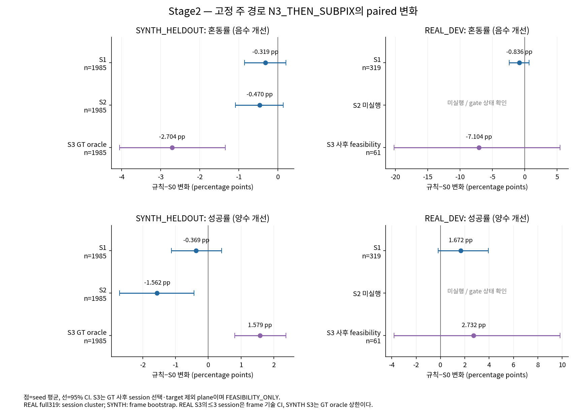
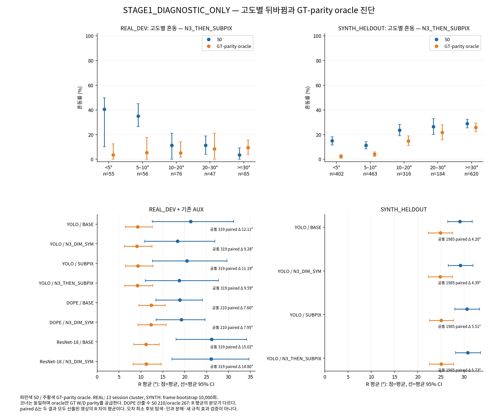

[확인] Stage2 규칙별 판정: S1=UNRESOLVED, S2=WORSENED, S3=FEASIBILITY_ONLY. 합친 방법 전체의 단일 우열 판정은 하지 않습니다.
[확인] 코너·support·K·치수·모델·SubPix·cap·proper metric은 고정하고 가설 선택과 PnP fit 부분집합만 바꿨습니다. 나쁜 결과와 중단 gate도 아래에 남깁니다.
[확인] REAL GT는 수동 2D 기반 기하 참조이며 독립적인 실제 6D 계측보다 신뢰도가 낮습니다. 기존 319 CONFIRMED와 재검토40의4 UNCLEAR를 구분합니다.

# W/D 선택 규칙의 2단계 결과

## 규칙별 판정과 실행 gate

| 규칙 | 실제 판정 | 해석 |
|---|---|---|
| S1 | UNRESOLVED | 사전 고정 주 경로·혼동/성공 CI 및 SYNTH gate |
| S2 | WORSENED | 사전 고정 주 경로·혼동/성공 CI 및 SYNTH gate |
| S3 | FEASIBILITY_ONLY | 사후 session GT·target 제외 plane의 FEASIBILITY_ONLY; 일반화나 배포 성능 판정 아님 |

[확인] 주 경로는 N3_THEN_SUBPIX이고 변화는 규칙−S0입니다. 혼동은 R>45°·|yaw|≥60°, 성공은 T<5 cm·proper R<5°입니다. SYNTH의 주 경로가 WORSENED이면 REAL 평가를 실행하지 않고 모든319 ID를 skip receipt에 남깁니다. SUPPORTED 조건을 충족하지 않은 결과를 성능 향상으로 단정하지 않습니다. 세 규칙×두 지표의 다중 비교 보정은 하지 않았습니다. [VERDICT_STAGE2.json](VERDICT_STAGE2.json)

[확인] S2 REAL은 SYNTH gate로 미실행입니다. [SKIPPED_S2_REAL.json](SKIPPED_S2_REAL.json)에 전체 예정 ID와 실제 F=0을 보존했습니다.

## 주 경로의 실제 paired 변화

[확인] S1/REAL_DEV, 주 경로 n=319: 혼동 변화 -0.836 pp, CI [-2.381, 0.660]; 성공 변화 1.672 pp, CI [-0.185, 3.928]. 혼동 seed별 0.313 / -2.508 / -0.313 pp, 성공 seed별 0.627 / 1.881 / 2.508 pp. [RESULTS_S1_REAL.json](RESULTS_S1_REAL.json)

[확인] S1/SYNTH_HELDOUT, 주 경로 n=1985: 혼동 변화 -0.319 pp, CI [-0.857, 0.202]; 성공 변화 -0.369 pp, CI [-1.125, 0.403]. 혼동 seed별 -0.504 / -0.101 / -0.353 pp, 성공 seed별 0.151 / -0.453 / -0.806 pp. [RESULTS_S1_SYNTH.json](RESULTS_S1_SYNTH.json)

[확인] S2/SYNTH_HELDOUT, 주 경로 n=1985: 혼동 변화 -0.470 pp, CI [-1.092, 0.134]; 성공 변화 -1.562 pp, CI [-2.704, -0.437]. 혼동 seed별 -0.504 / -0.504 / -0.403 pp, 성공 seed별 -0.856 / -1.763 / -2.065 pp. [RESULTS_S2_SYNTH.json](RESULTS_S2_SYNTH.json)

[확인] S3/REAL_DEV, 주 경로 n=61: 혼동 변화 -7.104 pp, CI [-20.219, 5.464]; 성공 변화 2.732 pp, CI [-3.825, 9.836]. 혼동 seed별 -4.918 / -11.475 / -4.918 pp, 성공 seed별 0.000 / 6.557 / 1.639 pp. [RESULTS_S3_REAL.json](RESULTS_S3_REAL.json)

[확인] S3/SYNTH_HELDOUT, 주 경로 n=1985: 혼동 변화 -2.704 pp, CI [-4.047, -1.343]; 성공 변화 1.579 pp, CI [0.806, 2.368]. 혼동 seed별 -2.922 / -2.469 / -2.720 pp, 성공 seed별 1.713 / 1.461 / 1.562 pp. [RESULTS_S3_SYNTH.json](RESULTS_S3_SYNTH.json)

## 모든 경로·seed의 정확도

[전체 정확도 표](STAGE2_table.md)는 네 경로의 S0/규칙별 seed1·2·3 및 seed mean을 모두 포함합니다. 평균·표본 분산·SD·중앙값·P90·95% CI·자세 산출 수를 제시하며, 큰 오차를 잘라내지 않습니다. 미산출은 수치 평균에서 제외하고 전체 비율 분모에 false로 남깁니다.

## 모든 paired 차이

| 규칙 / 모집단 | 경로 | 지표 | seed mean 변화 (규칙−S0) | 95% CI | seed1 / 2 / 3 변화 | paired 영상 수 | SYNTH scenario cluster 보조 CI |
|---|---|---|---:|---|---|---:|---|
| S1 / REAL_DEV | BASE | T_cm | 0.244 | [-0.362, 1.118] | 0.244 / 0.244 / 0.244 | 319 | NA |
| S1 / REAL_DEV | BASE | R_deg | -0.672 | [-1.703, 0.464] | -0.672 / -0.672 / -0.672 | 319 | NA |
| S1 / REAL_DEV | BASE | ADDsym_m | -0.004 | [-0.016, 0.011] | -0.004 / -0.004 / -0.004 | 319 | NA |
| S1 / REAL_DEV | BASE | IoU3D | -0.000 | [-0.012, 0.011] | -0.000 / -0.000 / -0.000 | 319 | NA |
| S1 / REAL_DEV | BASE | confusion_rate | -0.627 pp | [-1.987, 0.949] | -0.627 / -0.627 / -0.627 | 319 | NA |
| S1 / REAL_DEV | BASE | success_rate | -0.940 pp | [-3.344, 1.240] | -0.940 / -0.940 / -0.940 | 319 | NA |
| S1 / REAL_DEV | N3_DIM_SYM | T_cm | 0.435 | [-0.076, 1.436] | 0.360 / -0.006 / 0.951 | 319 | NA |
| S1 / REAL_DEV | N3_DIM_SYM | R_deg | -0.867 | [-1.586, -0.311] | -0.712 / -1.324 / -0.563 | 319 | NA |
| S1 / REAL_DEV | N3_DIM_SYM | ADDsym_m | -0.004 | [-0.014, 0.004] | -0.004 / -0.013 / 0.004 | 319 | NA |
| S1 / REAL_DEV | N3_DIM_SYM | IoU3D | -0.001 | [-0.011, 0.009] | -0.000 / -0.000 / -0.002 | 319 | NA |
| S1 / REAL_DEV | N3_DIM_SYM | confusion_rate | -0.940 pp | [-1.726, -0.335] | -0.627 / -1.567 / -0.627 | 319 | NA |
| S1 / REAL_DEV | N3_DIM_SYM | success_rate | -0.104 pp | [-2.091, 1.211] | 0.000 / -0.940 / 0.627 | 319 | NA |
| S1 / REAL_DEV | SUBPIX | T_cm | -0.481 | [-1.828, 0.730] | -0.481 / -0.481 / -0.481 | 319 | NA |
| S1 / REAL_DEV | SUBPIX | R_deg | 0.132 | [-0.726, 1.167] | 0.132 / 0.132 / 0.132 | 319 | NA |
| S1 / REAL_DEV | SUBPIX | ADDsym_m | 0.000 | [-0.015, 0.019] | 0.000 / 0.000 / 0.000 | 319 | NA |
| S1 / REAL_DEV | SUBPIX | IoU3D | 0.008 | [-0.000, 0.014] | 0.008 / 0.008 / 0.008 | 319 | NA |
| S1 / REAL_DEV | SUBPIX | confusion_rate | 0.313 pp | [-0.741, 1.455] | 0.313 / 0.313 / 0.313 | 319 | NA |
| S1 / REAL_DEV | SUBPIX | success_rate | -3.448 pp | [-6.306, -1.282] | -3.448 / -3.448 / -3.448 | 319 | NA |
| S1 / REAL_DEV | N3_THEN_SUBPIX | T_cm | -0.303 | [-1.132, 0.550] | -0.398 / -0.596 / 0.085 | 319 | NA |
| S1 / REAL_DEV | N3_THEN_SUBPIX | R_deg | -0.477 | [-1.702, 0.744] | 0.510 / -1.878 / -0.062 | 319 | NA |
| S1 / REAL_DEV | N3_THEN_SUBPIX | ADDsym_m | -0.007 | [-0.023, 0.008] | 0.004 / -0.025 / -0.001 | 319 | NA |
| S1 / REAL_DEV | N3_THEN_SUBPIX | IoU3D | 0.004 | [-0.005, 0.013] | 0.001 / 0.008 / 0.003 | 319 | NA |
| S1 / REAL_DEV | N3_THEN_SUBPIX | confusion_rate | -0.836 pp | [-2.381, 0.660] | 0.313 / -2.508 / -0.313 | 319 | NA |
| S1 / REAL_DEV | N3_THEN_SUBPIX | success_rate | 1.672 pp | [-0.185, 3.928] | 0.627 / 1.881 / 2.508 | 319 | NA |
| S1 / SYNTH_HELDOUT | BASE | T_cm | -0.116 | [-0.228, -0.003] | -0.116 / -0.116 / -0.116 | 1985 | [-0.229, -0.004] |
| S1 / SYNTH_HELDOUT | BASE | R_deg | -0.142 | [-0.472, 0.191] | -0.142 / -0.142 / -0.142 | 1985 | [-0.479, 0.186] |
| S1 / SYNTH_HELDOUT | BASE | ADDsym_m | -0.003 | [-0.007, 0.001] | -0.003 / -0.003 / -0.003 | 1985 | [-0.007, 0.001] |
| S1 / SYNTH_HELDOUT | BASE | IoU3D | 0.006 | [0.004, 0.008] | 0.006 / 0.006 / 0.006 | 1985 | [0.004, 0.008] |
| S1 / SYNTH_HELDOUT | BASE | confusion_rate | -0.302 pp | [-0.705, 0.050] | -0.302 / -0.302 / -0.302 | 1985 | [-0.695, 0.051] |
| S1 / SYNTH_HELDOUT | BASE | success_rate | 0.353 pp | [-0.302, 1.008] | 0.353 / 0.353 / 0.353 | 1985 | [-0.305, 1.027] |
| S1 / SYNTH_HELDOUT | N3_DIM_SYM | T_cm | -0.174 | [-0.300, -0.062] | -0.139 / -0.233 / -0.148 | 1985 | [-0.301, -0.059] |
| S1 / SYNTH_HELDOUT | N3_DIM_SYM | R_deg | -0.389 | [-0.722, -0.073] | -0.346 / -0.392 / -0.430 | 1985 | [-0.726, -0.080] |
| S1 / SYNTH_HELDOUT | N3_DIM_SYM | ADDsym_m | -0.005 | [-0.009, -0.002] | -0.005 / -0.005 / -0.006 | 1985 | [-0.009, -0.002] |
| S1 / SYNTH_HELDOUT | N3_DIM_SYM | IoU3D | 0.008 | [0.006, 0.010] | 0.008 / 0.008 / 0.007 | 1985 | [0.005, 0.010] |
| S1 / SYNTH_HELDOUT | N3_DIM_SYM | confusion_rate | -0.537 pp | [-0.924, -0.185] | -0.504 / -0.504 / -0.605 | 1985 | [-0.922, -0.185] |
| S1 / SYNTH_HELDOUT | N3_DIM_SYM | success_rate | 0.202 pp | [-0.302, 0.722] | 0.252 / -0.151 / 0.504 | 1985 | [-0.318, 0.720] |
| S1 / SYNTH_HELDOUT | SUBPIX | T_cm | -0.403 | [-1.157, 0.282] | -0.403 / -0.403 / -0.403 | 1985 | [-1.147, 0.306] |
| S1 / SYNTH_HELDOUT | SUBPIX | R_deg | -0.506 | [-1.055, 0.033] | -0.506 / -0.506 / -0.506 | 1985 | [-1.070, 0.044] |
| S1 / SYNTH_HELDOUT | SUBPIX | ADDsym_m | -0.008 | [-0.016, -0.000] | -0.008 / -0.008 / -0.008 | 1985 | [-0.016, -0.000] |
| S1 / SYNTH_HELDOUT | SUBPIX | IoU3D | 0.001 | [-0.002, 0.005] | 0.001 / 0.001 / 0.001 | 1985 | [-0.002, 0.005] |
| S1 / SYNTH_HELDOUT | SUBPIX | confusion_rate | -0.605 pp | [-1.209, 0.000] | -0.605 / -0.605 / -0.605 | 1985 | [-1.218, 0.000] |
| S1 / SYNTH_HELDOUT | SUBPIX | success_rate | -0.907 pp | [-1.864, 0.050] | -0.907 / -0.907 / -0.907 | 1985 | [-1.851, 0.000] |
| S1 / SYNTH_HELDOUT | N3_THEN_SUBPIX | T_cm | -0.180 | [-0.577, 0.159] | -0.270 / -0.113 / -0.156 | 1985 | [-0.572, 0.166] |
| S1 / SYNTH_HELDOUT | N3_THEN_SUBPIX | R_deg | -0.161 | [-0.645, 0.309] | -0.394 / 0.058 / -0.146 | 1985 | [-0.625, 0.294] |
| S1 / SYNTH_HELDOUT | N3_THEN_SUBPIX | ADDsym_m | -0.004 | [-0.010, 0.002] | -0.007 / -0.001 / -0.003 | 1985 | [-0.010, 0.002] |
| S1 / SYNTH_HELDOUT | N3_THEN_SUBPIX | IoU3D | 0.001 | [-0.002, 0.004] | 0.002 / 0.001 / 0.001 | 1985 | [-0.002, 0.004] |
| S1 / SYNTH_HELDOUT | N3_THEN_SUBPIX | confusion_rate | -0.319 pp | [-0.857, 0.202] | -0.504 / -0.101 / -0.353 | 1985 | [-0.856, 0.200] |
| S1 / SYNTH_HELDOUT | N3_THEN_SUBPIX | success_rate | -0.369 pp | [-1.125, 0.403] | 0.151 / -0.453 / -0.806 | 1985 | [-1.126, 0.383] |
| S2 / SYNTH_HELDOUT | BASE | T_cm | 0.110 | [-0.158, 0.302] | 0.110 / 0.110 / 0.110 | 1985 | [-0.154, 0.305] |
| S2 / SYNTH_HELDOUT | BASE | R_deg | -0.356 | [-0.704, -0.043] | -0.356 / -0.356 / -0.356 | 1985 | [-0.706, -0.048] |
| S2 / SYNTH_HELDOUT | BASE | ADDsym_m | -0.003 | [-0.008, 0.000] | -0.003 / -0.003 / -0.003 | 1985 | [-0.008, 0.001] |
| S2 / SYNTH_HELDOUT | BASE | IoU3D | -0.006 | [-0.009, -0.003] | -0.006 / -0.006 / -0.006 | 1985 | [-0.009, -0.002] |
| S2 / SYNTH_HELDOUT | BASE | confusion_rate | -0.504 pp | [-0.907, -0.151] | -0.504 / -0.504 / -0.504 | 1985 | [-0.902, -0.151] |
| S2 / SYNTH_HELDOUT | BASE | success_rate | -0.403 pp | [-1.511, 0.655] | -0.403 / -0.403 / -0.403 | 1985 | [-1.499, 0.670] |
| S2 / SYNTH_HELDOUT | N3_DIM_SYM | T_cm | -0.132 | [-0.387, 0.077] | -0.146 / -0.276 / 0.026 | 1985 | [-0.389, 0.079] |
| S2 / SYNTH_HELDOUT | N3_DIM_SYM | R_deg | -0.108 | [-0.437, 0.217] | -0.310 / 0.159 / -0.173 | 1985 | [-0.439, 0.212] |
| S2 / SYNTH_HELDOUT | N3_DIM_SYM | ADDsym_m | -0.003 | [-0.007, 0.001] | -0.005 / -0.001 / -0.002 | 1985 | [-0.007, 0.001] |
| S2 / SYNTH_HELDOUT | N3_DIM_SYM | IoU3D | 0.000 | [-0.003, 0.004] | 0.003 / 0.001 / -0.003 | 1985 | [-0.003, 0.004] |
| S2 / SYNTH_HELDOUT | N3_DIM_SYM | confusion_rate | -0.319 pp | [-0.688, 0.034] | -0.554 / -0.050 / -0.353 | 1985 | [-0.691, 0.034] |
| S2 / SYNTH_HELDOUT | N3_DIM_SYM | success_rate | 0.285 pp | [-0.521, 1.108] | 0.655 / 0.252 / -0.050 | 1985 | [-0.549, 1.103] |
| S2 / SYNTH_HELDOUT | SUBPIX | T_cm | -0.125 | [-0.815, 0.490] | -0.125 / -0.125 / -0.125 | 1985 | [-0.822, 0.500] |
| S2 / SYNTH_HELDOUT | SUBPIX | R_deg | 0.451 | [-0.199, 1.117] | 0.451 / 0.451 / 0.451 | 1985 | [-0.213, 1.125] |
| S2 / SYNTH_HELDOUT | SUBPIX | ADDsym_m | 0.001 | [-0.008, 0.009] | 0.001 / 0.001 / 0.001 | 1985 | [-0.008, 0.009] |
| S2 / SYNTH_HELDOUT | SUBPIX | IoU3D | -0.005 | [-0.010, 0.000] | -0.005 / -0.005 / -0.005 | 1985 | [-0.010, 0.000] |
| S2 / SYNTH_HELDOUT | SUBPIX | confusion_rate | 0.151 pp | [-0.605, 0.907] | 0.151 / 0.151 / 0.151 | 1985 | [-0.605, 0.905] |
| S2 / SYNTH_HELDOUT | SUBPIX | success_rate | -2.065 pp | [-3.476, -0.654] | -2.065 / -2.065 / -2.065 | 1985 | [-3.469, -0.663] |
| S2 / SYNTH_HELDOUT | N3_THEN_SUBPIX | T_cm | -0.300 | [-0.765, 0.111] | -0.461 / -0.124 / -0.313 | 1985 | [-0.772, 0.113] |
| S2 / SYNTH_HELDOUT | N3_THEN_SUBPIX | R_deg | -0.249 | [-0.798, 0.292] | -0.264 / -0.231 / -0.252 | 1985 | [-0.811, 0.288] |
| S2 / SYNTH_HELDOUT | N3_THEN_SUBPIX | ADDsym_m | -0.005 | [-0.012, 0.002] | -0.006 / -0.004 / -0.005 | 1985 | [-0.012, 0.002] |
| S2 / SYNTH_HELDOUT | N3_THEN_SUBPIX | IoU3D | -0.001 | [-0.006, 0.003] | 0.001 / -0.003 / -0.002 | 1985 | [-0.006, 0.003] |
| S2 / SYNTH_HELDOUT | N3_THEN_SUBPIX | confusion_rate | -0.470 pp | [-1.092, 0.134] | -0.504 / -0.504 / -0.403 | 1985 | [-1.095, 0.135] |
| S2 / SYNTH_HELDOUT | N3_THEN_SUBPIX | success_rate | -1.562 pp | [-2.704, -0.437] | -0.856 / -1.763 / -2.065 | 1985 | [-2.703, -0.437] |
| S3 / REAL_DEV | BASE | T_cm | -9.103 | [-18.261, -2.081] | -9.103 / -9.103 / -9.103 | 61 | NA |
| S3 / REAL_DEV | BASE | R_deg | -10.982 | [-21.344, -0.861] | -10.982 / -10.982 / -10.982 | 61 | NA |
| S3 / REAL_DEV | BASE | ADDsym_m | -0.206 | [-0.351, -0.069] | -0.206 / -0.206 / -0.206 | 61 | NA |
| S3 / REAL_DEV | BASE | IoU3D | 0.021 | [0.001, 0.040] | 0.021 / 0.021 / 0.021 | 61 | NA |
| S3 / REAL_DEV | BASE | confusion_rate | -13.115 pp | [-26.230, -1.639] | -13.115 / -13.115 / -13.115 | 61 | NA |
| S3 / REAL_DEV | BASE | success_rate | 1.639 pp | [0.000, 4.918] | 1.639 / 1.639 / 1.639 | 61 | NA |
| S3 / REAL_DEV | N3_DIM_SYM | T_cm | -12.298 | [-23.133, -3.480] | -13.718 / -13.636 / -9.539 | 61 | NA |
| S3 / REAL_DEV | N3_DIM_SYM | R_deg | -7.120 | [-18.515, 4.050] | -6.482 / -6.662 / -8.217 | 61 | NA |
| S3 / REAL_DEV | N3_DIM_SYM | ADDsym_m | -0.203 | [-0.372, -0.039] | -0.212 / -0.211 / -0.186 | 61 | NA |
| S3 / REAL_DEV | N3_DIM_SYM | IoU3D | 0.027 | [0.001, 0.054] | 0.027 / 0.025 / 0.028 | 61 | NA |
| S3 / REAL_DEV | N3_DIM_SYM | confusion_rate | -8.743 pp | [-22.404, 4.918] | -8.197 / -8.197 / -9.836 | 61 | NA |
| S3 / REAL_DEV | N3_DIM_SYM | success_rate | 3.825 pp | [-1.639, 10.383] | 1.639 / 3.279 / 6.557 | 61 | NA |
| S3 / REAL_DEV | SUBPIX | T_cm | -11.992 | [-24.229, -2.217] | -11.992 / -11.992 / -11.992 | 61 | NA |
| S3 / REAL_DEV | SUBPIX | R_deg | -7.986 | [-18.509, 2.344] | -7.986 / -7.986 / -7.986 | 61 | NA |
| S3 / REAL_DEV | SUBPIX | ADDsym_m | -0.215 | [-0.380, -0.058] | -0.215 / -0.215 / -0.215 | 61 | NA |
| S3 / REAL_DEV | SUBPIX | IoU3D | 0.015 | [-0.004, 0.034] | 0.015 / 0.015 / 0.015 | 61 | NA |
| S3 / REAL_DEV | SUBPIX | confusion_rate | -9.836 pp | [-22.951, 3.279] | -9.836 / -9.836 / -9.836 | 61 | NA |
| S3 / REAL_DEV | SUBPIX | success_rate | 1.639 pp | [0.000, 4.918] | 1.639 / 1.639 / 1.639 | 61 | NA |
| S3 / REAL_DEV | N3_THEN_SUBPIX | T_cm | -13.088 | [-25.268, -3.336] | -13.076 / -13.418 / -12.769 | 61 | NA |
| S3 / REAL_DEV | N3_THEN_SUBPIX | R_deg | -5.741 | [-16.394, 4.629] | -3.834 / -9.385 / -4.004 | 61 | NA |
| S3 / REAL_DEV | N3_THEN_SUBPIX | ADDsym_m | -0.193 | [-0.361, -0.029] | -0.173 / -0.241 / -0.163 | 61 | NA |
| S3 / REAL_DEV | N3_THEN_SUBPIX | IoU3D | 0.020 | [-0.005, 0.047] | 0.021 / 0.030 / 0.011 | 61 | NA |
| S3 / REAL_DEV | N3_THEN_SUBPIX | confusion_rate | -7.104 pp | [-20.219, 5.464] | -4.918 / -11.475 / -4.918 | 61 | NA |
| S3 / REAL_DEV | N3_THEN_SUBPIX | success_rate | 2.732 pp | [-3.825, 9.836] | 0.000 / 6.557 / 1.639 | 61 | NA |
| S3 / SYNTH_HELDOUT | BASE | T_cm | -1.715 | [-2.180, -1.309] | -1.715 / -1.715 / -1.715 | 1985 | [-2.166, -1.293] |
| S3 / SYNTH_HELDOUT | BASE | R_deg | -2.461 | [-3.606, -1.342] | -2.461 / -2.461 / -2.461 | 1985 | [-3.593, -1.353] |
| S3 / SYNTH_HELDOUT | BASE | ADDsym_m | -0.030 | [-0.042, -0.019] | -0.030 / -0.030 / -0.030 | 1985 | [-0.042, -0.018] |
| S3 / SYNTH_HELDOUT | BASE | IoU3D | 0.019 | [0.015, 0.024] | 0.019 / 0.019 / 0.019 | 1985 | [0.015, 0.023] |
| S3 / SYNTH_HELDOUT | BASE | confusion_rate | -2.166 pp | [-3.426, -0.957] | -2.166 / -2.166 / -2.166 | 1985 | [-3.431, -0.949] |
| S3 / SYNTH_HELDOUT | BASE | success_rate | 1.864 pp | [1.108, 2.670] | 1.864 / 1.864 / 1.864 | 1985 | [1.103, 2.657] |
| S3 / SYNTH_HELDOUT | N3_DIM_SYM | T_cm | -1.825 | [-2.336, -1.375] | -1.867 / -1.766 / -1.843 | 1985 | [-2.319, -1.368] |
| S3 / SYNTH_HELDOUT | N3_DIM_SYM | R_deg | -2.612 | [-3.685, -1.537] | -2.677 / -2.428 / -2.731 | 1985 | [-3.676, -1.524] |
| S3 / SYNTH_HELDOUT | N3_DIM_SYM | ADDsym_m | -0.033 | [-0.045, -0.022] | -0.034 / -0.031 / -0.035 | 1985 | [-0.045, -0.022] |
| S3 / SYNTH_HELDOUT | N3_DIM_SYM | IoU3D | 0.019 | [0.015, 0.023] | 0.019 / 0.019 / 0.018 | 1985 | [0.015, 0.023] |
| S3 / SYNTH_HELDOUT | N3_DIM_SYM | confusion_rate | -2.502 pp | [-3.728, -1.293] | -2.569 / -2.267 / -2.670 | 1985 | [-3.711, -1.291] |
| S3 / SYNTH_HELDOUT | N3_DIM_SYM | success_rate | 1.612 pp | [0.924, 2.301] | 1.662 / 1.411 / 1.763 | 1985 | [0.940, 2.315] |
| S3 / SYNTH_HELDOUT | SUBPIX | T_cm | -3.380 | [-4.259, -2.592] | -3.380 / -3.380 / -3.380 | 1985 | [-4.247, -2.573] |
| S3 / SYNTH_HELDOUT | SUBPIX | R_deg | -3.053 | [-4.316, -1.788] | -3.053 / -3.053 / -3.053 | 1985 | [-4.308, -1.807] |
| S3 / SYNTH_HELDOUT | SUBPIX | ADDsym_m | -0.047 | [-0.062, -0.033] | -0.047 / -0.047 / -0.047 | 1985 | [-0.062, -0.033] |
| S3 / SYNTH_HELDOUT | SUBPIX | IoU3D | 0.028 | [0.023, 0.033] | 0.028 / 0.028 / 0.028 | 1985 | [0.023, 0.033] |
| S3 / SYNTH_HELDOUT | SUBPIX | confusion_rate | -3.224 pp | [-4.635, -1.763] | -3.224 / -3.224 / -3.224 | 1985 | [-4.642, -1.830] |
| S3 / SYNTH_HELDOUT | SUBPIX | success_rate | 2.015 pp | [1.159, 2.922] | 2.015 / 2.015 / 2.015 | 1985 | [1.176, 2.872] |
| S3 / SYNTH_HELDOUT | N3_THEN_SUBPIX | T_cm | -2.704 | [-3.372, -2.112] | -2.791 / -2.558 / -2.763 | 1985 | [-3.376, -2.102] |
| S3 / SYNTH_HELDOUT | N3_THEN_SUBPIX | R_deg | -2.658 | [-3.841, -1.474] | -2.905 / -2.476 / -2.594 | 1985 | [-3.848, -1.484] |
| S3 / SYNTH_HELDOUT | N3_THEN_SUBPIX | ADDsym_m | -0.038 | [-0.052, -0.025] | -0.041 / -0.035 / -0.038 | 1985 | [-0.051, -0.025] |
| S3 / SYNTH_HELDOUT | N3_THEN_SUBPIX | IoU3D | 0.025 | [0.021, 0.029] | 0.026 / 0.024 / 0.025 | 1985 | [0.021, 0.029] |
| S3 / SYNTH_HELDOUT | N3_THEN_SUBPIX | confusion_rate | -2.704 pp | [-4.047, -1.343] | -2.922 / -2.469 / -2.720 | 1985 | [-4.044, -1.377] |
| S3 / SYNTH_HELDOUT | N3_THEN_SUBPIX | success_rate | 1.579 pp | [0.806, 2.368] | 1.713 / 1.461 / 1.562 | 1985 | [0.821, 2.317] |

## 실패·손상·가설 변경·fallback

| 규칙 / 모집단 | 경로 | seed | 성공→실패 | 실패→성공 | 혼동 회복 | 혼동 손상 | 가설 변경 | fallback | 미산출 |
|---|---|---:|---:|---:|---:|---:|---:|---:|---:|
| S1 / REAL_DEV | BASE | 1 | 6 | 3 | 5 | 3 | 8 | 0 | 0 |
| S1 / REAL_DEV | BASE | 2 | 6 | 3 | 5 | 3 | 8 | 0 | 0 |
| S1 / REAL_DEV | BASE | 3 | 6 | 3 | 5 | 3 | 8 | 0 | 0 |
| S1 / REAL_DEV | N3_DIM_SYM | 1 | 5 | 5 | 3 | 1 | 4 | 0 | 0 |
| S1 / REAL_DEV | N3_DIM_SYM | 2 | 7 | 4 | 6 | 1 | 7 | 0 | 0 |
| S1 / REAL_DEV | N3_DIM_SYM | 3 | 3 | 5 | 2 | 0 | 3 | 0 | 0 |
| S1 / REAL_DEV | SUBPIX | 1 | 14 | 3 | 5 | 6 | 11 | 4 | 0 |
| S1 / REAL_DEV | SUBPIX | 2 | 14 | 3 | 5 | 6 | 11 | 4 | 0 |
| S1 / REAL_DEV | SUBPIX | 3 | 14 | 3 | 5 | 6 | 11 | 4 | 0 |
| S1 / REAL_DEV | N3_THEN_SUBPIX | 1 | 6 | 8 | 4 | 5 | 9 | 2 | 0 |
| S1 / REAL_DEV | N3_THEN_SUBPIX | 2 | 3 | 9 | 9 | 1 | 10 | 0 | 0 |
| S1 / REAL_DEV | N3_THEN_SUBPIX | 3 | 3 | 11 | 2 | 1 | 3 | 0 | 0 |
| S1 / SYNTH_HELDOUT | BASE | 1 | 19 | 26 | 10 | 4 | 17 | 2 | 0 |
| S1 / SYNTH_HELDOUT | BASE | 2 | 19 | 26 | 10 | 4 | 17 | 2 | 0 |
| S1 / SYNTH_HELDOUT | BASE | 3 | 19 | 26 | 10 | 4 | 17 | 2 | 0 |
| S1 / SYNTH_HELDOUT | N3_DIM_SYM | 1 | 20 | 25 | 15 | 5 | 22 | 0 | 0 |
| S1 / SYNTH_HELDOUT | N3_DIM_SYM | 2 | 28 | 25 | 15 | 5 | 23 | 0 | 0 |
| S1 / SYNTH_HELDOUT | N3_DIM_SYM | 3 | 21 | 31 | 16 | 4 | 22 | 0 | 0 |
| S1 / SYNTH_HELDOUT | SUBPIX | 1 | 55 | 37 | 25 | 13 | 45 | 6 | 0 |
| S1 / SYNTH_HELDOUT | SUBPIX | 2 | 55 | 37 | 25 | 13 | 45 | 6 | 0 |
| S1 / SYNTH_HELDOUT | SUBPIX | 3 | 55 | 37 | 25 | 13 | 45 | 6 | 0 |
| S1 / SYNTH_HELDOUT | N3_THEN_SUBPIX | 1 | 41 | 44 | 25 | 15 | 44 | 5 | 0 |
| S1 / SYNTH_HELDOUT | N3_THEN_SUBPIX | 2 | 54 | 45 | 23 | 21 | 47 | 7 | 0 |
| S1 / SYNTH_HELDOUT | N3_THEN_SUBPIX | 3 | 50 | 34 | 22 | 15 | 42 | 7 | 0 |
| S2 / SYNTH_HELDOUT | BASE | 1 | 63 | 55 | 12 | 2 | 16 | 0 | 0 |
| S2 / SYNTH_HELDOUT | BASE | 2 | 63 | 55 | 12 | 2 | 16 | 0 | 0 |
| S2 / SYNTH_HELDOUT | BASE | 3 | 63 | 55 | 12 | 2 | 16 | 0 | 0 |
| S2 / SYNTH_HELDOUT | N3_DIM_SYM | 1 | 51 | 64 | 18 | 7 | 28 | 0 | 0 |
| S2 / SYNTH_HELDOUT | N3_DIM_SYM | 2 | 53 | 58 | 10 | 9 | 21 | 0 | 0 |
| S2 / SYNTH_HELDOUT | N3_DIM_SYM | 3 | 65 | 64 | 14 | 7 | 25 | 0 | 0 |
| S2 / SYNTH_HELDOUT | SUBPIX | 1 | 122 | 81 | 28 | 31 | 66 | 0 | 0 |
| S2 / SYNTH_HELDOUT | SUBPIX | 2 | 122 | 81 | 28 | 31 | 66 | 0 | 0 |
| S2 / SYNTH_HELDOUT | SUBPIX | 3 | 122 | 81 | 28 | 31 | 66 | 0 | 0 |
| S2 / SYNTH_HELDOUT | N3_THEN_SUBPIX | 1 | 109 | 92 | 32 | 22 | 60 | 0 | 0 |
| S2 / SYNTH_HELDOUT | N3_THEN_SUBPIX | 2 | 119 | 84 | 31 | 21 | 59 | 0 | 0 |
| S2 / SYNTH_HELDOUT | N3_THEN_SUBPIX | 3 | 123 | 82 | 30 | 22 | 59 | 0 | 0 |
| S3 / REAL_DEV | BASE | 1 | 0 | 1 | 12 | 4 | 19 | 0 | 0 |
| S3 / REAL_DEV | BASE | 2 | 0 | 1 | 12 | 4 | 19 | 0 | 0 |
| S3 / REAL_DEV | BASE | 3 | 0 | 1 | 12 | 4 | 19 | 0 | 0 |
| S3 / REAL_DEV | N3_DIM_SYM | 1 | 2 | 3 | 13 | 8 | 25 | 0 | 0 |
| S3 / REAL_DEV | N3_DIM_SYM | 2 | 1 | 3 | 12 | 7 | 23 | 0 | 0 |
| S3 / REAL_DEV | N3_DIM_SYM | 3 | 0 | 4 | 12 | 6 | 21 | 0 | 0 |
| S3 / REAL_DEV | SUBPIX | 1 | 0 | 1 | 11 | 5 | 20 | 0 | 0 |
| S3 / REAL_DEV | SUBPIX | 2 | 0 | 1 | 11 | 5 | 20 | 0 | 0 |
| S3 / REAL_DEV | SUBPIX | 3 | 0 | 1 | 11 | 5 | 20 | 0 | 0 |
| S3 / REAL_DEV | N3_THEN_SUBPIX | 1 | 3 | 3 | 11 | 8 | 23 | 0 | 0 |
| S3 / REAL_DEV | N3_THEN_SUBPIX | 2 | 1 | 5 | 12 | 5 | 21 | 0 | 0 |
| S3 / REAL_DEV | N3_THEN_SUBPIX | 3 | 2 | 3 | 10 | 7 | 21 | 0 | 0 |
| S3 / SYNTH_HELDOUT | BASE | 1 | 13 | 50 | 102 | 59 | 185 | 0 | 0 |
| S3 / SYNTH_HELDOUT | BASE | 2 | 13 | 50 | 102 | 59 | 185 | 0 | 0 |
| S3 / SYNTH_HELDOUT | BASE | 3 | 13 | 50 | 102 | 59 | 185 | 0 | 0 |
| S3 / SYNTH_HELDOUT | N3_DIM_SYM | 1 | 14 | 47 | 109 | 58 | 190 | 0 | 0 |
| S3 / SYNTH_HELDOUT | N3_DIM_SYM | 2 | 15 | 43 | 104 | 59 | 185 | 0 | 0 |
| S3 / SYNTH_HELDOUT | N3_DIM_SYM | 3 | 10 | 45 | 108 | 55 | 185 | 0 | 0 |
| S3 / SYNTH_HELDOUT | SUBPIX | 1 | 18 | 58 | 137 | 73 | 236 | 0 | 0 |
| S3 / SYNTH_HELDOUT | SUBPIX | 2 | 18 | 58 | 137 | 73 | 236 | 0 | 0 |
| S3 / SYNTH_HELDOUT | SUBPIX | 3 | 18 | 58 | 137 | 73 | 236 | 0 | 0 |
| S3 / SYNTH_HELDOUT | N3_THEN_SUBPIX | 1 | 17 | 51 | 136 | 78 | 235 | 0 | 0 |
| S3 / SYNTH_HELDOUT | N3_THEN_SUBPIX | 2 | 22 | 51 | 125 | 76 | 227 | 0 | 0 |
| S3 / SYNTH_HELDOUT | N3_THEN_SUBPIX | 3 | 20 | 51 | 130 | 76 | 228 | 0 | 0 |

모든 ID와 가설 변경 전후는 각 RESULTS JSON의 failures에 보존됩니다. 성공→실패와 혼동 손상 사례도 제외하지 않습니다.

## S3의 범위와 제한

[확인] session별 camera-world 외부 자세가 고정됐다는 기존 기록은 확인되지 않았습니다. 높이 SD≤5 cm·normal RMS≤2°로 고른 session은 GT를 이용한 사후 선택입니다. 해당 target frame의 GT는 plane 계산에서 제외하지만 다른 frame GT를 쓰므로 일반적인 GT-free 선택기라고 부르지 않습니다. SYNTH S3는 GT plane oracle 상한입니다. 세 개 이하 session의 REAL S3는 frame bootstrap 기술 CI만 사용하고 언제나 FEASIBILITY_ONLY입니다. [S3_ELIGIBILITY_REAL.json](S3_ELIGIBILITY_REAL.json)

## 코드 봉인·재현·이후 깊이 gate

[확인] 각 규칙의 새 선택/부분집합을 참조값 scoring 전에 봉인했습니다. 결과·실패 ID는 위 RESULTS 파일, 규칙별 최종 판정은 VERDICT_STAGE2에 보존됩니다. [고정 사전 방법](METHOD_KO.md), [재현](REPRODUCE.md). 별도 Square 연구 결과와 이 W/D 연구의 판정을 합치지 않습니다.

[확인] Stage3는 공식 Metric3D-v2 Small로 고정합니다. REAL231의 주 경로 per-frame 세 seed 절대 상대오차 평균→231 median≤5% 및 누락0을 먼저 요구합니다. 누락이나 gate 악화이면 S4 미실행을 기록합니다. 깊이 정확도와 S4 결과를 아직 평가하지 않은 Stage2 보고서에서 성공을 주장하지 않습니다. [DEPTH_PREPARATION.json](DEPTH_PREPARATION.json)

## 최초 게시한 Stage1 진단

[확인] 최초 Stage1 게시 commit `2502db29e77c26b88c6c681b054902ea997f441d`의 문서·그림은 [원문 snapshot/hash](STAGE1_PUBLISHED_SNAPSHOT.json)로 보존합니다. [원래 보고서](STAGE1_REPORT_KO.md), [원래 방법](STAGE1_METHOD_KO.md), [원래 재현](STAGE1_REPRODUCE.md), [원래 표](FIRST_PUBLISHED_STAGE1_table.md), [원래 그림](FIRST_PUBLISHED_STAGE1_figure.png).

첨부의 oracle 혼동0%/R4.17°/성공49.8% 기대는 실제 GT-parity 정의에서 재현되지 않았습니다. 실제 Stage1 주 경로 REAL oracle은 혼동6.583%/R9.199°/성공47.753%이며, S0 parity는 T/R 최대 차이0입니다. 아래는 최초 원문이며 이후 단계의 판정과 구분합니다.

[확인] 판정 = STAGE1_DIAGNOSTIC_ONLY. 현재 산출물은 W/D 가설 진단이며 S1–S4의 효과 판정은 하지 않았습니다.
[확인] 주 경로 N3_THEN_SUBPIX의 REAL_DEV R 평균은 S0 18.792° / GT-parity oracle 9.199°이며, 혼동률은 18.495% / 6.583%입니다.
[확인] 첨부 기획의 oracle 혼동률 0%·R 약 4.17°·성공률 약 49.8%는 이번 고정 절차에서 재현되지 않았습니다. 실제 주 경로 oracle 혼동률은 6.583%, R 평균은 9.199°, 성공률은 47.753%입니다. S0의 원래 가설과 T/R은 최대 차이 0으로 재현되므로 OpenCV 버전 차이를 불일치 원인으로 주장할 근거가 없습니다.
[확인] GT-parity oracle은 기존 GT의 긴 축 parity를 공급합니다. R 오차가 최소인 후보를 고르는 oracle이 아니며, S0−oracle 평균 차이를 원인별 오차 기여량으로 해석하지 않습니다.
[확인] REAL GT는 수동 2D 코너와 알려진 치수로 복원한 기하 참조입니다. 독립적인 실제 6D 계측값보다 신뢰도가 낮으며, 원래 319 CONFIRMED와 후속 40장 재검토의 36 CONFIRMED·4 UNCLEAR를 구분합니다.

# W/D 가설 선택의 1단계 진단

## 실행 범위와 실제 parity

[확인] Stage0에서 기존 REAL_DEV 3828개 예측 경로를 실제 원래 F로 다시 계산했습니다. 가설 일치 3828/3828, 자세 산출 여부 일치 3828/3828이며, 최대 T 차이 0.000000000 cm, 최대 R 차이 0.000000000°입니다. 허용 오차는 0.01 cm/0.01°입니다. [STAGE0_PARITY.json](STAGE0_PARITY.json)

[확인] penalty 없이 최종 두 가설의 전체 9점 RMSE만 비교한 단순 선택은 원래 선택과 3828/3828회 일치합니다. 이 비율은 실제 공식 점수 계약과 단순 RMSE 선택의 차이를 확인하는 값입니다. 가설 진단의 formal score gap은 **대안−선택의 공식 가중 점수 차이**이고 penalty를 포함하므로 순수 영상 RMSE 차이와 같다고 가정하지 않습니다. [solver.py](../../../scripts/research/pallet_wd_hypothesis_diag_20261010/solver.py)

[확인] 실제 Stage1 F 호출 수는 31476회이며 모집단별 {'REAL': 3828, 'SYNTH': 23820, 'AUX': 3828}입니다. SYNTH 참조 margin 계산의 추가 8점 참조 solver 호출 3970회는 진단용입니다. 새 신경망 추론·학습·합성 이미지 생성은 없으며 Stage2 규칙 실행은 0입니다. [STAGE1_EXECUTION.json](STAGE1_EXECUTION.json)

[확인] SYNTH 참조 준비에서 NPZ 배열을 ID마다 다시 압축 해제하고 큰 backing array를 보존하는 메모리 문제가 발생해 중단했습니다. 이미 봉인한 REAL/SYNTH 선택과 원래 source는 보존했고, 배열을 한 번 읽는 별도 scoring recovery로 이어갔습니다. 완료한 F 선택의 재실행은 0회입니다. 복구 참조 margin fit은 3,970회이며, 중단 전 참조 fit 횟수는 NOT_MEASURED로 남겨 총 호출 수를 꾸미지 않습니다. [STAGE1_POSTSEAL_AMENDMENT.json](STAGE1_POSTSEAL_AMENDMENT.json), [stage1_resume.py](../../../scripts/research/pallet_wd_hypothesis_diag_20261010/stage1_resume.py)

[확인] 고정 좌표·support·K·치수만으로 S0와 두 후보를 계산하고, 각 모집단의 선택을 봉인한 뒤 해당 참조 자세와 옛 오류 값을 읽었습니다. REAL parity PASS 후 SYNTH와 AUX를 진행했습니다. 원래 core와 새 선택 코드는 실제 계산 전에 SHA를 고정하고 실행 후 확인했습니다. [STAGE1_FINAL_SOURCE_LOCK.json](STAGE1_FINAL_SOURCE_LOCK.json), [STAGE1_SELECTION_SEAL.json](STAGE1_SELECTION_SEAL.json), [INPUT_AUDIT.json](INPUT_AUDIT.json)

## 모든 방법의 정확도와 oracle 차이

[확인] YOLO 네 경로 BASE, N3_DIM_SYM, SUBPIX, N3_THEN_SUBPIX를 같은 REAL_DEV 319장·SYNTH_HELDOUT 1,985장으로 비교합니다. 존재하는 DOPE/ResNet-18의 기존 BASE·N3 예측도 같은 319장으로 진단합니다. 각 영상의 반복 seed를 별도 독립 영상으로 세지 않습니다.

전체 seed별/seed mean 평균·표본 분산·표준편차·중앙값·P90·95% CI·산출 수는 **[단일 Stage1 표](STAGE1_table.md)**에 있으며, [기계 판독 수치](STAGE1_METRICS.json)와 원행 [REAL](STAGE1_ROWS_REAL.jsonl.gz), [SYNTH](STAGE1_ROWS_SYNTH.jsonl.gz), [AUX](STAGE1_ROWS_AUX.jsonl.gz)를 함께 제공합니다.

[확인] seed mean R 차이(S0−oracle)는 두 결과의 영상별 paired 차이로 집계합니다. 이 값이 작거나 음수인 방법도 그대로 남기며, oracle은 예측 코너의 오류를 제거하지 않습니다. 가설 parity가 맞아도 코너 오류·PnP 오차·참조 불확실성이 남습니다.

[확인] YOLO의 네 경로는 REAL에서 두 선택 모두 319/319, SYNTH에서 모두 1,985/1,985 자세를 산출했습니다. DOPE BASE/N3는 S0 210/319, oracle 267/319로 산출 수가 다르며, ResNet-18은 모두 319/319입니다. DOPE의 R 평균은 서로 다른 available-only 분포이므로, 두 평균의 단순 차이와 paired Δ를 혼동하지 않아야 합니다. 표·그림의 paired Δ는 두 결과 모두 산출된 영상의 차이 평균입니다.

| 모집단 / backbone | 방법 | S0 자세 산출/전체 | oracle 자세 산출/전체 | paired R 차이 공통 영상 수 |
|---|---|---:|---:|---:|
| REAL_DEV / YOLO | BASE | 319/319 | 319/319 | 319 |
| REAL_DEV / YOLO | N3_DIM_SYM | 319/319 | 319/319 | 319 |
| REAL_DEV / YOLO | SUBPIX | 319/319 | 319/319 | 319 |
| REAL_DEV / YOLO | N3_THEN_SUBPIX | 319/319 | 319/319 | 319 |
| SYNTH_HELDOUT / YOLO | BASE | 1985/1985 | 1985/1985 | 1985 |
| SYNTH_HELDOUT / YOLO | N3_DIM_SYM | 1985/1985 | 1985/1985 | 1985 |
| SYNTH_HELDOUT / YOLO | SUBPIX | 1985/1985 | 1985/1985 | 1985 |
| SYNTH_HELDOUT / YOLO | N3_THEN_SUBPIX | 1985/1985 | 1985/1985 | 1985 |
| REAL_DEV AUX / DOPE | BASE | 210/319 | 267/319 | 210 |
| REAL_DEV AUX / DOPE | N3_DIM_SYM | 210/319 | 267/319 | 210 |
| REAL_DEV AUX / ResNet-18 | BASE | 319/319 | 319/319 | 319 |
| REAL_DEV AUX / ResNet-18 | N3_DIM_SYM | 319/319 | 319/319 | 319 |

[확인] 미산출·oracle 선택 전후 가설·성공/혼동 회복 및 손상의 모든 영상 ID는 [STAGE1_FAILURES.json](STAGE1_FAILURES.json)에 보존했습니다.

[확인] oracle의 진단 이점도 균일하지 않습니다. 주 경로의 REAL 고도 ≥30° 85장에서는 혼동률이 S0 3.529%에서 oracle 9.412%로 높아졌습니다. 이 구간과 잔여 실패를 그대로 남깁니다.

## 고도·가설 구분 margin·거리·재질·가림

[확인] 고도 구간은 <5 / 5–10 / 10–20 / 20–30 / ≥30°, 참조 W/D margin은 <2 / 2–4 / 4–8 / 8–16 / ≥16 px, 카메라에서의 유클리드 거리는 <2 / 2–3 / 3–4 / 4–6 / ≥6 m로 미리 고정했습니다. margin은 참조 기하의 가설 구분 정도이며 예측 formal gap과 구분합니다. 구간별 장수가 0인 경우 NA로 표시합니다. 재질과 가림 등급은 기존 레이블이며 새 어노테이션이 아닙니다.

### 고도

| 모집단 / 방법 | 구간 | 영상 수 | S0 혼동률 | oracle 혼동률 | S0 성공률 | oracle 성공률 | S0 R 평균 | oracle R 평균 |
|---|---|---:|---|---|---|---|---:|---:|
| REAL_DEV / YOLO / BASE | <5 | 55 | 47.273% CI [10.000, 59.459] | 3.636% CI [0.000, 12.500] | 5.455% CI [0.000, 8.108] | 7.273% CI [0.000, 10.811] | 43.678 | 8.848 |
| REAL_DEV / YOLO / BASE | 5–10 | 56 | 37.500% CI [26.387, 50.000] | 5.357% CI [0.000, 17.647] | 14.286% CI [5.882, 21.875] | 16.071% CI [6.452, 22.857] | 36.992 | 12.276 |
| REAL_DEV / YOLO / BASE | 10–20 | 76 | 17.105% CI [0.000, 25.000] | 3.947% CI [0.000, 9.302] | 18.421% CI [10.937, 35.714] | 18.421% CI [10.526, 33.333] | 16.705 | 6.378 |
| REAL_DEV / YOLO / BASE | 20–30 | 47 | 12.766% CI [6.977, 18.750] | 8.511% CI [0.000, 21.053] | 55.319% CI [37.778, 81.254] | 51.064% CI [32.786, 74.196] | 12.129 | 8.580 |
| REAL_DEV / YOLO / BASE | >=30 | 85 | 3.529% CI [0.000, 9.185] | 9.412% CI [4.000, 15.584] | 64.706% CI [38.095, 88.372] | 62.353% CI [38.095, 84.146] | 5.856 | 10.420 |
| REAL_DEV / YOLO / BASE | UNKNOWN | 0 | NA | NA | NA | NA | NA | NA |
| REAL_DEV / YOLO / N3_DIM_SYM | <5 | 55 | 37.576% CI [6.409, 48.246] | 3.636% CI [0.000, 12.500] | 6.061% CI [0.000, 12.500] | 10.909% CI [0.000, 16.340] | 36.136 | 8.682 |
| REAL_DEV / YOLO / N3_DIM_SYM | 5–10 | 56 | 35.714% CI [26.041, 45.046] | 5.357% CI [0.000, 17.647] | 17.857% CI [3.570, 28.947] | 21.429% CI [3.570, 34.617] | 35.452 | 12.266 |
| REAL_DEV / YOLO / N3_DIM_SYM | 10–20 | 76 | 12.281% CI [0.000, 21.053] | 5.263% CI [1.639, 14.286] | 21.491% CI [12.381, 41.667] | 21.491% CI [11.904, 38.365] | 12.684 | 6.304 |
| REAL_DEV / YOLO / N3_DIM_SYM | 20–30 | 47 | 10.638% CI [3.571, 17.073] | 8.511% CI [0.000, 21.053] | 56.738% CI [35.185, 78.161] | 52.482% CI [28.571, 71.795] | 10.226 | 8.417 |
| REAL_DEV / YOLO / N3_DIM_SYM | >=30 | 85 | 3.137% CI [0.000, 7.812] | 9.412% CI [4.000, 15.584] | 71.765% CI [48.333, 91.006] | 69.412% CI [48.297, 87.407] | 5.257 | 10.183 |
| REAL_DEV / YOLO / N3_DIM_SYM | UNKNOWN | 0 | NA | NA | NA | NA | NA | NA |
| REAL_DEV / YOLO / SUBPIX | <5 | 55 | 43.636% CI [13.043, 54.396] | 3.636% CI [0.000, 12.500] | 9.091% CI [0.000, 19.231] | 10.909% CI [0.000, 19.231] | 41.507 | 8.830 |
| REAL_DEV / YOLO / SUBPIX | 5–10 | 56 | 37.500% CI [27.273, 47.562] | 5.357% CI [0.000, 17.647] | 17.857% CI [9.091, 26.667] | 23.214% CI [13.333, 31.915] | 36.768 | 12.491 |
| REAL_DEV / YOLO / SUBPIX | 10–20 | 76 | 15.789% CI [6.250, 22.388] | 5.263% CI [1.639, 14.286] | 46.053% CI [26.531, 64.287] | 48.684% CI [28.048, 66.667] | 15.985 | 6.525 |
| REAL_DEV / YOLO / SUBPIX | 20–30 | 47 | 10.638% CI [3.571, 17.073] | 8.511% CI [0.000, 21.053] | 63.830% CI [50.000, 85.714] | 59.574% CI [46.969, 78.261] | 10.431 | 8.635 |
| REAL_DEV / YOLO / SUBPIX | >=30 | 85 | 3.529% CI [0.000, 9.185] | 9.412% CI [4.000, 15.584] | 70.588% CI [49.275, 90.000] | 68.235% CI [49.275, 86.040] | 5.881 | 10.463 |
| REAL_DEV / YOLO / SUBPIX | UNKNOWN | 0 | NA | NA | NA | NA | NA | NA |
| REAL_DEV / YOLO / N3_THEN_SUBPIX | <5 | 55 | 40.606% CI [10.000, 49.789] | 3.636% CI [0.000, 12.500] | 8.485% CI [0.000, 20.000] | 15.152% CI [0.000, 28.571] | 38.555 | 8.648 |
| REAL_DEV / YOLO / N3_THEN_SUBPIX | 5–10 | 56 | 35.119% CI [26.515, 45.098] | 5.357% CI [0.000, 17.647] | 20.833% CI [8.527, 30.834] | 25.000% CI [8.601, 37.107] | 34.999 | 12.541 |
| REAL_DEV / YOLO / N3_THEN_SUBPIX | 10–20 | 76 | 11.404% CI [0.000, 21.053] | 5.263% CI [1.639, 14.286] | 51.754% CI [28.819, 71.668] | 52.632% CI [30.159, 70.930] | 12.142 | 6.427 |
| REAL_DEV / YOLO / N3_THEN_SUBPIX | 20–30 | 47 | 11.348% CI [4.000, 18.842] | 8.511% CI [0.000, 21.053] | 64.539% CI [47.312, 84.444] | 61.702% CI [47.367, 77.778] | 11.024 | 8.592 |
| REAL_DEV / YOLO / N3_THEN_SUBPIX | >=30 | 85 | 3.529% CI [0.000, 9.185] | 9.412% CI [4.000, 15.584] | 74.510% CI [56.410, 90.794] | 71.765% CI [55.729, 87.319] | 5.566 | 10.167 |
| REAL_DEV / YOLO / N3_THEN_SUBPIX | UNKNOWN | 0 | NA | NA | NA | NA | NA | NA |
| SYNTH_HELDOUT / YOLO / BASE | <5 | 402 | 13.682% CI [10.402, 17.120] | 2.239% CI [0.957, 3.770] | 67.413% CI [62.725, 71.868] | 74.129% CI [69.705, 78.317] | 14.812 | 5.244 |
| SYNTH_HELDOUT / YOLO / BASE | 5–10 | 463 | 10.151% CI [7.484, 13.006] | 4.104% CI [2.366, 5.992] | 74.298% CI [70.306, 78.214] | 76.458% CI [72.606, 80.266] | 12.922 | 7.893 |
| SYNTH_HELDOUT / YOLO / BASE | 10–20 | 316 | 20.253% CI [15.909, 24.832] | 14.873% CI [11.037, 18.971] | 61.709% CI [56.325, 67.173] | 63.608% CI [58.209, 69.024] | 30.561 | 27.127 |
| SYNTH_HELDOUT / YOLO / BASE | 20–30 | 184 | 23.913% CI [17.838, 30.286] | 21.739% CI [15.865, 27.778] | 51.630% CI [44.221, 58.989] | 52.174% CI [44.724, 59.563] | 40.088 | 38.466 |
| SYNTH_HELDOUT / YOLO / BASE | >=30 | 620 | 26.774% CI [23.361, 30.323] | 25.806% CI [22.419, 29.325] | 45.161% CI [41.277, 49.181] | 45.161% CI [41.217, 49.106] | 46.384 | 45.122 |
| SYNTH_HELDOUT / YOLO / BASE | UNKNOWN | 0 | NA | NA | NA | NA | NA | NA |
| SYNTH_HELDOUT / YOLO / N3_DIM_SYM | <5 | 402 | 13.765% CI [10.573, 17.039] | 2.239% CI [0.957, 3.770] | 69.652% CI [65.189, 73.945] | 75.373% CI [71.101, 79.414] | 14.794 | 5.202 |
| SYNTH_HELDOUT / YOLO / N3_DIM_SYM | 5–10 | 463 | 11.015% CI [8.261, 13.907] | 4.104% CI [2.366, 5.992] | 73.434% CI [69.546, 77.270] | 76.242% CI [72.452, 79.984] | 13.611 | 7.842 |
| SYNTH_HELDOUT / YOLO / N3_DIM_SYM | 10–20 | 316 | 20.148% CI [15.919, 24.601] | 14.873% CI [11.037, 18.971] | 62.553% CI [57.372, 67.629] | 64.451% CI [59.295, 69.565] | 30.643 | 27.114 |
| SYNTH_HELDOUT / YOLO / N3_DIM_SYM | 20–30 | 184 | 23.913% CI [17.891, 30.215] | 21.739% CI [15.865, 27.778] | 53.986% CI [46.886, 61.020] | 54.710% CI [47.509, 61.798] | 39.994 | 38.450 |
| SYNTH_HELDOUT / YOLO / N3_DIM_SYM | >=30 | 620 | 26.989% CI [23.595, 30.507] | 25.806% CI [22.419, 29.325] | 46.613% CI [42.872, 50.368] | 46.774% CI [43.005, 50.485] | 46.335 | 45.059 |
| SYNTH_HELDOUT / YOLO / N3_DIM_SYM | UNKNOWN | 0 | NA | NA | NA | NA | NA | NA |
| SYNTH_HELDOUT / YOLO / SUBPIX | <5 | 402 | 15.174% CI [11.733, 18.795] | 2.239% CI [0.957, 3.770] | 58.955% CI [54.098, 63.753] | 64.428% CI [59.658, 69.018] | 15.984 | 5.417 |
| SYNTH_HELDOUT / YOLO / SUBPIX | 5–10 | 463 | 10.583% CI [7.843, 13.449] | 4.104% CI [2.366, 5.992] | 64.579% CI [60.189, 68.913] | 66.955% CI [62.642, 71.197] | 13.401 | 8.035 |
| SYNTH_HELDOUT / YOLO / SUBPIX | 10–20 | 316 | 24.367% CI [19.661, 29.341] | 14.873% CI [11.037, 18.971] | 53.797% CI [48.220, 59.365] | 56.962% CI [51.485, 62.391] | 33.628 | 27.326 |
| SYNTH_HELDOUT / YOLO / SUBPIX | 20–30 | 184 | 25.000% CI [18.784, 31.429] | 21.739% CI [15.865, 27.778] | 41.304% CI [34.254, 48.503] | 42.391% CI [35.366, 49.697] | 41.205 | 38.663 |
| SYNTH_HELDOUT / YOLO / SUBPIX | >=30 | 620 | 28.871% CI [25.295, 32.437] | 25.806% CI [22.419, 29.325] | 39.032% CI [35.185, 42.834] | 40.000% CI [36.116, 43.790] | 48.233 | 45.413 |
| SYNTH_HELDOUT / YOLO / SUBPIX | UNKNOWN | 0 | NA | NA | NA | NA | NA | NA |
| SYNTH_HELDOUT / YOLO / N3_THEN_SUBPIX | <5 | 402 | 14.925% CI [11.545, 18.329] | 2.239% CI [0.957, 3.770] | 55.224% CI [50.586, 59.859] | 60.116% CI [55.530, 64.649] | 15.939 | 5.344 |
| SYNTH_HELDOUT / YOLO / N3_THEN_SUBPIX | 5–10 | 463 | 11.231% CI [8.505, 14.094] | 4.104% CI [2.366, 5.992] | 57.595% CI [53.161, 61.954] | 60.331% CI [55.950, 64.640] | 13.904 | 7.985 |
| SYNTH_HELDOUT / YOLO / N3_THEN_SUBPIX | 10–20 | 316 | 23.629% CI [19.032, 28.343] | 14.873% CI [11.037, 18.971] | 50.422% CI [45.110, 55.873] | 53.059% CI [47.759, 58.499] | 33.590 | 27.292 |
| SYNTH_HELDOUT / YOLO / N3_THEN_SUBPIX | 20–30 | 184 | 26.449% CI [20.074, 32.952] | 21.739% CI [15.865, 27.778] | 39.130% CI [32.417, 46.012] | 39.130% CI [32.386, 45.989] | 42.510 | 38.657 |
| SYNTH_HELDOUT / YOLO / N3_THEN_SUBPIX | >=30 | 620 | 28.817% CI [25.349, 32.409] | 25.806% CI [22.419, 29.325] | 37.581% CI [33.958, 41.144] | 38.710% CI [35.050, 42.362] | 48.115 | 45.419 |
| SYNTH_HELDOUT / YOLO / N3_THEN_SUBPIX | UNKNOWN | 0 | NA | NA | NA | NA | NA | NA |

### 참조 margin

| 모집단 / 방법 | 구간 | 영상 수 | S0 혼동률 | oracle 혼동률 | S0 성공률 | oracle 성공률 | S0 R 평균 | oracle R 평균 |
|---|---|---:|---|---|---|---|---:|---:|
| REAL_DEV / YOLO / BASE | <2 | 22 | 45.455% CI [13.482, 66.667] | 18.182% CI [0.000, 48.000] | 0.000% CI [0.000, 0.000] | 0.000% CI [0.000, 0.000] | 38.122 | 18.171 |
| REAL_DEV / YOLO / BASE | 2–4 | 44 | 29.545% CI [15.556, 60.000] | 4.545% CI [0.000, 20.000] | 6.818% CI [0.000, 20.000] | 4.545% CI [0.000, 14.286] | 26.736 | 7.270 |
| REAL_DEV / YOLO / BASE | 4–8 | 86 | 25.581% CI [12.069, 40.000] | 2.326% CI [0.000, 7.018] | 17.442% CI [6.557, 30.303] | 17.442% CI [8.235, 28.987] | 24.189 | 5.840 |
| REAL_DEV / YOLO / BASE | 8–16 | 100 | 20.000% CI [7.018, 34.784] | 6.000% CI [3.061, 10.000] | 34.000% CI [24.468, 47.144] | 36.000% CI [29.054, 47.222] | 21.688 | 10.125 |
| REAL_DEV / YOLO / BASE | >=16 | 67 | 5.970% CI [0.000, 17.857] | 8.955% CI [0.000, 23.874] | 80.597% CI [42.857, 97.368] | 76.119% CI [42.857, 93.548] | 8.166 | 10.647 |
| REAL_DEV / YOLO / BASE | UNKNOWN | 0 | NA | NA | NA | NA | NA | NA |
| REAL_DEV / YOLO / N3_DIM_SYM | <2 | 22 | 30.303% CI [25.000, 33.333] | 18.182% CI [0.000, 48.000] | 1.515% CI [0.000, 3.704] | 1.515% CI [0.000, 3.704] | 27.884 | 18.105 |
| REAL_DEV / YOLO / N3_DIM_SYM | 2–4 | 44 | 19.697% CI [7.143, 47.619] | 4.545% CI [0.000, 20.000] | 3.030% CI [0.000, 17.391] | 0.758% CI [0.000, 4.348] | 18.765 | 7.145 |
| REAL_DEV / YOLO / N3_DIM_SYM | 4–8 | 86 | 22.093% CI [9.756, 34.235] | 2.326% CI [0.000, 7.018] | 21.705% CI [11.111, 34.849] | 23.256% CI [14.197, 35.354] | 21.206 | 5.760 |
| REAL_DEV / YOLO / N3_DIM_SYM | 8–16 | 100 | 19.667% CI [6.944, 33.333] | 6.000% CI [3.061, 10.000] | 41.667% CI [30.573, 56.323] | 45.000% CI [36.986, 57.489] | 21.024 | 10.009 |
| REAL_DEV / YOLO / N3_DIM_SYM | >=16 | 67 | 5.473% CI [0.000, 16.667] | 10.448% CI [2.778, 40.000] | 82.587% CI [44.792, 97.368] | 78.109% CI [44.792, 93.548] | 7.447 | 10.385 |
| REAL_DEV / YOLO / N3_DIM_SYM | UNKNOWN | 0 | NA | NA | NA | NA | NA | NA |
| REAL_DEV / YOLO / SUBPIX | <2 | 22 | 40.909% CI [23.077, 75.000] | 18.182% CI [0.000, 48.000] | 18.182% CI [0.000, 36.111] | 18.182% CI [0.000, 36.111] | 37.203 | 18.267 |
| REAL_DEV / YOLO / SUBPIX | 2–4 | 44 | 22.727% CI [9.524, 52.632] | 4.545% CI [0.000, 20.000] | 38.636% CI [0.000, 58.333] | 43.182% CI [6.452, 61.404] | 21.077 | 7.049 |
| REAL_DEV / YOLO / SUBPIX | 4–8 | 86 | 25.581% CI [12.765, 38.235] | 2.326% CI [0.000, 7.018] | 29.070% CI [14.062, 46.250] | 30.233% CI [16.667, 46.250] | 24.375 | 6.114 |
| REAL_DEV / YOLO / SUBPIX | 8–16 | 100 | 20.000% CI [7.018, 34.784] | 6.000% CI [3.061, 10.000] | 40.000% CI [28.440, 52.894] | 42.000% CI [32.857, 52.941] | 21.599 | 10.229 |
| REAL_DEV / YOLO / SUBPIX | >=16 | 67 | 5.970% CI [0.000, 17.857] | 10.448% CI [2.778, 40.000] | 80.597% CI [42.857, 97.368] | 76.119% CI [42.857, 93.548] | 8.133 | 10.680 |
| REAL_DEV / YOLO / SUBPIX | UNKNOWN | 0 | NA | NA | NA | NA | NA | NA |
| REAL_DEV / YOLO / N3_THEN_SUBPIX | <2 | 22 | 31.818% CI [22.222, 68.542] | 18.182% CI [0.000, 48.000] | 12.121% CI [2.564, 24.000] | 15.152% CI [2.564, 25.000] | 29.382 | 18.185 |
| REAL_DEV / YOLO / N3_THEN_SUBPIX | 2–4 | 44 | 18.182% CI [1.316, 58.333] | 4.545% CI [0.000, 20.000] | 43.939% CI [0.000, 68.553] | 42.424% CI [0.000, 68.254] | 17.300 | 7.024 |
| REAL_DEV / YOLO / N3_THEN_SUBPIX | 4–8 | 86 | 23.256% CI [10.724, 35.507] | 2.326% CI [0.000, 7.018] | 33.333% CI [17.445, 53.521] | 36.434% CI [23.287, 54.098] | 22.294 | 5.958 |
| REAL_DEV / YOLO / N3_THEN_SUBPIX | 8–16 | 100 | 20.000% CI [7.936, 33.333] | 6.000% CI [3.061, 10.000] | 43.333% CI [31.333, 55.556] | 47.000% CI [38.172, 57.334] | 21.417 | 10.148 |
| REAL_DEV / YOLO / N3_THEN_SUBPIX | >=16 | 67 | 5.970% CI [0.000, 17.857] | 10.448% CI [2.778, 40.000] | 82.587% CI [48.135, 96.899] | 77.612% CI [44.792, 93.122] | 7.880 | 10.420 |
| REAL_DEV / YOLO / N3_THEN_SUBPIX | UNKNOWN | 0 | NA | NA | NA | NA | NA | NA |
| SYNTH_HELDOUT / YOLO / BASE | <2 | 300 | 30.667% CI [25.442, 36.066] | 14.000% CI [10.154, 18.056] | 38.667% CI [33.213, 44.218] | 48.333% CI [42.810, 54.045] | 39.143 | 25.724 |
| SYNTH_HELDOUT / YOLO / BASE | 2–4 | 372 | 16.398% CI [12.755, 20.301] | 15.323% CI [11.735, 19.143] | 51.882% CI [46.821, 56.897] | 53.495% CI [48.378, 58.500] | 27.678 | 26.414 |
| SYNTH_HELDOUT / YOLO / BASE | 4–8 | 546 | 15.201% CI [12.316, 18.345] | 11.722% CI [9.123, 14.510] | 63.736% CI [59.590, 67.725] | 65.018% CI [60.935, 68.947] | 24.251 | 21.202 |
| SYNTH_HELDOUT / YOLO / BASE | 8–16 | 457 | 14.661% CI [11.468, 17.987] | 11.160% CI [8.368, 14.050] | 71.772% CI [67.586, 75.792] | 72.210% CI [68.090, 76.221] | 23.023 | 20.072 |
| SYNTH_HELDOUT / YOLO / BASE | >=16 | 310 | 23.548% CI [18.885, 28.339] | 19.677% CI [15.385, 24.272] | 64.516% CI [59.177, 69.768] | 64.516% CI [59.140, 69.775] | 38.474 | 35.792 |
| SYNTH_HELDOUT / YOLO / BASE | UNKNOWN | 0 | NA | NA | NA | NA | NA | NA |
| SYNTH_HELDOUT / YOLO / N3_DIM_SYM | <2 | 300 | 31.889% CI [26.802, 37.101] | 14.000% CI [10.154, 18.056] | 40.000% CI [34.802, 45.238] | 49.222% CI [43.915, 54.526] | 39.906 | 25.690 |
| SYNTH_HELDOUT / YOLO / N3_DIM_SYM | 2–4 | 372 | 17.115% CI [13.404, 21.013] | 15.323% CI [11.735, 19.143] | 56.093% CI [51.318, 60.870] | 57.885% CI [53.035, 62.577] | 28.007 | 26.367 |
| SYNTH_HELDOUT / YOLO / N3_DIM_SYM | 4–8 | 546 | 15.201% CI [12.357, 18.324] | 11.722% CI [9.123, 14.510] | 63.187% CI [59.163, 67.087] | 64.591% CI [60.632, 68.411] | 24.393 | 21.178 |
| SYNTH_HELDOUT / YOLO / N3_DIM_SYM | 8–16 | 457 | 14.515% CI [11.380, 17.803] | 11.160% CI [8.368, 14.050] | 72.648% CI [68.567, 76.573] | 73.450% CI [69.383, 77.283] | 22.813 | 19.996 |
| SYNTH_HELDOUT / YOLO / N3_DIM_SYM | >=16 | 310 | 23.441% CI [18.816, 28.205] | 19.677% CI [15.385, 24.272] | 64.624% CI [59.358, 69.828] | 64.194% CI [58.882, 69.321] | 38.336 | 35.757 |
| SYNTH_HELDOUT / YOLO / N3_DIM_SYM | UNKNOWN | 0 | NA | NA | NA | NA | NA | NA |
| SYNTH_HELDOUT / YOLO / SUBPIX | <2 | 300 | 35.333% CI [29.967, 40.864] | 14.000% CI [10.154, 18.056] | 22.667% CI [17.915, 27.527] | 32.000% CI [26.646, 37.415] | 42.419 | 26.100 |
| SYNTH_HELDOUT / YOLO / SUBPIX | 2–4 | 372 | 20.161% CI [16.185, 24.359] | 15.323% CI [11.735, 19.143] | 42.204% CI [37.110, 47.175] | 45.161% CI [40.000, 50.142] | 30.894 | 26.694 |
| SYNTH_HELDOUT / YOLO / SUBPIX | 4–8 | 546 | 16.117% CI [13.121, 19.268] | 11.722% CI [9.123, 14.510] | 54.212% CI [50.000, 58.288] | 56.044% CI [51.845, 60.227] | 25.182 | 21.471 |
| SYNTH_HELDOUT / YOLO / SUBPIX | 8–16 | 457 | 14.880% CI [11.685, 18.182] | 11.160% CI [8.368, 14.050] | 66.740% CI [62.264, 70.953] | 66.958% CI [62.555, 71.227] | 23.330 | 20.164 |
| SYNTH_HELDOUT / YOLO / SUBPIX | >=16 | 310 | 24.194% CI [19.520, 29.054] | 19.677% CI [15.385, 24.272] | 63.871% CI [58.553, 69.159] | 64.194% CI [58.842, 69.416] | 39.076 | 35.822 |
| SYNTH_HELDOUT / YOLO / SUBPIX | UNKNOWN | 0 | NA | NA | NA | NA | NA | NA |
| SYNTH_HELDOUT / YOLO / N3_THEN_SUBPIX | <2 | 300 | 38.111% CI [32.886, 43.434] | 14.000% CI [10.154, 18.056] | 18.444% CI [14.441, 22.702] | 26.556% CI [21.790, 31.500] | 44.967 | 26.092 |
| SYNTH_HELDOUT / YOLO / N3_THEN_SUBPIX | 2–4 | 372 | 19.265% CI [15.473, 23.315] | 15.323% CI [11.735, 19.143] | 37.097% CI [32.491, 41.667] | 39.158% CI [34.435, 43.780] | 30.352 | 26.681 |
| SYNTH_HELDOUT / YOLO / N3_THEN_SUBPIX | 4–8 | 546 | 16.056% CI [13.095, 19.199] | 11.722% CI [9.123, 14.510] | 48.779% CI [44.656, 52.878] | 50.855% CI [46.717, 54.902] | 25.351 | 21.442 |
| SYNTH_HELDOUT / YOLO / N3_THEN_SUBPIX | 8–16 | 457 | 14.588% CI [11.452, 17.879] | 11.160% CI [8.368, 14.050] | 64.624% CI [60.339, 68.831] | 65.646% CI [61.339, 69.808] | 22.989 | 20.105 |
| SYNTH_HELDOUT / YOLO / N3_THEN_SUBPIX | >=16 | 310 | 23.763% CI [19.131, 28.572] | 19.677% CI [15.385, 24.272] | 63.871% CI [58.548, 69.140] | 63.763% CI [58.386, 68.950] | 38.656 | 35.787 |
| SYNTH_HELDOUT / YOLO / N3_THEN_SUBPIX | UNKNOWN | 0 | NA | NA | NA | NA | NA | NA |

### 카메라 거리

| 모집단 / 방법 | 구간 | 영상 수 | S0 혼동률 | oracle 혼동률 | S0 성공률 | oracle 성공률 | S0 R 평균 | oracle R 평균 |
|---|---|---:|---|---|---|---|---:|---:|
| REAL_DEV / YOLO / BASE | <2 | 88 | 7.955% CI [1.429, 19.609] | 6.818% CI [1.923, 11.111] | 71.591% CI [41.429, 89.394] | 68.182% CI [41.429, 84.848] | 10.418 | 9.557 |
| REAL_DEV / YOLO / BASE | 2–3 | 103 | 26.214% CI [7.921, 45.400] | 5.825% CI [1.515, 12.195] | 28.155% CI [18.750, 41.586] | 31.068% CI [23.469, 42.667] | 26.573 | 9.872 |
| REAL_DEV / YOLO / BASE | 3–4 | 67 | 20.896% CI [10.526, 30.435] | 5.970% CI [0.000, 11.594] | 17.910% CI [5.000, 31.171] | 14.925% CI [3.947, 26.667] | 19.570 | 8.136 |
| REAL_DEV / YOLO / BASE | 4–6 | 45 | 22.222% CI [0.000, 47.059] | 2.222% CI [0.000, 3.390] | 4.444% CI [0.000, 20.000] | 4.444% CI [0.000, 20.000] | 20.959 | 4.920 |
| REAL_DEV / YOLO / BASE | >=6 | 16 | 68.750% CI [50.000, 72.727] | 18.750% CI [0.000, 100.000] | 0.000% CI [0.000, 0.000] | 0.000% CI [0.000, 0.000] | 56.445 | 20.213 |
| REAL_DEV / YOLO / BASE | UNKNOWN | 0 | NA | NA | NA | NA | NA | NA |
| REAL_DEV / YOLO / N3_DIM_SYM | <2 | 88 | 7.197% CI [1.190, 18.452] | 7.955% CI [3.077, 13.275] | 74.242% CI [44.808, 90.698] | 71.591% CI [46.751, 86.889] | 9.523 | 9.297 |
| REAL_DEV / YOLO / N3_DIM_SYM | 2–3 | 103 | 25.243% CI [9.195, 41.213] | 5.825% CI [1.515, 12.195] | 35.275% CI [23.362, 50.667] | 40.129% CI [29.810, 54.762] | 25.372 | 9.752 |
| REAL_DEV / YOLO / N3_DIM_SYM | 3–4 | 67 | 15.920% CI [7.018, 25.000] | 5.970% CI [0.000, 11.594] | 20.896% CI [8.889, 33.333] | 17.910% CI [6.989, 29.630] | 15.576 | 8.107 |
| REAL_DEV / YOLO / N3_DIM_SYM | 4–6 | 45 | 14.815% CI [6.306, 37.500] | 2.222% CI [0.000, 3.390] | 2.963% CI [0.000, 22.222] | 2.963% CI [0.000, 22.222] | 14.713 | 4.820 |
| REAL_DEV / YOLO / N3_DIM_SYM | >=6 | 16 | 50.000% CI [45.455, 66.667] | 18.750% CI [0.000, 100.000] | 2.083% CI [0.000, 3.030] | 2.083% CI [0.000, 3.030] | 44.200 | 20.129 |
| REAL_DEV / YOLO / N3_DIM_SYM | UNKNOWN | 0 | NA | NA | NA | NA | NA | NA |
| REAL_DEV / YOLO / SUBPIX | <2 | 88 | 7.955% CI [1.429, 19.609] | 7.955% CI [3.077, 13.275] | 72.727% CI [42.857, 90.427] | 69.318% CI [42.857, 86.000] | 10.394 | 9.571 |
| REAL_DEV / YOLO / SUBPIX | 2–3 | 103 | 25.243% CI [7.921, 42.860] | 5.825% CI [1.515, 12.195] | 33.010% CI [22.018, 47.143] | 35.922% CI [26.437, 47.960] | 25.680 | 10.021 |
| REAL_DEV / YOLO / SUBPIX | 3–4 | 67 | 22.388% CI [11.267, 33.333] | 5.970% CI [0.000, 11.594] | 32.836% CI [15.789, 50.000] | 32.836% CI [17.647, 47.368] | 21.021 | 8.408 |
| REAL_DEV / YOLO / SUBPIX | 4–6 | 45 | 20.000% CI [10.000, 46.154] | 2.222% CI [0.000, 3.390] | 44.444% CI [0.000, 60.227] | 48.889% CI [7.692, 65.884] | 19.031 | 4.754 |
| REAL_DEV / YOLO / SUBPIX | >=6 | 16 | 50.000% CI [36.364, 100.000] | 18.750% CI [0.000, 100.000] | 0.000% CI [0.000, 0.000] | 0.000% CI [0.000, 0.000] | 45.141 | 20.280 |
| REAL_DEV / YOLO / SUBPIX | UNKNOWN | 0 | NA | NA | NA | NA | NA | NA |
| REAL_DEV / YOLO / N3_THEN_SUBPIX | <2 | 88 | 7.197% CI [0.833, 18.692] | 7.955% CI [3.077, 13.275] | 73.864% CI [44.439, 90.054] | 71.591% CI [47.436, 86.992] | 9.578 | 9.346 |
| REAL_DEV / YOLO / N3_THEN_SUBPIX | 2–3 | 103 | 25.890% CI [10.092, 41.873] | 5.825% CI [1.515, 12.195] | 37.217% CI [24.862, 50.916] | 42.395% CI [32.448, 54.668] | 26.015 | 9.892 |
| REAL_DEV / YOLO / N3_THEN_SUBPIX | 3–4 | 67 | 17.910% CI [8.696, 26.812] | 5.970% CI [0.000, 11.594] | 38.308% CI [20.097, 56.924] | 36.816% CI [20.000, 53.704] | 17.276 | 8.314 |
| REAL_DEV / YOLO / N3_THEN_SUBPIX | 4–6 | 45 | 17.037% CI [5.442, 56.326] | 2.222% CI [0.000, 3.390] | 44.444% CI [0.000, 65.527] | 45.926% CI [0.000, 65.537] | 16.386 | 4.775 |
| REAL_DEV / YOLO / N3_THEN_SUBPIX | >=6 | 16 | 39.583% CI [36.364, 50.000] | 18.750% CI [0.000, 100.000] | 2.083% CI [0.000, 3.030] | 2.083% CI [0.000, 3.030] | 36.071 | 20.074 |
| REAL_DEV / YOLO / N3_THEN_SUBPIX | UNKNOWN | 0 | NA | NA | NA | NA | NA | NA |
| SYNTH_HELDOUT / YOLO / BASE | <2 | 250 | 21.200% CI [16.216, 26.316] | 9.600% CI [6.167, 13.386] | 67.600% CI [61.753, 73.361] | 70.000% CI [64.255, 75.688] | 27.623 | 18.669 |
| SYNTH_HELDOUT / YOLO / BASE | 2–3 | 481 | 15.385% CI [12.159, 18.723] | 9.979% CI [7.392, 12.731] | 74.220% CI [70.338, 78.085] | 77.547% CI [73.814, 81.210] | 22.234 | 18.116 |
| SYNTH_HELDOUT / YOLO / BASE | 3–4 | 478 | 14.644% CI [11.618, 17.873] | 10.251% CI [7.595, 13.017] | 70.711% CI [66.595, 74.739] | 73.222% CI [69.136, 77.101] | 22.387 | 18.590 |
| SYNTH_HELDOUT / YOLO / BASE | 4–6 | 484 | 18.802% CI [15.352, 22.374] | 15.702% CI [12.474, 19.038] | 56.612% CI [52.174, 60.971] | 58.264% CI [53.831, 62.600] | 30.130 | 27.334 |
| SYNTH_HELDOUT / YOLO / BASE | >=6 | 292 | 30.137% CI [24.913, 35.461] | 26.712% CI [21.649, 31.884] | 16.096% CI [11.969, 20.548] | 16.781% CI [12.576, 21.222] | 50.838 | 47.574 |
| SYNTH_HELDOUT / YOLO / BASE | UNKNOWN | 0 | NA | NA | NA | NA | NA | NA |
| SYNTH_HELDOUT / YOLO / N3_DIM_SYM | <2 | 250 | 21.200% CI [16.220, 26.130] | 9.600% CI [6.167, 13.386] | 67.333% CI [61.528, 73.042] | 70.267% CI [64.567, 75.809] | 27.652 | 18.643 |
| SYNTH_HELDOUT / YOLO / N3_DIM_SYM | 2–3 | 481 | 15.662% CI [12.526, 18.924] | 9.979% CI [7.392, 12.731] | 74.705% CI [70.859, 78.523] | 77.963% CI [74.338, 81.536] | 22.806 | 18.080 |
| SYNTH_HELDOUT / YOLO / N3_DIM_SYM | 3–4 | 478 | 13.808% CI [10.859, 16.915] | 10.251% CI [7.595, 13.017] | 73.361% CI [69.401, 77.170] | 74.756% CI [70.815, 78.474] | 21.389 | 18.542 |
| SYNTH_HELDOUT / YOLO / N3_DIM_SYM | 4–6 | 484 | 19.904% CI [16.369, 23.502] | 15.702% CI [12.474, 19.038] | 55.510% CI [51.229, 59.717] | 57.851% CI [53.584, 62.027] | 30.973 | 27.258 |
| SYNTH_HELDOUT / YOLO / N3_DIM_SYM | >=6 | 292 | 31.050% CI [25.874, 36.354] | 26.712% CI [21.649, 31.884] | 20.205% CI [16.080, 24.378] | 21.347% CI [17.182, 25.576] | 51.100 | 47.563 |
| SYNTH_HELDOUT / YOLO / N3_DIM_SYM | UNKNOWN | 0 | NA | NA | NA | NA | NA | NA |
| SYNTH_HELDOUT / YOLO / SUBPIX | <2 | 250 | 20.000% CI [15.079, 25.097] | 9.600% CI [6.167, 13.386] | 67.200% CI [61.181, 72.973] | 69.600% CI [63.855, 75.304] | 26.683 | 18.744 |
| SYNTH_HELDOUT / YOLO / SUBPIX | 2–3 | 481 | 16.632% CI [13.304, 20.086] | 9.979% CI [7.392, 12.731] | 70.894% CI [66.738, 74.948] | 74.428% CI [70.556, 78.224] | 23.592 | 18.204 |
| SYNTH_HELDOUT / YOLO / SUBPIX | 3–4 | 478 | 16.109% CI [12.857, 19.397] | 10.251% CI [7.595, 13.017] | 61.297% CI [56.855, 65.696] | 64.644% CI [60.246, 68.894] | 23.597 | 18.745 |
| SYNTH_HELDOUT / YOLO / SUBPIX | 4–6 | 484 | 20.868% CI [17.287, 24.675] | 15.702% CI [12.474, 19.038] | 39.050% CI [34.649, 43.424] | 40.496% CI [36.111, 44.921] | 31.909 | 27.524 |
| SYNTH_HELDOUT / YOLO / SUBPIX | >=6 | 292 | 35.616% CI [30.182, 41.250] | 26.712% CI [21.649, 31.884] | 11.301% CI [7.746, 15.094] | 13.014% CI [9.293, 17.029] | 54.799 | 48.217 |
| SYNTH_HELDOUT / YOLO / SUBPIX | UNKNOWN | 0 | NA | NA | NA | NA | NA | NA |
| SYNTH_HELDOUT / YOLO / N3_THEN_SUBPIX | <2 | 250 | 21.600% CI [16.599, 26.606] | 9.600% CI [6.167, 13.386] | 66.533% CI [60.687, 72.246] | 70.133% CI [64.499, 75.758] | 28.026 | 18.671 |
| SYNTH_HELDOUT / YOLO / N3_THEN_SUBPIX | 2–3 | 481 | 16.216% CI [12.967, 19.604] | 9.979% CI [7.392, 12.731] | 69.785% CI [65.721, 73.810] | 73.458% CI [69.551, 77.283] | 23.379 | 18.184 |
| SYNTH_HELDOUT / YOLO / N3_THEN_SUBPIX | 3–4 | 478 | 15.690% CI [12.569, 18.865] | 10.251% CI [7.595, 13.017] | 56.416% CI [52.115, 60.680] | 59.554% CI [55.261, 63.675] | 23.126 | 18.708 |
| SYNTH_HELDOUT / YOLO / N3_THEN_SUBPIX | 4–6 | 484 | 20.661% CI [17.110, 24.322] | 15.702% CI [12.474, 19.038] | 31.198% CI [27.358, 35.073] | 31.887% CI [28.011, 35.772] | 31.679 | 27.505 |
| SYNTH_HELDOUT / YOLO / N3_THEN_SUBPIX | >=6 | 292 | 36.644% CI [31.222, 42.200] | 26.712% CI [21.649, 31.884] | 10.388% CI [7.256, 13.732] | 11.301% CI [8.054, 14.791] | 56.417 | 48.195 |
| SYNTH_HELDOUT / YOLO / N3_THEN_SUBPIX | UNKNOWN | 0 | NA | NA | NA | NA | NA | NA |

### 재질

| 모집단 / 방법 | 구간 | 영상 수 | S0 혼동률 | oracle 혼동률 | S0 성공률 | oracle 성공률 | S0 R 평균 | oracle R 평균 |
|---|---|---:|---|---|---|---|---:|---:|
| REAL_DEV / YOLO / BASE | plastic | 194 | 25.773% CI [11.585, 40.910] | 5.155% CI [1.492, 8.974] | 23.196% CI [11.454, 45.456] | 24.227% CI [12.000, 46.324] | 25.446 | 8.953 |
| REAL_DEV / YOLO / BASE | wood | 125 | 15.200% CI [1.613, 23.936] | 8.000% CI [2.128, 20.833] | 48.800% CI [30.147, 88.421] | 45.600% CI [29.412, 78.947] | 14.999 | 9.687 |
| REAL_DEV / YOLO / N3_DIM_SYM | plastic | 194 | 21.649% CI [9.568, 34.834] | 5.670% CI [1.667, 9.570] | 25.773% CI [11.764, 49.437] | 28.179% CI [13.643, 51.614] | 21.842 | 8.838 |
| REAL_DEV / YOLO / N3_DIM_SYM | wood | 125 | 12.533% CI [1.613, 18.972] | 8.000% CI [2.128, 20.833] | 53.867% CI [34.973, 89.825] | 50.667% CI [34.559, 80.351] | 13.016 | 9.521 |
| REAL_DEV / YOLO / SUBPIX | plastic | 194 | 25.258% CI [12.963, 38.983] | 5.670% CI [1.667, 9.570] | 37.113% CI [18.987, 56.217] | 39.691% CI [22.143, 57.868] | 25.016 | 9.049 |
| REAL_DEV / YOLO / SUBPIX | wood | 125 | 12.800% CI [1.613, 19.149] | 8.000% CI [2.128, 20.833] | 54.400% CI [36.458, 89.262] | 52.000% CI [37.705, 78.947] | 13.550 | 9.766 |
| REAL_DEV / YOLO / N3_THEN_SUBPIX | plastic | 194 | 22.165% CI [9.803, 36.347] | 5.670% CI [1.667, 9.570] | 40.722% CI [21.287, 60.043] | 44.502% CI [27.619, 61.863] | 22.337 | 8.964 |
| REAL_DEV / YOLO / N3_THEN_SUBPIX | wood | 125 | 12.800% CI [1.613, 19.149] | 8.000% CI [2.128, 20.833] | 56.267% CI [39.891, 88.772] | 52.800% CI [38.971, 79.298] | 13.288 | 9.563 |
| SYNTH_HELDOUT / YOLO / BASE | NOT_APPLICABLE | 1985 | 18.942% CI [17.229, 20.705] | 13.854% CI [12.393, 15.416] | 59.698% CI [57.531, 61.864] | 61.914% CI [59.698, 64.031] | 29.082 | 24.881 |
| SYNTH_HELDOUT / YOLO / N3_DIM_SYM | NOT_APPLICABLE | 1985 | 19.211% CI [17.514, 20.940] | 13.854% CI [12.393, 15.416] | 60.756% CI [58.623, 62.821] | 62.989% CI [60.890, 65.038] | 29.228 | 24.837 |
| SYNTH_HELDOUT / YOLO / SUBPIX | NOT_APPLICABLE | 1985 | 20.756% CI [18.992, 22.569] | 13.854% CI [12.393, 15.416] | 51.587% CI [49.370, 53.854] | 54.156% CI [51.940, 56.373] | 30.601 | 25.090 |
| SYNTH_HELDOUT / YOLO / N3_THEN_SUBPIX | NOT_APPLICABLE | 1985 | 20.856% CI [19.110, 22.653] | 13.854% CI [12.393, 15.416] | 48.010% CI [45.894, 50.160] | 50.411% CI [48.279, 52.527] | 30.787 | 25.059 |

### 가림 등급

| 모집단 / 방법 | 구간 | 영상 수 | S0 혼동률 | oracle 혼동률 | S0 성공률 | oracle 성공률 | S0 R 평균 | oracle R 평균 |
|---|---|---:|---|---|---|---|---:|---:|
| REAL_DEV / YOLO / BASE | clean | 153 | 10.458% CI [1.899, 16.146] | 3.268% CI [1.316, 6.154] | 47.059% CI [25.714, 74.797] | 45.752% CI [25.000, 72.132] | 10.628 | 4.985 |
| REAL_DEV / YOLO / BASE | moderate | 92 | 21.739% CI [4.651, 41.346] | 14.130% CI [3.846, 25.000] | 31.522% CI [19.354, 49.398] | 29.348% CI [19.540, 43.590] | 20.228 | 13.984 |
| REAL_DEV / YOLO / BASE | severe | 74 | 44.595% CI [30.337, 56.522] | 2.703% CI [0.000, 8.163] | 6.757% CI [0.000, 10.256] | 9.459% CI [0.000, 14.286] | 44.922 | 12.143 |
| REAL_DEV / YOLO / N3_DIM_SYM | clean | 153 | 6.754% CI [1.235, 10.590] | 3.268% CI [1.316, 6.154] | 51.634% CI [28.077, 80.480] | 50.545% CI [27.419, 77.780] | 7.694 | 4.820 |
| REAL_DEV / YOLO / N3_DIM_SYM | moderate | 92 | 17.029% CI [4.545, 30.980] | 14.130% CI [3.846, 25.000] | 39.130% CI [24.583, 58.905] | 35.870% CI [22.463, 53.764] | 16.173 | 13.828 |
| REAL_DEV / YOLO / N3_DIM_SYM | severe | 74 | 42.793% CI [28.788, 55.000] | 4.054% CI [0.000, 11.364] | 3.153% CI [0.000, 5.495] | 10.360% CI [0.000, 14.679] | 43.233 | 12.096 |
| REAL_DEV / YOLO / SUBPIX | clean | 153 | 7.190% CI [1.527, 11.268] | 3.268% CI [1.316, 6.154] | 64.706% CI [51.282, 82.353] | 64.706% CI [52.083, 80.000] | 8.375 | 5.041 |
| REAL_DEV / YOLO / SUBPIX | moderate | 92 | 23.913% CI [7.463, 43.183] | 14.130% CI [3.846, 25.000] | 39.130% CI [24.561, 57.577] | 38.043% CI [26.190, 52.857] | 22.110 | 13.998 |
| REAL_DEV / YOLO / SUBPIX | severe | 74 | 43.243% CI [31.034, 57.778] | 4.054% CI [0.000, 11.364] | 6.757% CI [0.000, 10.256] | 10.811% CI [0.000, 16.667] | 43.667 | 12.393 |
| REAL_DEV / YOLO / N3_THEN_SUBPIX | clean | 153 | 6.536% CI [0.000, 12.308] | 3.268% CI [1.316, 6.154] | 69.935% CI [56.540, 86.005] | 69.281% CI [57.017, 83.816] | 7.601 | 4.879 |
| REAL_DEV / YOLO / N3_THEN_SUBPIX | moderate | 92 | 18.841% CI [5.691, 33.333] | 14.130% CI [3.846, 25.000] | 41.667% CI [27.898, 60.094] | 39.493% CI [26.740, 56.112] | 17.693 | 13.828 |
| REAL_DEV / YOLO / N3_THEN_SUBPIX | severe | 74 | 42.793% CI [30.036, 54.167] | 4.054% CI [0.000, 11.364] | 5.405% CI [0.000, 8.547] | 13.514% CI [0.000, 18.421] | 43.294 | 12.376 |
| SYNTH_HELDOUT / YOLO / BASE | NOT_APPLICABLE | 1985 | 18.942% CI [17.229, 20.705] | 13.854% CI [12.393, 15.416] | 59.698% CI [57.531, 61.864] | 61.914% CI [59.698, 64.031] | 29.082 | 24.881 |
| SYNTH_HELDOUT / YOLO / N3_DIM_SYM | NOT_APPLICABLE | 1985 | 19.211% CI [17.514, 20.940] | 13.854% CI [12.393, 15.416] | 60.756% CI [58.623, 62.821] | 62.989% CI [60.890, 65.038] | 29.228 | 24.837 |
| SYNTH_HELDOUT / YOLO / SUBPIX | NOT_APPLICABLE | 1985 | 20.756% CI [18.992, 22.569] | 13.854% CI [12.393, 15.416] | 51.587% CI [49.370, 53.854] | 54.156% CI [51.940, 56.373] | 30.601 | 25.090 |
| SYNTH_HELDOUT / YOLO / N3_THEN_SUBPIX | NOT_APPLICABLE | 1985 | 20.856% CI [19.110, 22.653] | 13.854% CI [12.393, 15.416] | 48.010% CI [45.894, 50.160] | 50.411% CI [48.279, 52.527] | 30.787 | 25.059 |

## 공식 점수 gap의 경고 진단

[확인] 작은 gap이 혼동을 예측하는 방향으로 ROC score를 −gap으로 둡니다. AUC는 seed별 결과의 평균과 반복 예측을 합친 기술용 pooled 값을 구분합니다. threshold는 1/2/3/5 px이며 strict gap<threshold입니다. 경고율은 모든 경로 예측 분모, 혼동 포착률은 실제 혼동 예측 분모, 정밀도는 경고 예측 분모입니다. 이것은 S4 threshold 선택이나 성능 판정이 아닙니다.

| 모집단 / backbone / 방법 | AUC: seed 평균 | pooled AUC (기술) | 경고 기준 px | 경고율 | 혼동 포착률 | 경고 정밀도 | 유효 gap/예측 수 |
|---|---:|---:|---:|---:|---:|---:|---:|
| REAL_DEV / YOLO / BASE | 0.748 | 0.748 | <1 | 11.912% | 26.087% | 47.368% | 957/957 |
| REAL_DEV / YOLO / BASE | 0.748 | 0.748 | <2 | 21.944% | 47.826% | 47.143% | 957/957 |
| REAL_DEV / YOLO / BASE | 0.748 | 0.748 | <3 | 35.110% | 59.420% | 36.607% | 957/957 |
| REAL_DEV / YOLO / BASE | 0.748 | 0.748 | <5 | 49.216% | 78.261% | 34.395% | 957/957 |
| REAL_DEV / YOLO / N3_DIM_SYM | 0.733 | 0.733 | <1 | 12.121% | 24.855% | 37.069% | 957/957 |
| REAL_DEV / YOLO / N3_DIM_SYM | 0.733 | 0.733 | <2 | 23.197% | 45.665% | 35.586% | 957/957 |
| REAL_DEV / YOLO / N3_DIM_SYM | 0.733 | 0.733 | <3 | 36.573% | 63.006% | 31.143% | 957/957 |
| REAL_DEV / YOLO / N3_DIM_SYM | 0.733 | 0.733 | <5 | 50.784% | 78.035% | 27.778% | 957/957 |
| REAL_DEV / YOLO / SUBPIX | 0.713 | 0.713 | <1 | 14.420% | 24.615% | 34.783% | 957/957 |
| REAL_DEV / YOLO / SUBPIX | 0.713 | 0.713 | <2 | 27.273% | 44.615% | 33.333% | 957/957 |
| REAL_DEV / YOLO / SUBPIX | 0.713 | 0.713 | <3 | 37.304% | 63.077% | 34.454% | 957/957 |
| REAL_DEV / YOLO / SUBPIX | 0.713 | 0.713 | <5 | 51.724% | 75.385% | 29.697% | 957/957 |
| REAL_DEV / YOLO / N3_THEN_SUBPIX | 0.732 | 0.732 | <1 | 14.525% | 33.333% | 42.446% | 957/957 |
| REAL_DEV / YOLO / N3_THEN_SUBPIX | 0.732 | 0.732 | <2 | 26.855% | 45.763% | 31.518% | 957/957 |
| REAL_DEV / YOLO / N3_THEN_SUBPIX | 0.732 | 0.732 | <3 | 39.394% | 66.102% | 31.034% | 957/957 |
| REAL_DEV / YOLO / N3_THEN_SUBPIX | 0.732 | 0.732 | <5 | 50.888% | 77.966% | 28.337% | 957/957 |
| SYNTH_HELDOUT / YOLO / BASE | 0.582 | 0.582 | <1 | 13.955% | 25.798% | 35.018% | 5955/5955 |
| SYNTH_HELDOUT / YOLO / BASE | 0.582 | 0.582 | <2 | 24.987% | 38.298% | 29.032% | 5955/5955 |
| SYNTH_HELDOUT / YOLO / BASE | 0.582 | 0.582 | <3 | 35.466% | 48.670% | 25.994% | 5955/5955 |
| SYNTH_HELDOUT / YOLO / BASE | 0.582 | 0.582 | <5 | 51.637% | 61.436% | 22.537% | 5955/5955 |
| SYNTH_HELDOUT / YOLO / N3_DIM_SYM | 0.585 | 0.585 | <1 | 14.677% | 27.885% | 36.499% | 5955/5955 |
| SYNTH_HELDOUT / YOLO / N3_DIM_SYM | 0.585 | 0.585 | <2 | 25.626% | 40.210% | 30.144% | 5955/5955 |
| SYNTH_HELDOUT / YOLO / N3_DIM_SYM | 0.585 | 0.585 | <3 | 36.121% | 48.689% | 25.895% | 5955/5955 |
| SYNTH_HELDOUT / YOLO / N3_DIM_SYM | 0.585 | 0.585 | <5 | 52.343% | 62.413% | 22.907% | 5955/5955 |
| SYNTH_HELDOUT / YOLO / SUBPIX | 0.595 | 0.595 | <1 | 18.388% | 33.738% | 38.082% | 5955/5955 |
| SYNTH_HELDOUT / YOLO / SUBPIX | 0.595 | 0.595 | <2 | 30.529% | 46.359% | 31.518% | 5955/5955 |
| SYNTH_HELDOUT / YOLO / SUBPIX | 0.595 | 0.595 | <3 | 40.453% | 54.612% | 28.020% | 5955/5955 |
| SYNTH_HELDOUT / YOLO / SUBPIX | 0.595 | 0.595 | <5 | 54.055% | 64.806% | 24.884% | 5955/5955 |
| SYNTH_HELDOUT / YOLO / N3_THEN_SUBPIX | 0.605 | 0.605 | <1 | 17.867% | 33.011% | 38.534% | 5955/5955 |
| SYNTH_HELDOUT / YOLO / N3_THEN_SUBPIX | 0.605 | 0.605 | <2 | 30.143% | 47.504% | 32.869% | 5955/5955 |
| SYNTH_HELDOUT / YOLO / N3_THEN_SUBPIX | 0.605 | 0.605 | <3 | 40.621% | 55.797% | 28.648% | 5955/5955 |
| SYNTH_HELDOUT / YOLO / N3_THEN_SUBPIX | 0.605 | 0.605 | <5 | 55.550% | 66.184% | 24.849% | 5955/5955 |
| REAL_DEV AUX / DOPE / BASE | 0.613 | 0.613 | <1 | 9.718% | 31.429% | 35.484% | 630/957 |
| REAL_DEV AUX / DOPE / BASE | 0.613 | 0.613 | <2 | 15.987% | 45.714% | 31.373% | 630/957 |
| REAL_DEV AUX / DOPE / BASE | 0.613 | 0.613 | <3 | 23.511% | 48.571% | 22.667% | 630/957 |
| REAL_DEV AUX / DOPE / BASE | 0.613 | 0.613 | <5 | 32.915% | 62.857% | 20.952% | 630/957 |
| REAL_DEV AUX / DOPE / N3_DIM_SYM | 0.639 | 0.639 | <1 | 9.404% | 35.135% | 43.333% | 630/957 |
| REAL_DEV AUX / DOPE / N3_DIM_SYM | 0.639 | 0.639 | <2 | 17.346% | 46.847% | 31.325% | 630/957 |
| REAL_DEV AUX / DOPE / N3_DIM_SYM | 0.639 | 0.639 | <3 | 22.884% | 52.252% | 26.484% | 630/957 |
| REAL_DEV AUX / DOPE / N3_DIM_SYM | 0.639 | 0.639 | <5 | 32.602% | 64.865% | 23.077% | 630/957 |
| REAL_DEV AUX / ResNet-18 / BASE | 0.666 | 0.666 | <1 | 8.150% | 10.390% | 30.769% | 957/957 |
| REAL_DEV AUX / ResNet-18 / BASE | 0.666 | 0.666 | <2 | 25.392% | 42.857% | 40.741% | 957/957 |
| REAL_DEV AUX / ResNet-18 / BASE | 0.666 | 0.666 | <3 | 36.364% | 57.143% | 37.931% | 957/957 |
| REAL_DEV AUX / ResNet-18 / BASE | 0.666 | 0.666 | <5 | 48.589% | 66.234% | 32.903% | 957/957 |
| REAL_DEV AUX / ResNet-18 / N3_DIM_SYM | 0.677 | 0.677 | <1 | 8.882% | 16.087% | 43.529% | 957/957 |
| REAL_DEV AUX / ResNet-18 / N3_DIM_SYM | 0.677 | 0.677 | <2 | 22.153% | 37.826% | 41.038% | 957/957 |
| REAL_DEV AUX / ResNet-18 / N3_DIM_SYM | 0.677 | 0.677 | <3 | 35.528% | 53.913% | 36.471% | 957/957 |
| REAL_DEV AUX / ResNet-18 / N3_DIM_SYM | 0.677 | 0.677 | <5 | 47.126% | 66.087% | 33.703% | 957/957 |

## GT와 해석의 제한

[확인] 원래 축 검토는 319 CONFIRMED입니다. 후속 독립 재검토는 40장 중 36 CONFIRMED·4 UNCLEAR이며, UNCLEAR ID는 `eval_night08:1779449470423201536`, `eval_night09:1779449638581035008`, `eval_outside:1778653367706938112`, `plastic_night_01:038567`입니다. 이번 진단은 고정된 원래 참조를 유지하며 4장을 다른 GT로 바꾸거나 숨기지 않습니다. [INPUT_AUDIT.json](INPUT_AUDIT.json)

[확인] 공식 혼동은 proper symmetry 최소 R>45° 및 |yaw|≥60°이고, 5 cm·5° 성공은 strict T<5 cm 및 proper symmetry 최소 R<5°입니다. REAL cluster CI는 13 session, SYNTH 기본 CI는 frame bootstrap이며 재표본 10,000회·seed 20260917입니다. 다중 비교 보정은 하지 않았습니다. 가림·고도 subgroup와 AUX는 기술 진단으로 읽어야 합니다. [statistics.py](../../../scripts/research/pallet_wd_hypothesis_diag_20261010/statistics.py), [verdict.py](../../../scripts/research/pallet_wd_hypothesis_diag_20261010/verdict.py)

[추정] 낮은 고도나 작은 참조 margin에서 S0/oracle 차이가 나타나는 것은 W/D 식별 난이도와 양립합니다. 동일 영상의 관측 기하·코너 오류·참조 생성 절차가 함께 바뀌므로 인과관계를 입증하지 않습니다. 원래 GT의 기하 복원 불확실성은 oracle 진단에도 적용됩니다.

[확인] S1·S2·S3는 이후 고정 절차로 평가하며 사전 판정 규칙을 유지합니다. S3의 카메라 외부 자세 고정 기록은 아직 확인되지 않았고, GT 높이 SD≤5 cm·normal RMS≤2°로 고른 session은 사후 선택이므로 최대 FEASIBILITY_ONLY입니다. S4의 Metric3D-v2는 코드·가중치 private 준비와 import/전처리 검산만 했으며 모델 생성·forward는 0입니다. Stage2 보고 뒤 깊이 정확도 gate를 확인하기 전 성능 결과를 주장하지 않습니다. [DEPTH_PREPARATION.json](DEPTH_PREPARATION.json)

## 코드와 재현

[방법](METHOD_KO.md), [실제 재현 명령](REPRODUCE.md), [영어 3문장](PAPER_SNIPPET_EN.md), [그림 SHA와 근거](STAGE1_FIGURE_INDEX.json). 공개 산출물은 숫자와 직접 생성한 그래프만 포함하며 원본 RGB·개인 경로·검토자 정보는 포함하지 않습니다.
