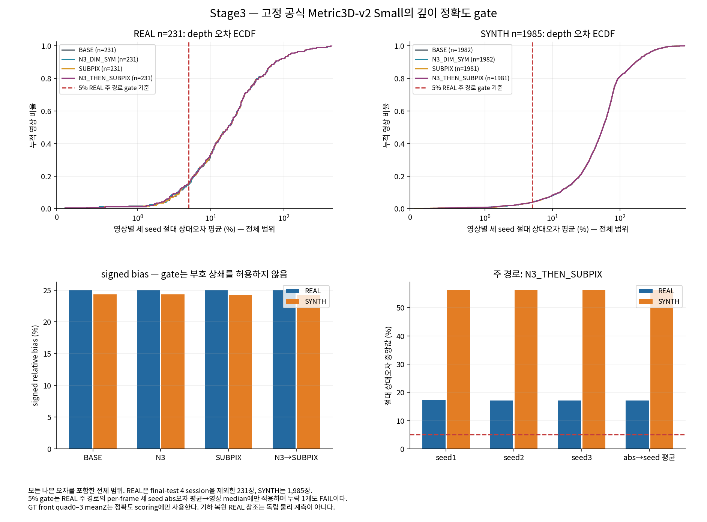

[확인] Stage3: depth gate=FAIL_STOP_S4; S4=NOT_EXECUTED_DEPTH_GATE_FAIL. S4의 방법 판정은 없으며 m 선택·REAL S4 평가를 실행하지 않았습니다.

# Stage3 깊이 정확도와 S4 gate

[확인] REAL231 주 경로의 per-frame 세 seed 절대 상대오차 평균에 대한 median은 17.179%입니다. 기준은 ≤5%, 완전한 세 seed coverage는 231/231입니다. signed error를 먼저 평균하여 상쇄하지 않았고, 누락이 있으면 subset median으로 gate를 통과시키지 않습니다. [DEPTH_GATE.json](DEPTH_GATE.json)

[확인] 실제 모델 생성 총 3회, depth forward 총 2216회, 새 F 0회, 새 PnP 0회, 학습 0회입니다. 정확도 gate와 m 선택에 final-test 4 session을 사용하지 않았습니다. [STAGE3_EXECUTION.json](STAGE3_EXECUTION.json), [SOURCE_LOCK_STAGE3.json](SOURCE_LOCK_STAGE3.json), [DEPTH_INFERENCE_RECEIPT.json](DEPTH_INFERENCE_RECEIPT.json)

[확인] 총 생성 횟수에는 사용자 설정과 관계없는 loader 검사 실패 1회와 읽기 전용 checkpoint 진단 1회가 포함됩니다. 두 단계 forward는 합계 0회였습니다. 그 후 공식 strict=False 경로에서 누락된 유일한 `depth_model.encoder.mask_token`을 공식 초기값 0 그대로 허용했습니다. 이 값은 masks를 받지 않는 RGB 추론에 사용되지 않습니다. checkpoint·모델·전처리·임계는 바꾸지 않았고, 실패 lock과 원래 source lock을 보존했습니다. [실행 총계](STAGE3_RECOVERY_EXECUTION.json), [실행 전 수정 봉인](STAGE3_RUNTIME_AMENDMENT.json)

## 네 경로·모든 seed의 오차와 coverage

단위는 %이고 분산은 %²입니다. ±는 표본 SD(ddof=1), P90은 linear quantile입니다. abs와 signed를 구분하고 양·음 bias를 숨기지 않습니다. depth gate는 사전에 고정된 median 기준이며 별도의 bootstrap CI를 계산하지 않았습니다. 수치 분포는 유효 depth만 사용하고 coverage·누락 ID를 따로 표시합니다. [REAL](DEPTH_ACCURACY_REAL.json), [SYNTH](DEPTH_ACCURACY_SYNTH.json), [REAL 원행](DEPTH_ACCURACY_ROWS_REAL.jsonl.gz), [SYNTH 원행](DEPTH_ACCURACY_ROWS_SYNTH.jsonl.gz)

[확인] RGB 한 장의 depth map은 네 경로·세 seed가 공유합니다. 경로별 기존 qFinal만으로 ROI를 각각 정하므로 2,216개의 depth forward로 26,592행의 정확도를 계산했습니다. 코너 보정이나 N3 모델을 다시 실행하지 않았습니다. [REAL 측정 봉인](DEPTH_MEASUREMENT_SEAL_REAL.json), [SYNTH 측정 봉인](DEPTH_MEASUREMENT_SEAL_SYNTH.json)

| 모집단 | 경로 | 집계 | 깊이 산출/전체 | 절대 상대오차 %: 평균±SD·분산·중앙값/P90/최대 | signed bias % |
|---|---|---|---:|---|---:|
| REAL | BASE | seed mean(abs 후 평균) | 231/231 | 34.446 ± 55.354 분산 3064.095 중앙값 17.202 / P90 75.329 / 최대 441.583 | 25.001 |
| REAL | BASE | seed 1 | 231/231 | 34.446 ± 55.354 분산 3064.095 중앙값 17.202 / P90 75.329 / 최대 441.583 | 25.001 |
| REAL | BASE | seed 2 | 231/231 | 34.446 ± 55.354 분산 3064.095 중앙값 17.202 / P90 75.329 / 최대 441.583 | 25.001 |
| REAL | BASE | seed 3 | 231/231 | 34.446 ± 55.354 분산 3064.095 중앙값 17.202 / P90 75.329 / 최대 441.583 | 25.001 |
| REAL | N3_DIM_SYM | seed mean(abs 후 평균) | 231/231 | 34.445 ± 55.425 분산 3071.896 중앙값 17.148 / P90 75.735 / 최대 442.557 | 24.970 |
| REAL | N3_DIM_SYM | seed 1 | 231/231 | 34.402 ± 55.422 분산 3071.575 중앙값 17.225 / P90 75.910 / 최대 442.646 | 24.933 |
| REAL | N3_DIM_SYM | seed 2 | 231/231 | 34.487 ± 55.430 분산 3072.535 중앙값 17.111 / P90 76.073 / 최대 442.618 | 25.018 |
| REAL | N3_DIM_SYM | seed 3 | 231/231 | 34.447 ± 55.426 분산 3071.999 중앙값 17.107 / P90 75.222 / 최대 442.408 | 24.959 |
| REAL | SUBPIX | seed mean(abs 후 평균) | 231/231 | 34.468 ± 55.372 분산 3066.021 중앙값 17.309 / P90 75.978 / 최대 441.583 | 25.031 |
| REAL | SUBPIX | seed 1 | 231/231 | 34.468 ± 55.372 분산 3066.021 중앙값 17.309 / P90 75.978 / 최대 441.583 | 25.031 |
| REAL | SUBPIX | seed 2 | 231/231 | 34.468 ± 55.372 분산 3066.021 중앙값 17.309 / P90 75.978 / 최대 441.583 | 25.031 |
| REAL | SUBPIX | seed 3 | 231/231 | 34.468 ± 55.372 분산 3066.021 중앙값 17.309 / P90 75.978 / 최대 441.583 | 25.031 |
| REAL | N3_THEN_SUBPIX | seed mean(abs 후 평균) | 231/231 | 34.461 ± 55.439 분산 3073.470 중앙값 17.179 / P90 76.091 / 최대 442.557 | 24.978 |
| REAL | N3_THEN_SUBPIX | seed 1 | 231/231 | 34.439 ± 55.446 분산 3074.216 중앙값 17.282 / P90 75.985 / 최대 442.646 | 24.971 |
| REAL | N3_THEN_SUBPIX | seed 2 | 231/231 | 34.492 ± 55.444 분산 3074.088 중앙값 17.147 / P90 76.302 / 최대 442.618 | 25.023 |
| REAL | N3_THEN_SUBPIX | seed 3 | 231/231 | 34.452 ± 55.428 분산 3072.275 중앙값 17.107 / P90 75.985 / 최대 442.408 | 24.941 |
| SYNTH | BASE | seed mean(abs 후 평균) | 1982/1985 | 78.340 ± 87.015 분산 7571.629 중앙값 56.150 / P90 170.967 / 최대 893.334 | 24.368 |
| SYNTH | BASE | seed 1 | 1982/1985 | 78.340 ± 87.015 분산 7571.629 중앙값 56.150 / P90 170.967 / 최대 893.334 | 24.368 |
| SYNTH | BASE | seed 2 | 1982/1985 | 78.340 ± 87.015 분산 7571.629 중앙값 56.150 / P90 170.967 / 최대 893.334 | 24.368 |
| SYNTH | BASE | seed 3 | 1982/1985 | 78.340 ± 87.015 분산 7571.629 중앙값 56.150 / P90 170.967 / 최대 893.334 | 24.368 |
| SYNTH | N3_DIM_SYM | seed mean(abs 후 평균) | 1982/1985 | 78.319 ± 87.005 분산 7569.930 중앙값 56.222 / P90 170.756 / 최대 894.822 | 24.342 |
| SYNTH | N3_DIM_SYM | seed 1 | 1982/1985 | 78.325 ± 87.013 분산 7571.196 중앙값 56.182 / P90 170.941 / 최대 895.490 | 24.348 |
| SYNTH | N3_DIM_SYM | seed 2 | 1982/1985 | 78.339 ± 87.045 분산 7576.889 중앙값 56.189 / P90 170.638 / 최대 897.327 | 24.355 |
| SYNTH | N3_DIM_SYM | seed 3 | 1982/1985 | 78.292 ± 86.959 분산 7561.894 중앙값 56.233 / P90 170.689 / 최대 891.647 | 24.323 |
| SYNTH | SUBPIX | seed mean(abs 후 평균) | 1981/1985 | 78.315 ± 87.017 분산 7572.017 중앙값 56.185 / P90 170.782 / 최대 895.524 | 24.279 |
| SYNTH | SUBPIX | seed 1 | 1981/1985 | 78.315 ± 87.017 분산 7572.017 중앙값 56.185 / P90 170.782 / 최대 895.524 | 24.279 |
| SYNTH | SUBPIX | seed 2 | 1981/1985 | 78.315 ± 87.017 분산 7572.017 중앙값 56.185 / P90 170.782 / 최대 895.524 | 24.279 |
| SYNTH | SUBPIX | seed 3 | 1981/1985 | 78.315 ± 87.017 분산 7572.017 중앙값 56.185 / P90 170.782 / 최대 895.524 | 24.279 |
| SYNTH | N3_THEN_SUBPIX | seed mean(abs 후 평균) | 1981/1985 | 78.302 ± 87.018 분산 7572.184 중앙값 56.249 / P90 170.702 / 최대 896.308 | 24.239 |
| SYNTH | N3_THEN_SUBPIX | seed 1 | 1981/1985 | 78.306 ± 87.010 분산 7570.788 중앙값 56.206 / P90 170.996 / 최대 896.222 | 24.233 |
| SYNTH | N3_THEN_SUBPIX | seed 2 | 1982/1985 | 78.325 ± 87.034 분산 7574.971 중앙값 56.244 / P90 170.540 / 최대 900.601 | 24.281 |
| SYNTH | N3_THEN_SUBPIX | seed 3 | 1982/1985 | 78.286 ± 86.968 분산 7563.501 중앙값 56.197 / P90 170.566 / 최대 892.102 | 24.267 |

## 고정 주 경로의 깊이 오차 요약

| 모집단 | 완전 세 seed 영상/전체 | 절대 상대오차 중앙값 % | P90 % | 최대 % | signed bias % | signed 중앙값 % |
|---|---:|---:|---:|---:|---:|---:|
| REAL | 231/231 | 17.179 | 76.091 | 442.557 | 24.978 | 9.027 |
| SYNTH | 1981/1985 | 56.249 | 170.702 | 896.308 | 24.239 | -14.431 |

[확인] 작은 상대오차를 가정한 계획자의 시뮬레이션과 달리 실제 고정 모델의 주 경로는 위와 같은 큰 오차·누락을 보였습니다. 이를 숨기거나 scale을 보정해 gate를 다시 실행하지 않았습니다. signed bias는 outlier의 영향을 받는 평균이며 부호 중앙값도 함께 표시했습니다.

## 누락과 실패

[확인] REAL/BASE: 완전 세 seed 영상 231/231, 누락 ID 없음.

[확인] REAL/N3_DIM_SYM: 완전 세 seed 영상 231/231, 누락 ID 없음.

[확인] REAL/SUBPIX: 완전 세 seed 영상 231/231, 누락 ID 없음.

[확인] REAL/N3_THEN_SUBPIX: 완전 세 seed 영상 231/231, 누락 ID 없음.

[확인] SYNTH/BASE: 완전 세 seed 영상 1982/1985, 누락 ID `G38__G__f18405`, `G38__G__f27392`, `TEX__shard_02_f1088`.

[확인] SYNTH/N3_DIM_SYM: 완전 세 seed 영상 1982/1985, 누락 ID `G38__G__f18405`, `G38__G__f27392`, `TEX__shard_02_f1088`.

[확인] SYNTH/SUBPIX: 완전 세 seed 영상 1981/1985, 누락 ID `G38__G__f18405`, `G38__G__f27392`, `TEX__shard_02_f1088`, `TEX__shard_07_f0478`.

[확인] SYNTH/N3_THEN_SUBPIX: 완전 세 seed 영상 1981/1985, 누락 ID `G38__G__f18405`, `G38__G__f27392`, `TEX__shard_02_f1088`, `TEX__shard_07_f0478`.

## 가장 큰 오차의 ID

[확인] 모집단·경로마다 완전한 세 seed가 있는 영상을 절대 상대오차 내림차순으로 정렬해 상위 5개를 표시합니다. 같은 오차는 ID 순서로 정렬했습니다. 좋은 사례를 선택하지 않았으며 나머지 ID·seed도 위 원행에 모두 남겼습니다.

| 모집단 | 경로 | ID | 세 seed 절대 상대오차 평균 % |
|---|---|---|---:|
| REAL | BASE | `eval_outside:1778653367706938112` | 441.583 |
| REAL | BASE | `eval_outside:1778653545299653120` | 388.570 |
| REAL | BASE | `eval_outside:1778653526955536896` | 281.220 |
| REAL | BASE | `eval_outside:1778653540259983104` | 242.897 |
| REAL | BASE | `wood_184309:000674` | 226.936 |
| REAL | N3_DIM_SYM | `eval_outside:1778653367706938112` | 442.557 |
| REAL | N3_DIM_SYM | `eval_outside:1778653545299653120` | 388.683 |
| REAL | N3_DIM_SYM | `eval_outside:1778653526955536896` | 281.913 |
| REAL | N3_DIM_SYM | `eval_outside:1778653540259983104` | 243.159 |
| REAL | N3_DIM_SYM | `wood_184309:000674` | 226.821 |
| REAL | SUBPIX | `eval_outside:1778653367706938112` | 441.583 |
| REAL | SUBPIX | `eval_outside:1778653545299653120` | 388.328 |
| REAL | SUBPIX | `eval_outside:1778653526955536896` | 281.908 |
| REAL | SUBPIX | `eval_outside:1778653540259983104` | 242.799 |
| REAL | SUBPIX | `wood_184309:000674` | 226.870 |
| REAL | N3_THEN_SUBPIX | `eval_outside:1778653367706938112` | 442.557 |
| REAL | N3_THEN_SUBPIX | `eval_outside:1778653545299653120` | 388.330 |
| REAL | N3_THEN_SUBPIX | `eval_outside:1778653526955536896` | 282.105 |
| REAL | N3_THEN_SUBPIX | `eval_outside:1778653540259983104` | 243.143 |
| REAL | N3_THEN_SUBPIX | `wood_184309:000674` | 226.805 |
| SYNTH | BASE | `P0__shard_00_f0200` | 893.334 |
| SYNTH | BASE | `P0__shard_07_f0879` | 767.338 |
| SYNTH | BASE | `TEX__shard_06_f0840` | 765.348 |
| SYNTH | BASE | `TEX__shard_00_f0576` | 682.409 |
| SYNTH | BASE | `P0__shard_00_f0398` | 645.946 |
| SYNTH | N3_DIM_SYM | `P0__shard_00_f0200` | 894.822 |
| SYNTH | N3_DIM_SYM | `P0__shard_07_f0879` | 767.689 |
| SYNTH | N3_DIM_SYM | `TEX__shard_06_f0840` | 764.137 |
| SYNTH | N3_DIM_SYM | `TEX__shard_00_f0576` | 679.352 |
| SYNTH | N3_DIM_SYM | `P0__shard_00_f0398` | 646.270 |
| SYNTH | SUBPIX | `P0__shard_00_f0200` | 895.524 |
| SYNTH | SUBPIX | `P0__shard_07_f0879` | 767.727 |
| SYNTH | SUBPIX | `TEX__shard_06_f0840` | 760.255 |
| SYNTH | SUBPIX | `TEX__shard_00_f0576` | 682.409 |
| SYNTH | SUBPIX | `P0__shard_00_f0398` | 646.271 |
| SYNTH | N3_THEN_SUBPIX | `P0__shard_00_f0200` | 896.308 |
| SYNTH | N3_THEN_SUBPIX | `P0__shard_07_f0879` | 767.728 |
| SYNTH | N3_THEN_SUBPIX | `TEX__shard_06_f0840` | 761.080 |
| SYNTH | N3_THEN_SUBPIX | `TEX__shard_00_f0576` | 679.130 |
| SYNTH | N3_THEN_SUBPIX | `P0__shard_00_f0398` | 646.601 |

[확인] 고정 gate에 따라 m={1,2,3} grid 선택과 S4 6D 평가를 실행하지 않았습니다. 이를 WORSENED/UNRESOLVED 등 S4 방법 판정으로 바꾸지 않습니다. 깊이 모델 자체의 성능 일반화 결론도 내리지 않습니다.

## 해석의 범위

[확인] ROI는 기존 예측 quad 0–3을 중심에서 0.85배로 줄인 영역입니다. native RGB와 그 좌표계의 K를 고정했습니다. K는 공식 resize·depth 역정규화 과정에서 사용하며 network.inference API에 직접 들어가는 값은 RGB tensor입니다. GT는 depth 측정 봉인 뒤 accuracy scoring에만 사용했습니다. REAL reference front meanZ 역시 수동 2D 기하 복원의 영향을 받아 독립적인 센서 depth 참조로 해석하지 않습니다. 공식 Small 모델·전처리·threshold는 결과를 보고 바꾸지 않았습니다. [공식 K 처리 코드](https://github.com/YvanYin/Metric3D/blob/eb5b6fac0dc155e4e52f576e304fbf11655ff339/hubconf.py#L148-L201)

[확인] 공식 최소 예제의 ViT-Small/RAFT-4를 결과 확인 전에 고정했고 float32·eval·no_grad·batch 1로 추론했습니다. 공식 전처리의 native 해상도 복원, focal-length 역정규화와 depth [0,300] m 제한을 그대로 사용했습니다. 보고 그래프에서는 큰 상대오차를 추가로 자르지 않았습니다. 새로운 모델 비교나 scale 보정을 실행하지 않았습니다. [실제 준비 근거](DEPTH_PREPARATION.json), [어댑터 코드](../../../scripts/research/pallet_wd_hypothesis_diag_20261010/depth.py)

[확인] checkpoint별 별도 license 표시는 확인되지 않았습니다. 공식 BSD 코드와 저자의 비상업 제한 제거 안내를 근거로 승인된 연구 사용을 수행했고, commercial permission을 주장하지 않습니다. xformers 없이 공식 Torch Attention fallback을 사용했으며 기존 환경을 바꾸지 않았습니다. [공식 코드 license](https://github.com/YvanYin/Metric3D/blob/eb5b6fac0dc155e4e52f576e304fbf11655ff339/LICENSE), [저자 안내](https://github.com/YvanYin/Metric3D/issues/115#issuecomment-2245665482), [고정 방법](METHOD_KO.md). 원 RGB와 depth map은 private에 남고 공개에는 숫자·SHA·자체 그래프만 있습니다.

[확인] 지시문의 ‘출판처 미확인’ 전제는 수정합니다. Metric3D v2는 IEEE TPAMI 2024에 출판되었으며 DOI는 10.1109/TPAMI.2024.3444912입니다. [논문](https://arxiv.org/abs/2404.15506), [DOI](https://doi.org/10.1109/TPAMI.2024.3444912)

[확인] 저장한 깊이 결과의 독립 검산 상태는 PASS입니다. [DEPTH_VERIFICATION.json](DEPTH_VERIFICATION.json)에 입력 SHA·gate 계산·오차 집계를 기록했습니다. 검산은 모델이나 PnP를 다시 실행하지 않습니다.
