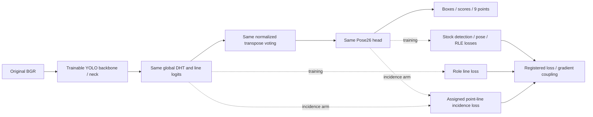

# Pallet DHT Coupling v2

동일한 YOLO26n + DHT forward에서 학습 손실·gradient 결합만 바꾸는 후속 실험이다. v1의 같은 예산 `point_only`, `hough_features`, `hough_joint` 9개 모델은 hash를 검증해 재사용하고, 새 네 방법을 각각 3 seed로 학습·실제 평가한다. **2026-09-09: 새12개 모델의 본학습·실사평가·통계·시각화 전달이 완료됐다. 안정적인 종합 개선은 확인되지 않았다.** 48개 보정 신뢰구간은 모두0을 포함했다. 실제 창 표시와 Discord204를 확인했으며, runtime strict parity7/1638실패는 원래 기준으로 별도 보존했다. [실제 보고서](../../../data/pallet/results/pallet_dht_coupling_v2/index.html) · [결과 해석](../../../_docs/notes/pallet_dht_coupling.md) · [완료 기록](../../../data/pallet/results/pallet_dht_coupling_v2/COMPLETION.json). 합성 smoke와 UI fixture는 실제 성능 결과와 구분한다.



| New arm | Loss / gradient change |
|---|---|
| `balanced` | `lambda_line = 0.1 × stock.o2m / 0.8`, following the original one2many weight schedule |
| `pcgrad` | Symmetric two-task PCGrad on shared dependencies; sum projected gradients before the original clipping |
| `balanced_pcgrad` | Both the registered coefficient schedule and PCGrad |
| `incidence` | Fixed role-line loss plus predicted-point/line incidence under the actual stock assignment |

위 표의 네 방법은 실사 결과로 고르지 않고 모두 남긴다. 전체 backbone·neck·head를 학습하며 기존 one2one feature detach, decoding, zero-initialized feedback projection을 유지한다. PCGrad의 task-private gradient 보존은 projection 직후·global clipping 전의 범위다. Clipping이나 optimizer를 거친 최종 update까지 같다는 뜻은 아니다. Incidence는 학습 손실이며 추론 후 점을 이동시키는 WLS가 아니다.

예산은 합성 train 55,980 / val 4,020, 각 2 epochs·batch16·FP32·6,998 optimizer steps다. R0 초기 tensor, 실제 증강된 batch trace와 source manifest는 기존 joint의 같은 seed와 일치해야 한다. 새 입력 증강이나 독립 final test를 섞지 않는다. 실제 계수와 미리 고정한 계산 규칙은 결과 루트의 `TRAIN_PROTOCOL.json`이 정본이다.

실행 명령은 다음과 같다. Driver 실행 전 source/data·훈련 protocol·완료 경로의 binding을 동결해야 한다. 기존 실험을 덮어쓰거나 동시에 driver를 실행하지 않는다.

```bash
cd /home/minjae/Documents/github/pallet-pose
conda activate pallet-yolo26
export PYTHONPATH="$PWD${PYTHONPATH:+:$PYTHONPATH}"
export DHT_COUPLING_RUN="$PWD/data/pallet/results/pallet_dht_coupling_v2"
cd "$DHT_COUPLING_RUN"

python -m scripts.research.pallet_dht_coupling_v2.driver \
  --run-dir "$DHT_COUPLING_RUN"
```

단일 checkpoint의 CPU 계약 검사와 실제 평가는 같은 CLI를 사용한다. `check`는 이미지 decode와 모델 forward를 하지 않는다. `all`은 positive319 + negative2689를 해당 새 모델로 실제 추론하고 기존 canonical 2D·MAIN 6D를 계산한다.

```bash
export DHT_COUPLING_CHECKPOINT="$DHT_COUPLING_RUN/runs/balanced_seed1/weights/final.pt"

python -m scripts.research.pallet_dht_coupling_v2.evaluate \
  --run-dir "$DHT_COUPLING_RUN" --arm balanced --seed 1 \
  --checkpoint "$DHT_COUPLING_CHECKPOINT" --phase check

python -m scripts.research.pallet_dht_coupling_v2.evaluate \
  --run-dir "$DHT_COUPLING_RUN" --arm balanced --seed 1 \
  --checkpoint "$DHT_COUPLING_CHECKPOINT" --phase all --device 0
```

`--phase infer`와 `--phase metrics`로 저장된 예측과 계산 단계를 분리할 수도 있다. Checkpoint는 마지막 epoch의 FP32 EMA를 사용한다. `epoch_1.pt`는 추가 진단용이고 실사에서 checkpoint를 고르는 데 쓰지 않는다. Custom pickle을 직접 읽을 때는 `import scripts.research.pallet_dht_coupling_v2.integration`을 먼저 수행한다. [evaluate.py](evaluate.py)의 `CanonicalPredictor`가 등록과 실제 입력 recipe를 적용한다.

실제 추론 recipe는 reflect100 `BORDER_REFLECT_101` → `imgsz640`, `rect=True`, batch1, FP32, conf0.001, IoU0.7, max_det300이다. 표준 predictor가 padded canvas로 복원한 좌표에서100을 빼 원본으로 저장한다. 원본 경계로 추가 clipping하지 않는다. GT·crop·기존 예측 복사·점 replacement를 새 모델 forward에 넣지 않는다.

| Artifact | Meaning |
|---|---|
| `REUSED_CONTROLS.json` | 기존9개 control의 checkpoint·훈련·실제평가·증강 hash. 새 추론 횟수는0으로 구분 |
| `GRADIENT_DIAGNOSIS.json` | 기존 raw final3seed, 합성1고정batch의 1회 gradient 진단. 모집단의 충돌 빈도가 아님 |
| `runs/<arm>_seedN/COMPLETION.json` | 실제 최종2epochs6998steps·checkpoint·source binding |
| `runs/.../GRADIENT_AUDIT.json` | 고정step의 stock/line 및 pose+RLE/line gradient; global/Hough/semantic head를 구분 |
| `evaluation/.../PREDICTIONS.json` | 새 모델의 3,008장 실제 forward와 모든 candidate·원본좌표 |
| `evaluation/.../LINE_EVIDENCE.json`, `evidence/*.npz` | 고정 예제의 실제12role logits·sigmoid·역투표·letterbox affine |
| `SUMMARY.json`, `VERDICT.json` | 새12개와 재사용9개, 3seed 평균·표본 SD, 사전지정48비교와 별도 판정 |
| `VIEW_DIAGNOSIS.json` | v1에서 고정한 재구성 앙각·2D면적비 그룹의 설명용 통계 |
| `RUNTIME.json` | 21모델×26장×3회 전체 predictor 시간과 변경 없는 `atol1e-4,rtol0` 검사 |
| `index.html`, `REPORT_RENDER.json` | 새12/재사용9/319원본 갤러리와 입력 SHA; 기본은 balanced seed1·지정사례·role7 |
| `ACTUAL_VISUAL_QA.json` | 실제21모델 저장 예측·GT·독립 역투표·Canvas좌표·브라우저 상호작용 검사 |

주 비교는 새 네 방법 각각 대 기존 `hough_joint`와 `point_only`다. 4×2×6지표의48개 family에 Bonferroni percentile 구간을 적용한다. 100,000 paired session draws로 각 99.8958% 구간(alpha=0.05/48)을 계산하고, 일반95% 구간은 설명용으로 병기한다. 같은 frame/session draw를 세 seed에 적용한 뒤 seed별 평가 통계 차이를 평균한다. Seed를 독립 이미지처럼 세지 않고 임의의 p값도 만들지 않는다.

각 candidate/reference의 개선 판정은 2D median/P90과 MAIN 6D 네 지표의 전체 모집단 seed 평균, family 구간 방향, 각 seed의 matching/pose coverage 보존을 모두 요구한다. 전체 매칭 모집단 평균과 공통 관측 프레임의 대응 차이는 구분한다. `complete/PASS`는 실행·산출물 검사이지 성능 향상이나 runtime parity가 아니다. Runtime 검사가 실패하면 원래 기준과 실패·관측 최대차이를 표시하고 시간을 참고값으로 보고한다.

실사319/2689는 재사용 DEV이며 독립 final·새 현장 일반화의 증거가 아니다. 13세션에 조건부인 bootstrap 근사를 사용하며 미래 모든 학습 seed의 불확실성을 포함하지 않는다. 6D GT와 앙각은 기하 재구성이고 면적비는 실제 yaw·edge 가시성이 아니다. 넓은 선 증거 응답이나 gradient 충돌 감소도 올바른 역할 검출·인과성·성능 향상을 입증하지 않는다. 예제 best/worst와 쉬움/어려움은 GT를 사용한 사후 진단이다.

생성한 CPU fixture 검사는 실제 모델 결과와 분리한다.

```bash
python -m unittest scripts.research.pallet_dht_coupling_v2.test_reporting -v
```

보고서는 요청된 `viz-expert` 분석 스타일·palette를 읽고 그림/표의 영문 라벨과 한국어 설명을 사용한다. 자체 렌더러는 브라우저를 열거나 알림을 보내지 않는다. Driver가 실제 화면 검토 기록을 확인한 뒤 최종 HTML 열기·창 확인·승인된 Discord 알림 단계를 수행한다.
