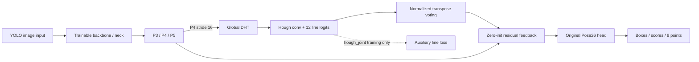

**Pallet DHT Joint v1 — 실제 점·선 공동학습**

이 실험은 기존 YOLO26n R0에서 시작해 backbone, neck, pose head와 새 Deep Hough Transform(DHT) 분기를 함께 학습한다. 합성 데이터로 전체 네트워크를 미세조정하며, 주 비교는 같은 추가 학습 예산의 `hough_joint`와 `point_only`다. R0는 추가 학습 전의 과거 기준이다.

**학습 9/9와 새 모델의 실사 평가 9/9를 완료했다. 같은 예산 점 모델 대비 종합 우월성은 확인되지 않았다.** 모든 모델이 positive 319장과 negative 2,689장을 실제 추론했다. 아래는 [SUMMARY.json](../../../data/pallet/results/pallet_dht_joint_v1/SUMMARY.json)의 3 seed 평균 ± 표본 SD(ddof=1)이며, 상세 결과와 판정은 [index.html](../../../data/pallet/results/pallet_dht_joint_v1/index.html), [VERDICT.json](../../../data/pallet/results/pallet_dht_joint_v1/VERDICT.json)에 있다.

| Arm | 2D median(px) ↓ | 2D P90(px) ↓ | 회전 median(°) ↓ | 이동 median(cm) ↓ | 3D IoU median ↑ | ADD-sym AUC ↑ |
|---|---:|---:|---:|---:|---:|---:|
| `point_only` | 6.865 ± 0.234 | 40.395 ± 9.186 | 2.376 ± 0.153 | 7.731 ± 0.470 | 0.5953 ± 0.0196 | 0.4236 ± 0.0192 |
| `hough_features` | 6.773 ± 0.215 | 36.320 ± 4.522 | 2.434 ± 0.109 | 7.975 ± 0.389 | 0.5968 ± 0.0201 | 0.4276 ± 0.0180 |
| `hough_joint` | 6.689 ± 0.203 | 38.690 ± 3.308 | 2.319 ± 0.091 | 7.800 ± 0.258 | 0.5949 ± 0.0098 | 0.4242 ± 0.0118 |

공동학습의 2D 평균은 낮아졌지만, 공통 302프레임에서 계산한 13세션 대응 95% CI는 median 차이 −0.100px [−0.546, +0.110], P90 차이 −3.242px [−22.614, +3.159]로 모두 0을 포함한다. 같은 seed의 점 매칭 수는 `point_only` [307, 308, 310]에서 `hough_joint` [309, 307, 307]로 바뀌어 coverage 보존 조건도 충족하지 않았다. 6D는 모든 seed에서 319/319를 반환했지만 네 지표 모두 세션 CI가 개선을 지지하지 않았다. `keypoint_gain_confirmed`, `pose_gain_confirmed`, `overall_accuracy_improved`는 모두 **false**다. 공통 프레임의 대응 차이는 위 전체 매칭 모집단 평균 차이와 구분한다.

**실행 시간 수집 완료는 엄격한 예측 일치 PASS가 아니다.** [RUNTIME.json](../../../data/pallet/results/pallet_dht_joint_v1/RUNTIME.json)은 702회 수집을 완료했으나 기존 `atol=1e-4, rtol=0` 검사가 7회 실패해 `PASS=false`, `parity_PASS=false`, `status=COMPLETE_WITH_STRICT_PARITY_FAILURE`다. 관측된 최대 점 좌표 차이는 0.006103515625px다. CUDA sparse HT·역투표의 고정 입력 반복에서 수치적 비결정성을 확인했으며, 허용치와 정확도 캐시는 바꾸지 않았다. 시간 표는 실패를 동반한 참고 실측값으로 읽는다. 원본 실패·코드 보존 및 진단 근거는 [FINDINGS.md](../../../data/pallet/results/pallet_dht_joint_v1/provenance/runtime_parity_diagnostic/FINDINGS.md)와 `provenance/runtime_parity_001/`에 있다. 이 관측 최대값을 보편적 오차 상한으로 사용하지 않는다.

**구조와 대조군**

아래는 두 Hough arm의 구조다. `point_only`는 기존 P3/P4/P5를 그대로 Pose26 head에 전달한다.



| Arm | DHT → image feature feedback | 학습 손실 | 해석 |
|---|---|---|---|
| `point_only` | 없음 | 기존 `E2ELoss(PoseLoss26)` | 같은 예산의 전체 네트워크 점·검출 대조군 |
| `hough_features` | 있음 | 기존 점·검출 손실 | Hough 구조의 효과. 12개 채널은 선 역할 정답으로 감독하지 않음 |
| `hough_joint` | 있음 | 기존 점·검출 손실 + `0.1 × line loss` | 사전등록한 주 모델 |

[hough_block.py](hough_block.py)는 P4를 16채널로 줄여 `90 θ × 113 ρ` 격자에 모은다. θ는 선의 **법선각**, ρ는 중심을 기준으로 한 feature-cell 거리이며 간격은 0.5, 범위는 −28…28이다. 실제 투표 연산자는 `A′ = Kρ A`, `Kρ = [0.25, 0.5, 0.25]`다. 순방향은 `A′F / A′1`, 되돌림은 `A′ᵀH / A′ᵀ1`로 각각 정규화한다. 되돌림은 정규화된 순방향의 수학적 역함수나 adjoint를 뜻하지 않는다.

두 Hough convolution의 특징과 12채널 sigmoid 지도를 함께 되돌려 P3/P4/P5에 residual로 더한다. 출력 projection의 weight와 bias를 0으로 초기화해 초기 feature residual은 0이다. 학습 후에는 상자, 점수, centroid를 포함한 9점 모두 바뀔 수 있다. 추론 forward에는 GT, 예측 점 proposal, GT crop, 사후 WLS 보정이 들어가지 않는다.

[integration.py](integration.py)는 기존 Pose26 decoding과 E2E loss update를 유지한다. 전체 네트워크를 학습 가능 상태로 만들고 BN도 갱신하지만, 기존 **one2one 입력 feature detach 경계는 보존**한다. Backbone/neck에는 기존 one2many 학습 경로와 공동학습군의 line loss 경로가 연결된다. 학습용 네트워크는 unfused R0에서 구성한다.

[line_targets.py](line_targets.py)의 12개 역할은 앞·뒤 면의 4개 경계씩과 깊이 방향 4개 경계다. 이미 증강된 합성 GT에서 bilinear target을 만들고, 여러 객체의 같은 역할은 maximum union으로 합친다. 선 손실은 foreground/background를 따로 평균하는 BCE다. 지원되지 않는 객체의 역할이 있으면 해당 image/role을 무시한다. `visibility > 0`은 좌표 감독 가능 여부이며 물리적으로 edge가 보인다는 뜻은 아니다. `hough_features`의 같은 채널 번호에는 의미적 역할을 배웠다는 보장이 없다.

**고정한 학습·평가 계약**

실제 값의 정본은 [TRAIN_PROTOCOL.json](../../../data/pallet/results/pallet_dht_joint_v1/TRAIN_PROTOCOL.json)이다.

| 항목 | 등록된 설정 |
|---|---|
| 초기 가중치 | `integration.R0_PATH`의 YOLO26n, 60-epoch R0 checkpoint |
| 합성 데이터 | 기존 고정 manifest의 train 55,980장 / validation 4,020장 |
| 실행 수 | 3 arms × seeds 1, 2, 3 |
| 추가 학습 예산 | 각 2 epochs, batch 16, 6,998 optimizer steps |
| Optimizer / 정밀도 | AdamW, LR `1e-4`, weight decay `5e-4`, FP32 (`amp=false`) |
| Scheduler | cosine, `lrf=0.1`, warmup 0.1 epoch, warmup bias LR 0 |
| 학습 입력 | 이미 준비된 reflect100 합성 canvas를 640 square로 변환, `rect=false` |
| 활성 증강 | scale 0.25, translate 0.1, HSV 0.015/0.5/0.35 |
| 제외한 증강 | mosaic, mixup, cutmix, copy-paste, 수평·수직 flip, 회전·shear·perspective |
| Checkpoint 선택 | 마지막 epoch의 FP32 EMA. 실사·best epoch 선택 없음 |
| 실사 평가 | 재사용 DEV positive 319장 + negative 2,689장, **매 모델 새 forward** |

같은 seed의 세 arm은 source/epoch/seed로 결정한 동일 augmentation과 minibatch를 받는다. `BATCH_TRACE.jsonl`의 실제 image/label tensor hash로 이를 확인한다. 서로 다른 seed의 trace와 최종 EMA도 별도로 확인한다. 설치 환경의 선택적 Albumentations wrapper는 버전 불일치로 세 arm 모두 비활성이고, 위 HSV·affine 증강은 활성이다. 자세한 데이터 계보는 [SOURCE_REVALIDATION.json](../../../data/pallet/results/pallet_dht_joint_v1/SOURCE_REVALIDATION.json)과 기존 [SOURCE_DATA_AUDIT.md](../pallet_line_pose_v1/SOURCE_DATA_AUDIT.md)에 있다.

**실행과 재개**

아래 명령은 실제 `--help`와 구현에 있는 인자만 사용한다. `pallet-yolo26` 환경과 이미 준비된 결과 루트의 `PURPOSE.md`, `TRAIN_PROTOCOL.json`, completion-chain/source bindings가 필요하다. 원본 합성 manifest와 R0 checkpoint 경로·SHA도 일치해야 한다. 새 실험의 입력과 프로토콜은 별도 결과 루트에 먼저 고정한다. 다른 driver와 중복 실행하지 않는다.

```bash
cd /home/minjae/Documents/github/pallet-pose
conda activate pallet-yolo26
export PYTHONPATH="$PWD${PYTHONPATH:+:$PYTHONPATH}"
export DHT_JOINT_RUN="$PWD/data/pallet/results/pallet_dht_joint_v1"
cd "$DHT_JOINT_RUN"

# 전체 학습 → 실제 평가 → runtime → 집계 → HTML/독립 QA → 전달
python -m scripts.research.pallet_dht_joint_v1.driver \
  --run-dir "$DHT_JOINT_RUN"
```

Driver는 완료된 셀의 hash를 검증하고 재사용한다. 미완료 셀에 `weights/last.pt`가 있으면 마지막 완료 epoch에서 재개하며, 중단된 부분 epoch는 다시 실행한다. 첫 epoch checkpoint가 없으면 부분 산출물을 provenance 아래 보존하고 같은 초기 가중치·seed에서 시작한다. 마지막 단계는 실제 HTML 브라우저 열기와 기존 Discord 알림을 포함한다.

단일 셀의 등록된 학습 명령은 다음과 같다. FP32 실행에서는 `--amp`를 추가하지 않는다. 직접 재개할 때는 같은 설정에 `--resume`을 붙이며, 완료 epoch의 `last.pt`가 있어야 한다.

```bash
python -m scripts.research.pallet_dht_joint_v1.train \
  --run-dir "$DHT_JOINT_RUN" --arm hough_joint --seed 1 \
  --epochs 2 --batch 16 --lr 0.0001 --optimizer AdamW \
  --line-weight 0.1 --workers 2 --lrf 0.1 \
  --warmup-epochs 0.1 --warmup-bias-lr 0 \
  --amp-init-scale 16 --device 0
```

완료 checkpoint의 계약만 확인하는 `check` 단계는 CPU load와 메타데이터 검사를 수행하고 실사 이미지를 decode하거나 모델을 forward하지 않는다. `all`은 같은 설정으로 319 + 2,689장을 실제 추론하고 canonical 2D·MAIN 6D를 평가한다.

```bash
export DHT_JOINT_CHECKPOINT="$DHT_JOINT_RUN/runs/hough_joint_seed1/weights/final.pt"

python -m scripts.research.pallet_dht_joint_v1.evaluate \
  --run-dir "$DHT_JOINT_RUN" --arm hough_joint --seed 1 \
  --checkpoint "$DHT_JOINT_CHECKPOINT" --device 0 --phase check

python -m scripts.research.pallet_dht_joint_v1.evaluate \
  --run-dir "$DHT_JOINT_RUN" --arm hough_joint --seed 1 \
  --checkpoint "$DHT_JOINT_CHECKPOINT" --device 0 --phase all
```

`evaluate.py`는 `--phase infer`와 `--phase metrics`도 지원한다. 후자는 저장된 실제 예측을 읽어 CPU 평가를 수행한다. 전체 9개 셀 완료 후 driver가 `aggregate`, `report`, `audit_outputs`, `visual_qa`, `finalize`를 순서대로 실행한다. 별도 관점 설명은 [view_diagnostics.py](view_diagnostics.py)의 고정 GT strata를 사용하며 주 판정을 변경하지 않는다.

**저장 checkpoint를 직접 읽을 때**

Custom pickle class 이름은 `integration.DHTPoseModel` / `integration.DHTPose26`이다. 해당 디렉터리를 Python 경로에 넣고 **bare `import integration`을 먼저** 수행한다. 다음은 지원되는 CPU loader API다.

```python
from pathlib import Path
import sys

repo = Path("/home/minjae/Documents/github/pallet-pose")
sys.path.insert(0, str(repo))
sys.path.insert(0, str(repo / "scripts/research/pallet_dht_joint_v1"))
import integration

checkpoint_path = (
    repo / "data/pallet/results/pallet_dht_joint_v1"
    / "runs/hough_joint_seed1/weights/final.pt"
)
network, saved = integration.load_trained_model(checkpoint_path, use_ema=True)
```

이 loader는 완료 flag를 확인해 unfused FP32 eval model을 반환한다. 실제 실사 평가에 필요한 main/smoke 구분, 마지막 epoch·optimizer budget, protocol/config/checkpoint SHA는 `evaluate --phase check`가 추가로 검증한다. Checkpoint의 `joint_provenance.config_sha256`는 `CELL_CONFIG.json`에서 `bindings`를 제외한 canonical JSON의 SHA이고, raw 파일 SHA는 학습 `COMPLETION.json`의 `cell_config_file_sha256`다. `protocol_sha256`는 `TRAIN_PROTOCOL.json` 파일의 SHA다.

원본 BGR에서 논문 입력 계약을 적용하는 구현은 [evaluate.py](evaluate.py)의 `CanonicalPredictor(checkpoint_path, device="0")`와 `predict(original_bgr)`다. 반환값은 `(all_candidates, elapsed_ms)`이며 GT를 받지 않는다. Canonical recipe는 **reflect100 `BORDER_REFLECT_101` → `imgsz=640`, `rect=True`, batch1, FP32, conf0.001, IoU0.7, max_det300**이다. 표준 predictor가 padded canvas로 되돌린 box/9점에서 100을 빼 원본 좌표로 저장하며, 원본 경계로 추가 clipping하지 않는다. 직접 `YOLO(final.pt)`만 호출하면 reflect100과 원본 좌표 복원까지 자동 적용되지는 않으므로 이 wrapper를 사용한다. 추론용으로 fuse한 모델을 학습 초기 네트워크로 재사용하지 않고 `build_model(...)`의 unfused 경로를 사용한다.

**결과 파일 읽기**

| 경로 | 확인할 내용 |
|---|---|
| `runs/<arm>_seed<seed>/CELL_CONFIG.json` | 실제 셀 설정과 초기 가중치·데이터·source binding |
| `runs/.../weights/final.pt` | 마지막 epoch의 실제 model와 EMA, optimizer 상태, 완료 budget |
| `runs/.../history.json`, `GRADIENT_AUDIT.json` | epoch loss·검증, gradient·parameter/BN 변화 |
| `runs/.../COMPLETION.json`, `TRAINING_AUDIT.json` | 완료 step·checkpoint SHA, 같은 seed의 augmentation 일치 및 네트워크 학습 증거 |
| `evaluation/<arm>_seed<seed>/PREDICTIONS.json` | 3,008장 실제 새 forward의 모든 후보, 원본 좌표와 입력 hash |
| `evaluation/.../RESULTS.json`, `PAPER_2D_per_frame.csv`, `POSE_PER_FRAME_BY_ARM.json` | canonical 9점·MAIN 6D·frame/session 결과 |
| `evaluation/.../NEGATIVE_OUTCOMES.json` | negative 이미지 FP @0.001/0.25/0.5/0.85; box AP는 `RESULTS.json` |
| `evaluation/.../LINE_EVIDENCE.json`, `evidence/*.npz` | 고정 예제의 실제 12채널 logits·sigmoid·정규화 역투표·raw/letterbox affine |
| `RUNTIME.json` | 같은 26장×3반복×9모델의 실제 predictor 시간. 현재 수집 완료, strict parity 실패이며 PASS=false |
| `SUMMARY.json`, `VERDICT.json` | 3 seed 평균·표본 SD, 동일 예산 비교, 10,000회 대응 세션 bootstrap와 사전등록 판정 |
| `index.html`, `REPORT_RENDER.json` | 원본/점 비교·허프 증거 및 보고서 입력 SHA |
| `ACTUAL_VISUAL_QA.json`, `actual_visual_qa/*.png` | 319장·9개 모델 좌표와 독립 역투표/브라우저 검사; 실제 화면 캡처 |
| `VIEW_STRATA.json`, `VIEW_DIAGNOSIS.json/.md` | 새 실사 예측 전에 정한 재구성 앙각·면적비 그룹의 설명용 분석 |
| `CASE_DIAGNOSIS.json/.md` | 사용자 지정 사례의 9모델 공식 감독7corner+centroid(총8점)·이전에 고정한 GT-only 순열 진단; 실제 출력은 재번호하지 않음 |
| `CASE_ROLE7_VISUAL_QA.json`, `case_role7_visual/*.png` | GT4–GT7인 실제 영상 왼쪽 높이선의 3 seed 추가 화면 검토. 기존 role3 QA는 보존 |
| 최상위 `COMPLETION.json` | 전체 실행·보고서·전달 완료 기록. 성능 향상 여부는 별도 필드 |

개별 `predict()`의 시간은 준비·전처리 등을 포함하는 순차 telemetry다. 속도 비교에는 warmed input shape, 교차 실행 순서와 같은 이미지를 사용한 `RUNTIME.json`을 읽는다. 파일 decode와 PnP 시간은 runtime 비교에서 제외한다.

**판정과 해석 범위**

2D는 최고 box score 후보의 IoU≥0.5 매칭에서 `visibility>0`인 0–8번 좌표를 사용하며 keypoint confidence로 제거하지 않는다. 매칭된 점의 median/P90과 매칭 coverage를 함께 읽는다. MAIN 6D는 기존 selector·solver·geometry-reconstructed GT를 사용한다. Negative 후보도 새로 추론하므로 기존 R0의 검출 결과가 보존된다고 가정하지 않는다.

주 판정은 `hough_joint` 대 같은 seed의 `point_only`다. 각 seed의 지표를 계산한 뒤 평균하고 표본 SD(ddof=1)를 표시한다. 대응 비교는 양쪽 모델의 세 seed에서 모두 관측한 공통 프레임을 사용하며, 같은 13개 촬영 세션 draw를 모든 seed에 적용한다. 공통 subset 차이와 전체 모집단 평균 차이는 다를 수 있다. 2D 두 지표와 MAIN 6D 네 지표 각각에 평균 개선·올바른 방향의 세션 95% CI·해당 coverage 보존 조건이 있고, 종합 향상은 양쪽 기준을 모두 만족해야 한다. `complete=true`나 실행 감사 `PASS=true`만으로 성능 향상을 뜻하지 않는다.

319 positive와 2,689 negative는 반복 사용한 **DEV**다. 독립 final test, 새로운 현장 일반화, 많은 학습 seed 모집단의 불확실성을 입증하지 않는다. 세션 수는 13개이며 반복 비교 전체를 교정한 구간도 아니다. 6D reference와 앙각은 기존 기하 재구성의 가정을 포함하고, 2D 측면/앞면 면적비는 yaw 실측값이나 물리적 가시성 label이 아니다. 선 증거 지도는 실제 모델 출력의 시각화로, attention·인과 설명·보정된 정답 확률을 뜻하지 않는다. 도움/악화 순위와 쉬움/어려움 구분은 GT를 사용한 사후 진단이다.
